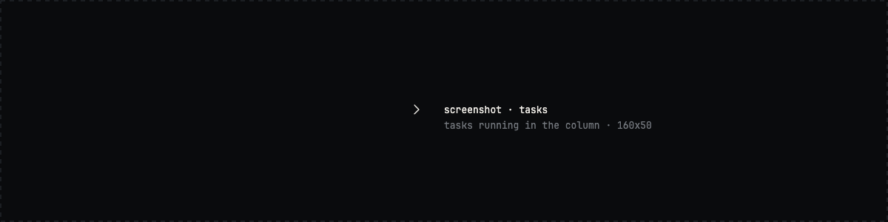
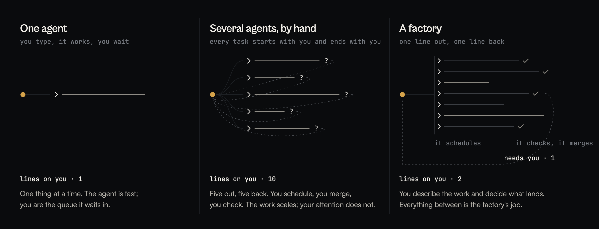
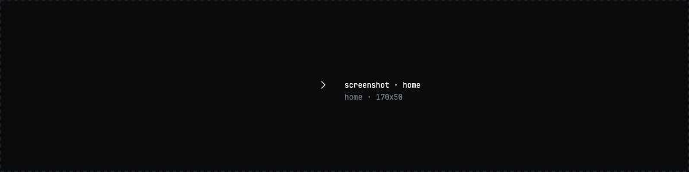
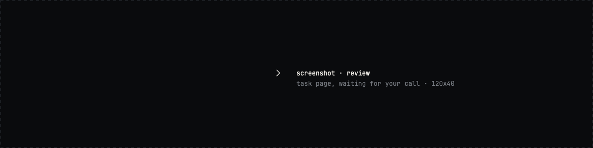
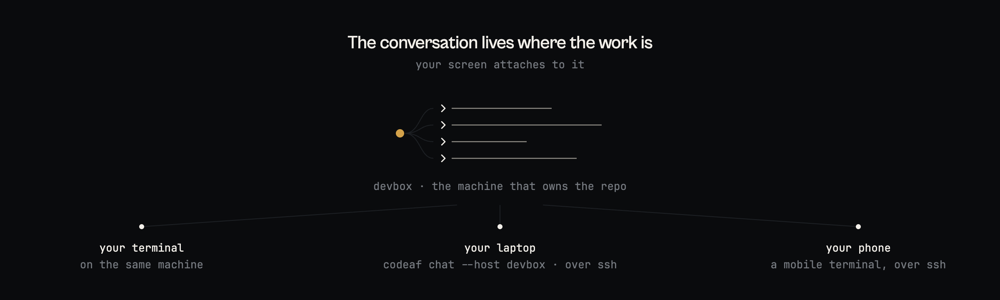
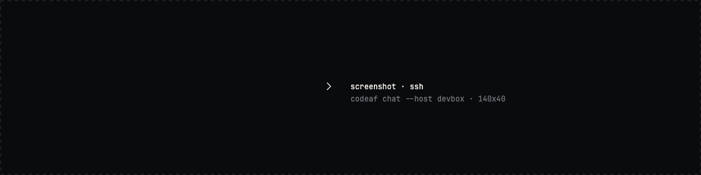

<div align="center">


<br>

<a href="LICENSE"></a>
<a href="https://github.com/Agent-Field/codeaf/releases"></a>
<a href="https://github.com/Agent-Field/codeaf/stargazers"></a>


<p>
<a href="#install">Install</a> ·
<a href="#what-a-factory-is">What a factory is</a> ·
<a href="#benchmarks">Benchmarks</a> ·
<a href="#headless-is-the-other-front-door">Headless</a> ·
<a href="#switching-from-opencode-pi-or-aider">Switching</a> ·
<a href="docs/GUIDE.md">Guide</a>
</p>

</div>

CodeAF is an open-source software factory for your terminal. You describe the
work and decide what lands. It plans, runs, checks and merges, on the model
you choose for each call, and comes back only when it needs you. One binary, no
account, no service to run. Any model, open models by default. Apache 2.0. By
[AgentField AI](https://agentfield.ai).

## Install

```bash
curl -fsSL https://agentfield.ai/get/codeaf | bash
codeaf
```

The script puts the release binary for your platform in `~/.codeaf/bin`. To
build it yourself: `git clone`, `make build`, `bin/codeaf`
([guide](docs/GUIDE.md#install)). Release assets, checksums and version
pinning are on the [releases page](https://github.com/Agent-Field/codeaf/releases).

On first start it asks for a key: OpenRouter, DeepSeek, GLM, Kimi, MiniMax or
Qwen. Point it at Ollama and it needs no key.

Everything is in the one binary: the tools, tasks, standing orders, memory,
spend, search, remote access, the headless commands and a manual about itself.

<!-- TODO: binary size, cold start, idle memory. -->

## Hand it work

Start it inside a repository. Give it something that takes longer than you
want to watch.

```text
 › /task move the retry logic out of the three clients into one place, keep the
   per-client backoff numbers, and make the tests pass
```

The task exists when you press enter. It works on its own branch, and the
conversation is yours again. Describe the work without `/task` and CodeAF
proposes one on a card when the job is bigger than a few edits, and waits for
your yes.

When it lands, `home` says so under `to check`, with the diff, the test run and
the cost. `a` accepts and merges, `l` sends it back with a note, `n` drops it.
Nothing merges without you.

<!-- TODO(G1): recording. A brief becomes a task, home shows it running, it
     lands, `a` accepts it. 160x45, about 20s, scripted with vhs. -->


Every turn ends with its price.

```text
                                          · 19:31 · 3.2s · 1 tool call · $0.0008 · ❮
 $0.0008 · ⟲ saved $0.0005 · 45% cached   15.6k/1.3M · 1%                        idle
```

## What a factory is

If you have three terminals open with three agents and a merge waiting, you
already run a factory, by hand. The agents got fast. The scheduling, the
checking and the merging stayed with you, and every task starts with you and
ends with you.



Count the lines that touch the person. A factory is the third picture: one
line out, one line back. What makes that possible:

- **The factory does the middle.** It sizes the work, splits it when one
  worker is not enough, runs the parts where they cannot collide, tests what
  came back, and merges what passed. You see one thing per task: land it, or
  send it back.
- **It asks only when it must.** A question a person has to answer waits under
  `needs you` on `home`. Everything else it decides, records the decision, and
  carries on.
- **Specialist tasks check themselves.** Work that comes round in the same
  shape (review this pull request, chase this flaky test, audit these
  dependencies) runs as a saved program with typed input and typed output. It
  either produces what it promised or is marked incomplete. Those are the tasks
  in the benchmark below.

<!-- TODO: settle the public name. The manual calls these subharnesses and the
     command is /subharness; this README says specialist task. -->

## Benchmarks

<!-- TODO(C1): chart, two panels: pass rate vs cost, pass rate vs time.
     Render from the launch run with bench/oneroad/plots/final_board.py. -->

We ran `[N]` held-out GitHub issues, `[K]` seeds each, through every harness
below on the same open model, `[MODEL]`. Versions and configs are in
[BENCHMARKS.md](BENCHMARKS.md), with every failure, timeout and unpriced call.

| harness | version | pass rate | cost per issue | time per issue |
| --- | --- | --- | --- | --- |
| CodeAF | `[..]` | `[..]` | `[..]` | `[..]` |
| `[HARNESS]` | `[..]` | `[..]` | `[..]` | `[..]` |
| `[HARNESS]` | `[..]` | `[..]` | `[..]` | `[..]` |
| `[HARNESS]` | `[..]` | `[..]` | `[..]` | `[..]` |

CodeAF is on the frontier: the harnesses that passed more cost more and took
longer, and the ones that cost less passed fewer. Rerun it on your own
repository with `bench/` and send us the numbers.

## The right model for each call

CodeAF runs six model seats, and picks the seat per call, not per session.
Seat one is the model you talk to. The other five are the crew, for the calls
you did not type:

| seat | what it answers |
| --- | --- |
| reflex | memory, titles, the safety gate. Near free, reads every turn. |
| small work | digests, task names, yes-or-no checks |
| worker | every task you hand off. Most of the bill. |
| careful work | checks on finished work, the brief a task is shaped into, vision |
| mastermind | plans runs and designs specialist tasks |

Three presets ship, all on open weights. `/crew frugal`, `balanced` or `max`
sets the five in one word; any seat can be pinned to its own model.

| preset | worker | careful work | mastermind |
| --- | --- | --- | --- |
| frugal | deepseek-v4-flash | glm-5.3-flash | glm-5.3-flash |
| balanced | glm-5.3-flash | qwen3.8-27b | glm-5.3 |
| max | glm-5.3 | kimi-k3 | kimi-k3 |

Under that, the provider is chosen per request from what has finished fastest
for this kind of call, and every settled task is graded by the check it already
had to pass, so work that keeps failing on the worker seat is lifted to careful
work on its own. `codeaf models` prints the ratings. Reasoning effort is a
ladder, `low` to `max`, per seat.


Providers built in: OpenRouter, DeepSeek, GLM, Kimi, MiniMax, Qwen, Ollama and
any OpenAI-compatible endpoint. Set a daily limit on first start; `spend`
shows where it went.

## Home is the control room

A factory that runs without you needs one screen that answers, in order: what
needs me, what is running, what happened while I was away, and what did it
cost. That is `home`, and it is what a bare `codeaf` opens once the machine has
work on it.



Every project on the machine is on it, not only the folder you started in. A
digit answers a question from the row it is asked on. `enter` on a landed task
opens it with its diff, its test run and its cost; `a` accepts.



Six more places sit behind it, one key each: `tasks` (every task on the
machine, with state and cost), `spend` (by day, model and task), `settings`,
`standing`, `memory` (what CodeAF remembers about you and your projects, line
by line, editable) and `search` (every past conversation). Conversations,
tasks and spend are written to disk as they happen, so a crash or a closed
laptop loses nothing, and `esc esc` rewinds a conversation to any earlier
message.

## Standing orders

Say "always run the tests before you land" or "every morning, check the
release radar". CodeAF asks whether you mean once or from now on, and it
becomes a standing order: a timer, a budget, and the same review as everything
else.


## Headless is the other front door

The factory has two doors. The conversation is one. The other is a command
that runs the same brain with the conversation removed, for CI, a cron job, a
script, or a benchmark harness.

```bash
codeaf do "bump every dependency whose changelog is worth reading" --timeout 30m --json
```

`do` takes your brief byte for byte, plans it, runs it, checks it, and prints
one JSON object and an exit code. Nothing that exists for a person watching is
paid for: no title, no memory reflex, no screen. Where the conversation would
stop to ask, `do` takes the best answer it has, records that it assumed, and
carries on. `exec` runs one worker with no plan; `run` executes a plan you
have read and edited. The exit code says how much is wrong; the `stop` field
says what. [The contract](docs/HEADLESS.md).

<!-- TODO: confirm "no title, no memory reflex" against the code. -->

## From your terminal, your servers, or your phone

The conversation lives on the machine that owns the work. Your screen attaches
to it.



```bash
codeaf chat --host devbox     # the work runs on devbox, over ssh; codeaf on its PATH is all it needs
codeaf serve                  # no ssh in? hold a connection open through a relay
codeaf chat --at otter-lamp   # attach to a served machine by name, from any paired device
```

The relay puts two connections next to each other and nothing more. It sees a
machine name and byte counts; the conversation is encrypted end to end, and
pairing uses a password-authenticated key exchange, so the relay cannot read it
or sit in the middle. [Details](docs/REMOTE.md).

Close the laptop and the tasks keep running. Open the phone and `home` is
there at phone width: what needs you, a digit to answer, a key to accept.

<p>


</p>

## What it is allowed to touch

A task writes on its own branch and nowhere else. In the conversation, a
command the rules do not already allow is held up and shown to you first:
`1` allow once, `2` always this command, `3` deny. `--yolo` turns the asking
off for a session and says so on the status line. Nothing leaves your machine
except the model calls you configured.

<!-- TODO: confirm the telemetry sentence against the code before publishing. -->

Open source under Apache 2.0, all of it, including the runtime and the
specialist tasks. You are giving a program write access to your repositories.
You should be able to read every line of it.

## What a copilot does, and what CodeAF does

| | a copilot | CodeAF |
| --- | --- | --- |
| where you work | one window, one repository | every project on the machine, from one control room |
| what you do | watch it type | describe work, answer what needs you, decide what lands |
| what runs | one model, one thread | six seats, chosen per call, on open weights |
| how long it lasts | one session | conversations, tasks and standing orders that outlive the window |
| without you | it stops | headless, standing orders, a phone in your pocket |
| what you pay | a seat | the tokens, priced on every turn, under a daily limit you set |

## Switching from opencode, pi or aider

Your keys and providers carry over. The conversation works the same way.
Everything around it is new: a control room across projects, tasks that wait
for your call, a crew of models chosen per call, standing orders, a headless
door, and a session you can reach over ssh or from a phone.

## Roadmap

v0.1.0 shipped on 2026-08-17. `[N]` changes since, each written up in
[docs/changes](docs/changes/).

| shipped | launch, `[DATE]` | next |
| --- | --- | --- |
| conversation, tasks, review | binaries and installer for every platform | team server: one machine, every engineer's factory |
| home, standing orders, memory | benchmark results and chart | web view |
| six-seat crew, spend limits | `[..]` | identity and a signed record per task, through the AgentField control plane, Apache 2.0 like the rest |
| ssh, relay, phone, headless | | |

Vote in [Discussions](https://github.com/Agent-Field/codeaf/discussions).
Three things help most: run the benchmark on your own repository and send the
run; add a provider that is missing; when a task goes wrong, `/why` and paste
what it says into an issue.

<!-- TODO: Discord link. -->

## Docs

- `codeaf manual`, or `alt+.` for the key map. The manual ships in the binary and the chat reads it too.
- [Guide](docs/GUIDE.md): every flag, key, slash command and exit code.
- [docs/](docs/README.md): architecture, headless, remote, limits.

Built by the team behind [AgentField](https://github.com/Agent-Field/agentfield),
the open-source AI backend, and Covalent.
