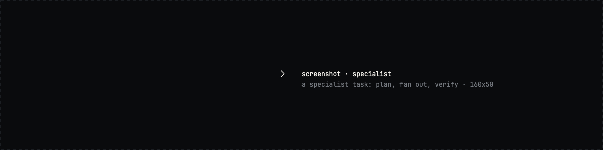

<div align="center">


<br>

<a href="LICENSE"></a>
<a href="https://github.com/Agent-Field/codeaf/releases"></a>
<a href="https://github.com/Agent-Field/codeaf/stargazers"></a>


<p>
<a href="#install">Install</a> ·
<a href="#benchmarks">Benchmarks</a> ·
<a href="#you-are-already-running-a-factory">Why a factory</a> ·
<a href="#seven-places-one-machine">Places</a> ·
<a href="#from-your-terminal-your-servers-or-your-phone">Anywhere</a> ·
<a href="#any-model-open-by-default">Models</a> ·
<a href="#coming-from-opencode-pi-or-aider">Switching</a> ·
<a href="#built-in-the-open">Roadmap</a> ·
<a href="docs/GUIDE.md">Guide</a>
</p>

</div>

codeaf is an open-source software factory for your terminal. You describe work
across your projects. It runs in its own worktrees, on the model you choose,
and comes back for your review. One binary. Any model, open models by default.
Apache 2.0. By [AgentField AI](https://agentfield.ai).

## Install

```bash
curl -fsSL https://agentfield.ai/get/codeaf | bash
codeaf
```

No account. On first start it asks for a key: OpenRouter, DeepSeek, GLM, Kimi,
MiniMax or Qwen, or point it at Ollama and use no key at all. Building from
source, pinning a version and the dev channel are in the [guide](docs/GUIDE.md#install).

## Your first turn

Start it inside a repository and ask something.

```text
 › where does codeaf find its api key?

    ▸ read apikey.go                                                          1 call

  In Load's order: `$OPENROUTER_API_KEY`, then `$OPENAI_API_KEY`, then the `api_key`
  field in the profile config. First non-empty wins.

                                          · 19:31 · 3.2s · 1 tool call · $0.0008 · ❮
 $0.0008 · ⟲ saved $0.0005 · 45% cached   15.6k/1.3M · 1%                        idle
```

That is a real turn on the default model, `deepseek/deepseek-v4-flash`: one
question, one file read, one answer, and what it cost on the last line. The
same line is there on every turn, so you always know.

Now hand it something you would rather not sit through.

<!-- TODO(G1): hero gif. One message that becomes three tasks, home fills, one task
     comes back, `a` accepts it. 160x45, ~20s, scripted with vhs. -->


## Benchmarks

<!-- TODO(C1): pareto chart, two panels: pass rate vs cost, pass rate vs time.
     Render from the launch run with bench/oneroad/plots/final_board.py, brand colours. -->

codeaf sits on the Pareto frontier of cost, time and pass rate on
`[BENCHMARK]`: no measured harness reached a higher pass rate at lower cost
and time. Every harness ran the same open model, `[MODEL]`, on `[N]` held-out
GitHub issues, `[K]` seeds each.

| harness | pass rate | cost per issue | time per issue |
| --- | --- | --- | --- |
| codeaf `[VERSION]` | `[..]` | `[..]` | `[..]` |
| `[HARNESS]` | `[..]` | `[..]` | `[..]` |
| `[HARNESS]` | `[..]` | `[..]` | `[..]` |
| `[HARNESS]` | `[..]` | `[..]` | `[..]` |

Every run is published with its failures, timeouts and unpriced calls, in
[BENCHMARKS.md](BENCHMARKS.md). The result comes from the task type described
under [specialist tasks](#specialist-tasks-the-benchmarked-kind-of-work).

## You are already running a factory

If you have three terminals open with three agents, three worktrees and a merge
waiting, you are running a factory by hand. The agents got fast. The scheduling,
the merging and the checking stayed with you.


codeaf is built for the third picture. Work runs where it cannot collide, keeps
its own record, and reaches you only when it needs a decision or a review.
Your attention goes to the row that asks for it.

## What a copilot does, and what a factory does

| | a copilot | codeaf |
| --- | --- | --- |
| where you work | one window, one repository | every project on the machine, from one home screen |
| what you do | watch it type | assign work, answer questions, review what lands |
| what it works in | your checkout | its own worktree per task, merged when you accept |
| how long it lasts | one session | conversations, tasks and standing orders that outlive the window |
| what it costs | a subscription | the price of the tokens, on every turn, with a daily limit you set |

## Seven places, one machine

A chat has a scrollback. A factory has a floor. codeaf gives every machine
seven full-screen places, reached with `alt+1` to `alt+7` from anywhere.

| place | what it answers |
| --- | --- |
| `home` | What needs me? What is running? What happened while I was away? What did today cost? |
| `tasks` | Every task on the machine, by the conversation that started it, with state and cost. |
| `spend` | Cost by day, by model and by task. |
| `settings` | Models, the crew, connected accounts, limits. |
| `standing` | The orders that keep running: what they do, when they last fired, what they cost. |
| `memory` | What codeaf remembers about you and your projects, line by line, editable. |
| `search` | Every past conversation. |


`home` opens on a bare `codeaf` once the machine has work on it. `esc` puts you
back in the conversation you came from.

## Hand off work

Say what you want done. When it is more than a few edits, codeaf proposes a
task: a brief, a worktree, a budget. Say yes and walk away. Several tasks at
once is the normal case, and each one keeps to its own branch until you accept it.


When a task lands it says so on `home`, under `to check`, and waits for your
call: `a` accept, `l` look again, `n` not right. Nothing merges on its own.


## Specialist tasks: the benchmarked kind of work

<!-- TODO: confirm the public name for this task type. The manual calls them
     subharnesses; the site copy retires that word. -->

Some work comes round again in the same shape: review this pull request, chase
this flaky test, audit these dependencies. A specialist task is a saved program
for one such job. It takes typed input, plans, fans out, checks its own result
and answers with typed output, so a run either produces what it promised or is
marked incomplete. The benchmark numbers above are specialist tasks.



Describe the job and codeaf writes the program. `/subharness` lists the ones on
this machine.

## Standing orders

Say "always run the tests before you land" or "every morning, check the
release radar". codeaf asks whether you mean this once or from now on, and a
standing order is born. They run on a timer, in the background, under the same
budget and the same review as everything else.


## From your terminal, your servers, or your phone

The conversation lives on the machine that owns the work. Your screen attaches
to it.


```bash
codeaf chat --host devbox        # the work runs on devbox, over ssh, nothing to install there first
codeaf serve                     # no ssh? hold a relay open and attach from anywhere
codeaf chat --at devbox          # ...including your phone
```

Close the laptop and the tasks keep running. Open the phone and `home` is
there at phone width: what needs you, a digit to answer, a key to accept.

<p>


</p>

## Any model, open by default

The model is the part you swap. Providers built in: OpenRouter, DeepSeek, GLM,
Kimi, MiniMax, Qwen, Ollama and any OpenAI-compatible endpoint.

The crew is five seats, one per kind of work, and each seat has its own model.
Three presets ship, all on open weights:

| preset | worker | high | mastermind |
| --- | --- | --- | --- |
| frugal | deepseek-v4-flash | glm-5.3-flash | glm-5.3-flash |
| balanced | glm-5.3-flash | qwen3.8-27b | glm-5.3 |
| max | glm-5.3 | kimi-k3 | kimi-k3 |

Set a daily limit on first start. `spend` shows where it went.


## One binary. You bring a model.

Everything above is in `bin/codeaf`: the tools, the tasks and their worktrees,
standing orders, memory, spend, search, remote access, the headless commands
and a manual about itself. No daemon to run, no account to make, no other
service to stand up.

<!-- TODO: binary size, cold start, idle memory, largest number of tasks run at once. -->

```bash
codeaf do "bump every dependency with a changelog worth reading"   # headless, exit code says how it went
codeaf manual                                                       # the manual the chat reads too
```

Open source under Apache 2.0, all of it. You are giving a program write access
to your repositories. You should be able to read every line of it.

## Coming from opencode, pi or aider?

Your keys and providers carry over; the first turn is two minutes away. The
conversation will feel familiar. Then press `alt+1`.

What is new is everything around the conversation: a home screen across
projects, tasks that run in their own worktrees and wait for your call, standing
orders, spend by model, a session you can reach over ssh or from a phone.

## Where this goes

- **Day one.** Ask a question. Hand off one task. Accept it.
- **Week one.** Three projects on `home`. A daily limit. A standing order for the tests.
- **Month one.** Your dev box over ssh. Your phone on the train. A specialist task for the job that keeps coming back.

Every line above is a feature that ships today.

## Built in the open

`[N]` changes since v0.1.0 on 2026-08-17, each one written up in
[docs/changes](docs/changes/). Benchmarks are published as they are run.

| shipped | launch, `[DATE]` | next |
| --- | --- | --- |
| conversation, tasks, worktrees, review | installer and binaries for every platform | team server: one machine, every engineer's factory |
| seven places, standing orders, memory | benchmark results | web view |
| open-model crew, spend limits | `[..]` | the AgentField control plane: identity, policy and proof for every task |
| ssh, relay, phone, headless | | |

Vote on what comes next in [Discussions](https://github.com/Agent-Field/codeaf/discussions).

**Help wanted.** Three things move the project most:

1. Run the benchmark on one of your own repositories and send us the run.
2. Add a provider you use that is not on the list.
3. When a task goes wrong, `/why` and paste what it says into an issue.

<!-- TODO: Discord link. -->

## Docs

- `codeaf manual`, or `alt+.` for the key map. The manual ships in the binary and the chat reads it too.
- [Guide](docs/GUIDE.md): every flag, key, slash command and exit code.
- [docs/](docs/README.md): architecture, headless, remote, limits.

Built by the team behind [AgentField](https://github.com/Agent-Field/agentfield),
the open-source AI backend, and Covalent. Apache 2.0.
