<div align="center">

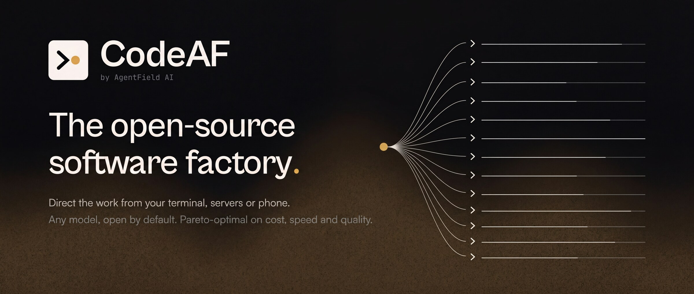

<br>

<a href="LICENSE"></a>
<a href="https://github.com/Agent-Field/codeaf/releases"></a>
<a href="https://github.com/Agent-Field/codeaf/stargazers"></a>
<a href="https://discord.gg/aBHaXMkpqh"></a>


<p>
<a href="#install">Install</a> ·
<a href="#one-window-for-every-project">One window</a> ·
<a href="#what-a-factory-is">What a factory is</a> ·
<a href="#subharnesses-specialists-built-for-one-job">Subharnesses</a> ·
<a href="#benchmarks">Benchmarks</a> ·
<a href="#headless-is-the-other-front-door">Headless</a> ·
<a href="docs/GUIDE.md">Guide</a>
</p>

</div>

**Frontier-grade coding on open models, at a fraction of the cost.**

CodeAF is a coding harness built for open models, to get the most out of every
dollar. It is also a different way to work once more than one thing is going on:
instead of three terminals of agents with you in the middle, one window where you
hand work off, see what is moving across every project, and step in only where
your judgment is needed. A factory, on your own machine, and the more you hand it
the more it does.

On DeepSWE its developer subharness solved the most issues of ten harnesses on
the same open model, at the lowest cost per solved issue ([benchmarks](#benchmarks)).

Written in Go as one small binary, with nothing else to install or run. Apache
2.0. By [AgentField AI](https://agentfield.ai?utm_source=github-readme&utm_campaign=codeaf-readme&utm_id=codeaf-readme-byline).

> **Early preview.** CodeAF is young and moving fast. Expect rough edges, and tell
> us where you hit them on [Discord](https://discord.gg/aBHaXMkpqh) or in an [issue](https://github.com/Agent-Field/codeaf/issues).

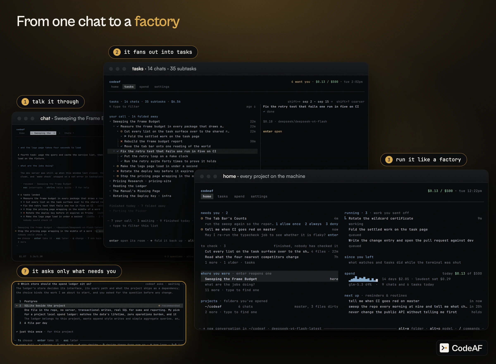

https://github.com/user-attachments/assets/bc87e460-17b1-4d7a-8c69-284b524ea194

<sub>Real speed, with sound. The three tasks run live on DeepSeek V4.1 Flash; the other projects and the large task tree are a seeded demo machine.</sub>

## Install

```bash
curl -fsSL https://agentfield.ai/get/codeaf | bash
codeaf
```

The script puts the release binary for your platform in `~/.codeaf/bin`. To
pin a version, give it a tag from the
[releases page](https://github.com/Agent-Field/codeaf/releases), where the
assets and checksums also live:

```bash
curl -fsSL https://agentfield.ai/get/codeaf | VERSION=<tag> bash
```

To build it yourself: `git clone`, `make build`, `bin/codeaf`
([guide](docs/GUIDE.md#install)).

On first start it connects OpenRouter in your browser, or takes a key. Codex signs in
a ChatGPT plan from `/connect` or `codeaf connect codex`; DeepSeek, GLM, Kimi, MiniMax
and Qwen take keys; Ollama needs none.

## One window for every project

An agent that lives in one folder means a terminal per repository, and a tmux
layout to remember which is which. CodeAF is one window.

`home` lists every project and conversation on the machine. `enter` opens any
of them in a tab, and the one you left keeps streaming with its tasks still
running. `tab` flips back. `alt+k` jumps to any conversation, open or closed.
Each keeps its own approval rules, models and spend limit.

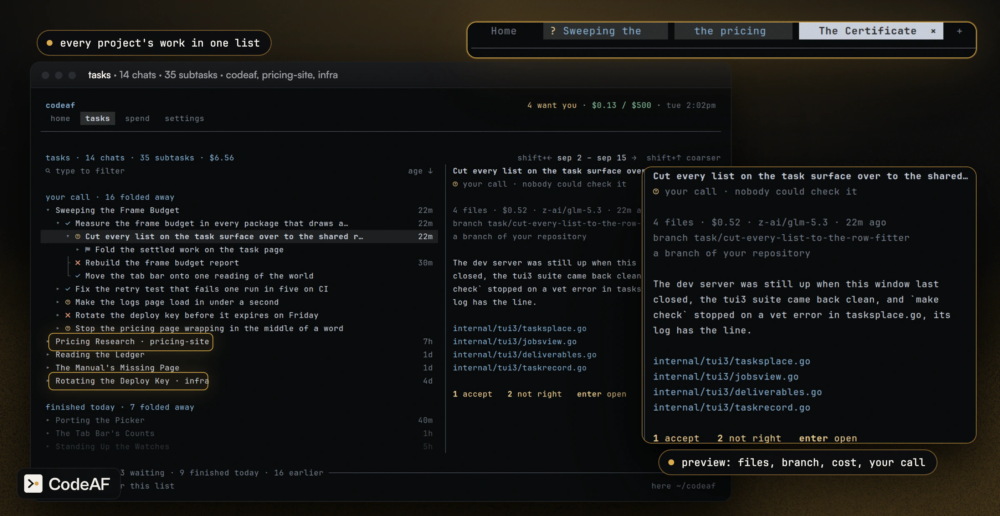

`home` answers what needs you, what is unread, what is running and what it
cost, for all of them at once. A digit answers a question from its row.

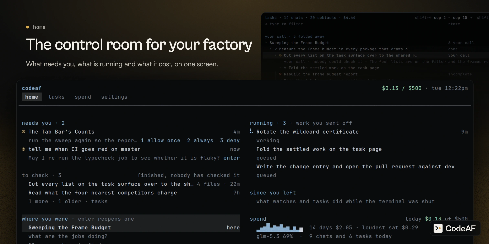

## Talk, and it becomes tasks

Say what is wrong the way you would to a colleague. Name three things in one
message and each can become its own task, in its own copy of the repository, on
its own branch. The conversation stays yours while they run, and the rail beside it
shows every task and its subtasks.

```text
 › three more while you are on it: the retry test fails one run in five on CI,
   the pricing page wraps mid word on phones, and the deploy key expires friday
```

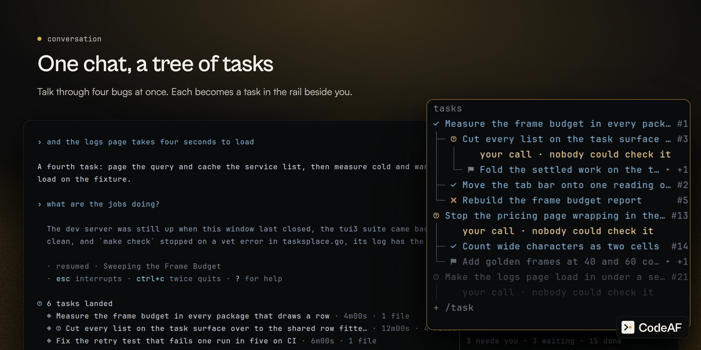

Work that passes its check lands on your branch by itself, never on `main`,
`dev` or a release branch. Work nothing could check waits under `unread`:
`1` accept, `2` not right.

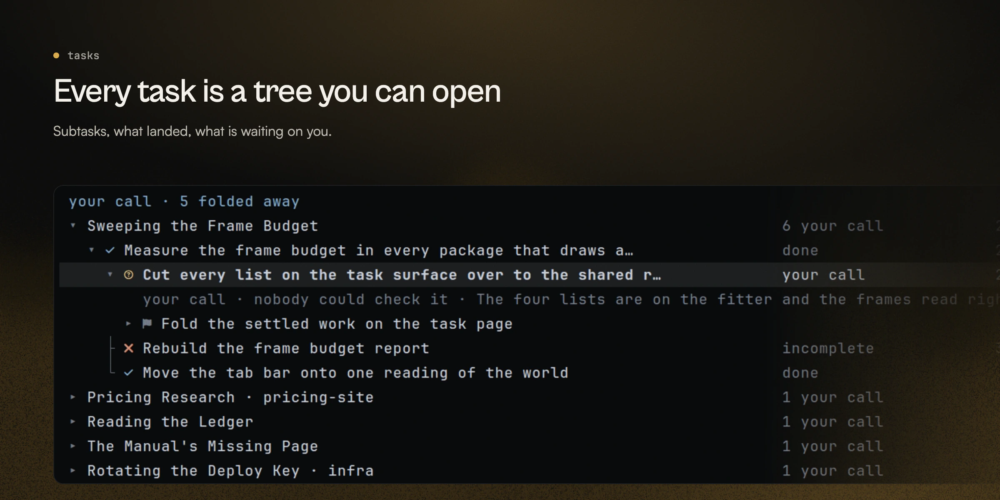

## What a factory is

Agents run by hand got fast, but the scheduling, checking and merging stayed
with you.

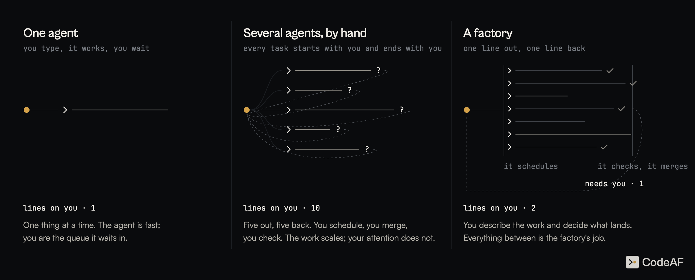

A factory is the third picture: one line out, one line back.

- **It does the middle.** It sizes the work, splits it, runs the parts where
  they cannot collide, tests what came back and merges what passed.
- **It asks only when it must.** A question waits under `needs you`, from every
  project. Everything else it decides, writes down, and carries on.

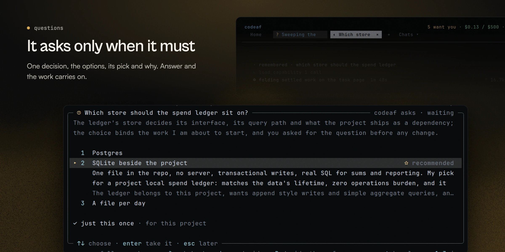

## Subharnesses: specialists built for one job

A general agent does everything a little. The work that matters most comes round
in the same shape: review this pull request, fix this issue, audit these
dependencies. A subharness is a specialist built for exactly that job, with its
own plan, its own checks and the models that suit it. It takes typed input and
returns typed output, so it delivers what it promised or is marked incomplete.
A run is a task like any other, on `home`, with a room and a stop.

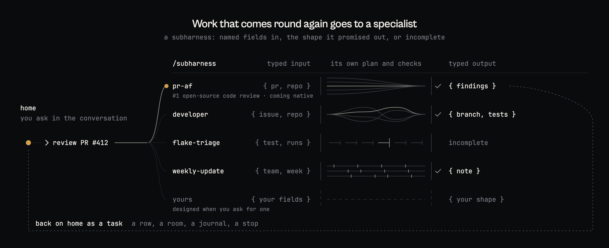

- **Coming soon, native:** [PR-AF](https://github.com/Agent-Field/pr-af), the #1
  open-source code reviewer on Martian Code-Review-Bench.
- **Native now:** `/senior-dev`, the developer subharness. First of ten
  harnesses on DeepSWE, in the [benchmark below](#benchmarks).
- **Your own:** "make me a harness for triaging flaky tests" designs one, saves
  it, and `/subharness` runs it.

## Benchmarks

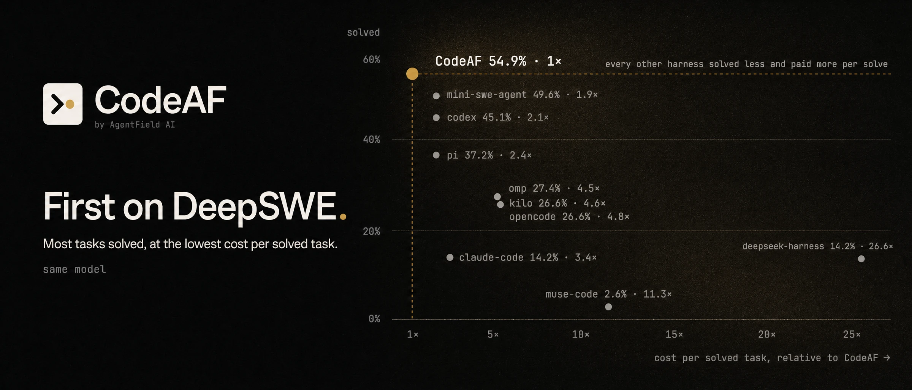

`/senior-dev`, CodeAF's developer subharness, against nine other coding harnesses
on the same model, DeepSeek V4 Flash: 113 real GitHub issues from DeepSWE, graded
by the official verifiers. It solved the most issues and paid the least for each
one it solved.

Every number, the method and the limits: [docs/benchmarks/deepswe](docs/benchmarks/deepswe/).

## The right model for each call

One session, many models. The model you talk to is one seat. Five more, the
crew, take the calls you did not type:

| seat | what it answers |
| --- | --- |
| reflex | memory, titles, the safety gate. Near free, reads every turn. |
| small work | digests, task names, yes-or-no checks |
| worker | every task you hand off. Most of the bill. |
| careful work | checks on finished work, the brief a task is shaped into, vision |
| mastermind | plans runs and designs subharnesses |

`/crew frugal`, `balanced` or `max` sets all five in one word. Any seat can be
pinned.

Every finished task is graded by the check it already had to pass. Work that
keeps failing on the worker seat moves up to careful work on its own, and each
request goes to the provider that has been fastest for that kind of call.
`codeaf models` prints the ratings.

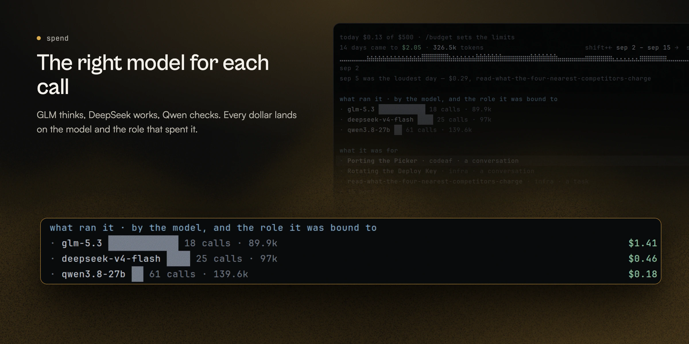

Providers built in: OpenRouter, DeepSeek, GLM, Kimi, MiniMax, Qwen, Codex through a
ChatGPT plan, Ollama and any OpenAI-compatible endpoint.

## Model Pool

The picker can choose models from what other installs have found. It is on by
default: what an install sends is computed, text-free numbers about the models
it ran (role, model, a number, which model judged, door, size bucket, day) under
a per-install nonce, never code,
prompts, paths or an identity, and `codeaf pool status` shows exactly what is
waiting to go. Turn it off with `model_pool = off` on the settings sheet or
`CODEAF_MODEL_POOL=off`; `read` uses the pool and sends nothing, and
`CODEAF_TELEMETRY=off` caps it at `read` along with the usage counts. The relay
publishes a signed index the crew picker reads under `picked from = learn`. The index is mirrored on the `model-pool` branch at
`pool/index.json`. The design is [Pareto Crewing](docs/design/model-pool/pareto-crewing.pdf);
the relay's code is under `relay/`, with a [runbook](docs/design/model-pool/RUNBOOK.md)
that includes running your own.

[](https://github.com/Agent-Field/CodeAF/tree/model-pool)

## Standing orders

Rules, reminders and watches are one thing, and you set them up by saying them.
"Never commit straight to main here." "Every Monday, draft the weekly update."
"Tell me when CI goes red." A card asks once; `1` and it stands, in this project
or everywhere, on the same daily spend limit as the rest.

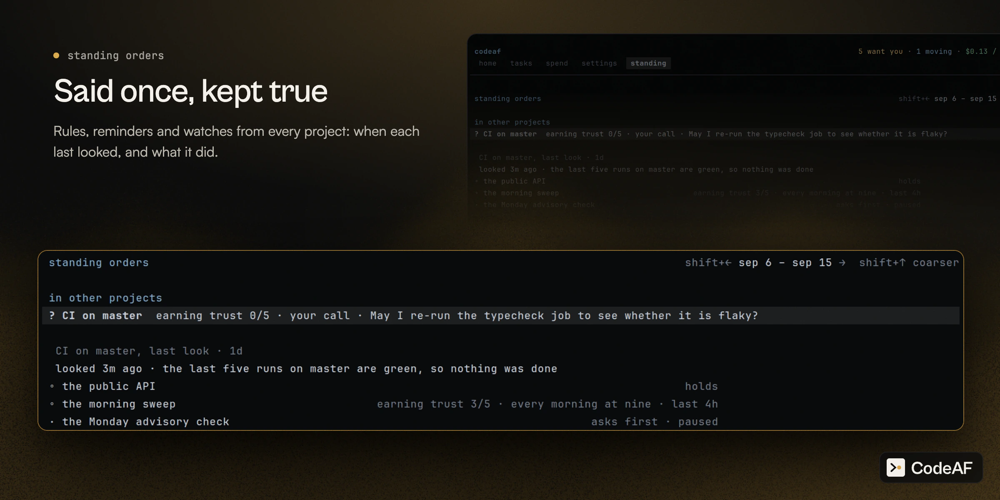

## Headless is the other front door

The same factory, with the conversation removed, for CI, cron, scripts and
benchmark harnesses.

```bash
codeaf do "bump every dependency whose changelog is worth reading" --timeout 30m --json
```

`do` takes your brief byte for byte, plans, runs and checks it, and prints one
JSON object and an exit code. Where the conversation would ask, it takes its
best answer and records the assumption. `exec` runs one worker with no plan;
`run` executes a plan you edited. [The contract](docs/HEADLESS.md).

## Run it on your dev box, drive it from anywhere

Most agents on a remote box mean ssh, tmux, and a terminal that lags on every
key. CodeAF splits in two instead. The screen runs on the machine in front of
you. The conversation runs on the machine that owns the work, and `home` shows
that machine: its projects, tasks and standing orders.

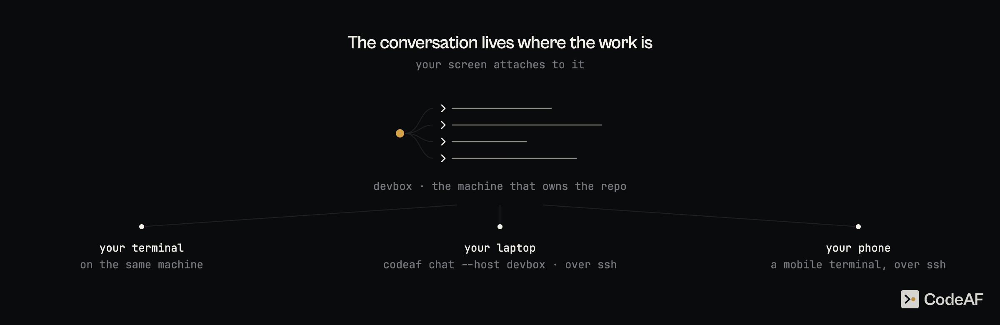

```bash
codeaf chat --host devbox    # your own ssh: config, keys, jump hosts. nothing to install there but codeaf
```

- **Typing never waits on the network.** Drawing the screen makes no round
  trip. Pressing enter makes one.
- **Close the lid, the work keeps going.** The conversation lives on devbox. A
  dropped link redials for five minutes, a question asked while you were away
  is still waiting when you come back, and desk and laptop can watch the same
  turn.
- **Files cross both ways.** Paste a screenshot or drop a file and it lands on
  devbox. Click a path in a reply and it opens here, in your own editor.

On your phone there is no app to install. ssh in from any mobile terminal, run
`codeaf` in the project, and it joins the same live conversation, folded to fit
the screen.

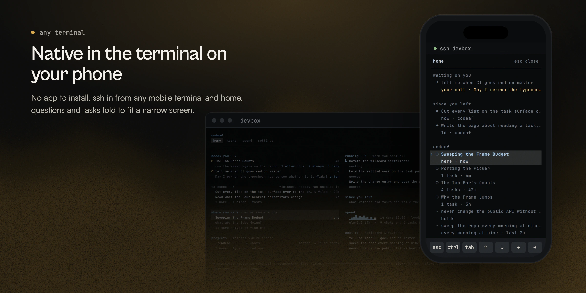

Still local over a connection: spend, search and memory. Reaching a machine
with no ssh at all, through a relay and a pairing code, is built and switches on
when the hosted relay does. [How it works](docs/REMOTE.md).

## What a copilot does, and what CodeAF does

| | a copilot | CodeAF |
| --- | --- | --- |
| where you work | one window, one repository | every project on the machine, from one control room |
| what you do | watch it type | describe work, answer what needs you, decide what lands |
| what runs | one model, one thread | six seats chosen per call, and subharnesses built for one job |
| how long it lasts | one session | conversations, tasks and standing orders that outlive the window |
| without you | it stops | headless, standing orders, a phone in your pocket |

## Performance benchmark

One Go binary, 53 MB on disk: up to 21x smaller than the field.

|                          | CodeAF  | claude         | heaviest rival measured |
| ------------------------ | ------- | -------------- | ----------------------- |
| On disk                  | 53 MB   | 224 MB, 4x     | 1.1 GB, 21x (omp)       |
| RAM per added session    | 27 MB   | 216 MB, 8x     | 653 MB, 24x (opencode)  |
| 16 idle sessions         | 507 MB  | 3.5 GB, 7x     | 10.5 GB, 21x (opencode) |
| Peak during one turn     | 122 MB  | 421 MB, 3.4x   | 1.0 GB, 8x (opencode)   |
| Resume a 50-turn session | 145 ms  | 392 ms, 2.7x   | 3.0 s, 20x (opencode)   |

Sixteen of ours fit in half a gigabyte; claude's fourth tab alone needs more.

Harness, method and every table: [docs/benchmarks/performance](docs/benchmarks/performance/).

## Docs

- `codeaf manual`, or `alt+.` for the key map. The manual ships in the binary and the chat reads it too.
- [Guide](docs/GUIDE.md): every flag, key, slash command and exit code.
- [docs/](docs/README.md): architecture, headless, remote, limits.

<details>
<summary>Telemetry: anonymous usage counts. <code>CODEAF_TELEMETRY=off</code> turns them off.</summary>

```text
codeaf sends anonymous usage counts to AgentField.
  Sent:  version, OS, mode, session counts, errors, and total tokens used.
  Never: anything about you or your work. No prompts, code, file names,
         paths, repo names, keys, email, IP, or machine name.
  What is collected:        codeaf telemetry info
  Turn off:                 CODEAF_TELEMETRY=off
```

Counts and buckets only, never your work. [docs/TELEMETRY.md](docs/TELEMETRY.md)
lists every field and every way to turn it off.

</details>

Built by the [AgentField](https://github.com/Agent-Field/agentfield) team.
