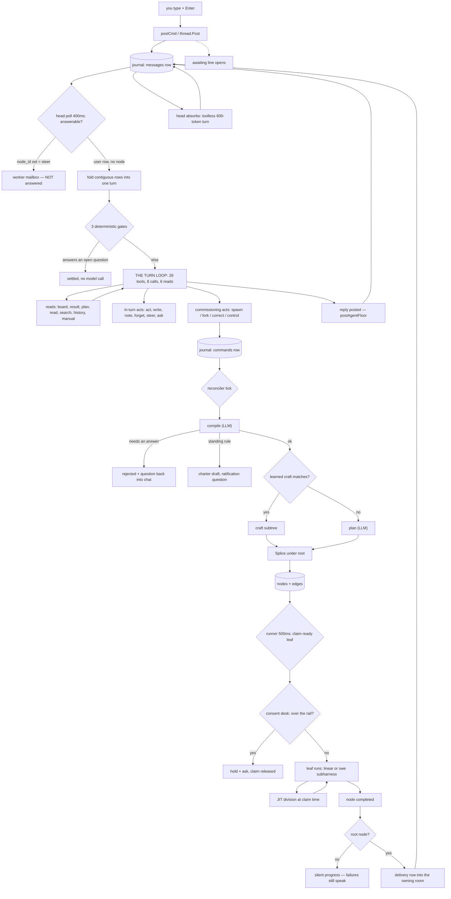
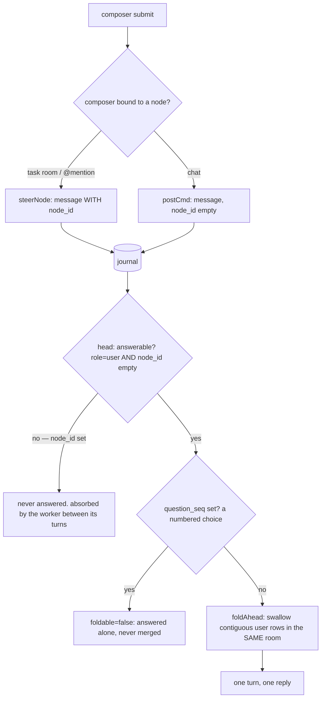
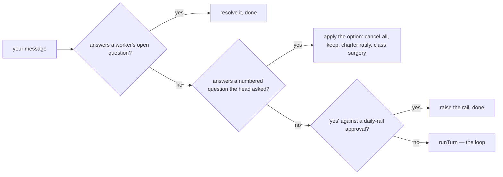
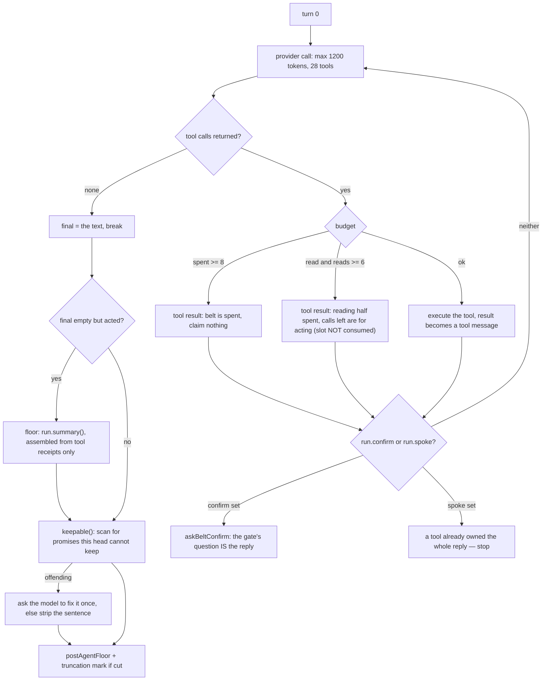
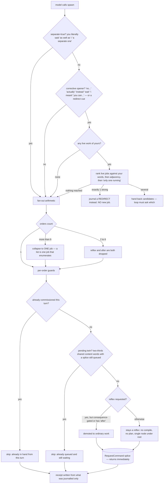
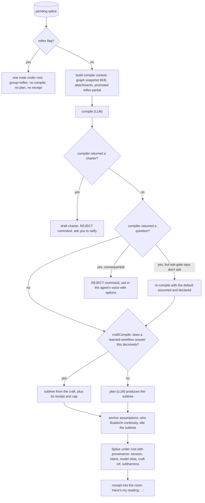
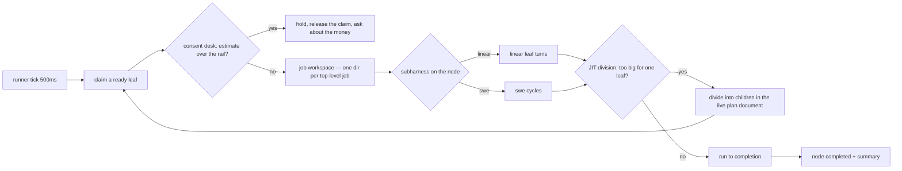
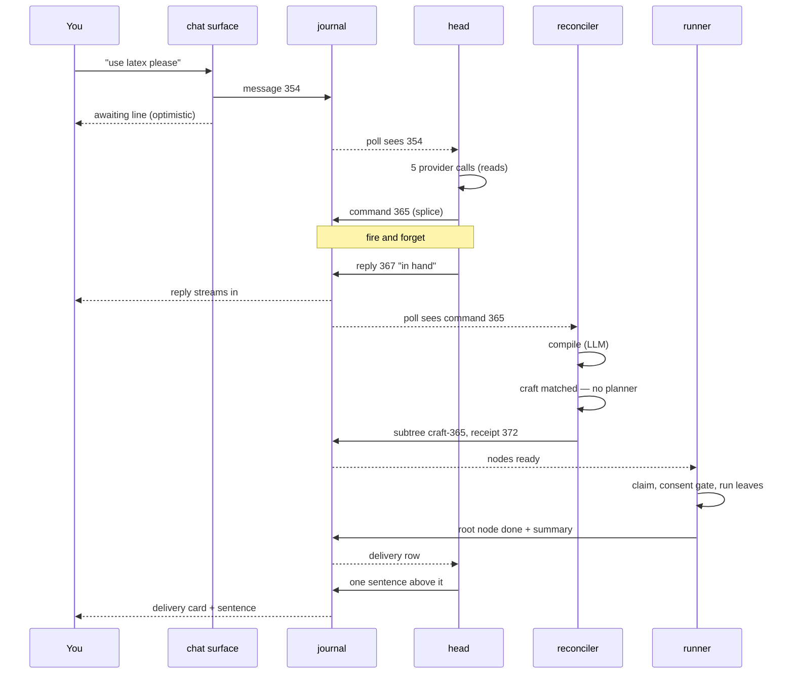

# One message, all the way down

Every branch between typing a sentence in aforge chat and a worker finishing a job — what is decided, by whom, what blocks, and what is fired and forgotten.

Traced on branch `chat-v2` against a real journal: `~/.aforge/graph.db`, session `d52ce75d`, seq 346–372.

---

## Bottom line

**There is no chat→task call.** The chat surface writes exactly one row — your message — into the SQLite journal and returns. Everything after that is four independent poll loops reading that journal. Nothing calls anything.

**One message = one head turn = one agentic tool loop** over 28 typed tools, capped at 8 tool calls (max 6 of them reads) and 10 provider calls. The ten deterministic recognizers still run, but only as *hints* in the prompt — they cannot answer any more.

**Only three tools create a task** — `spawn`, `fork`, `correct` — and all three are fire-and-forget: they append a command row and return a sentence. No compiling, no planning, no work happens inside your turn.

---

## The five loops, and their clocks

All five live in one process when you run `aforge chat --v2`. A second window is a *visitor* — surface only, no head, no runner. They share nothing but the journal, and each is gated on `LatestEventSeq()` so a quiet system costs one integer read per tick.

| Loop | Clock | Reads | Writes | Where |
|---|---|---|---|---|
| chat surface | 300ms | messages, nodes, questions | one user message row | `tui2/chat/poll.go` |
| head | 400ms | messages across all rooms | agent replies, commands, facts | `head/head.go:249` |
| reconciler | ~1s | pending commands | subtrees, receipts, charters | `resident/resident.go:537` |
| runner | 500ms | ready leaves | node claims, results | `resident/runner.go:346` |
| consent desk | on claim | estimates vs rails | money questions | `cmd/aforge/chat.go:500` |

One exception to journal-only coupling: **token deltas stream over an in-process Go channel**, keyed by session id, so the reply types out live instead of appearing at the next poll. A visitor window has no such channel and its replies land whole.

---

## The whole path

The three colours to hold in your head, since mermaid won't show them: **reads and in-turn acts** block your turn and their results are ground truth for the reply. **Commissioning acts** are journalled and left — the turn returns before anything runs. **Gates** stop and ask.

---

## Getting in: three kinds of row

`internal/head/coalesce.go` · `tui2/chat/poll.go:694` · `rooms.go:1319`

The surface has two write doors and they behave completely differently.

**Folding** is why typing three sentences fast gets one answer rather than three. It takes a *contiguous* run: the first row from another room, or any row it cannot answer, stops the fold — otherwise a row would be marked handled without being answered and go silent forever.

**Mid-turn refold** (`watchForFold`) is the other half: while the *first* provider call of a turn is in flight, a new message from you cancels it and the turn restarts carrying both halves. Armed only on turn 0 and only while nothing has acted — once a tool has journalled anything, the turn owes you a receipt and may not withdraw.

---

## Three things that never reach the model

`internal/head/head.go:470`

These run before the loop and answer terminally. They are the *answer* side of consent gates the head itself opened — routing them through a model would let the model reword what you consented to.

---

## The prompt: exactly what the head knows about you

`internal/head/loop.go:284` — `turnPrompt`

Two messages, every turn. The system message is `orchestratorPrompt` wrapped in your voice preferences and is **byte-identical between turns on purpose** — it is the one thing in the call that can be cached at a tenth of the price. The user message is assembled *stable-first*, so volatile blocks sit at the end and invalidate as little of the prefix as possible.

| # | Block | Volatility | Note |
|---|---|---|---|
| 1 | recent thread | appends only | this room only; moves its front in big steps |
| 2 | measured execution history | between jobs | competence priors |
| 3 | manual page list | constant | compile-time |
| 4 | live board | every status tick | same renderer as the `board` tool, 12 rows max |
| 5 | services | ticks | persistent things you're running |
| 6 | deep slices | per message | *guessed*: jobs this sentence seems to be about |
| 7 | notebook | per message | retrieved durable beliefs, numbered |
| 8 | hints | per message | the ten recognizers, demoted to evidence |
| 9 | clock | per minute | so "yesterday" resolves |
| 10 | today's spend vs rail | per cent | never dropped |
| 11 | your message, verbatim | — | last thing before the answer |

Two things it deliberately *cannot* see: another room's conversation (only via the `thread` tool, on purpose), and anything older than the recent-thread window unless it calls `search`.

---

## The loop and its budget

`internal/head/loop.go:94` — `runTurn`

The numbers, and why they are those numbers:

- **8 tool calls** — enough for read → write → read back → say, with two spare after a tool error. Bounded so one sentence can never become an open tab.
- **6 of them may be reads** — the belt is *divided*, not widened. A turn that spends everything investigating still has two hands left to commission the fix. This exists because a diagnosis once used all eight calls reading, then claimed it had commissioned a repair it never commissioned.
- **10 provider calls** — 8, plus one to be told the belt is spent, plus one to speak.
- **1200 output tokens** — deliverables are not supposed to be in the reply at all; they go through `write` onto disk. Anything cut flows a truncation mark, so a cut answer can never be presented as a whole one.

---

## Every choice the head has

`internal/head/toolbelt.go:304`

This is the entire action space. **read/in-turn** = the turn blocks on it and the result is ground truth for the reply. **journalled** = a command row is appended and the turn returns; you get a receipt, not an outcome. **ends turn** = the tool owns the words and the loop stops.

| Tool | Kind | What happens |
|---|---|---|
| `board` | read | live work, 12 rows; the only place ids come from. `q`/`id` also reach finished jobs |
| `result` | read | one job's findings in full, files, spend — 4KB |
| `plan` | read | the job's step structure, waits-on, per-step cost |
| `read` | read | opens a file a job actually recorded writing. Uncompressed |
| `search` | read | conversation + notebook + folded jobs. The only read that reaches what was merely said |
| `history` | read | time-windowed settled work; reaches packed-away jobs |
| `thread` | read | another room's transcript, on demand only |
| `manual` | read | aforge's own docs — the only sanctioned source for questions about itself |
| `competence` | read | measured strengths and weak spots |
| `standing` | read | watches, rules, next check |
| `spending` | read | today vs rail, or a named window |
| `act` | in-turn | one shell command, **10s ceiling**, 4KB out, 400B in. Consequence-gated; refusal says "use spawn" |
| `write` | in-turn | document onto disk, returns a path. The artifact door |
| `note` | in-turn | one durable notebook line, may supersede a numbered one |
| `forget` | in-turn | quarantines one belief (or journals a skill retirement) |
| `steer` | in-turn | broadcasts into the mailboxes of parts *running right now*. Plan untouched, nothing journalled, returns the count told |
| `await` | in-turn | waits up to **3s** for a command's receipt. The only feedback loop on async commands |
| `spawn` | journalled | **the task door.** 1–6 splice commands. See below |
| `fork` | journalled | spawn carrying the conversation as context |
| `correct` | journalled | redo a *delivered* deliverable with the criticism in hand |
| `control` | journalled | cancel/pause/resume/restart/reprioritize, ≤32 ids. May raise a confirm gate |
| `revise` | journalled | edit the remaining plan of a live job |
| `expedite` | journalled | front of queue + trim the unstarted tail |
| `rule` | journalled | retire/pause/cadence/wording/probation a standing rule |
| `service` | journalled | stop/restart/auto-restart; `stop_everything` asks once |
| `craft` | journalled | run/revert/retire a learned workflow |
| `ask` | ends turn | numbered question with clickable options. Your next message is the answer |
| `answer_question` | ends turn | settles a worker's question — but refuses anything consent-bearing, which is most of them |
| `interrupt` | ends turn | stops the head's own turn, keeps what was said, marks where it stopped |

Two structural facts fall out of this table:

- **Nothing in the loop can wait for work.** `await` waits 3 seconds for a *receipt*, never for a result. There is no commission-and-report-back inside one turn, by design.
- **Reads are how the head grounds a claim.** The reply is passed through `keepable()`, and a turn that acted with no words falls back to `run.summary()`, assembled from tool receipts and never from intent.

---

## Does this sentence become a task?

`internal/head/spawn.go:38` · `amend.go:86`

The decision you most want to understand — and most of it is *not* the model's. Five guards run inside the tool, after the model has already decided to call it.

Why each guard exists, from the failure archive:

- **Amendment door** — "deep research 20 best stocks" then, 40 seconds later, "no you can use internet search" commissioned two identical jobs and charged twice. *Reference* makes it a change; resemblance never does ("another look at the stock list" is genuinely a second ask).
- **Fan-out cap of 6** — past that, the message is a list, and a list is one job that enumerates.
- **Turn dedupe** — the loop calling `spawn` twice with the same sentence in one breath used to buy two compiles, two plans and two deliverables.
- **Pending twin** — "get me a list of X" … a minute later "ok start it" twinned the job while the first splice was still queued.
- **Consequence gate on reflex** — a reflex whose words buy, send, publish or delete beyond the workspace is not a reflex. Applied at the journaling door, not trusted from wherever the flag was set.

---

## After the command: what the reconciler does

`internal/resident/resident.go:1095`

Your turn is **already over** by the time any of this runs. Note the two further model calls here — compile and plan — which are nothing to do with the head. This is why a job takes a few seconds to appear on the board.

Then the runner, on its own clock:

---

## How anything gets back to you

`internal/resident/resident.go:2095` · `internal/head/absorb.go`

Four separate return channels, easy to confuse:

| Channel | Trigger | Appears as |
|---|---|---|
| live tokens | in-process channel, keyed by session | the reply typing out |
| progress | node status changes seen by the surface's poll | the job card mutating in place |
| delivery | **root** node completed → system row anchored to the node | the delivery card, verbatim result |
| absorption | head sees that delivery row | one sentence of the head's own, above the card |

Three rules worth knowing:

- **Intermediate completions are silent**; intermediate *failures* speak. A leg dying is your task's news even when the leg wasn't the task.
- **The room is the work's, not the window's.** `deliverySessionID` sends a deliverable to the room that commissioned it, not to whichever window happens to be open.
- **The absorption turn has no tools and 600 tokens**, with a prompt that forbids restating the result: the verified text goes out whole underneath it, so anything it adds about substance is invention sitting one line above a contradiction.

---

## Your journal, seq 346 → 372

Two consecutive messages from session `d52ce75d`. Nothing here is illustrative — this is what actually ran.

### "open the pdf" — the `act` path, 2 provider calls, no task

| seq | event | meaning |
|---|---|---|
| 346 | message_posted user | "open the pdf" |
| 348 | usage 10321 → 81 | call 1: model chooses `act`; the shell command runs in-turn |
| 351 | usage 10479 → 9 | call 2: nine tokens of words |
| 352 | message_posted agent | "The PDF opened in your default viewer." `answers_seq=346` |

### "thjere is still overflow use latex please" — the `spawn` path, 6 calls, one task

| seq | event | meaning |
|---|---|---|
| 354 | message_posted user | typo and all — it travels verbatim |
| 356 | usage 10343 → 62, cached 9984 | call 1 — note the cache hit: the stable prefix is working |
| 358 | usage 10499 → 165 | call 2 — a read |
| 360 | usage 11361 → 124 | call 3 — prompt growing as tool results append |
| 362 | usage 11632 → 101 | call 4 |
| 364 | usage 13180 → 322 | call 5 — the `spawn` arguments |
| **365** | **command_requested splice** | fire-and-forget. Instruction rewritten as "Rebuild the Abir Abbas profile brochure as a proper LaTeX document…" |
| 366 | usage 13528 → 137 | call 6 — the words |
| 367 | message_posted agent | "The LaTeX rebuild is in hand…" — **your turn ends here** |
| 368 | usage 8125 → 789 | reconciler: **compile** |
| 369 | usage 391 → 16 | titling |
| **370** | **subtree_spliced craft-365** | a learned craft matched — 4 nodes, *no planner call at all* |
| 371 | command_resolved applied | "spliced 4 nodes" |
| 372 | message_posted system | "using your person-research-dossier way of doing this — 3 steps, ~$2.50 cap" |

Read the gap between 367 and 372: **two model calls after the head told you it was in hand, the shape of the job was still being decided.** The head's sentence was written before anything knew whether this was 3 steps or 30.

---

## Where the naturalness actually breaks

The joints — where the machine's structure shows through the conversation. Ranked by how often the archive hits them.

1. **The commitment sentence is written before the job's shape exists.** The head says "in hand" at 367; compile and craft-matching happen at 368–370. Anything it says about size, cost or steps at that moment is a guess. The truth arrives at 372 — in a *system* voice, in machine vocabulary ("3 steps, ~$2.50 cap"), under a sentence that already committed.

2. **Nothing can commission and report back in one turn.** `await` tops out at 3 seconds for a receipt. So "have a quick look and tell me" is either one turn of reads with no work, or work with no look. The failure mode is the loop reaching the end of its belt holding an answer and no hands — exactly why the read cap sits two below the whole.

3. **The amendment door is lexical.** Whether "use latex please" is a change or a new job hangs on a prefix list (`correctiveOpeners`) plus a ranking score. Your real message tripped none of it — no live work — so it became a new job with continuity. The same sentence 30 seconds earlier would have become a revision. That discontinuity is invisible from the chat.

4. **Steer and chat are different doors with no visible difference.** A node-anchored message is never answered — it goes to a worker's mailbox. If nothing is running on that job, `steer` reports "no one was told." From your side, both look like typing into a box.

5. **Four return channels, one transcript.** Progress cards, delivery cards, system receipts and the head's own voice all land in the same column in different registers. The absorption turn exists purely to put one human sentence in front of machine output.

6. **The hints block is invisible leverage.** Ten recognizers write pre-answers into the prompt for messages that trip them, and nothing at all for messages that don't. Two similar sentences can get materially different grounding, with no way to see which one got the hint.
