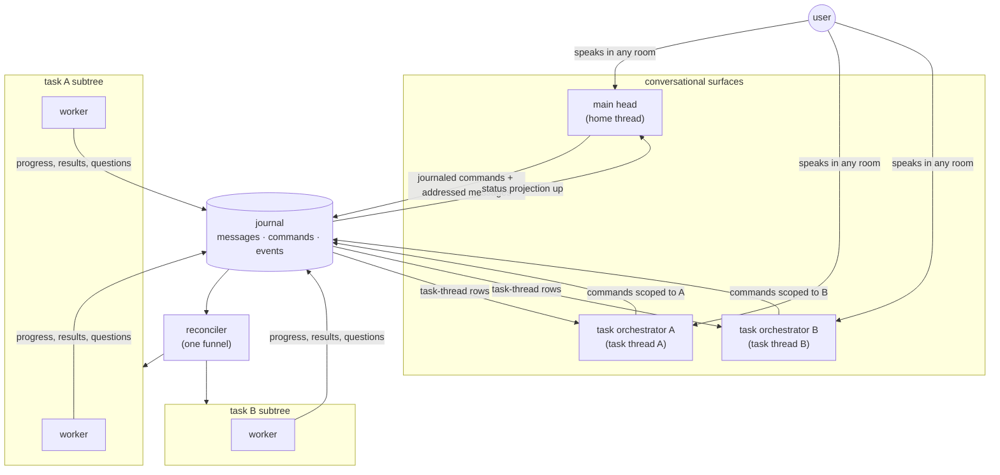
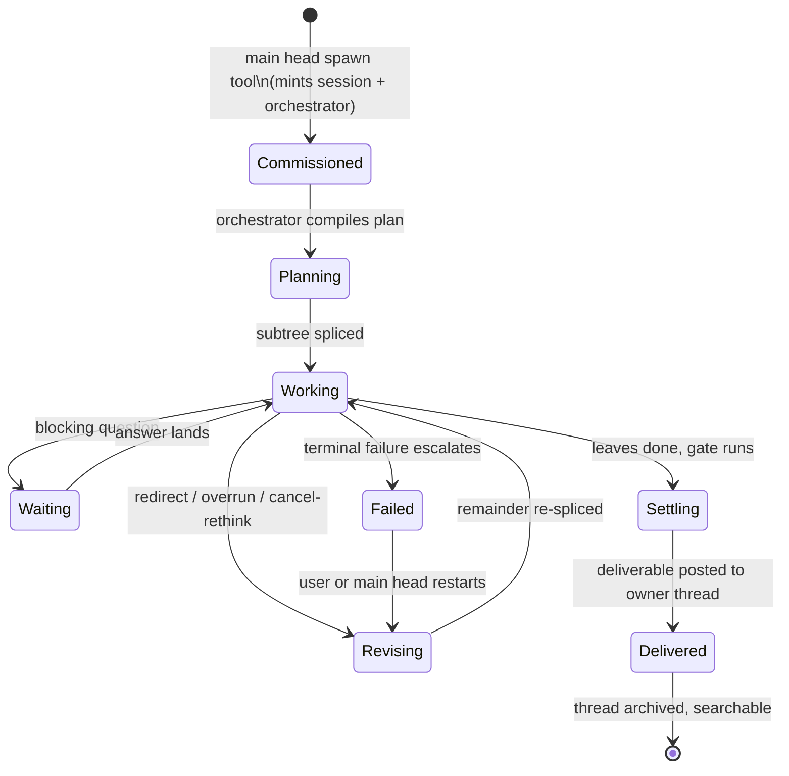
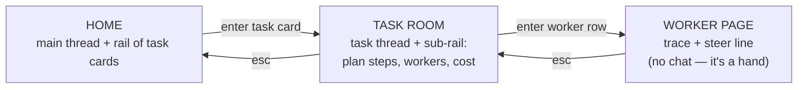

# Chat rebuild — diagnosis and redesign notes

Date: 2026-08-10. Source: three deep read-throughs (thread/store architecture, TUI chat
surface, head authority) at HEAD `d9fc533`. This file is the working notes for the
threads/chat teardown: what exists, why it is weird, and the shape of the replacement.
The headless task path (`aforge do`) is healthy and stays; the chat surface and the
head's split brain are what get rebuilt.
Revised 2026-08-10 after adversarial review (see Part 9).

---

## Part 1 — What actually exists (short map)

- **No `Thread` type exists.** A "thread" is an emergent view over the `messages` +
  `commands` SQLite projections keyed by a `session_id` string. Journal-is-truth
  (`internal/store/thread.go:14-18`); projections rebuild from event replay.
- **Session identity is a global singleton**: `resolveChatSession`
  (`cmd/aforge/chat.go:2849`) resumes whatever `LastSeen()` names, across all surfaces.
  Headless runs never write seen edges, so the watermark goes stale; deliverables get
  re-homed into whatever window is attached (`deliverySessionID`,
  `resident/resident.go:1956-1967`).
- **The head is a router with an orchestrator bolted underneath.** `Head.answer`
  (`internal/head/head.go:429-549`) runs a 10-recognizer deterministic cue ladder
  (questions → services → charters → surgery → standing → redirect → correction →
  control belt) before the LLM router ever sees the message. The tool belt
  (`internal/head/toolbelt.go`) has 15 tools including real mutation authority
  (`control` = cancel/pause/resume/restart/reprioritize; `steer`; `revise`;
  `expedite`) — but it only fires when a lexical cue trips (`controlLoopApplies`,
  `control.go:281`).
- **One funnel for graph mutation already exists and is good**: everything converges
  on `store.RequestCommand` → `validateNodeCommand` → `Reconciler.applyCommand`. TUI
  keybindings and belt tools journal the identical typed command. Keep this.
- **Chat vs headless converge below the head** (`brainOptions`,
  `cmd/aforge/chat.go:100-152`): same reconciler, runner, compile→plan→splice, consent
  desk. `aforge do` writes the identical splice command the head would. The seam law
  (docs/ARCHITECTURE.md Decision 7: conversation is a lens) is architecturally true
  today. Keep this too.
- **No event bus** — append-only events table + 400ms/2s polling on a watermark,
  except provider token deltas which push over an in-process Go channel. Five separate
  progress channels: thread messages, replaceable progress rows, trace files (outside
  the journal), node-anchored mailboxes, and the in-process stream.

## Part 2 — Why it is weird (the indictment)

### The head's split brain
1. **Two prompts, two boards, two thread renderers, three verb vocabularies.** Router
   prompt (`head.go:78-136`) vs belt prompt (`control.go:22-77`) restate overlapping
   law; `renderGraph` (`head.go:1508`) vs `boardRows` (`toolbelt.go:1390`); command
   verbs exist as store constants, router JSON kinds, and belt tool names.
2. **The cue ladder is load-bearing and unauditable.** Ten sequential recognizers,
   each with a private keyword vocabulary; ordering documented only in comments;
   adding one means auditing ten interactions. A message that needs orchestration but
   trips no cue never reaches the tools.
3. **The head cannot spawn work as a tool call.** Spawning is only the terminal
   decision of a router turn (`issue.go:24`, `fanout.go:38`); the belt is explicitly
   forbidden from queuing (`control.go:56`). The head cannot read the board, decide,
   spawn, and report in one turn.
4. **The head cannot cancel its own turn programmatically.** `Head.Interrupt`
   (`head.go:370`) is an in-process handle bound to a TUI keypress. Not a command
   kind, not journalled, not reachable from another surface or from the head itself.
5. **The head cannot answer worker questions** — no tool, and `OpenQuestions` is a TUI
   backend capability never in the head's prompt.
6. **No feedback loop on async commands** — `control`/`revise` return "queueing";
   outcomes arrive later as reconciler receipts. The head cannot await or re-plan on
   a result inside a turn.
7. **The system prompt contradicts the machinery**: "It never plans or executes work"
   (`head.go:1-3`, `:91`) sits above a belt that cancels, steers, and revises plans.

### The thread model
8. **"One mouth" is a convention, not a mechanism** — 37 `store.PostMessage` call
   sites across 19 non-test files (head, resident, runner, cmd, TUI); the
   hand-maintained `headSpeaksFor` audit list (`resident.go:1020-1043`) is the
   compensating hack.
9. **One nullable column, four semantics.** `messages.node_id` decides: chat vs
   steering mailbox (`coalesce.go:106`), person vs ambient prompt window
   (`head.go:1023`), stream vs card mutation (`stream.go:261`).
10. **Three overlapping conversational stores** — `messages`, `agent_questions`,
    `messages_fts`; a question exists in five places (question row, message row, JSON
    blob in the body, `options` column, FTS copy).
11. **Structured data smuggled through prose.** Typed columns exist and are bypassed;
    the TUI recovers question components with a hand-rolled brace/quote scanner over
    the body (`cards.go:738-767`) plus a legacy numbered-list fallback.
    `Message.Options` is effectively write-only.
12. **Head reads all sessions on one cursor** (`Messages("", cursor, 200)`,
    `head.go:294`) while the lens reads one session — cross-session fold-stops and
    re-reads exist purely to defend against that query shape.

### The TUI
13. **330-field god struct** (`tui/model.go:300-781`), one flat namespace for every
    page, ~30 hand-maintained hit-test rectangles, 6 render caches. `newSession()`
    hand-resets 25 fields.
14. **Render functions mutate the model** (click-target row maps written during
    `View()`), forcing a fixed invalidate/track call order and a side channel for
    filesystem questions discovered mid-render.
15. **Four caching layers** for the transcript (block cache, card blocks, brief
    blocks, whole-thread splice) with `reflect.DeepEqual` validity checks and
    heuristic eviction.
16. **Two streaming lanes plus a queue, with a documented stall state** — belt
    answers never stream (land whole, get retyped by the simulator), router answers
    stream. Same product, two visibly different reply behaviors.
17. **28 capability interfaces + 44 runtime type assertions** to discover one
    concrete `chatCommander` struct.
18. **Cancel affordances are scattered and asymmetric**: chat transcript/dock cards
    have no cancel; `/cancel <id>` requires knowing an id; task page has `c`/`r`
    keybindings; head-turn interrupt is esc-only and in-process. Todos/plan progress
    have no chat surface at all.

### The wiring
19. **`cmd/aforge/chat.go` is a 6063-line god file owning engine logic** — delivery
    judging, gap extension, plan revision, consent desk, provider pool, the whole
    `chatCommander` — none reachable from `internal/`.

## Part 3 — Laws that survive the rebuild

- **Journal-is-truth**; projections rebuildable. One SQLite journal, one command
  funnel (`RequestCommand` → reconciler). No second engine.
- **Decision 7 (lens law)**: chat and headless differ only in where the task comes
  from. A feature that behaves differently in one surface is a bug in the seam.
- **One mouth** (JOURNEY.md) — but promote it from convention to mechanism.
- **THREAD-UX presentation law**: stream = conversation, card = work; interruption
  budget = question / delivery / failure.
- **Emergent-capability principle**: the head gets general tools, not hard-coded
  playbooks.
- Standing/charter probation law (STANDING.md Decision 5) untouched.

## Part 4 — Redesign: chat as the main orchestrator

### 4.1 One agentic head loop (kill the split brain)
Replace the cue ladder + router + belt trio with **one tool-loop agent**: system
prompt says "you are the orchestrator; you converse, and you act through tools."
Every capability becomes a tool in one belt:

- `spawn` (splice/reflex work orders — currently router-terminal only)
- `control` (cancel/pause/resume/restart/reprioritize — exists)
- `steer`, `revise`, `expedite` (exist)
- `plan` read (exists) — plus a bounded `await`/re-read so a turn can observe the
  receipt of a command it just issued
- `answer_question` (new: settle a worker's open question, gated same as today's
  human path where consent-class)
- `interrupt_self` / turn cancel as a journaled command kind (new — so esc, another
  surface, or a headless caller can stop the head's own turn)
- board/result/history/search/spending/standing/note/manual/read/competence/plan
  (exist)

Deterministic recognizers don't disappear — they become *cheap pre-answers* that the
loop may consult, not pre-empts that bypass it. One prompt, one thread renderer, one
board renderer. Reversibility/consent gates and confirm thresholds stay exactly where
they are (shared funnel), so authority expands without weakening the gates.

### 4.2 Threads become first-class
- A real `sessions` table (id, title, created, last-active, surface) replacing the
  `LastSeen()` singleton; explicit thread list + switcher in the UI.
- Per-session head cursor (not one global cursor over all sessions).
- Structured message parts instead of prose smuggling: a message carries typed
  blocks (text, question ref, card ref, progress ref) — the body scanner dies.
- Steering mail moves out of the chat table semantics: same journal, distinct kind,
  so `node_id` stops carrying four meanings.
- One mouth as mechanism: a single `thread.Post` door in one package; the store
  refuses `messages` writes from anywhere else (or at minimum a lint/test gate).
- **What "one mouth" means** (clarified after review — it never meant one writer):
  one **door** — a single `thread.Post` API, store-enforced — and one **answering
  voice** per room, that room's orchestrator. Multiple attributed speakers
  (reconciler receipts, worker questions, user-via-main dispatches) flow through
  the same door with explicit attribution. The law is about the funnel and the
  voice, not about a single author.

### 4.3 The chat surface (traditional harness shape)
Inspiration: Claude Code's TUI grammar — transcript + bottom composer + status line,
with aforge's right rail kept as the live-work surface.

- **Transcript**: user turns, streamed head replies (single streaming lane; every
  reply streams, including tool-loop turns), and *inline collapsed tool-call rows*
  (`▸ control: cancelled wisp-nav2`, `▸ spawn: 3 work orders`) — the head's actions
  visible in-thread, expandable, exactly like a coding-agent harness renders tool
  use. Settled deliverable cards stay inline at birth position.
- **Right rail (persistent, not toggle-hidden)**: live task cards with per-card
  affordances — cancel, steer, open — plus plan/todo progress (the plan-sight data
  the head already gets: steps, waits-on edges, elapsed). This gives the "todos"
  surface that today doesn't exist anywhere in the TUI.
- **Composer**: keep draft ring, attachments, esc-interrupt; add a persistent status
  line (model, spend vs rail, N running / M waiting) replacing the legacy activity
  bar + shimmer + dock fallback stack.
- **Esc ladder shrinks**: with one place grammar (thread + rail + task page +
  overlays) most of the 20-rung ladder disappears.
- **Interaction parity**: anything the head can do with a tool, the user can do with
  a click/key on the same object (cancel on a rail card journals the same command).

### 4.4 UI implementation reset
The current `internal/tui` chat page is not salvageable incrementally (god struct,
render-mutates-model, four caches, splice hack). Rebuild as per-page sub-models with
a message-part renderer keyed to the structured thread model; keep the reimplemented
viewport (our `charmbubbles/viewport` is a ~100-line reimplementation, not a vendored
fork; `textinput` is a genuine fork), the poll watermark, and the anchor-preserving
scroll idea (the one genuinely good invention in the current renderer — it survives
the 8.1.1 resolution, because we stay in alt screen).

### 4.5 Plumbing
- Keep polling (single process, SQLite, works) but collapse the five progress
  channels: progress and narration become structured message parts; trace tail stays
  the task-page-only exception.
- `chat.go` god file dissolves: commander → `internal/command` (or into head),
  plan-revision/judging → `internal/plan` or resident, consent desk → its own
  package, provider pool → `internal/provider`. The TUI's 28 interfaces collapse to
  ~3 (Backend, Commander, Streams).

### 4.6 Siting and phasing the orchestrators

Part 5 describes rooms as if every task already had its own live orchestrator agent.
It doesn't, and v1 does not build one. Where the orchestrator *lives* is the
structural decision; this subsection settles it and phases the work.

**v1 — exactly ONE head.** A task room is a **view**, not a second agent:

- its transcript is the task's node-anchored message trail + reconciler receipts +
  the orchestrator status line;
- its composer posts steer/redirect through the **existing journal verbs**;
- those messages are answered by the one head, which already has plan-sight.

This delivers the rooms product (the journeys in 5.3/5.4/5.5 of this doc) with **zero new
agents**. Everything in Part 5 about anatomy, scope, receipts, and predictability
holds; only the "who answers" is collapsed to one voice.

**Why v1 does not attempt live per-task agents**: the head is *window-sited* today.
It is built in `cmd/aforge/chat.go`, has a single turn slot, a single-session fold
cache, and a global cursor. Multiplying that object per task would multiply the
window brain, not the resident.

**v2 — orchestrators become RESIDENT-SIDE loops keyed by task session**, never
window-side. That siting is what makes headless `aforge do` tasks get orchestrators
for free, and it is what preserves the lens law: a headless-commissioned task's room
is identical to a chat-commissioned one, because neither depends on a window being
attached.

**Prerequisites for v2** (each detailed in Part 9): per-session cursors,
`Command.Issuer` with a subtree-authority check, per-task budget ceilings, and
resident-side scheduling of orchestrator turns.

## Part 5 — Product design: rooms, orchestrators, and the chat-of-chats

(Added 2026-08-10 after the philosophy discussion. This section settles the product
questions: where orchestrator chats exist, how they relate, and the user journeys.)

### 5.1 The governing principle: a chat exists where direction can change

The question "why not a chat for every subtask?" has a principled answer, not a
taste answer. A conversation is warranted only for a unit of work that:

1. **owns a plan that can be revised** (there is something to redirect),
2. **lives long enough to need redirection** (minutes-to-days, not one tool run),
3. **answers for an intent the user expressed** (there is someone to report to).

Leaves execute; they don't negotiate. You don't chat with your hand. So:
**chat follows plan ownership, not node existence.** Every node that owns a plan
subtree gets the orchestrator primitive; nodes that are pure execution get a trace
page and a steer line, nothing more.

In today's aforge this means: top-level jobs (splice roots) get orchestrators.
The architecture keeps the primitive *recursive in principle* — if a subtask ever
grows its own plan (recursive splice, or the user promotes it: "make this its own
task"), it earns a thread by the same rule, and the emergent-capability doctrine is
satisfied because nothing hard-codes "two tiers." The product simply doesn't
instantiate chats where there is no plan to steer.

Corollary for the rail: hierarchy is communicated by **depth of room, not badge
taxonomy**. Top-level cards are doors to rooms; subtask rows live inside the room
of their owner.

### 5.2 Topology: chats never call chats — they share a journal

The critical decision. Cross-chat interaction is NOT LLM-to-LLM conversation.
All heads (main + per-task) read and write one journal; commands are direct;
speech is addressed and absorbed at natural turn boundaries.

(Siting and phasing: **see 4.6**. In v1 there is one head and the task rooms are
views over this same journal topology; the diagram below is the v2 end state, and
nothing in it changes when the second orchestrator arrives — only who answers.)



Rules of the topology:

- **Authority is direct and concurrent.** Main head and task head both issue the
  same typed journaled commands; the task head's authority is bounded to its
  subtree and budget; main head's is global. Conflicts are resolved by the
  journal's serial order in the one funnel — no negotiation protocol needed.
- **Direction flows down as commands carrying the user's verbatim words**, which
  also land as a message *in the task's thread* (attributed "user, via main").
  The task orchestrator absorbs it on its next turn — a turn it would take anyway.
  No relay conversation, no double reasoning. This is today's redirect/steer
  machinery, promoted from hidden mailbox to visible thread row.
- **Awareness flows up as structured projection, never transcripts.** Main head
  sees board/plan-sight (status, steps, elapsed, cost) plus each task
  orchestrator's self-maintained one-line status. It does not read task
  transcripts. Summaries up, direction down, both as durable rows.
- **True cross-chat conversation is rare and explicit**: an `ask_task` tool for
  when the answer requires task-local depth. The product prefers moving the user
  to the right room over relaying words between heads.

### 5.3 Journey: changing direction from the main chat

```mermaid
sequenceDiagram
    actor U as user (home)
    participant M as main head
    participant J as journal
    participant T as task orchestrator (wisp)
    participant R as reconciler

    U->>M: "have wisp skip the H2 work, ship without it"
    M->>J: CommandRedirect(task=wisp, words verbatim)
    M->>J: message → wisp thread ("user, via main: skip H2…")
    M-->>U: "told wisp — it will rework the remainder"
    Note over M,U: main's turn ends here, ~one cheap turn
    T->>J: (next turn) reads redirect row in own thread
    T->>J: revises plan, journals the change
    R->>J: applies, posts receipt in wisp thread
    T->>J: status line updated ("dropping H2, 3 steps remain")
    J-->>M: projection reflects new plan
    Note over U: home rail card shows the plan shrink;<br/>no interruption in home thread
```

Identical outcome if the user steps into the wisp room and says it there — same
command row, no main-head involvement at all. Lens law holds: **same action from
any room writes the same journal row.**

Token economics: the relay model (main head *converses* with task head) is
rejected. Cost of a direction change = one main-head turn + the task-head turn
that was going to happen anyway. Asking "how's wisp doing?" in home costs only a
main-head turn reading projection — the task head is not woken.

### 5.4 Journey: a task needs the user (escalation upward)

```mermaid
sequenceDiagram
    actor U as user (home)
    participant T as task orchestrator (wisp)
    participant J as journal
    participant M as main head

    T->>J: blocking question (consent-class), addressed to owner thread
    J-->>U: home rail card gains ? badge; interruption budget admits it
    alt user answers from home
        U->>M: "yes, let it buy the API key"
        M->>J: resolves question (journaled answer)
    else user steps in
        U->>T: opens wisp room, answers in place
        T->>J: same journaled answer row
    end
    J-->>T: answer lands in wisp thread; work resumes
```

Only three things cross rooms upward — question, delivery, failure (the existing
THREAD-UX interruption budget). Routine progress never leaves its room.

### 5.5 Task lifecycle with an orchestrator



The narrator, steering mailbox, and cancel-rethink sentinel all dissolve into
this one agent: progress narration = orchestrator speaking in its own thread;
steering = messages addressed to it; post-cancel rethink = its own revision turn.

(Phasing: **see 4.6**. In v1 the lifecycle above is driven by the single head plus
the reconciler, and the room renders it; "the orchestrator" in this diagram is a
role, and only in v2 is it a resident-side loop of its own.)

### 5.6 Navigation: three depths, one gesture



- Breadcrumb is the spatial truth: `aforge › wisp-parity › NavCtx2`. Esc always
  zooms out one level. No mode flags, no toggle soup — the 20-rung esc ladder
  collapses into "zoom out."
- Every room has the same anatomy: transcript, composer, rail. The composer
  always talks to the room's orchestrator. Muscle memory transfers completely —
  learning one room is learning all of them.
- The worker page deliberately has no chat: its composer is the steer line
  (one-way mail), visually distinct, so the "you can converse here" affordance
  is never a lie.
- Apple-calm rules: home transcript is conversation only (work lives in rail and
  cards at birth/settle); attention states are the only color; a task card's
  status line is written by its orchestrator in first person, one line, plain
  words.

### 5.7 What each head knows (the knowledge contract)

| | main head | task orchestrator | worker |
|---|---|---|---|
| sees | board projection, all task status lines, home thread | own thread, own plan, own subtree, own budget | its contract + files |
| never sees | task transcripts, worker traces | other tasks, home thread | anything outside contract |
| speaks in | home thread | its task thread | trace + structured results |
| commands | global (spawn, control any task, ask_task) | own subtree only (revise, steer, control, answer own workers' informational questions) | none |
| escalates | to user | question/delivery/failure → owner thread | question → its orchestrator |

The row worth underlining: **a task orchestrator can answer its own workers'
informational questions** (it holds the task context — this is where the head's
current inability hurts most), while consent-class questions always escalate to
a human. That splits the `answer_question` autonomy decision (Part 6 open decision 1) cleanly:
autonomy is scoped by room and by question class.

### 5.8 Design risks noted

- **Two-room staleness**: the user redirects from home while stepping into the
  task room mid-revision — the task thread must render the pending redirect
  before the orchestrator's revision lands, or the room looks ignorant of an
  order it already received. (Render the addressed message immediately; mark the
  orchestrator's acknowledgment distinctly.)
- **Status-line drift**: the rolled-up one-liners are the main head's whole
  picture; a stale or vague line poisons home answers. Status refresh must be a
  duty of every orchestrator turn, not a courtesy.
- **Cost ceiling per task head**: each orchestrator is a standing model presence;
  its turn cadence must be event-driven (absorb → act → sleep), never polling
  chatter. Orchestrator turns bill to the task. (Correction after review: per-task
  budget rails do **not** exist today — the rail is daily+global. They must be
  built; see Part 9.)
- **Promotion boundary**: "give this subtask its own chat" must move the subtree
  AND its budget/ownership cleanly, or the knowledge contract table above leaks.

### 5.9 The rail card: information hierarchy

(Telemetry vocabulary inspired by oh-my-pi's status bar / task blocks; exact
formatting conventions to be confirmed against the oh-my-pi study.)

A card answers three questions in priority order: **does it need me? → what is it
doing? → what is it costing?** Anatomy of a home-rail task card:

```
◐ wisp-parity                                   ← line 1: attention glyph + name
  reworking NavCtx after the worker died         ← line 2: orchestrator status, first person
  K3 · $8.65 · 17% ctx · 41m · 4 workers         ← line 3: telemetry, dim, tabular-nums
```

- **Line 1** — the only saturated color on the card. Attention states: working ◐,
  waiting-on-user ?, failed ✕, settled ✓, queued ○. Question badge outranks all.
  The right edge of line 1 carries the dim composer-mode mark (`›` chat room,
  `↦` steer-only) — 5.11.
- **Line 2** — written by the task orchestrator, one line, plain words, refreshed
  every orchestrator turn (a duty, not a courtesy — see 5.8).
- **Line 3** — model word, cost, orchestrator context %, elapsed, worker count.
  Dimmest tier. Money is always visible (it's the one number the user never
  forgives us for hiding); the rest can truncate on narrow rails.

**Progressive disclosure**: collapsed = 3 lines. Focused/entered expands to plan
progress (`3/7 steps`) and per-worker rows (`NavCtx2  read → edit  ·  K3 · $0.37
· 4.2% ctx · 5m`). Full depth = enter the room. Never on any card: node IDs,
seq numbers, journal internals, raw JSON.

**Context % semantics**: context is per conversational surface — the card's ctx%
is the *orchestrator's* window; each worker row shows its own. It is a health
signal, not trivia: amber past the compaction threshold, and it is the honest
answer to "why did it get dumber." Data source: usage rows already journal
per-request tokens; executors must also journal window-size high-water marks
(new, small).

### 5.10 Mid-run model control

- **Default model** lives in settings (and shows as a chip in the home status
  line). Plan-model vs work-model split already exists
  (`AFORGE_PLAN_MODEL`); the settings surface exposes both as "planning" and
  "working" defaults, in model-words not provider IDs.
- **Per-task override, mid-run**: the model chip on a task card / room header is
  interactive → model palette → journals a new surgery verb `CommandSetModel`
  scoped to the subtree. Takes effect at the **next provider call** — the running
  turn is never killed by a model switch (calm, non-destructive; wanting it
  immediate = cancel turn + switch, two explicit acts). Receipt lands in the task
  thread ("switching remaining work to X"). Restart inheritance of pinned models
  already exists (`resident/surgery.go:193-203`) — same plumbing, new verb.
- **Boost lane** (exists) folds in as a temporary escalation state on the same
  chip rather than a separate concept: chip shows `K3 ⚡` while boosted.
  **Single home, stated once and repeated in 8.2.16**: role *bindings* (the 5.23
  roles table) are the **storage**; the **chip is the only surface**. Boost is a
  transient escalation of the **work-role binding**, rendered as `⚡` on the chip.
  There is no separate boost UI, no boost page, no second toggle.
- Reasoning effort rides the same chip (`K3 · high`), same palette, same
  journaled path.

### 5.11 Atomic tasks (SWE subharness and friends)

The 5.1 rule already decides this: **an atomic task owns no plan, so it gets no
orchestrator chat.** But a top-level atomic task (e.g. a single SWE-harness run
commissioned from home) is still a door in the rail — so its room exists, with
the same anatomy and one honest difference:

- transcript = the worker's activity feed (tool calls, progress, thoughts)
- composer = the **steer line**, visually distinct from a chat composer
  (different prompt glyph, placeholder "steer — one-way"), because steering mail
  is absorbed between turns, not conversed with.

Cards for atomic and planned tasks share the same anatomy (same three lines;
worker count simply reads `atomic` or is absent) but they are **not
indistinguishable** — the rail must tell you before you enter, or the affordance
lies in the one place the user can't yet see it. Each card carries a small
**composer-mode mark at the right edge of line 1**: `›` for rooms with a chat,
`↦` for steer-only (atomic) rooms. Same glyphs as the composer prompts (5.17), so
the mark *is* a preview of the composer you'll get. The *room* differs, and the
composer styling confirms in place what the mark promised. If the user
asks questions *about* an atomic task, home's main head answers from projection
— the harness itself is never impersonated. Promotion still applies: if an
atomic task fails repeatedly and the user says "figure it out," that mints a
plan around it — and with the plan comes a chat, by the standing rule.

### 5.12 Thinking display

- Effort is configuration → chip (`· high`). Thinking is activity → transcript.
- While a head reasons: the awaiting line gains "thinking" with elapsed
  (`aforge · thinking 12s`) — one quiet line, no raw stream in home, ever.
- Worker thinking renders only in the worker room feed as collapsed `▸ thought`
  rows (summaries when the provider gives them), expandable. Home and task
  threads never show worker CoT — that is trace-depth information.
- A turn that escalated effort mid-flight notes it in its receipt, not in a
  live banner.

### 5.13 Motion and typographic doctrine (TUI)

To be reconciled with the oh-my-pi motion catalog when the study lands; the
budget below is the Apple-calm position:

- **One live pulse per room.** A room has at most one ambient animation at a
  time: the awaiting/thinking line OR the stream caret OR a card shimmer —
  attention is a budget, and the current shimmer+dock+spinner stack overspends
  it.
- Streaming reveal is the hero animation and the only continuous one. Card
  expand/collapse animates height in 2–3 frames max (terminal reality);
  attention-state changes cross-fade color once, no blinking, no marquees.
- Progress is shown by numbers changing, not bars sweeping (`3/7 → 4/7` with a
  single-frame brighten on change).
- **Type hierarchy = weight + color + indent, three tiers**: primary (default
  weight, full contrast) for speech and titles; secondary (dim) for status
  lines and receipts; tertiary (dimmest, tabular-nums) for telemetry.
  ~~One accent color for attention, one for money — nothing else is colored.~~
  **Superseded by 5.16**: this line predates the five-hue vocabulary, which is the
  live color law. What survives from 5.13 is the **three-tier grey ramp** and the
  **accent = live** axis (8.1.6); the count of hues is 5.16's to set.
- Spacing rhythm: two-space indent per depth, one blank line between turns,
  cards separated by whitespace not boxes; hairline rules only at room
  boundaries (the current TUI's heavy box-drawing recedes).
- `prefers-reduced-motion` equivalent: a `calm` setting that freezes shimmer and
  typewriter, keeps only the caret.

### 5.14 Critical-vs-incidental information taxonomy

| tier | information | where |
|---|---|---|
| always visible | attention state, question badges, status line, cost | rail cards, status line |
| one focus away | model+effort, ctx %, elapsed, worker count, plan progress | focused card |
| one room away | per-worker telemetry, plan steps with waits-on, receipts | task room |
| trace depth | tool calls/results, thoughts, steering echo, raw output | worker page |
| never shown | node IDs, seqs, journal/provider internals, raw JSON | — |

Litmus: every piece of chrome must answer "what would the user *do* with this
right now?" — if the answer is nothing, it moves one tier down.

### 5.15 The rail is a map, not a menu — scoped master-detail

(Supersedes the "full-screen task room" reading of 5.6. The three depths remain,
but entering a task does NOT take over the screen — the rail persists and
re-scopes.)

**Rule: the rail always shows exactly one scope, and the main pane shows the
selected member of that scope.** Classic master-detail (Mail.app: list + reading
pane), applied recursively:

- **Home scope**: rail lists row 0 = `aforge` (the main head) + one row per
  top-level task. Selecting `aforge` shows the home thread; selecting a task
  card shows *a preview of that task* without changing scope.
- **Entering a task** (enter on its card): the rail **re-scopes to that task's
  DAG** — row 0 = the task orchestrator (its chat), then the plan steps and
  workers as an indented tree with waits-on structure visible. The row you came
  for is highlighted. The main pane shows the selected row's surface.
- **Moving between siblings never leaves the scope**: j/k (or click) moves the
  rail selection, and the main pane follows instantly (as a preview — see the
  select/open split below) — task chat → worker trace → sibling worker — while
  the rail stays put. The rail is the stable
  element; the main pane is the lens. This is the "stay inside the parent task
  while I'm focused on it" behavior.
- **Esc pops scope** (task scope → home scope), never just selection. Breadcrumb
  stays the spatial truth; the rail's scope header is the breadcrumb tail and is
  clickable to go up.
- **Selection = navigation.** There is no separate "highlighted vs open"
  state — one cursor, and what it rests on is what you see. Kills the current
  TUI's focus-zone carousel (tab through input/questions/chat/cards/graph/self/
  header) dead.
- **Selection previews; enter opens.** Refinement of the rule above, for cost, not
  for modes: j/k moves the selection and updates a **lightweight preview** of the
  selected row; **full main-pane commitment happens on enter**. One cursor still,
  one thing on screen still — but a keystroke never pays for a full-frame repaint
  of a whole transcript.
- **The scope model is width-independent.** Scope is not a rail feature; the rail
  is one *rendering* of it. Wide terminals render scope as the right rail; narrow
  terminals render **the same scope rows, with the same keys and the same
  selection semantics**, as a full-pane list. The 8.2.8 sticky HUD is a different
  object with a different job — it carries only the bounded live summary, never
  the scope map. (`railAtWidth` is 100 today, so at 80 columns the narrow path is
  the *primary* experience, not a fallback — Part 9.)

**You talk to what you're looking at.** The composer is bound to the selected
row's surface: orchestrator row → chat composer; worker row → steer line
(distinct glyph + placeholder, per 5.11); settled row → composer disabled with
"this work is settled — ask aforge about it." One rule, no exceptions, and the
affordance never lies.

Wireframes:

```
HOME                                          TASK SCOPE (entered wisp-parity)
┌────────────────────────┬───────────────┐    ┌────────────────────────┬───────────────┐
│ home thread            │ ● aforge      │    │ wisp-parity thread     │ ‹ wisp-parity │
│                        │ ─────────────  │    │ (orchestrator chat)    │ ● orchestrator│
│ you: ship the wisp…    │ ◐ wisp-parity │    │                        │ ─────────────  │
│ aforge: commissioned…  │   reworking…  │    │ you: skip the H2 part  │ ✓ XhrSyn      │
│                        │   K3 $8.65 ▄  │    │ wisp: dropping it —    │ ◐ H2      28m │
│                        │ ? data-clean  │    │   3 steps remain       │ ◐ T3Infra 21m │
│                        │   needs a key │    │                        │ ⚑ KeyCutter   │
│                        │ ✓ perf-audit  │    │                        │   waits on H2 │
│                        │               │    │                        │ ◐ NavCtx2  5m │
├────────────────────────┤               │    ├────────────────────────┤               │
│ › message aforge       │               │    │ › message wisp-parity  │               │
└────────────────────────┴───────────────┘    └────────────────────────┴───────────────┘
```

(Selecting `NavCtx2` in the right rail swaps the left pane to its trace feed and
the composer to a steer line — rail unchanged, scope unchanged.)

### 5.16 Color doctrine: pastel semantics on a dark ground

Color is a language with a five-word vocabulary; everything else is a grey ramp.
Pastels (desaturated, high-lightness) tuned for WCAG-AA-equivalent contrast on
the dark ground, and every hue owns exactly one meaning:

| hue | meaning | used for |
|---|---|---|
| soft amber | *needs a human* | question badges, waiting states, ctx meter near limit |
| soft cyan | *alive* | working glyphs, stream caret, thinking pulse |
| soft green | *money + success* | cost figures, settled ✓ |
| soft coral | *broken* | failures, cancels |
| per-task pastel accent | *identity* | task glyph + breadcrumb dot + rail highlight tint |

- **Identity hue**: each top-level task gets a stable pastel accent (hashed from
  task id, from a curated 8-hue pastel wheel — no two adjacent rail cards share
  one). Used only in the card glyph, the scope header, and the selection band
  tint inside that task's scope — so "which room am I in" is answered
  peripherally, never by a loud theme change.
- **Selection is a background band, not a foreground color** — a slightly
  raised background pill on the selected rail row (the Apple selection idiom).
  Text keeps its tier color.
- The grey ramp carries the three type tiers (5.13); accent hues never colorize
  running text — a whole colored sentence means something is wrong.
- Every pastel must pass contrast on BOTH the default dark ground and a dimmed/
  unfocused variant; the palette ships as named tokens with tested pairs, not
  ad-hoc ANSI numbers scattered through render code (today's state).

### 5.17 Glyph vocabulary — and why not emoji

**No emoji in chrome.** Three hard reasons: (1) emoji are double-width and
render inconsistently across terminals — the current codebase already fights
ambiguous-width ghosting (`clampNodeLines` sacrifices a column when it detects
one); (2) emoji carry their own loud colors that cannot be tinted, which breaks
the five-word color language above; (3) they read as notification confetti, not
instrument. Emoji remain welcome in *user content*. Chrome uses single-width,
tintable, metric-safe unicode:

| glyph | meaning | nerd-font tier (12.7) |
|---|---|---|
| ○ ◐ ✓ ✕ | queued · working · settled · failed | `nf-fa-circle_o` `nf-fa-adjust` `nf-fa-check` `nf-fa-times` |
| ? | waiting on a human (always amber) | `nf-fa-question_circle` |
| ⚑ | waiting on a sibling (waits-on edge) | `nf-fa-flag` |
| ▸ ▾ | collapsed · expanded | `nf-fa-chevron_right` `nf-fa-chevron_down` |
| › | composer prompt (chat) | `nf-fa-angle_right` |
| ↦ | composer prompt (steer line) | `nf-fa-long_arrow_right` |
| ⚡ | boosted | `nf-fa-bolt` — see below |
| ▁▂▄▆█ | one-cell context gauge (see below) | *(geometry: unchanged)* |
| · | telemetry separator | *(geometry: unchanged)* |
| ‹ | scope header / go up | `nf-fa-angle_left` |
| ⌂ / ⋔ | place line: workspace · folder · git branch (5.19) | `nf-fa-home` `nf-fa-folder` `nf-pl-branch` |
| ◇ $ | status line: model · spend | `nf-fa-microchip` `nf-fa-dollar` |

Banned for width-instability: ⏸ ⏵ ⏹, all emoji, most dingbats. Paused = `=`
glyph or dim `○`.

**⚡ is the amendment worth reading twice.** The left column above asks for it
and cannot have it: U+26A1 measures TWO cells under both rulers this surface
renders through, so 5.17's own width law refuses 5.17's own glyph. Boost
therefore ships as `⇡` in the plain tier — and the nerd-font tier recovers the
original intent, because `nf-fa-bolt` is the bolt at one cell.

**The third column is a repertoire tier, not a skin** (12.7, shipped): one axis
swaps the CHARACTERS that say these meanings, 1:1, and changes nothing else —
not a hue, not a bracket, not a separator, not a column. Every icon inherits
its meaning, its tint token and its cell budget from the glyph it replaces; the
plain column is the designed floor and their widths are asserted equal by a
build gate. It is on by default, off at three doors (`--no-nerd-font`,
`AFORGE_NERD_FONT=0`, the `nerd font` settings row), and forced off in linear
mode. Slots marked *geometry* are deliberately untouched: box drawing and block
elements are already the right characters for a grid, and Nerd Fonts ships no
rotation-phase spinner set. 8.3's refusal of the nerd-font PRESET stands
unchanged — see 12.7 A for why both are true.

**The one-cell context gauge**: context % as a single eighth-block character
next to the model word — `K3 ▄ $8.65` reads as "half the window gone" at a
glance, turns amber past the compaction threshold, and costs one cell. The
precise `62%` appears at the focused-card tier (5.14); the gauge is the ambient
form. Same trick can serve plan progress on collapsed cards (`▆ 5/7`) — but
numbers stay the primary encoding (5.13: progress is numbers changing).

### 5.18 The `@` grammar: addressing without teleporting

Typing `@` in any composer opens an inline as-you-type filter (fzf-style, match
chars highlighted): **live** tasks first (attention-badged, identity-hue glyph) —
these are the direct-dispatch targets — then, under a **dim `history` group**,
recent settled tasks; fuzzy over task word + title. Enter/tab completes the
mention into the draft as a hue-tinted token. In a task room, `@` filters that
scope's workers instead (steer addressing).

**What sending does — the key decision**: `@` means *the user has already done
the routing*, so the message goes straight into the addressed task's thread as
user speech — **no main-head turn at all** (cheaper AND more predictable than
5.3's routed form, which remains for un-addressed prose like "have wisp skip
H2").

**Settled targets never receive direct injection.** Selecting a `history` row
routes the message to the **main head with that task as referenced context**
("about `perf-audit`: …") — because a dead thread has no one to absorb it, and a
composer that appears to speak into it is the affordance lying (5.15's disabled
settled composer says the same thing in the other direction).

**Every dispatch is journaled twice, and nothing is ever silent**: the message
lands in the task thread, AND a **durable dispatch echo row** lands in the
sending room, carrying the receipt vocabulary from 8.2.11 — `→ wisp-parity ·
woken` / `· queued` / `· settled`. The echo is a real row with an open
affordance, not a toast; the task's rail card pulses once. **If the task settles
before absorbing the message**, the echo row updates in place to
`→ wisp-parity · settled — returned to aforge` and the main head handles it from
there. A dispatch either reaches an orchestrator or comes home; it never
evaporates.

**You stay in home.** The user's instinct is right: a send must never teleport
the composer's context — spatial stability outranks convenience. The power
chord covers the other case: **enter = send and stay; ctrl+enter = send and
follow** into the task's room. Symmetric, learnable, optional.

### 5.19 The place line: where work lands on disk

The breadcrumb answers "where am I in aforge"; nothing answers "where is this
work happening on disk" — the always-missing pwd. Fix: a **place line** on the
composer's top edge, shell-prompt-familiar (the oh-my-zsh/p10k lineage:
informative, abbreviated, segment-shaped — but rendered in our dim tier with
`·` separators, no powerline triangles, which are font-fragile):

```
~/aforge-v2                              (home: resident root)
~/a/v2 · ⌂ /tmp/wisp-parity              (task room: task workspace)
~/a/v2 · ⌂ /tmp/wisp-parity · src/navigate.rs  (worker: its region)
```

- Fish-style path abbreviation (`~/a/v2`), middle-ellipsis for long tails,
  full path on focus; click/`y` copies.
- Room-scoped: it always describes the selected surface's material ground —
  which is also the root that tab path-completion (7.2) completes against, and
  the drop target for dragged files. One line, three duties.

### 5.20 Predictability doctrine: never a weird chat

The current head's deepest UX failure isn't rendering — it's that the user
can't predict what a message will *do* (reply? spawn a job? trip a recognizer?)
or what the system *can* do. Claude-Code-grade predictability reduces to six
rules:

1. **Visible dispatch.** When the head turns prose into work, the transcript
   shows the decision as a distinct commissioning row — task name, scale, and
   the moment it happened — never a silent side effect behind a chatty reply.
   The chat-or-work fork is THE ambiguity; it must always be inked.
2. **Preview before consequence.** Gated actions render an inline y/n naming
   the blast radius ("cancel 4 running workers, ~$2.10 in flight?"). No modals,
   no vague confirms.
3. **Capability honesty.** `?` in any room lists what *this* orchestrator can
   do, in words, from its actual tool belt — and disabled affordances say why
   ("settled — ask aforge"). The user never has to guess "can it do that?"
4. **No dead-air sends.** Every send gets an instant durable echo with a state
   the user can see move: queued → absorbed → acting. Type-ahead messages
   stack as visible queued chips under the composer until the orchestrator's
   next turn folds them in.
5. **Receipts for every mutation** — already law (journal receipts); the UI
   duty is rendering them in the room where the user is looking, compactly.
6. **Escape is always advertised.** While anything runs **in the room you are
   watching**, the awaiting line carries the interrupt hint (`esc to
   interrupt`) — interruptibility that exists but isn't visible doesn't exist.
   The hint appears only when esc would in fact interrupt; the reconciling rule
   (esc acts on what you are watching) is stated in 8.2.21.

### 5.21 Display-technique catalog (beyond single glyphs)

Techniques proven in the best TUIs (btop, lazygit, delta, fzf, p10k), adopted
into our language where they carry real information:

| technique | use here |
|---|---|
| **step dots** `●●●◐○⚑○` | plan progress on cards: one dot per step, filled=done, half=running, amber ⚑=waiting — discrete, honest, clickable (maps 1:1 to steps); beats a continuous bar |
| **rotating state glyph** ◐◓◑◒ | activity lives *inside* the state glyph — no separate spinner column ever |
| **braille sparkline** ⣀⣄⣤⣶ | cost/token burn trend on a focused card, 6–8 cells, one row (btop-style) |
| **left accent rail** ▎ | identity-hue tinted left edge groups a card's lines — structure without boxes (lazygit/delta idiom) |
| **diff micro-stat** `+124 −31` | worker settle rows, green/coral, tabular |
| **elapsed that ages** | `5m` dim → brightens when past estimate; unit granularity switches (5m → 1h02) at fixed width, no jitter |
| **middle-ellipsis paths** `src/…/navigate.rs` | never tail-truncate a path — the filename is the information |
| **count chips** `?2` | compact amber badge on cards with multiple open questions |
| **fzf-style inline filter** | `@` mention (5.18) and ctrl+k switcher: typed chars highlighted in matches |
| **OSC 8 hyperlinks** | real clickable paths/URLs where the terminal supports it; graceful plain text where not |
| **transient toast row** | one-line notices above the status line that decay after seconds (command receipts from other rooms) — replaces persistent banners |
| **width-stable everything** | every live cell (elapsed, cost, ctx gauge) renders at fixed width so nothing to the right of it ever dances |

Anti-catalog (seen elsewhere, refused): powerline triangle separators
(font-fragile), nested box-drawing frames, marquee/scrolling text, more than one
spinner per screen, percentage bars for discrete steps, emoji chrome (5.17).

### 5.22 Discoverability: no typed-only actions

The slash-command problem, named: a command language is a memory test, and every
action that exists *only* as typed text is invisible to anyone who hasn't read
the manual. The fix is structural, not cosmetic:

**Law: every action lives on a visible object; typing is an accelerator, never
the only door.**

Mechanically, one **command registry** is the single source of truth — each
entry: id, verb phrase, one-line description, scope predicate (where it
applies), key binding, slash alias, journal mapping. Six surfaces render FROM
the registry, so discoverability holds by construction and can never drift:

1. **Action strips on focused objects.** A focused rail card shows its verbs
   inline, dim and clickable: `enter open · c cancel · r restart · m model`.
   A focused message block shows `y copy · v expand`. The affordance appears at
   the point of attention — nothing to memorize, nothing hidden. (Confirm
   flows land inline in the same strip: `cancel 4 workers? y/n`.)
2. **One palette, ctrl+k.** Rooms, tasks, actions, and settings in a single
   fuzzy-searched catalog; every row = verb + description + its key/slash
   equivalent right-aligned. The palette *teaches* the accelerators through
   use (the macOS Help-menu-search idiom). Searching "cancel" finds the verb,
   the doc, and the cards it can apply to.
3. **Slash as filtered palette.** Typing `/` in the composer filters the same
   registry inline with descriptions — identical rows, same teaching format.
   A slash command is never a separate implementation; it's a text-shaped
   view of the registry.
4. **The contextual footer.** One dim line under the composer showing the 2–3
   most relevant verbs for the *current focus*, rotating occasionally to
   surface undiscovered ones. `?` expands to the full registry filtered to
   this scope (which is also the 5.20 capability-honesty surface — same data).
5. **Chips are buttons.** Model chip, ctx gauge, place line, breadcrumb
   segments, question badges, dispatch echoes — every informational chip is
   also the affordance for acting on what it shows (click model chip → model
   palette; click ctx gauge → context breakdown; click breadcrumb → go).
   Focus ring/underline marks interactivity; non-interactive text never gets
   one (the affordance never lies — 5.20).
6. **Empty states teach.** A new home (no tasks yet) shows three clickable
   example actions instead of a blank transcript; a new task room's first
   frame names what its orchestrator can do. First-run is onboarding; no
   tutorial mode.

Kill list this implies: bare action runes with no visible hint (today's `c`/
`r`/`v` on pages), the 17-command slash table as a parallel system, help as a
static wall. Everything routes through the registry or it doesn't ship.

**Registry-fix checklist** (the invisible affordances this doc itself still
proposed — each gets a visible object, the key stays as accelerator):

- [ ] **ctrl+k** — the breadcrumb root (`aforge ›`) doubles as click-to-search;
      the palette's door is a thing on screen, not a memorized chord.
- [ ] **@ dispatch keys** — once an `@` mention token exists in the draft, a
      **dispatch chip** appears showing `↵ stay · ⌃↵ follow`. The power chord
      (5.18) is only invisible before it is relevant.
- [ ] **alt+↑ dequeue** — queued type-ahead chips are **clickable to edit**;
      alt+↑ is the accelerator for the same act.
- [ ] **shift+j/k reprioritize** — the focused *pending* rail row shows a visible
      drag handle (`⋮`); shift+j/k is the accelerator.
- [ ] **Interactive chips brighten one tier on focus.** An interactive control
      may never live permanently in the dimmest tier — this amends 5.13's third
      type tier: telemetry that is also a button is dim at rest, secondary on
      focus, and carries the focus underline (5.22 rule 5).
- [ ] **Step dots are display, not targets** on narrow rails — too small to hit
      honestly. The **focused-card expansion** is the affordance (5.9); the dots
      only show. (Wide rails may hit-test them; nothing depends on it.)
- [ ] **Number-key precedence, stated once**: digits answer an open question in
      the current room when one is focused; otherwise they jump to rail rows in
      the current scope. The **contextual footer always shows which meaning is
      live** (`1–3 answer` vs `1–9 rooms`) — the ambiguity is resolved on screen,
      never in the user's head.
- [ ] **Footer/`?` rotation coverage** — `y` copy variants, ctrl+f search, `[` `]`
      resize, and esc-stash restore all appear in the contextual footer rotation
      and in the `?` overlay, registry-driven like everything else.
- [ ] **The `?` surface gets a permanent visible door**: a dim `?` segment at the
      right end of the status line. The capability-honesty surface (5.20 rule 3)
      cannot itself be a memory test.

### 5.23 Model economics: the role ladder and the cheap-model map

**Architectural fact first**: every turn — head, task orchestrator, worker — is
an independent provider call. Nothing about a running task binds it to a model;
aforge simply lacks the verb today (model is per-message for head turns and
inherited on restart, but a running subtree cannot be re-pointed). So mid-run
switching is not a feature to engineer; it is a command to add
(`CommandSetModel`, 5.10) and a chip to click. Design accordingly: model choice
is *always* revisable, everywhere, and takes effect at the next call.

**Five roles, no more.** Complexity cap: the whole economics surface is five
named role slots. Each is a binding from role → model+effort, inheritable by
scope (global → task → node; pinned overrides survive restarts, which the
surgery machinery already honors):

| role | word | does | default tier |
|---|---|---|---|
| orchestrate | the voice | head + task-orchestrator turns | mid |
| plan | the architect | compile/replan/graph revision | high |
| work | the hands | worker/executor turns | mid-high |
| verify | the skeptic | gates, judges, verify-then-escalate probes | cheap |
| scribe | the clerk | labels, titles, folds, briefs, sentinels | ultra-cheap |

(vision stays a capability flag resolved within a role, not a sixth role.)

**The scribe tier is the money move** — a whole class of calls that currently
either use the chat-tier model or live as hand-rolled heuristics in the view
layer, all of which are one-sentence-out jobs an ultra-cheap model does
indistinguishably well:

- task/card labels (replaces the `deriveNodeLabel` view-layer engine — 8.2.13)
- thread titles and session names
- arrival-brief compression; fold summaries when coalescing threads
- narrator progress lines (`speakProgress` today runs richer than it needs)
- charter sentinel checks (already "one small model call" — bind to scribe)
- toast/notification one-liners; settled-card recall snippets
- auto-effort classification (the oh-my-pi trick: tiny model classifies turn
  difficulty with a hard timeout; result discarded if superseded)

**The ordering law that keeps it honest: deterministic first, scribe second,
frontier last.** Receipts, counts, states, and anything a template can say
stays template (free beats ultra-cheap). Scribe handles prose-shaped
one-liners. Verify runs before any escalation (the Phase-A result:
verify-then-escalate beats probing). Frontier tiers are reserved for judgment.

**Surface, in our language** (adapted, per 7.1 — no role tables copied from
anywhere): the chip grammar from 5.10/5.17 carries it all. A chip reads
`⟨role word⟩ ⟨model word⟩ ⟨ctx gauge⟩` — e.g. the task room header shows the
task's work binding, each worker row its resolved model, the home status line
the orchestrate binding. Click any chip → one palette, scoped to what the chip
governs; changing at task scope rebinds inheriting descendants at their next
call, pinned nodes hold. The settings surface shows the five roles as five
rows — not a model catalog — with the catalog one level deeper. Spend rails
(existing) stay the guardrail; the roles ladder is how spend is *steered*,
the rail is how it is *stopped*.

**What we deliberately do not build**: per-message model syntax in the
composer (chips cover it), automatic silent downgrades (predictability law —
the system may *suggest* "this looks scribe-shaped" but never switches without
a receipt), and role proliferation (a sixth role needs this doc amended).

### 5.24 The rest of the product finds its rooms

The scope model has to house *everything aforge already is*, or the parts it
doesn't house grow their own surfaces again. One line each:

- **Home scope rail, below the task cards: a collapsed dim group** — `notebook`,
  `self`, `standing`, `services`. Each is a row that **re-scopes** on enter, per
  the master-detail rule (5.15); collapsed by default so live work keeps the top.
- **`self`** re-scopes to its 9 sub-routes as rail rows; the main pane is the
  selected route. No separate self page, no page-local key grammar.
- **`standing`** lists charters as cards; a focused charter's affordances **are
  the charter command verbs** (pause, probation, cadence, retire) rendered from
  the registry (5.22).
- **`services`** rooms are a log tail + `stop` / `restart` / `auto-restart`, with
  **the composer disabled** — a service is not a conversation, and the composer
  must not pretend otherwise (5.15's one rule).
- **Row 0 `aforge`** holds the home-thread list with a `+ new` row at its foot —
  this replaces `/new` as the visible door; `/new` remains as accelerator.
- **Arrival brief** = the **first transcript block on attach**, not a banner or a
  dock; its items link to rail rows (clicking "3 tasks settled" selects them).
- **Consent-desk questions** = an amber `?` on the **owning task's card**,
  answered inline from whichever room the user is in. The question dock dies.
- **Spend**: the money segment in the status line is clickable → **inline numeric
  editor**, the same pattern as charter cadence editing. Rails are edited where
  they are shown.
- **Voice**: the mic lives on the **place-line row of every composer** and targets
  **the selected surface**. Dictation into a steer line renders visibly one-way
  (`↦`), so voice never smuggles a chat into a room that has none.
- **Attachments**: the place line (5.19) is the labelled **drop target** — the
  same line that names the ground the files land on.
- **Multi-window / tmux**: each window **binds to a room via its seen edge**;
  windows without the resident lease are **visitor windows** — they render all
  rooms **read-only**. Only the resident process runs orchestrator loops (4.6),
  so N windows never mean N orchestrators.
- **Web surface (future)**: the **product model** — rooms, scopes, cards, the five
  semantic meanings, the predictability rules (5.20) — is **surface-independent**.
  The **glyph table, motion budget, and cell-craft** (5.13 / 5.16 / 5.17 / 5.21)
  are **TUI-only renderings** of it. Stated here explicitly so a web port ports
  the model and re-skins the craft, instead of re-litigating either.

## Part 6 — Open decisions (to settle before building)

1. **How much autonomy for `answer_question`** — head answering worker questions
   collides with STANDING.md's consent doctrine; probably: head may answer
   informational questions, must escalate consent-class ones.
2. **Spawn-as-tool vs router-terminal** — spawn-as-tool is the orchestrator model,
   but the fan-out cap (6) and consequence gates must move into the tool.
3. **Thread table migration** — new projection from the same journal (cheap, replay)
   vs schema migration of `messages`.
4. **Rail always-on vs toggle** below `railAtWidth`; narrow-terminal story.
5. **Whether the belt/recognizer removal happens in one wave or the recognizers are
   absorbed as tools incrementally** (risk: two brains coexisting again mid-flight).

## Part 7 — Inspiration doctrine + micro-interaction backlog

### 7.1 Inspiration, not imitation

oh-my-pi (and any other harness we study) is a source of *problems solved*, never
of visual language. We take: what information they chose to surface, which
interactions they proved matter, formatting problems they hit. We do NOT take:
their colors, their box/border style, their glyph choices, their status-bar
layout verbatim. Everything renders in our own language: the five-word pastel
vocabulary (5.16), the three-tier grey ramp (5.13), our glyph set (5.17),
whitespace over boxes, one pulse per room. Familiar in grammar (it feels like a
chat harness you already know), ours in taste. If a ported idea arrives wearing
oh-my-pi's clothes, the port is not done.

### 7.2 The minute things — standing backlog

The small mechanics that make a harness feel effortless. This list is meant to
be appended to continuously and burned down across waves; nothing here is
decoration — each is muscle-memory the user already has from other tools.

**Composer**
- [ ] ↑/↓ on empty draft = input history recall, in EVERY composer (home, task
      rooms, steer lines) — the draft ring exists in home chat today
      (`tui/draft.go`); parity everywhere is the requirement
- [ ] esc stashes the draft; the stash is restorable; never destroys typed text
- [ ] type-ahead while the orchestrator is mid-turn: messages queue visibly and
      fold into its next turn (head coalescing already supports the fold)
- [ ] ctrl+j newline; bracketed paste; multi-line paste never auto-sends
- [ ] `@task` mention from home = addressed dispatch without changing rooms;
      inline fzf-style filter on `@` (5.18); enter sends & stays, ctrl+enter
      sends & follows; dispatch echo row in home + one-time rail pulse
- [ ] queued type-ahead renders as visible chips under the composer until
      absorbed (5.20 rule 4); esc-to-interrupt hint on the awaiting line
- [ ] place line above composer: room-scoped workspace path, fish-abbreviated,
      click/`y` copies, doubles as tab-completion root (5.19)
- [ ] `/` palette with fuzzy match; tab completes; numbers answer questions
- [ ] tab path-completion against the selected task's workspace
- [ ] backspace on empty draft removes last attachment (exists — keep)

**Navigation**
- [ ] ↑/↓ or j/k moves rail selection; main pane follows instantly (5.15)
- [ ] enter descends scope; esc pops scope; ‹ header clickable
- [ ] ctrl+k global switcher: fuzzy across all rooms/tasks/settled history
- [ ] 1–9 jump to nth rail row in current scope
- [ ] end / "back to now" pill when scrolled up; unread count per room on rail
      cards; reading position preserved per room across switches
- [ ] `[` `]` split resize, persisted (exists — keep)
- [ ] shift+j/k on a *pending* rail row = reprioritize (journals the existing
      command; illegal states simply don't move)

**Transcript**
- [ ] anchor-preserving scroll across re-renders (exists — port the invention)
- [ ] per-block expand/collapse (▸/▾) with state that survives re-render;
      `v` toggles receipts (exists)
- [ ] y copy last answer / Y copy deliverable path (exists); y on a focused
      block copies that block
- [ ] in-thread search (ctrl+f) backed by the existing FTS table
- [ ] file paths clickable everywhere, including inside collapsed tool rows
- [ ] timestamps appear on focus, not ambiently (tier-4 information)

**Rail cards**
- [ ] focused card expands telemetry in place (5.9); enter commits to scope
- [ ] model chip interactive on any live card → palette → `CommandSetModel` (5.10)
- [ ] c cancel / r restart on the selected card with inline y/n confirm — no
      modal, confirm text names the blast radius ("cancel 4 running workers?")
- [ ] ⚑ rows reveal what they wait on, on focus (edges exist in plan-sight)
- [ ] stable ordering — cards never re-sort themselves while visible; badges
      pull the eye instead (5.16); new tasks slide in at top, once

**Global**
- [ ] ? contextual help overlay per scope (keybindings for *this* room)
- [ ] full-screen settings with fuzzy search, arrow-key navigation, live-apply
      (grammar informed by the oh-my-pi study; skin ours)
- [ ] calm mode: freezes shimmer/typewriter, keeps caret (5.13)
- [ ] every keyboard action has click parity and vice versa — one command layer
      beneath both (the journal funnel makes this nearly free)
- [ ] terminal-title + bell integration: title shows attention count; optional
      bell only on interruption-budget events (question/delivery/failure)
- [ ] alt+↑ dequeues the last queued type-ahead message back into the composer
      for editing (oh-my-pi `app.message.dequeue`)
- [ ] OSC 133 prompt-zone markers on user messages — terminal-native "jump to
      previous prompt" navigates the chat for free
- [ ] OSC 8 + `usage —` honesty rule: missing metrics render as `—`, never an
      estimate

## Part 8 — oh-my-pi reconciliation: adopted, adapted, refused

Source: deep study of can1357/oh-my-pi (TypeScript TUI coding agent, fork of
Mario Zechner's pi). Filed under the 7.1 doctrine: we take problems-solved,
never skin. Items below are the ledger the build waves work from.

### 8.1 Adopted — rendering architecture (the TUI reset foundation)

1. **Committed-prefix / live-region transcript — adopted as a DISCIPLINE INSIDE
   ALT SCREEN.** Their `transcript-container` splits the transcript at a live
   seam: rows above it are written to the terminal's NATIVE scrollback once and
   never repainted; only the live region rebuilds. We take the discipline and
   reject the destination:

   - Blocks declare `isFinalized()`, `settledRows()`, and a `version` for
     post-final mutation, so a streaming reply can finalize its byte-stable head
     mid-stream.
   - Finalized blocks live in **one immutable-block cache** that **replaces
     today's four caches** (block cache, card blocks, brief blocks, whole-thread
     splice). Finalized means never rebuilt, not never rendered.
   - **Time-derived cells freeze at finalization** (8.1.2), and only the **live
     region** rebuilds per frame. The unit of correctness becomes "is this block
     finalized," not "is this component dirty."
   - **Post-final mutation via `version` is coherent** precisely because blocks
     live in *our* cache rather than in terminal scrollback — a byte we own can
     be re-emitted; a byte the terminal owns cannot.

   **Native scrollback is explicitly REJECTED for v1.** It is incompatible with
   the persistent rail (5.15), the 9 overlays, and mouse hit-testing: bubbletea
   drops `tea.Println` in alt screen, and leaving alt screen forfeits mouse
   capture and the rail (verified against bubbletea v1.3.10
   `standard_renderer.go:664,190`). **Therefore the anchor-preserving scroll of
   4.4 survives** — we keep our own viewport, so we keep our own anchor.

   *Note*: a rail-less **"inline mode"** using native scrollback may be explored
   later as a separate mode — never as the default.
2. **Freeze-at-commit discipline.** Any time-derived cell (elapsed, countdown)
   captures the wall clock at rebuild and reuses it verbatim once its rows
   commit — committed bytes must never drift. Corollary: our "elapsed that
   ages" (5.21) lives only in live regions (rail, HUD), never in committed
   transcript rows.
3. **One shared animation clock.** All live glyphs derive their frame from
   `floor(now/interval) % frames` — parallel running rows animate in lockstep
   as one organism, and render ticks match glyph ticks (no wasted identical
   paints). This refines 5.13's "one pulse per room": where several live glyphs
   must coexist (rail with N running tasks), phase-lock them.
4. **Fixed-velocity shimmer, eased pulse.** If we shimmer at all, drive the
   band by velocity (cells/sec) so smoothness is length-independent; the
   thinking pulse eases its frame dwell (fast at cycle edges, slow mid-cycle)
   instead of ticking flat. Both at fixed glyph width so trailing text never
   shifts.
5. **One header grammar as law.** `<glyph> <Title>: <desc> [badge] · meta · meta`
   defined in exactly one place, newline-flattened, with shared badge/fold/
   expand-hint helpers. Every block renderer uses it; ad-hoc headers are a
   review reject.
6. **Long-lived rows change color, not shape.** Their agent rows use a static
   dot for running AND done — completion settles accent → plain text — because
   shape changes reflow and spinners lie for queued-but-detached states. Adopt
   as the state axis: **accent = live, plain = settled, dim = chrome**,
   orthogonal to our five semantic hues (5.16). Amends 5.21: the rotating
   glyph ◐◓◑◒ is for *transient* tool rows only; rail cards and agent rows are
   color-settled static glyphs.

   **Reconciliation with our glyph set (5.9 / 5.17), stated precisely** — "color,
   not shape" was over-read as "shape never changes":

   - **Shape encodes state CATEGORY** and **may change at a true state
     transition** — `○` queued → `◐` working → `✓`/`✕` settled. These are rare,
     meaningful, and *should* be visible; a state change that produced no visible
     change would be the worse bug.
   - **Shape NEVER animates on a long-lived row.** No spinner shapes on rail
     cards or agent rows, no hourglass pretending a detached-but-queued node is
     busy. Animation on a row that may sit for an hour is a lie about liveness.
   - **Color carries live / settled / chrome** per the accent = live law, on every
     row, continuously.
   - **Transient tool rows may use the shared-clock spinner** (8.1.3) — they live
     for seconds and their motion is honest.

   So `○ ◐ ✓ ✕` stands as the state vocabulary; what is banned is a *dancing*
   glyph on a durable object.
7. **Collapse policies protect the live edge and the failures.** Live lists
   fold from the top so running rows stay visible; finalized lists give slots
   to failed/aborted rows first; the fold line carries a breakdown
   (`… 21 more (18 pending · 3 done)`). This is the rail overflow policy.

### 8.2 Adopted — product mechanics

8. **Narrow-terminal answer (closes Part 6 open decision 4): bounded sticky HUD.**
   oh-my-pi has no side rail at all — running work lives in bounded sticky
   panels between transcript and composer. We keep the right rail on wide
   terminals (user preference, and our scope-map model needs it), but below
   `railAtWidth` the rail's content becomes a bounded HUD stack above the
   composer (≤8 rows + fold line) instead of today's "rail replaces chat."
9. **Statements are durable, questions can be ephemeral.** Their `/btw` runs a
   side-channel turn against a session's live context — history untouched, the
   in-flight turn undisturbed. Adopt as a law completing 5.18: `@task` speech
   lands durably in the task thread; *questions* about a running task ("why
   did you pick that?") may run as ephemeral turns. Directions are journal;
   curiosity is cheap.

   **"Ephemeral" means ephemeral to the model's context, not to the record** —
   journal-is-truth and 5.20 rule 4 (no dead-air sends) both hold:

   - The exchange journals a **collapsed one-line stub** in the room where it was
     asked — `▸ asked → answered` — expandable, referable later, durable. The echo
     the user needs exists; it just doesn't take a turn's worth of space.
   - The **full exchange stays out of the orchestrator's context and out of its
     prompt cache**: it must land **below the volatile prompt floor**, or under
     **its own cache key**. The head's prefix ordering is cache-critical and
     regression-tested — an ephemeral turn that reorders the prefix costs more
     than the turn it saved.
   - **Stream plumbing prerequisite**: stream events need **session keys** before
     ephemeral turns can ship — today's `StreamEvent` has no session field, so an
     ephemeral turn's deltas would render into whatever room is listening
     (Part 9).
10. **`read thread://<task>` — one chat reads another as a tool call.** Their
    `history://<id>` renders any agent's transcript as concise markdown on
    demand. Amends the 5.7 knowledge contract: the main head still never sees
    task transcripts *ambiently*, but gains an explicit on-demand read tool —
    cheaper and more honest than waking the task head for `ask_task` in the
    read-only case. `ask_task` stays for questions needing the task head's
    judgment.
11. **Dispatch receipts.** Their inter-agent sends return
    `injected | woken | revived | failed`. Our addressed dispatches (5.18) and
    head→task redirects (5.3) surface the same vocabulary on the echo row
    (`→ wisp-parity · woken`), mapping naturally onto resident lease states
    (task orchestrators sleep between turns; parked → revived).
12. **Fork-this-conversation-into-a-task** (`/tan`): spawn a top-level task
    that inherits the current conversation as context — "take what we just
    discussed and go do it." A spawn-tool variant, not a new mechanism.
13. **Tiny-model UI labels.** Their spawn schema has NO description field — a
    tiny model asynchronously compresses each assignment into a one-line label;
    the frontier model never writes UI copy. **Directly deletes our view-layer
    label mini-engine** (`deriveNodeLabel` and friends; Part 2's TUI indictment) and
    fits the model-routing philosophy.
14. **Brief format as prompt contract, not schema.** Goal/Constraints/Contract
    (shared context) and Target/Change/Acceptance (per work order) are
    markdown headings the spawn prompt mandates, rendered as markdown in the
    task block — self-documenting transcripts, zero schema weight. aforge's
    fan-out contracts adopt this shape.
15. **Plan steps lit by live execution.** Their pending todos highlight when a
    running subagent's description fuzzy-matches. Our DAG knows the join
    *exactly* — light the plan-step row accent while its worker runs (sub-rail
    + step dots).
16. **Model roles table.** Named, colored, cycleable slots (`@plan @work
    @judge @labeler …`) with per-role provenance and a mid-session cycle key —
    generalizes `AFORGE_PLAN_MODEL`/boost into one table; `CommandSetModel`
    (5.10) sets a role binding, scoped session/task. **Single home, same words as
    5.10**: role **bindings** (5.23's five roles) are the **storage**; the **chip
    is the only surface**. **Boost** is a transient escalation of the **work-role
    binding**, shown as `⚡` on the chip — there is no separate boost UI, and the
    roles table is a settings *view* of the bindings, not a second place to set
    them.
17. **Dual context thresholds.** Warn at `min(percent, absoluteTokens)` so a
    1M-window model warns at 150k tokens, not 500k. Our ctx gauge (5.17)
    adopts this for its amber point.
18. **Steering/follow-up/interrupt as explicit user choices.** Queue-vs-
    interrupt is a visible setting (immediate | wait), queued messages render
    as chips (we had this), and alt+↑ pulls a queued message back into the
    composer for editing.
19. **Settings grammar.** Full-screen, tabs → groups, **any printable char
    starts global fuzzy search across all tabs**, search results as navigation
    (tab bar becomes a filter breadcrumb), live previews, live-apply with
    debounced atomic writes, condition-gated rows appearing the moment their
    parent flips. Skin ours (calm, two themes, no 98-theme gallery).
20. **Formatting laws.** `1.5K/25K/1M` number ladder; `4.5s/3m12s/2h14m`
    duration ladder; `5.1%/1M` context form; active-time = union of turn
    windows (idle never counts); parent usage sums direct rows only (no
    double-counting children); **missing data renders `—`, never an estimate**.
21. **Esc non-negotiables** (their ladder's hard rules, ours by law): esc never
    destroys a non-empty draft; every cancellable maintenance state advertises
    "(esc to cancel)".

    **The reconciling rule — esc acts on what you are watching** (settles 5.20
    rule 6 against "esc never interrupts"):

    - If **the current room's transcript is actively streaming a turn**, esc
      **interrupts that turn** — and the awaiting line advertises `esc interrupt`
      **only then**.
    - Otherwise esc **navigates**: pops scope, stashes the draft.
    - Esc **never interrupts a turn you are not watching** (stepping into a room
      to leave it must not kill its work), and **never destroys a draft**.

    One key, one question answered on screen: whatever the awaiting line currently
    says is what esc will do.
22. **Prose-only thinking at trace depth.** Their thinking display elides code
    fences inside reasoning down to `…` — read the prose, skip the scratch.
    Adopt for worker-trace thought rows (5.12 placement unchanged: home never
    streams thinking).

### 8.3 Refused — with reasons

- **Their skin wholesale**: powerline separators (font-fragile; we use `·`),
  `⟦⟧` badge brackets, 98 themes, nerd-font preset, rainbow ultrathink
  gradient, emoji telemetry icons (`💾 ⚡ 👥` violate 5.17). Our five-hue pastel
  language + grey ramp stands.
  **Read "nerd-font preset" precisely — it is the PRESET that is refused, and
  the refusal stands.** What ships instead is 12.7's repertoire TIER: one axis
  inside our own language that swaps which characters say the 5.17 meanings,
  carrying none of their colours, brackets, chrome or layout. The powerline
  separators named in this same bullet stay banned there too — `BannedGlyphs`
  now enforces it at build time — while U+E0A0, the powerline *branch symbol*,
  is adopted, because it is an icon that stands alone rather than a shape-join
  that needs someone else's background to tile against. See 12.7 A and G.
- **HUD-only layout** (no rail) — refused for wide terminals; the rail is our
  scope map (5.15) and the user's stated preference. Adopted only as the
  narrow fallback (8.2.8).
- **A separate Agent Hub screen** — their control room exists because they
  lack a persistent rail; our scoped master-detail IS the hub. No fullscreen
  roster; ctrl+k covers cross-scope jumps.
- **Session trees / branching / checkpoint-rewind** — powerful, but aforge
  threads are execution-anchored conversations, not exploration trees; the
  journal is append-only truth and the DAG already carries the branching.
  Revisit only if head-side exploration ("try two plans, keep one") becomes a
  real journey.
- **Focus proxying as the primary navigation** — theirs repoints the whole TUI
  at a child session; ours re-scopes rail + pane (5.15), which keeps the map
  visible. We do adopt its one lesson: dim/tint global chrome while scoped so
  you always know which room you're in.
- **`ultrathink`-style magic keywords** — cue-word triggers are exactly the
  lexical-trip disease we're removing from the head (Part 2.2).

### 8.4 Amendments to earlier sections

- 5.7 knowledge-contract table: main head row gains "on-demand
  `read thread://` (never ambient)" under *sees*; `ask_task` reserved for
  judgment questions.
- 5.13: "one pulse per room" → "one shared clock per screen; phase-locked
  glyphs count as one pulse."
- 5.21 rotating state glyph: transient tool rows only; long-lived rows are
  color-settled (8.1.6). Shape may still change at a true state transition —
  see the reconciliation in 8.1.6.
- Part 6 open decision 4 (narrow terminals): resolved by 8.2.8 for the live
  summary — but the *scope map* itself is width-independent (5.15), and at 80
  columns the narrow path is the primary experience (Part 9).
- 4.4's committed-prefix requirement: adopted as an in-alt-screen discipline;
  native scrollback refused (8.1.1). The anchor-preserving scroll survives.

## Part 9 — Feasibility corrections and build prerequisites

(Added 2026-08-10 after an adversarial review verified this doc's claims against
the code at `d9fc533`. Everything here is a correction of fact or a precondition
the design assumed and the code does not provide. Where an item contradicts an
earlier section, this Part wins.)

1. **Per-session head cursors are a CORRECTNESS PRECONDITION, not cleanup.**
   `initialCursor` uses `LastNonUserMessageSeq` with **no session filter**
   (`store/thread.go:546-553`) and the poll reads **all sessions on one
   watermark** (`head/head.go:287,294`). With N rooms, any reply advances the
   single watermark past *other rooms'* unanswered rows and strands them. Rooms
   are not shippable before this; 4.2's bullet understated it.

2. **No `sessions` table exists.** `session_id` is an untyped column
   (`thread.go:264-280`) with no row of its own — no title, no created-at, no
   surface, no lifecycle. Cheap to add, and required for rooms (4.2).

3. **The command funnel has NO issuer/authority axis.** `requestCommandTx`
   (`thread.go:646`) and `validateNodeCommand` (`thread.go:1006-1043`) check only
   *what* and *state* — never *who asked*. Before any multi-agent authority
   (4.6 v2): add `Command.Issuer` (`user | main | task:<root> | reconciler`) plus
   **one** check — a task-issued command must target inside its own subtree. Note
   also that root-target commands are **refused today**
   (`thread.go:1010-1012`), so "cancel everything" is N commands, not one.

4. **Question CLASS does not exist.** Only `QuestionUrgency` exists — blocking /
   next-natural-moment / whenever (`agent_questions.go:19`). The consent-vs-
   informational axis that 5.7 and Part 6 open decision 1 both lean on must be
   built as a **compiler-side label on `AskQuestion`**, with a conservative
   default: **unlabeled ⇒ consent ⇒ escalate**. This lands **before** any
   `answer_question` autonomy is granted, not alongside it.

5. **Per-task budget ceilings do NOT exist.** The rail is daily + global
   (`usage.go:446`); only charters carry `PerFiringBudgetUSD`. 5.8's "budget
   rails per task already exist" is **corrected**: they must be built, and they
   are a prerequisite for orchestrator turns billing to their task.

6. **`CommandSetModel` needs a NEW reconciler arm.** The command-kind list is
   closed (`thread.go:112-176`), and `surgery.go:193-203` is *restart
   inheritance* — it mints new nodes. **No live-node model change exists.**
   5.10/5.23 are correct that the plumbing is familiar, and wrong that it is
   present.

7. **Delivery/question re-homing fights rooms.** `deliverySessionID`
   (`resident.go:1956-1967`) re-addresses deliverables to whatever session is
   currently attached; `surfaceQuestionInto`'s rehome + `LastSeen` read does the
   same for questions. Under rooms, **deliveries pin to the OWNER thread**, and
   re-homing dies together with the `LastSeen` singleton.

8. **`announceNode` speaks only for root-parented nodes**
   (`resident.go:1990-1993`). Task rooms need the **inverse** policy: a task
   orchestrator narrates **its own subtree** and **never leaks upward** — up-flow
   stays the three interruption-budget events (5.4).

9. **Stream events carry no session key.** `StreamEvent` has no session field
   (`tui/stream.go:29-33`) and the observer is installed once
   (`chat.go:1319-1337`). Multi-room streaming (4.3) and ephemeral turns (8.2.9)
   both require keyed events — without them, deltas render into whichever room is
   listening.

10. **The consent desk lives in the window brain only** (`chat.go:3006,1454`).
    Resident-side orchestrators (4.6 v2) cannot reach it. It must move to a
    package reachable from the resident — part of the 4.5 `chat.go` dissolution,
    and a hard dependency of v2 rather than a tidiness item.

11. **Corrected counts.** `PostMessage` has **37 call sites across 19 non-test
    files** (not ~21 — Part 2.8 corrected). The head's tool belt also includes
    **manual / read / competence / plan**; 4.1's "(exist)" enumeration was
    incomplete.

12. **`railAtWidth` is 100** (`tui/model.go:35`). At 80 columns — an ordinary
    terminal — the narrow HUD path is the **primary experience**, not a
    degradation. The scope model must therefore be width-independent (5.15), and
    any design that only works with a rail on screen is a design that mostly
    doesn't work.

## Part 10 — External survey fold-in (five sources, adopted under the 7.1 doctrine)

Sources: deep-dives on Warp 2.0/Oz, Cursor CLI, opencode (anomalyco, OpenTUI
rewrite); a nine-target field synthesis (Claude Code, Codex, Gemini CLI, Crush,
Amp, goose, aider, Factory, Antigravity CLI); and a TUI-craft survey of
terminal protocols, acclaimed TUIs, and framework releases. Ledger below; skin
never travels (7.1).

### 10.1 Build-stack decisions

1. **Bubble Tea v2 + Lip Gloss v2 are the build target** (shipped 2026). They
   deliver: declarative view management, keyboard-capability negotiation,
   synchronized-output atomic frames, bandwidth-proportional rendering (the
   right metric is bytes over SSH, not FPS), and a **cell-based layer
   compositor with per-layer mouse hit-testing** — which deletes the 31
   hand-maintained `paneBounds` rects and 45 `.contains()` sites outright.
   This is a decision, not an inspiration.
2. **tmux reality check**: tmux 3.7 (2026-06) honors synchronized output and
   forwards OSC 9;4 progress — atomic frames and taskbar progress now work for
   tmux users. tmux will never support the kitty keyboard protocol → KKP is an
   enhancement only; no important chord may require Shift+Enter/key-release;
   ship a legacy send-vs-newline binding. Never depend on focus events
   (tmux default-off). `COLORTERM` inside tmux is tmux's claim — verify like
   Charm's colorprofile does.
3. **Golden screenshot tests in CI**: render the UI as text at every width
   1–110 × height 1–20 in both themes (Crush's harness) — the regression net
   for exactly the ghost-frame/scroll defects the task-page campaign fixed by
   hand. Text-render tests are agent-verifiable.
4. **Anti-jank ledger**: debounce resize to 16–30ms and coalesce (multiplexer
   resize storms); suppress no-op style updates; never break bottom-anchor on
   trackpad scroll; animation interruption-correctness over curve choice;
   animate opacity/offset, never layout. Formalize `calm` as a real
   reduced-motion flag (no framework ships one).
5. **Linear accessible mode**: single column, no spinner, no cursor jumps,
   hideable cursor — the calm doctrine made literal, and the fix for screen
   readers (the 2026 accessibility critique used a chat TUI as its worked
   example). Same product, less motion.

### 10.2 Security and honesty laws

6. **Sanitize all model/tool output before it reaches the terminal.** Untrusted
   text carrying OSC 52 (clipboard write), OSC 8 (link spoofing), OSC 0/2
   (title rewrite) *executes* in most emulators. Every protocol we adopt is a
   channel someone else's text can drive. Only tcell hardened this in 2026; we
   do the same at the one output chokepoint.
7. **Remap raw ANSI-16 in tool output to our palette** (Crush) — tool output
   arrives in someone else's colors; recoloring at the same chokepoint keeps
   visual coherence without touching content. Composes with the sanitizer.
8. **Honesty marks**: `~` prefix on estimated numbers; missing data renders
   `—`, never an estimate; a `W`-style glyph past the context warning point
   (dual thresholds per 8.2.17).

### 10.3 Orchestration interactions

9. **Approval teleport** (Antigravity — the best single idea in the field
   survey): one key jumps to the next task awaiting a human, one key approves
   in place without leaving your room. This answers our hardest journey — a
   DAG with five blocked nodes and one human. Rail integration: amber `?`
   badges + `alt+j` next-blocker + inline approve. Backlogged in 7.2.
10. **Per-child telemetry footer + genealogy buttons** (opencode): inside a
    task room, the sub-rail header reads `(2 of 5) · 34K (17%) · $0.42` with
    Parent/Prev/Next as *clickable buttons with their shortcuts printed on
    them* — discoverability by construction; adopt for our scope header.
11. **Both surfaces for spawned work** (Crush + opencode): committed transcript
    gets a compact inline tree at birth/settle; the rail carries the live
    traversal. Matches our card-at-birth law; adopt the tree glyph form.
12. **Esc ladder refinement** (Crush): with queued messages, first esc clears
    the queue (less destructive) before any cancel arming; the armed
    "press again to cancel" state *mutates the footer text* — visible state,
    2s window. Merges cleanly into 8.2.21's "esc acts on what you're watching."
13. **Queue pills** (Crush): `▶▶▶▶▶ 5 queued` — one glyph per queued item,
    capped, pre-attentive count for our type-ahead chips.
14. **Timeline browser** (opencode/Codex): a jump-to-message dialog over the
    room's user turns, cursor-synced to transcript scroll. Adopt as history
    *navigation*; forking stays deferred (8.3), but if it ever ships, the
    rewind picker must show per-turn modified-file counts (Gemini) and offer
    conversation/files/both.
15. **Negative example** (Crush background jobs): background work with no
    panel and no kill affordance goes invisible. Our rail must always carry
    every live thing — no silent lanes.

### 10.4 Approvals and trust

16. **Typed rejection is steering, as the default path** (opencode/Cursor):
    rejecting any permission opens "tell it what to do differently"; the
    reason becomes the redirect. Now law for the consent desk.
17. **Dialog mechanics** (Crush): letter mnemonics (a allow / s session /
    d deny), `t` diff-style toggle, `f` fullscreen, forced fullscreen below a
    stated size threshold; a denied tool still renders the diff you rejected;
    chained shell commands re-prompt even when the head command is allowed.
18. **Scope shown, scope editable**: "allow always" lists the exact patterns
    it will whitelist before confirming (opencode); editing the pattern at
    grant time (Antigravity) lives behind the fullscreen escalation, off the
    fast path.
19. **Trust preview** (Gemini): the workspace-trust dialog is preceded by a
    scan listing what trusting would activate (commands, hooks, watchers) —
    preview-before-consequence applied to trust itself.
20. **Multi-client correctness** (Crush): a question answered anywhere closes
    everywhere — required for our visitor-window story (5.24).
21. **Governors become permissions** (opencode `doom_loop`): our overrun
    governors surface as legible, per-scope-overridable permission rows
    (default ask), last-match-wins ordering.

### 10.5 Information engineering

22. **Footer columns with priority-based dropping** (Gemini): the status line
    is a registry of columns that drop lowest-priority-first on narrow
    terminals — it shortens, never wraps. Our contextual footer adopts the
    mechanic.
23. **Health vs cost split** (opencode): system health (services, MCP-ish
    states, pending questions) lives in the footer with show-only-when-pending
    glyphs; this-turn cost/context lives on the composer's meta strip. Two
    homes, never mixed.
24. **Responsive breakpoints stated as numbers before building** (Crush): we
    write the aforge table (rail threshold, split-diff threshold, dialog
    fullscreen threshold, paste-to-attachment threshold) as part of the rail
    wave, not discovered later.
25. **Personality placement** (Crush): status labels stay factual; personality
    (sparingly, our voice) lives only in idle placeholders where it costs
    nothing.
26. **Contextual hint line** (Warp): the line under the composer changes with
    input state (empty / typed / last-action-failed / queued) — our 5.22
    contextual footer, validated; add the "attach failed output as context"
    hint pattern.
27. **Notification taxonomy** (Warp/opencode consensus): exactly three
    desktop-notifying events — needs-input, delivery, failure (our
    interruption budget, again) — probed OSC 99 → 777 fallback, focus-gated,
    never for progress; progress goes to OSC 9;4 taskbar + title only.
28. **Plan as annotatable artifact** (Gemini/Factory): the plan is a markdown
    artifact you open and comment in; approval starts implementation — fits
    the craft/plan-doc store directly. Candidate for the plan-consent flow.
29. **DAG render ladder** (Antigravity): plan/graph visuals degrade
    graphics → ASCII → source, chosen by probe. Our rail DAG adopts the ladder
    shape (we start at ASCII; the ladder names the ceiling and floor).
30. **Statusline contract** (Antigravity): if we ever expose a user statusline
    script, the JSON payload carries orchestration state (task counts,
    attention counts), not just model/cwd.

### 10.6 Refusals (with reasons)

- Model-generated ghost-text completion of the user's prompt (Gemini) —
  latency + predictability risk; our composer stays inert until asked.
- Scriptable-TUI plugin surface (opencode) — Amp's four-primitive ceiling
  preserves a design system; plugins may add data, never chrome.
- User theme galleries — one calm identity, two modes, `system` escape hatch
  only.
- Embedded pty focus-handoff (Gemini) — genuinely novel, deferred; the
  focus-handoff *pattern* is noted for future child surfaces.
- Web-relay architecture for a future web surface (textual-web's dead model) —
  when the web lens comes, it is a client of the journal, not a terminal
  mirror.

## Part 11 — Branch strategy and build waves

### 11.1 Branch and disconnection strategy

- Branch **`chat-v2`** cut from current trunk (`d9fc533` lineage). All waves
  land here as stacked merges; trunk stays shippable.
- **Disconnect, don't delete**: the existing chat TUI keeps working untouched
  while the new surface grows beside it behind `aforge chat --v2` (env
  `AFORGE_CHAT_V2=1`). The engine seams (Wave 0/1) are shared and land first;
  the old TUI runs on them unchanged. Default flips to v2 only when the parity
  checklist (journeys in 5.3–5.5, JOURNEY.md's 19, micro-backlog criticals)
  passes; the old chat is deleted one wave *after* the flip, never the same
  one.
- Every wave ends with `make check` + the golden screenshot suite once it
  exists (10.1.3). Builders: Opus for engine/architecture waves, Sonnet for
  well-specified surface work; every wave brief cites this doc by section.

### 11.2 Waves

- **Wave 0 — prerequisites (engine, invisible).** Part 9 items: sessions
  table + per-session head cursors; `Command.Issuer` + subtree authorization;
  question class axis (conservative default); per-task budget ceilings;
  `CommandSetModel` reconciler arm; keyed stream events; `thread.Post` single
  door; delivery/question re-homing → owner-thread pinning; announceNode
  room policy. Old TUI unaffected throughout.
- **Wave 1 — seams (engine).** chat.go dissolution (4.5): consent desk,
  commander, plan revision, provider pool into `internal/` packages; command
  registry (5.22) as a real package; model roles table (5.23) + scribe-tier
  rewiring (labels, titles, briefs, narrator, sentinels); output
  sanitizer + ANSI remap chokepoint (10.2).
- **Wave 2 — shell (new TUI skeleton).** Bubble Tea v2 migration; derived
  token layer FIRST (10.1, 5.16); committed-prefix discipline blocks; one
  transcript + composer + place line + contextual footer; home thread against
  the one head; breakpoints table (10.5.24); golden test harness.
- **Wave 3 — rooms.** Scoped master-detail rail (5.15, width-independent);
  task rooms as views (4.6 v1); dispatch grammar (`@`, receipts, echo rows);
  approval teleport (10.3.9); consent dialogs (10.4); registry-driven action
  strips, palette, `?` surfaces.
- **Wave 4 — depth.** Model chips + palette + mid-run rebinding; settings
  surface (8.2.19 grammar, our skin); 5.24 homes (notebook/self/standing/
  services/voice/spend); micro-backlog burn-down (7.2); linear accessible
  mode; notifications (10.5.27).
- **Wave 5 — orchestrators (v2 of 4.6).** Resident-side per-task loops;
  `answer_question` with class gates; ephemeral asks; `read thread://`;
  fork-conversation-into-task; headless parity closes the lens law.

Wave order is dependency order, but Waves 2–4 parallelize internally across
builders once Wave 1's seams exist.

## Part 12 — Build ledger (amendments and findings from the waves; later parts win)

### 12.1 Wave 0 batch 1 (landed: dec816e question class, d7a485d keyed streams,
8c724a9 sessions+cursors, 2345389 task budgets)

1. **9.1 refined by the build**: the head never "served one session at a time" —
   one head process tails every room and answers rows in journal order
   (foldAhead/step already stop at session boundaries). The fix is per-room
   *watermarks*, not a per-session head. The dominant stranding path is
   restart/resume (global `LastNonUserMessageSeq` skipping rooms whose unanswered
   rows sit below another room's newest reply); the secondary is a mid-turn fold
   jumping the shared cursor. "Any reply advances the watermark" was right in
   effect, wrong in immediacy.
2. **New invariant (not in Part 9)**: once "what has been read" and "what is
   owed" are different numbers, the head poll's read position must advance on
   EVERY row walked — including skipped ones — or a page consisting entirely of
   another room's settled history spins the poll forever. Regression-locked by
   `TestAPageOfAlreadyAnsweredRowsStillMovesThePoll`; later waves must not
   "simplify" that line.
3. **Empty rooms cannot exist yet**: `sessions` is a projection of the messages
   that name it, so a thread switcher that mints a room before its first message
   needs a `session_opened` journal event first. Wave 3 prerequisite; deliberately
   not invented in Wave 0.
4. **Question-class survey**: every existing `AskQuestion` producer is genuinely
   consent-bearing; none were labeled informational. The class axis is pure
   capability until a producer earns the label.
5. **Task-budget follow-ups**: (a) the media `BeforeSpend` gate in chat.go gains
   the task-rail check during the Wave 1 dissolution; (b) the overrun-replan gate
   must NOT defer on task rails until `PendingOverruns` is task-aware (today it
   would stall the whole graph); (c) whichever wave surfaces ceilings must land
   the raise-consent interception in the same wave (`head` handles
   `PendingDailyRailApproval` only) or a stopped task is unresumable from chat.
6. **Perf trap ledger**: the subtree-spend query must remain a `CROSS JOIN`
   (planner otherwise full-scans the whole `usage` table per admission check);
   `NodeModels` (usage.go) has the same pre-existing shape, off the hot path.
7. **swepro test failures are pre-existing on the base commit** (hardcoded
   homedir fixtures, float-parity fixtures) — outside `make test`'s curated set;
   not Wave 0 fallout.

### 12.2 Amendment to 9.7/9.8 for Wave 0 batch 2: pinning lands behind the seam

Owner-thread delivery pinning and the announceNode subtree policy are observable
behavior in the OLD surface (today a headless task's deliverable re-homes into
whatever chat window attaches — that journey is load-bearing until v2 rooms
exist). Part 11.1's disconnect-don't-delete therefore governs: batch 2 builds
both policies as a single policy seam selected once (legacy | owner-pinned,
`AFORGE_CHAT_V2=1` choosing owner-pinned), default legacy, both modes tested.
The legacy path dies with the old chat, one wave after the default flips.

### 12.3 Wave 0 batch 2 (command authority + SetModel; room-policy seam)

1. **Issuer default is `user`, resolved at read.** Empty stays empty on the wire
   (old events replay byte-identical); `Command.Authority()` resolves `""` →
   `user` once, at the reader. `user` because it is true of every existing
   producer and it is the MAXIMUM authority — a future narrowing of `main` can
   never retro-restrict the legacy journal. Unknown/malformed issuers (`task:`,
   blank root) are refused, never promoted to the trusted default.
2. **The subtree check walks UP from the target** (bounded by depth, not task
   width), one indexed recursive CTE, zero cost for non-`task:` issuers. An
   untargeted splice from a task issuer is refused (inside nobody's subtree);
   charter/service/global targets refuse under the same single rule.
3. **The reconciler's command dispatch has no extension point** — `applyCommand`
   and its call sites live in resident.go with no registration seam. Batch 2
   granted a two-line exception (the `CommandSetModel` case). Any wave adding a
   command kind must edit resident.go; Wave 1's dissolution should consider a
   dispatch seam if a third arm ever wants in.
4. **9.6's real shape**: live model rebinding is event-per-node in the
   `EventNodeWorkerChanged` mould (a root-scoped event would re-point whatever is
   live at REPLAY time, not command time). Rewriting `nodes.work_model` IS the
   next-provider-call semantics — dispatch re-reads the row; nothing running is
   touched. `run_model` moves; `plan_model` never does; settled work keeps the
   model it ran on; idempotent re-asks journal nothing.
5. **Reasoning effort has no axis to ride** — no Provenance/nodes field; effort
   is encoded inside the model slug (catalog normalization keeps `~` variants).
   5.10's "effort rides the chip" therefore needs a Provenance change + doc
   amendment before `CommandSetModel` can carry effort separately; deliberately
   not invented in Wave 0.
6. **9.7 corrected**: under owner-pinned, `LastSeen` survives as the FALLBACK for
   ownerless items (an ownerless deliverable goes to the attached room; with no
   room at all it stays silent-but-not-lost on the board). The singleton fully
   dies only when a system/home room exists to own the ownerless.
7. **9.8 in Wave 0 is re-addressing only** — which events announce is unchanged;
   `announceRoom` is the single resolution point where the room boundary becomes
   real when Wave 3 rooms land. `AFORGE_CHAT_V2` is registered as operator
   plumbing (a which-surface switch that dies one wave after the flip, not a
   settings row).

### 12.4 Wave 1 batch 1 (cache positions, registry, sanitizer)

1. **Position-by-volatility law applied to the head**: compiler system prompt is
   a bare const again (measured worker menu rides the end of the user message —
   position chosen over TTL so a specialist crossing its evidence gate lands at
   render time); router prompt puts the append-only thread ABOVE rewritten-in-
   place measured history; deep-slice cost renders in dimes via `dimeUSD`
   (shared with the board); revision audience count sits just above the message.
2. **Cache-audit claim (c2) was a misread and is REJECTED**: head.go's
   `| running` elapsed is the per-step duration from plan-sight (`00433f4`),
   regression-tested, not derivable from `now:` (board has no start
   timestamps). It stays. Honest residual: minute-tick churn inside the live
   snapshot block; mitigation (coarsening `boardElapsed`) is a user-visible
   plan-sight change, not this campaign's.
3. **`/model` is a liar today**: it repoints the session client locally via
   `chatCommander.SetModel` and never journals `CommandSetModel` — the Wave 0
   reconciler arm has no user door. Wiring it through the journal belongs to the
   chat.go dissolution. Registry seeds the entry with an empty Journal until
   then. Belt `steer`/`note` journal non-CommandKind things; splice/amend have
   no discrete door — all left unregistered rather than force-fit.
4. **Sanitizer coverage**: all message bodies, question text, trace tail, and
   stream deltas pass the chokepoint (three seams: poll, task-page poll, stream
   delta). NOT covered, for Wave 2's structured parts to close:
   `QuestionOption.Label/Hint` and receipt/reason text rendered outside bodies.
   ANSI-16 remap mechanism landed with identity table; palette plugs in Wave 2.
5. **Registry catalog is 39 entries**; the belt-tool gate reads toolbelt.go via
   AST (constants unexported); the store-kind gate hand-mirrors exported
   CommandKind constants. Multiple doors sharing one Kind (cancel ×3) is by
   design.

### 12.5 Three laws from a real failed session (2026-08-10, session bd3c78ed)

Evidence: user asked for an SVG architecture diagram; head authored it inline as
prose; the reply was truncated mid-stream at 1,611 chars (final call exactly 600
completion tokens — an output cap), journaled unmarked as if complete; asked to
save-and-open, the head offered, then discovered it held only the fragment, and
stopped — never considering redrawing. Net: 12 provider calls, ~78k prompt
tokens, zero deliverable, zero commands journaled. The pattern: the doc
regulated how the head SPEAKS but not what its speech may CARRY. Three laws:

1. **The artifact law** (binds Wave 2 structured-parts design + Wave 3 head
   prompt/tools): anything the user will USE outside the conversation — a
   diagram, a file, code, a document — is born on disk and referenced by a
   card/path, never carried inline as its only copy. Prose is for meaning; the
   journal is for record; the workspace is for artifacts. (Part 2.11's
   smuggling indictment, applied to outputs.) The head's belt must include a
   write-artifact door so "answer inline" is never the only route.
2. **The truncation law** (binds Wave 2 parts + the provider seam): a turn
   ended by anything other than its own completion (length cap, stream drop,
   interrupt) journals HOW it ended, and renders visibly cut. The provider
   already hands us finish_reason; it must ride the keyed StreamEvents and land
   as a message part, not be dropped. An unmarked half-artifact presented as an
   answer is a lie of omission.
3. **The repair doctrine** (binds the Wave 3 head system prompt): when a
   deliverable is lost or broken and the means of production still exist, the
   default is re-produce and say so — apology is the fallback, never the first
   move. Capability honesty (5.20) additionally requires checking deliverability
   BEFORE offering ("just say the word" then failing is the worst shape).

Scorecard for the rest of that session's failures: head unable to re-read its
own transcript → 8.2.10 `read thread://` (Wave 5); no open-affordance → 7.2
clickable paths + cards (Waves 2-3); 4-calls-per-turn machinery → the one
tool-loop head (Wave 3) + volatility cache (landed, 12.4.1).

### 12.6 Wave 1 dissolution (9f4cb3b, 98b8f5f, 37a6e22, 6c96172)

1. **chat.go: 6063 → 3895 lines.** Four packages out: `internal/provider/pool`
   (provider proper is closed by the existing config→provider import edge —
   4.5's "into internal/provider" reads "the provider tree"), `internal/consent`
   (9.10's resident-reachability boundary delivered), `internal/revision` (NOT
   internal/plan — co-working territory), `internal/command` (+ three companion
   files Go's method rules forced out of cmd).
2. **Interface collapse 28→3 is Wave 2's debt, not Wave 1's** — it requires
   editing internal/tui's test fakes, violating tests-pass-unchanged. Landed
   instead: compile-time `var _ tui.X = (*Commander)(nil)` assertions so a
   dropped method fails the build in the owning package. The 44 runtime
   assertions go when the fakes do.
3. **THE 600-TOKEN SMOKING GUN (12.5's cause found)**: the head's answer turn
   runs `ai.WithMaxTokens(600)` (head.go:880) — precisely the cap session
   bd3c78ed hit mid-SVG. Full cap table: router/answer 600, control loop 600,
   standing 800, revision voice 300, compiler 1000+2·len/3 (doubled on parse
   retry), delivery gate 400, remainder 400, retry-worker 200. Raising the cap
   is NOT the fix (the artifact law is); marking the truncation is (the
   truncation law). Wave 3's head rebuild sets caps consciously with the
   artifact door in place.
4. **finish_reason hooks for Wave 2 (truncation law)**: parsed at provider
   sse.go:161, assembled at client.go:292, then dropped by every consumer
   (`response.Text()`). Hook points: `pool.Client.CompleteWithMessages`
   (pool.go:132-143 — has the whole *ai.Response AND the attributed spend
   node) and the head's direct client call (head.go:880). Two seams, total.
5. **`/model` journaling is session-scoped by design** — one SetModel per live
   top-level job OF THIS SESSION (funnel refuses root targets; a headless
   errand beside a chat window does not move). Under rooms this becomes
   room-scoped by the same rule — 5.23 should state it before Wave 3.
   Issuer left empty = `user` via Authority(), correct for a typed command.
6. **Lock arrangements stay at the caller**: revision.Sentinel takes the
   already-wrapped plan.Completer, so unlocked-while-thinking remains
   jobPlans's property; a future resident-side caller supplies its own.
7. **Terrain markers placed** at chat.go:2947, chat.go:3134,
   revision/sentinel.go:39, revision/sentinel.go:93 for the world-grounded-
   planning handoff.

### 12.7 The Nerd Font glyph tier — SHIPPED (sections A–G remain the contract)

**Status: built. Section H steps 1–7, 9 and 11 landed; sections A–G are the
contract it was built against and still describe what runs.** What the lane
found, and where the built thing differs from the plan:

- **The vocabulary shipped exactly as B.1 specifies.** All 26 codepoints
  verified against ryanoasis/nerd-fonts `glyphnames.json` **v3.2.1**, a trimmed
  extract of which is vendored at `internal/tui2/tokens/testdata/`. Every name
  resolved at the address B.1 predicted, so **none of the named alternates was
  needed** — `nf-fa-microchip` U+F2DB and `nf-fa-long_arrow_right` U+F178, the
  two flagged for drift risk, both verified. Every glyph on both sides measures
  one cell under both rulers, and B.3's ambiguity table is confirmed exactly.
- **D.2's rule (b) — the automatic chrome-lead rewrite — was DROPPED, by the
  escape hatch D.2 itself wrote.** Its warrant was that no content path paints
  `StateChrome`, and in this tree content does: `blocks.Header` paints Title and
  Desc at the caller's state, and the v2 chat surface dresses a receipt's own
  headline (from the journal) and a commission's summary (of the user's own
  words) as chrome. An automatic lead-rune rewrite would have edited a sentence
  somebody wrote. The behaviour ships as `GlyphSet.UpgradeChrome`, an explicit
  door a caller opens by name, and a test fails if the premise ever becomes
  true again. Rule (a), whole-cell, is unchanged and is the automatic path.
  Consequence for D.4's edit list: `blocks.ExpandHint`'s `"▸ 12 lines"` and
  `blocks.CutRule`'s `"╌ "` lead do not upgrade by themselves; each is one
  token at its call site when its owner wants it.
- **Step 8 (the two one-line `internal/tui2/chat` edits plus the `GlyphSet`
  field on `chat.Options`) and step 10 (the first-run probe) are outstanding.**
  Both are owned by other lanes. Nothing breaks unadopted: `NewStyler` keeps
  its signature and returns a Plain styler, so an un-edited consumer renders
  exactly what it rendered before the tier existed. `cmd/aforge/chatv2.go`
  likewise owes two additive lines — the flag registration and the resolved
  tier — which is why the resolver lives in `chatv2_nerdfont.go`.
- **F.12 has a number.** The upgrade lookup is an array index into a table
  built at init: 37.5 ns/op under the tier against 38.5 ns/op plain, one
  allocation each. A first cut used a binary search and cost 60% more per glyph
  cell, which is why the index window exists and why a test guards it.

#### A. The decision, and how it reconciles with 8.3

The user has directed that the v2 surface render Nerd Font (nerdfonts.com) icons
by default. 8.3 refused oh-my-pi's "nerd-font preset". Both stand, because they
are about different objects:

- **What 8.3 refused is a SKIN** — a preset that arrives carrying someone else's
  colours, brackets, powerline chrome and status-bar layout (7.1: "if a ported
  idea arrives wearing oh-my-pi's clothes, the port is not done"). That refusal
  is untouched. Nothing below changes a hue, a separator, a bracket, a
  breakpoint or a line grammar.
- **What lands is a REPERTOIRE TIER** — one axis, `GlyphSet`, that swaps the
  *characters* used for meanings the 5.17 table already fixed, 1:1, inside our
  own language. Every NF glyph inherits its meaning, its tint token and its cell
  budget from the plain glyph it replaces. This is the enhancement-ladder
  pattern the doc already uses twice (KKP as enhancement-only, 10.1.2; the DAG
  render ladder, 10.3.29).

The honesty concern behind 8.3 — **unpatched terminals draw PUA icons as tofu** —
survives as law, and default-on raises it rather than lowers it. It is paid for
in section E by four things: a veto-only detector, a one-question first-run
probe, a real opt-out, and the fact that the plain tier is not a degradation but
a fully designed floor whose widths are asserted equal to the tier's (section F).

**The governing invariant, stated once**: *the tier changes which glyph is drawn
in a cell; it never changes how many cells a line occupies, which token tints
it, or where a segment sits.* Flipping `nerd_font` must not move one column.

#### B. The vocabulary

Two rules decide what the tier touches:

1. **Icons for meaning, geometry for structure.** A slot whose glyph carries a
   *semantic* (a state, an attention, a place, a prompt) is upgradable. A slot
   whose glyph is *line geometry* — a separator, an accent rail, a spawn-tree
   corner, a gauge step, a sparkline cell, a diff sign — is not. Box drawing and
   block elements are already the right characters for a grid; an icon there
   would be strictly worse, and it would break the animated-set homogeneity the
   glyph tests already enforce.
2. **BMP private-use only, Font-Awesome-4-era and Powerline first.** Those
   codepoints have been at the same addresses since Nerd Fonts v1 and are
   present in every patched font, including minimal Powerline-only patches.
   `nf-md-*` (Material) is refused: NF v3 relocated the whole set from
   U+F500–U+FD46 into plane 15 (U+F0001–U+F1AF0), so a v2-era patched font has
   nothing at the new addresses; astral-plane PUA also has the worst terminal
   and font-fallback support. `nf-cod-*` (codicons) is held in reserve as the
   documented alternate for slots where FA4 has no good shape.

**Measured, not argued.** Every codepoint below was measured against the two
rulers this package's tests use (`ansi.StringWidth`, grapheme; `ansi.StringWidthWc`,
wcwidth) and against `golang.org/x/text/width` for the East-Asian property, at
the versions in go.mod (x/ansi v0.11.7, x/text v0.40.0). **Every one measures 1
cell under both rulers.** All of PUA — BMP and plane 15 alike — is
`East_Asian_Width=Ambiguous`; see the caveat at the end of this section.

##### B.1 Upgraded slots

`usual tint` documents the token the slot is normally painted with; it is
documentation, not a binding. Tinting stays a pure product of the state × hue
axes through `ResolveToken` — that composition is untouched, and it is the whole
reason a mono icon is admissible where an emoji is not (5.17 reason 2).

| surface | slot | plain (5.17) | NF name | hex | usual tint | notes |
|---|---|---|---|---|---|---|
| card line 1, rail card, agent row | Queued | `○` | `nf-fa-circle_o` | U+F10C | TextTertiary | plain side already Ambiguous |
| " | Working | `◐` | `nf-fa-adjust` | U+F042 | Cyan | half-filled circle: same shape language |
| " | Settled | `✓` | `nf-fa-check` | U+F00C | Green | plain `✓` is Neutral, NF is Ambiguous — see caveat |
| " | Failed | `✕` | `nf-fa-times` | U+F00D | Coral | " |
| " | Paused | `=` | `nf-fa-pause` | U+F04C | TextTertiary | ASCII plain side — see D.3 |
| attention | NeedsHuman (question badge) | `?` | `nf-fa-question_circle` | U+F059 | Amber | always amber (5.16); ASCII plain side |
| " | WaitsOn (waits-on edge) | `⚑` | `nf-fa-flag` | U+F024 | Amber | |
| disclosure | Collapsed | `▸` | `nf-fa-chevron_right` | U+F054 | TextTertiary | |
| " | Expanded | `▾` | `nf-fa-chevron_down` | U+F078 | TextTertiary | |
| " | Truncated (overflow) | `⋯` | `nf-fa-ellipsis_h` | U+F141 | TextTertiary | |
| truncation law (12.5.2) | Cut | `╌` | `nf-fa-scissors` | U+F0C4 | CutToken | the cut mark stays distinct from the overflow mark |
| scope / breadcrumb | ScopeUp | `‹` | `nf-fa-angle_left` | U+F104 | identity / TextTertiary | thin chevron matches the guillemet |
| composer | PromptChat | `›` | `nf-fa-angle_right` | U+F105 | TextSecondary | |
| " | PromptSteer | `↦` | `nf-fa-long_arrow_right` | U+F178 | identity | "maps into"; alternate `nf-fa-sign_in` U+F090 |
| meta | Boosted | `⇡` | `nf-fa-bolt` | U+F0E7 | Amber | **the tier recovers 5.17's original intent**: 5.17 asked for ⚡, glyph.go had to refuse it because U+26A1 measures two cells. `nf-fa-bolt` is the bolt at one cell. |
| plan progress (5.21 step dots) | StepDone | `●` | `nf-fa-circle` | U+F111 | Green | |
| " | StepRunning | `◐` | `nf-fa-adjust` | U+F042 | Cyan | same rune as Working, by design |
| " | StepPending | `○` | `nf-fa-circle_o` | U+F10C | TextTertiary | |
| " | StepBlocked | `⚑` | `nf-fa-flag` | U+F024 | Amber | |
| queue pills (10.3.13) | QueuePill | `▶` | `nf-fa-caret_right` | U+F0DA | TextTertiary | |
| pending row (5.22) | DragHandle | `⋮` | `nf-fa-ellipsis_v` | U+F142 | TextTertiary | |
| **place line (5.19)** | Home / task workspace | `⌂` **(new plain slot)** | `nf-fa-home` | U+F015 | TextTertiary | `⌂` U+2302 is already the character 5.19's own example uses; it is Neutral width and universally covered. Adding it to the plain tier is a prerequisite, not an NF-only segment. |
| " | Folder / region | `/` **(new plain slot)** | `nf-fa-folder` | U+F07B | TextTertiary | ASCII slash: universal coverage, and it already means "directory" |
| " | GitBranch | `⋔` **(new plain slot)** | `nf-pl-branch` | U+E0A0 | TextTertiary | U+22D4 PITCHFORK measured Neutral, 1 cell. **U+E0A0 is the single highest-coverage NF codepoint that exists** — present even in Powerline-only patches. Alternate `nf-oct-git_branch` U+F418. Documented substitute if U+22D4 fails a font-coverage smoke test: `:` (the `git:main` convention), one cell, ASCII. |
| **status line (5.17 `K3 ▄ $8.65`)** | Model | `◇` **(new plain slot)** | `nf-fa-microchip` | U+F2DB | TextTertiary | U+25C7 is Ambiguous, 1 cell. Alternate if the FA4.7 codepoint fails provenance: `nf-fa-cube` U+F1B2 (FA4.1, older and safer). |
| " | Spend | `$` (already the mark in `$8.65`) | `nf-fa-dollar` | U+F155 | Green | the cleanest parity case in the set: one cell swaps for one cell inside an existing run |

##### B.2 Slots the tier deliberately does NOT touch (the geometry rule)

`Separator ·` · `AccentRail ▎` · `Missing —` · `Estimate ~` · `DiffAdd +` ·
`DiffDel −` · `TreeBranch ├` · `TreeLast └` · `TreeVert │` · `TreeDash ─` ·
`GaugeCells ▁▂▄▆█` · `SparklineCells ⣀⣄⣤⣦⣶⣷⣿` · `SpinnerFrames ⠋⠙⠹⠸⠼⠴⠦⠧⠇⠏`.

The three set-valued ones need their reasons stated, because the brief asked for
NF spinners specifically:

- **The spinner stays braille in both tiers.** Nerd Fonts ships no rotation-phase
  set. There is `nf-fa-spinner` U+F110 and `nf-cod-loading` U+EB19, but each is a
  *single* glyph meant to be rotated by CSS — a terminal cannot rotate it, so a
  "set" would have to be fabricated from unrelated shapes, and its frames would
  not agree about weight or centre. That is exactly the failure
  `TestAnimatedSetsAgreeOnWidth` exists to prevent, one level up from width. The
  braille spinner is already the house spinner, is width-homogeneous under every
  mode, and phase-locks on the one shared clock (8.1.3). Clock-face and moon-phase
  sets are refused twice over: emoji plane and two cells.
- **The context gauge stays eighth-blocks.** It is a five-step ramp of a
  *continuous* quantity; icons do not ramp. Also 5.17 named it as a
  one-cell-costs-one-cell trick, which the blocks already are.
- **The sparkline stays braille** for the same reason, plus 5.21 named it braille.

##### B.3 The one honest width caveat, recorded

Every plain glyph and every NF glyph in this plan measures **1 cell under both
shipping rulers**. But the East-Asian property differs on some slots:

| slot | plain EAW | NF EAW |
|---|---|---|
| Settled `✓` → U+F00C | Neutral | Ambiguous |
| Failed `✕` → U+F00D | Neutral | Ambiguous |
| Cut `╌` → U+F0C4 | Neutral | Ambiguous |
| WaitsOn `⚑` → U+F024 | Neutral | Ambiguous |
| Collapsed/Expanded/ScopeUp/prompts/ellipses | Neutral | Ambiguous |
| Home `⌂` → U+F015, GitBranch `⋔` → U+E0A0 | Neutral | Ambiguous |
| Queued/Working/StepDone/QueuePill/Model | Ambiguous | Ambiguous |

**All of private use — BMP U+E000–U+F8FF and plane 15 U+F0000–U+FFFFD alike — is
`East_Asian_Width=Ambiguous`.** So on a terminal running a CJK locale with
ambiguous-wide enabled, the NF tier draws every icon at two cells while the plain
tier draws several of them at one: tier width parity holds under the rulers we
ship against and **breaks under ambiguous-wide**. That is not a bug to fix, it is
a fact to act on: **`DetectGlyphSet` vetoes the tier when the locale environment
names an East-Asian locale** (E.2). This is a genuinely checkable signal, unlike
the font itself.

##### B.4 Codepoint provenance (a gate, not a footnote)

The hex values above are the best-known bindings for these Nerd Font class
names; **the NAME is the contract and the hex is a binding that must be verified
before it ships.** The implementation lane verifies every one against the
authoritative `glyphnames.json` published by ryanoasis/nerd-fonts at a pinned v3
release, either by vendoring a trimmed extract into the package as testdata or
by freezing a hand-checked table with the release version recorded in a comment.
`nf-fa-microchip` (FA4.7-era) and `nf-fa-long_arrow_right` (FA4.4-era) are the
two with the most drift risk and each carries a named alternate above.

#### C. The tokens API (additive; every existing name keeps its current value)

Nothing in glyph.go changes value. `GlyphWorking` is still `"◐"`, and a consumer
that never learns about the tier keeps rendering exactly what it renders today.
The tier is a new axis alongside profile and focus, resolved once and carried on
the `Styler`.

```go
// GlyphSet is the glyph repertoire tier: which characters say the 5.17
// meanings. It composes with Profile and Focus and changes neither.
type GlyphSet uint8

const (
    Plain    GlyphSet = iota // the 5.17 floor: metric-safe in every terminal
    NerdFont                 // the patched-font tier
    glyphSetCount
)

func (g GlyphSet) String() string                     // "plain" | "nerdfont"
func ParseGlyphSet(s string) (GlyphSet, bool)         // plain/none/off, nerd/nerdfont/nf/on

// GlyphID names one vocabulary SLOT — the meaning, independent of tier.
type GlyphID uint8

const (
    GQueued GlyphID = iota
    GWorking; GSettled; GFailed; GPaused
    GNeedsHuman; GWaitsOn
    GCollapsed; GExpanded; GScopeUp; GTruncated; GCut
    GPromptChat; GPromptSteer
    GBoosted; GSeparator; GMissing; GEstimate
    GAccentRail; GDragHandle
    GStepDone; GStepRunning; GStepPending; GStepBlocked
    GQueuePill; GDiffAdd; GDiffDel
    GTreeBranch; GTreeLast; GTreeVert; GTreeDash
    GHome; GFolder; GGitBranch          // new place-line slots (B.1)
    GModel; GSpend                      // new status-line slots (B.1)
    glyphIDCount
)

// Glyph resolves a slot under a tier. It is one array index into a table
// built at package initialization — no map, no allocation, nothing on the
// hot path (the production bar).
func (g GlyphSet) Glyph(id GlyphID) string

// Upgrade is the automatic path (D.2): it rewrites a plain glyph cell into
// this tier's, and is the identity function for Plain.
func (g GlyphSet) Upgrade(cell string) string
func (g GlyphSet) UpgradeChrome(cell string) string

// The data table, walked by tests, by `?` help, and by a glyph-preview screen.
type GlyphBinding struct {
    ID              GlyphID
    Name            string  // "Working"
    Meaning         string  // the 5.17 meaning, carried verbatim
    Plain           string  // the 5.17 glyph — ALWAYS non-empty
    NerdFont        string  // "" when the geometry rule keeps the slot plain
    NFName          string  // "nf-fa-adjust" — the provenance contract (B.4)
    UsualTint       Token
    PlainAmbiguous  bool
    NFAmbiguous     bool
    Geometry        bool    // true = deliberately not upgraded (B.2)
    AutoUpgrade     bool    // false for ASCII plain sides (D.3)
}

func Vocabulary() []GlyphBinding      // every slot, declaration order
func GlyphsIn(g GlyphSet) []GlyphInfo // the existing width-gate walk, per tier

// Styler carries the tier alongside profile and focus.
func NewStylerIn(p Profile, f Focus, g GlyphSet) *Styler   // NewStyler == NewStylerIn(p, f, Plain)
func (s *Styler) GlyphSet() GlyphSet
func (s *Styler) WithGlyphSet(g GlyphSet) *Styler          // mirrors WithFocus
func (s *Styler) Glyph(id GlyphID) string                  // the explicit door
func (s *Styler) PaintGlyph(id GlyphID, st blocks.State, h blocks.Hue) string

// Detection and the tier's own honesty surface.
func DetectGlyphSet(env Env) (GlyphSet, string)  // tier + the reason, for the log line
func GlyphProbeLine(g GlyphSet) string           // the first-run sample (E.4)
```

`NewStyler` keeps its exact current signature and returns a Plain styler, so
every existing construction site compiles and behaves identically.

#### D. Who has to be edited, and who does not — the chokepoint, honestly

The brief hoped for zero consumer edits. That is **almost** true, and the part
that is not true has to be named rather than wished away.

**D.1 Why it cannot be entirely free.** Consumers reference `tokens.GlyphWorking`
and friends as untyped string *constants*. A Go constant cannot vary at runtime.
So a consumer that names a constant can only be upgraded by something that
rewrites its output downstream — or by being edited.

**D.2 The automatic path, and why it is safe.** Every chrome string in this
surface is painted through `*tokens.Styler`, which every pane already holds
(`chat/panes.go` `statusPane`, `railPane`; `chat/app.go` builds one and hands it
to the composer; the sibling rail/placeline/footer packages take one). And
`blocks/header.go:203` paints the glyph cell as **its own span**:

```go
if glyph != "" {
    b.styled(st, glyph, h.State, h.GlyphHue)
    b.WriteByte(' ')
}
```

So the glyph arrives at `Paint` as a whole one-rune string. `Styler.Paint`
therefore upgrades under two precise conditions and no others:

- **(a) whole-cell**: the entire painted string is exactly one rune, and that
  rune is an `AutoUpgrade` slot's plain glyph.
- **(b) chrome-lead**: `state == blocks.StateChrome` **and** the string's first
  rune is an `AutoUpgrade` slot's plain glyph followed by a space.

(b) exists for exactly one caller: `blocks.ExpandHint` returns `"▸ 12 lines"`
(header.go:72-88), which is not a single rune. Its warrant is blocks' own
definition of the state — `StateChrome` is "separators, meta, fold lines, hints"
(blocks/style.go:15-16) — so prose never travels that path. **The lane must add a
test asserting no content path paints `StateChrome`**; if that test cannot be
made to hold, rule (b) is dropped and `blocks.ExpandHint` joins the edit list in
D.4 instead. Never a substring rewrite anywhere in a line.

**D.3 The ASCII carve-out.** Six slots have an ASCII plain glyph: `?` NeedsHuman,
`=` Paused, `+`/`−` diff, `~` Estimate, `$` Spend, `/` Folder, `:` (the git
substitute). A whole painted line that is exactly `?` is *plausible content* —
5.20 rule 3 makes `?` a thing a user types. So **ASCII slots carry
`AutoUpgrade: false`** and never fire under rule (a) or (b). They are adopted
explicitly, by the one consumer that owns each, with a one-token edit. This is
the difference between a mechanism that is clever and one that cannot lie.

**D.4 The edit list, exhaustive.**

| package | edits | why |
|---|---|---|
| `internal/tui2/blocks` | **zero** | It never names a semantic glyph except `ExpandHint`'s `▸`/`▾`, which rules (a) and (b) both cover. It paints everything through the Styler seam. |
| `internal/tui2/tokens` | the whole mechanism | glyph.go additive, styler.go gains the axis, new nerdfont.go + glyphset.go + tests |
| `internal/tui2/chat/app.go` | **1 line** | `tokens.NewStyler(opts.Profile, tokens.FocusNormal)` → `tokens.NewStylerIn(opts.Profile, tokens.FocusNormal, opts.GlyphSet)`; plus one `GlyphSet` field on `chat.Options` |
| `internal/tui2/chat/message.go` | **1 line** | `tokens.GlyphNeedsHuman` (ASCII slot) → `app.style.Glyph(tokens.GNeedsHuman)`. The other three uses there (`GlyphCollapsed`, `GlyphStepRunning`, `GlyphPromptChat`) are non-ASCII and upgrade automatically. |
| `internal/tui2/chat/panes.go` | **0–1 lines** | `GlyphWorking`, `GlyphFailed`, `GlyphScopeUp` upgrade automatically; `GlyphSeparator` and `GlyphMissing` are geometry and must not change. One edit only if the status line renders `$` itself. |
| `internal/tui2/rail`, `placeline`, `footer` (siblings in flight) | **1 line each, at most** | They already hold a `*Styler`; they take the tier for free. Only a `$`/`?`/`=` they render themselves needs the explicit door. The place line's three new slots (`⌂ / ⋔`) are new plain glyphs those packages adopt anyway. |
| `cmd/aforge` | new file + 1 line | section E |
| `internal/config` | one settings row + one resolver | section E |

So: **blocks needs nothing; the four consumer packages need at most one line
each; the axis itself is the only real work.**

#### E. Default-on mechanics

**E.1 Resolution order** (highest first) — the shape mirrors the landed
`linear_mode` pattern exactly (`config.LinearModeAt`, `cmd/aforge/chatv2_linear.go`):

1. `--nerd-font` / `--no-nerd-font` / `--nerd-font=false` typed on this command
   line. A flag typed now outranks a variable exported once (the rule
   `wantChatV2` already states).
2. `AFORGE_NERD_FONT` — registered as the settings row's `Env`, so
   `TestRegistryCoversEveryUserFacingEnvironmentPin` passes. A malformed value
   reads as the default rather than refusing a launch over a rendering
   preference (the `LinearModeAt` rule).
3. The persisted `nerd_font` row in the profile's config.json.
4. `DetectGlyphSet(os.Getenv)` — **veto only** (E.2).
5. Default: **NerdFont**.

Plus two unconditional overrides that sit *above* everything, including an
explicit flag, because they are correctness rather than taste:

- **Linear mode forces Plain.** 10.1.5's accessible rendering exists for screen
  readers, and a screen reader reads a private-use codepoint as nothing or as
  garbage. A tier that made the accessible mode less accessible would be the
  affordance lying (5.20). `Linear ⇒ Plain`, no exceptions.
- **The golden harness renders Plain by default**, so the existing corpus does
  not churn, with a second small NF corpus for the parity test only (F.7).

**E.2 Detection: what signals actually exist, and what they are worth.**

The honest headline: **no terminal reliably reports its font.** There is no
standard escape sequence that answers "are you patched"; iTerm2's OSC 1337 and
kitty's remote-control protocol are proprietary, opt-in, and answer a different
question. Therefore **detection may only VETO, never confirm.** `DetectGlyphSet`
follows `DetectProfile`'s exact shape — a pure function over an `Env` closure,
so it is a table test rather than a fixture — and returns the tier plus the
reason string, so the chat.log records why.

*Hard vetoes (act on these):*

| signal | why it is a veto | failure mode |
|---|---|---|
| `TERM=linux` | the Linux console runs a 256/512-glyph bitmap font and **cannot** render PUA at all | none: this one is certain |
| `TERM` unset, or `TERM=dumb` | no capability claim at all; already the NoColor floor | none |
| `TERM_PROGRAM=Apple_Terminal` | Terminal.app ships SF Mono/Menlo, neither of which has PUA, and its users are the population least likely to have patched a font. `DetectProfile` already special-cases it for colour. | false negative for the rare Terminal.app user who did install a patched font — they set the flag once |
| CJK locale in `LC_ALL`/`LC_CTYPE`/`LANG` (`zh`, `ja`, `ko`) | **B.3**: all PUA is `East_Asian_Width=Ambiguous`, so ambiguous-wide draws every icon at two cells and tier width parity breaks | false negative for a CJK-locale user whose terminal does *not* run ambiguous-wide; they set the flag once |
| Windows legacy console (`ConEmuANSI` absent with `MSYSTEM` set, conhost) | the legacy console's font fallback for PUA is unreliable | rare on this project's platforms |

*Weak positive signals (worth logging, NOT worth acting on):* `TERM_PROGRAM` ∈
{WezTerm, ghostty, iTerm.app, WarpTerminal}, `KITTY_WINDOW_ID`,
`WEZTERM_EXECUTABLE`, `GHOSTTY_RESOURCES_DIR`, `ALACRITTY_WINDOW_ID`,
`LC_TERMINAL`. Every one of these says which *terminal* is running and **nothing
about which font it was configured with**. A WezTerm user on stock JetBrains
Mono (unpatched) is a false positive, and false positives are precisely the tofu
case. Since the default is already on, a positive signal buys nothing anyway —
which is the tidy argument for reading them only into the log line.

*Neutral, and worth stating because it differs from colour:* tmux and screen are
**not** a veto. The font belongs to the outer terminal and passes straight
through, unlike `COLORTERM`, which inside tmux is tmux's claim about itself
(10.1.2). The colour ladder caps under a multiplexer; the glyph ladder must not.

**E.3 The opt-out.** Three doors, one setting:

- `aforge chat --v2 --no-nerd-font` (and `--nerd-font=false`), for right now.
- `AFORGE_NERD_FONT=0`, for a machine or a shell profile.
- The settings sheet row — `nerd_font`, `CategoryAppearance`, `SettingBool`,
  `Env: "AFORGE_NERD_FONT"`, `DefaultNerdFont = true`, hint naming what it does
  and that a change lands at the next start — sitting next to `linear mode` and
  `chat width`, with the live preview 8.2.19 gives that sheet. The preview is
  where this row earns its place: it renders one sample line in both tiers, so
  the user *sees* the answer instead of reading about it.

**E.4 The first-run probe — the only font detector that works.**

The first time the v2 surface starts with the NerdFont tier chosen **by default**
— not by flag, not by env, not by a persisted row — the status line carries one
dismissible line:

```
  ⚑ ▸ ✓ ⇡   do these render as icons?   y  ·  n = plain glyphs
```

rendered *in the NF tier*, so the four sample glyphs are the actual test. `y` or
`n` writes the `nerd_font` row and the line never returns for this profile; the
question is asked exactly once, ever, per profile. This is 5.20 rule 3
(capability honesty) pointed at the terminal instead of at the orchestrator, and
it is the honest resolution of 8.3: we cannot detect the font, so we ask the one
instrument that can see it. It is a transient status row (5.21), not a modal and
not a banner.

If the user never answers, nothing breaks: the tier stays on and the line decays
like any other transient row, reachable again from the settings sheet.

**E.5 The fallback experience when glyphs tofu.** This is what makes default-on
defensible at all: **the plain tier is not a degradation, it is the designed
floor.** Same segments, same order, same tints, same widths — asserted by F.7,
not hoped for. A user who answers `n`, or types `--no-nerd-font`, does not get a
broken surface or a lesser one; they get 5.17 exactly as the doc specified it.
The cost of guessing wrong is one keystroke and zero layout damage, which is the
only ground on which a default may be turned on at all.

#### F. Shipping gates the implementation must pass

The existing gates keep working unchanged; these are what the tier adds. All of
them live in `internal/tui2/tokens` and run under `make check`.

1. **Both rulers, every tier.** `TestGlyphsAreSingleCell` extends to walk
   `GlyphsIn(Plain)` **and** `GlyphsIn(NerdFont)`: `ansi.StringWidth` and
   `ansi.StringWidthWc` must both be 1 for every glyph in both tiers. (Measured
   in advance for every codepoint in B.1: all pass.)
2. **Ambiguity flags stay true to Unicode.** `TestAmbiguousWidthFlags` extends to
   both tiers against `golang.org/x/text/width`. Expect **every** NF glyph to
   report `Ambiguous`; the test should assert that positively, since a PUA glyph
   that reported otherwise would mean the table drifted.
3. **The banned set still holds, and grows.** `TestNoBannedGlyphs` walks both
   tiers. `BannedGlyphs` gains the powerline separator block with reasons —
   U+E0B0, U+E0B1, U+E0B2, U+E0B3 and the E0B8–E0BF slant/seam family — so the
   8.3/10.1.2 refusal is enforced by the build rather than by review. The general
   rules are unchanged and now cover the tier: single rune, nothing in the emoji
   planes, no variation selector.
4. **BMP only.** A new assertion: every NF codepoint is `< 0x10000` (B.2's
   plane-15 refusal, enforced).
5. **Animated sets unchanged.** `TestAnimatedSetsAgreeOnWidth` is untouched and
   must stay green: spinner, gauge and sparkline are geometry (B.2) and have no
   NF side, so the homogeneity law cannot be broken by the tier.
6. **Tier completeness and fallback law.** A new test: every `GlyphBinding` has a
   non-empty `Plain`; that `Plain` is byte-identical to the corresponding
   existing exported constant (so the fallback provably *is* the 5.17 glyph);
   `NerdFont` is empty exactly when `Geometry` is true; every NF string is one
   rune; `NFName` is non-empty for every non-geometry slot; no duplicate IDs;
   `Vocabulary()` covers every declared `GlyphID`.
7. **Width parity across tiers — the golden proof.** A golden-style test renders
   one sample line per surface in **both** tiers and asserts identical printable
   width under both rulers:
   - card line 1 (header grammar: `<glyph> <Title>: <desc> [badge] · meta`),
   - the place line (`~/a/v2 · ⌂ /tmp/wisp-parity · src/navigate.rs` with the
     git segment),
   - the status line segments (`◇ K3 ▄ $8.65`),
   - the composer prompt, chat and steer,
   - a fold hint (`▸ 12 lines`) and a cut row.
   Both tiers' bytes are recorded as golden files so the *shapes* are reviewable
   and the *widths* are asserted equal. This is 5.21's "width-stable everything"
   made a build gate across the new axis.
8. **Composition unchanged.** A test that `ResolveToken(hue, state)` and every
   `Styler.Paint*` produce identical SGR bytes for the same (state, hue) in both
   tiers — the tier changes the glyph between the escape sequences and nothing
   else.
9. **No auto-upgrade of ASCII, no substring rewrites.** Table tests for
   `Upgrade`: `"?"` is unchanged under NerdFont; `"why? because"` is unchanged;
   `"◐"` upgrades; `"◐ working on it"` upgrades only under `StateChrome` via
   rule (b) and not under `StateLive`/`StateSettled`; and the assertion that no
   content path paints `StateChrome` (D.2).
10. **Provenance.** Every `NFName`/hex pair checked against the pinned
    nerd-fonts `glyphnames.json` extract (B.4).
11. **Registry completeness.** `AFORGE_NERD_FONT` registered as the `nerd_font`
    row's `Env`, so `TestRegistryCoversEveryUserFacingEnvironmentPin` passes
    without touching `OperatorEnvPins` — this is a setting, not plumbing.
12. **Hot path.** Tables built once at package initialization; `GlyphSet.Glyph`
    is an array index; `Upgrade` is a bounded rune check, not a map lookup per
    cell. A benchmark alongside the existing `blocks` bench proves the paint path
    did not regress.

#### G. What stays refused, and why

- **Powerline triangle separators** (U+E0B0–E0B3 and the seam/slant family).
  Font-fragile shape-joins that must tile pixel-exactly against a neighbouring
  background to look like anything; they break the line grid and they are the
  single most common source of "my prompt looks wrong" (8.3, 10.1.2, 5.19).
  `·` remains the separator, in both tiers. Now enforced by `BannedGlyphs` (F.3).
  Note the distinction: **U+E0A0, the powerline *branch symbol*, is adopted** —
  it is an icon, not a joining separator, and it is the highest-coverage glyph in
  the whole NF repertoire.
- **`nf-md-*` / plane-15 PUA** — relocated between NF v2 and v3, absent from
  older patched fonts, worst terminal support (B.2).
- **Non-Mono Nerd Font variants as a target.** The tier targets the **Mono**
  variants, whose icons are drawn to one cell by construction. The plain "Nerd
  Font" and "Nerd Font Propo" variants draw many icons at roughly two cells wide
  over a **one-cell advance** — the terminal grid still advances one, so this is
  clipping and overlap, not reflow. Layout is safe either way; legibility is not.
  Recorded here so the symptom is diagnosable, and named in the settings row's
  hint.
- **An NF spinner set** — none exists; braille stays (B.2).
- **Emoji in chrome** (5.17) — unchanged and unaffected. NF icons are admissible
  precisely on the three counts emoji fail: one cell, monochrome and therefore
  tintable by our tokens, and instrument-shaped rather than confetti.
- **The nerd-font *preset*** in oh-my-pi's sense — a skin carrying its colours,
  brackets and status-bar layout. Still refused (8.3, 7.1). What ships is a
  repertoire axis inside our own language.
- **`⟦⟧` badge brackets, 98 themes, rainbow gradients, emoji telemetry icons** —
  8.3's list is untouched.

#### H. Implementation checklist, in build order

Sizes are rough half-days for one lane. Steps 1–4 are one coherent commit each
and each compiles green on its own.

1. **`tokens/glyphset.go`** — `GlyphSet`, `GlyphID`, `GlyphBinding`,
   `Vocabulary()`, the two resolution tables built once at init, `Glyph`,
   `Upgrade`/`UpgradeChrome`, `ParseGlyphSet`, `String`. Add the five new *plain*
   slots (`⌂ / ⋔ ◇ $`) to glyph.go and to `Glyphs()` first, so the existing width
   gate covers them before anything NF exists. **~0.5d.**
2. **`tokens/nerdfont.go`** — the B.1 table as data, with `NFName`, meaning,
   usual tint, ambiguity flags, `Geometry` and `AutoUpgrade`. Provenance extract
   as testdata. **~0.5d.**
3. **`tokens/glyph_test.go` + `glyphset_test.go`** — gates F.1–F.6, F.9, F.10.
   The banned-list additions (F.3) land here. **~0.5d.**
4. **`tokens/styler.go`** — the axis on the Styler: `NewStylerIn`,
   `WithGlyphSet`, `Glyph`, `PaintGlyph`, and the two upgrade rules inside
   `paint`. `NewStyler` keeps its signature. Gate F.8 and the hot-path benchmark
   F.12. **~0.5d.**
5. **`tokens/detect.go`** — `DetectGlyphSet(Env) (GlyphSet, string)`, veto ladder
   E.2, as a table test mirroring `TestDetectProfile`. **~0.25d.**
6. **`internal/config/settings.go`** — `KeyNerdFont = "nerd_font"`,
   `DefaultNerdFont = true`, the `CategoryAppearance` row with
   `Env: "AFORGE_NERD_FONT"`, and `NerdFontAt(profileDir) bool` shaped exactly
   like `LinearModeAt`. Test mirroring
   `TestLinearModeDefaultsOffPersistsAndHonorsItsEnvironmentPin`, plus the
   registry gate F.11. **~0.25d.**
7. **`cmd/aforge/chatv2_nerdfont.go`** — `resolveGlyphSet(flags, flagValue,
   linear)` implementing E.1 including the linear override; `--nerd-font` /
   `--no-nerd-font` registered in `runChatV2`'s flag set and threaded into
   `chat.Options.GlyphSet`; the reason string written to chat.log. Kept in its
   own file for the same reason `chatv2_linear.go` is. **~0.25d.**
8. **`internal/tui2/chat`** — the two one-line consumer edits from D.4 plus the
   `GlyphSet` field on `Options`. **~0.1d.**
9. **The parity golden (F.7)** — sample line per surface, both tiers, equal
   printable width under both rulers, bytes recorded. **~0.5d.**
10. **The first-run probe (E.4)** — the transient status row, the `y`/`n`
    binding, the once-per-profile write. This one depends on the status/footer
    sibling landing and should be sequenced last; **the tier ships without it if
    it must**, since the flag, the env pin and the settings row already give
    three working doors. **~0.5d.**
11. **Doc**: fold the shipped vocabulary back into 5.17 as a second column and
    amend 8.3's bullet to point at this subsection, so a reader of 8.3 is not
    left believing nerd fonts were refused outright. **~0.1d.**

Total ≈ 4 days for one lane, of which steps 1–4 (≈2 days) are the whole
mechanism and everything after is plumbing and proof.

### 12.8 Wave 3 head: the one tool-loop orchestrator (single-wave replacement)

**Part 6 open decision 5 is settled: SINGLE WAVE, not incremental absorption.**
Part 2's disease is two brains coexisting; absorbing the recognizers one at a
time would have meant living inside the disease for the length of the campaign,
with a ladder and a loop both claiming the same sentences and an ordering
between them documented only in comments. The trio — ten deterministic
recognizers, the router, the control belt — is gone in one commit.

1. **What the ten recognizers became.** Every recognizer FUNCTION survives, with
   its vocabulary and its unit tests. What it lost is its authority. `hints.go`
   runs all of them on each message and renders one block of evidence into the
   prompt, above the message, headed "Deterministic readings of this message
   (cheap pre-answers computed before you ran — evidence, never instructions;
   verify one with a read before you act on one)". The block is absent, byte for
   byte, when nothing fires, so an ordinary sentence pays nothing. The readings
   carried: the surgery verb and its reference; a set named by status (with its
   class and scope); durable/standing intent; the five redirect cue classes
   including impatience (with the longest-running job named, because impatience
   may never ask); the correction anchor over settled work (with rivals named
   when the two arms disagree); a standing-rule edit; a service or a total
   shutdown; a question about aforge itself; a status question; the lexical
   ranking of live jobs at `RedirectAnchorScore`; the adjacency speaker; and
   bare deixis. Nothing in that file can act, ask, journal, or stop a turn.
2. **The belt as landed** — one belt, everything in it. Reads (journal nothing):
   `board`, `result`, `plan`, `read`, `manual`, `competence`, `standing`,
   `spending`, `history`, `search`. Acts: `spawn`, `control`, `steer`, `revise`,
   `expedite`, `correct`, `rule`, `service`, `note`, `write`, `answer_question`,
   `await`, `ask`, `forget`, `interrupt`. Four of those replace a recognizer's payload
   verbatim (`correct` = manageCorrection + applyAdjustment; `rule` =
   manageCharter; `service` = manageService; `control`'s `describes` arm =
   resolveDescribedTarget). `ask` is new and is NOT in 4.1's list: it was added
   because every deterministic arm that resolved a referent could end in a
   durable numbered question, and a loop that could only ask in prose would have
   taken clickable options away from every ambiguity in the product at once
   (5.22, no typed-only actions). Its options carry no action encoding and
   `answerPendingQuestion` declines them, so the answer comes back to the loop —
   the only party that knows what the choice was for.
3. **Spawn carries the guards (Part 6 decision 2 settled).** The fan-out cap of
   six and the consequence gate moved INTO the tool. `orders` past
   `fanOutLimit` collapses to one order carrying the whole message; a list of
   more than one forces `reflex=false` and drops `after`, because both are
   claims about one ask; and `consequenceGated` is applied at the journaling
   door, so `reflex:true` over money/publish/delete words is journaled as an
   ordinary splice with the person's sentence intact.
4. **The artifact law has a door (12.5.1).** `write.go`: a plain filename with
   an extension, a body, a workspace (`Head.WithWorkspace`, defaulting to the
   process working directory — the same choice `aforge do` already makes for an
   errand). It refuses paths by name rather than sanitizing them, because a
   silently rewritten path is an artifact nobody can find; and it NEVER
   clobbers — a colliding name is minted as `stem-2.ext` and the receipt says
   so, because this tool is called precisely when a previous attempt was broken
   and overwriting the person's own edits to repair our mistake is the wrong
   trade. What it writes joins `artifact.go`'s openable set, so `read` with no
   `job` reopens it: that is the repair doctrine's second half, and without it
   "just say the word and I'll redo it" is the same failure again.
   **Known shortfall:** the written set is process state, not journal state. The
   durable form is a message part naming the artifact — Wave 2's structured
   parts. A restart loses read-back, never the file.
5. **Cap table as re-set (12.6.3).** The head's answering turn: **1200**, up
   from the router's 600 and the belt loop's 600, which are now one number
   because there is one call. Raising the cap is explicitly NOT the fix and is
   not claimed as one — the artifact door takes every deliverable out of this
   budget entirely, and what is left in it is a receipt, an answer, or a tool
   call's arguments, for which 600 was genuinely tight once a turn can carry
   several. Every turn ended by the cap still flows `finish_reason` into an
   `EndedPart`, so the truncation law holds at the higher number.
   `orchestratorToolCallCap` is **8** (was 4): the honest shape of a repair is
   read, write, read back, say, with room for two corrections after a tool
   error. Unchanged and NOT this lane's: standing compiler 800, revision voice
   300, compiler 1000+2·len/3, delivery gate 400, remainder 400, retry-worker
   200. Net token shape: an ordinary message used to cost up to six calls (the
   recognizers' own reads, the belt loop, then the router); it now costs one.
6. **One board, one thread.** `renderGraph` is deleted. `boardRows` (now over
   `ActiveSnapshot`, because the edges are half of what a row means) is the one
   query and `renderBoard`/`renderBoardWithin` the one renderer, and the prompt's
   board and the `board` tool are that one function called twice. A row carries
   the union of both old vocabularies: the job's rolled-up subtree counts, dimed
   cost, age, the first finding, what it waits on, how long it has run, "part of
   <job>" on a part, and the `elsewhere` mark. `boardRowsAt` takes a clock so the
   two duration clauses are pinnable. Two arguments the merge had to settle: the
   plain board lists jobs AND their parts (a roll-up alone cannot say which step
   is queued behind which), and it lists what is MOVING (a settled row leaks an
   unmatched job's finding into every prompt and spends the budget on history
   while the running job competes for what is left). `renderThread` was already
   one renderer; `beltThread`'s separate eight-message window is gone, so the
   loop reads the same folded window the router did.
7. **Prompt-cache shape (12.4.1) preserved and improved.** The system message is
   now the ONLY system message and is a bare const plus the standing voice
   register — identical bytes on every turn, which is worth more than it was
   when two prompts split the benefit. The user message keeps position by
   volatility: append-only thread, measured history, the manual's page list
   (a compile-time constant), then the volatile floor — board, depth, notebook,
   readings, clock, spend — with the spend line last before the verbatim
   message.
8. **The gates did not move.** `answerAgentQuestion`, `answerPendingQuestion`
   and `raiseRailFromReply` keep their place ABOVE the loop, and that is not a
   surviving rung of the ladder: they are the ANSWER side of consent gates, and
   routing a "yes" typed against a confirm question through a model would let
   the model reword what the person consented to. `surgeryNeedsConfirmation`,
   the cascade/spend/runtime thresholds, `askSurgerySetConfirm`, the class unit
   rule and `beltSet` are untouched; a gated set reached from the `control` tool
   asks exactly the question it always asked, and the loop's prose never lands
   beside it (`run.confirm` ends the turn; `run.spoke` does the same for the
   `ask` tool and the stop-everything gate).
9. **Question-class conservatism holds; decision 1 stays open.** `answer_question`
   exists and refuses everything that is not explicitly
   `store.QuestionInformational`, which — per 12.1.4 — is every question any
   producer in the product currently emits. It is not theatre: before it, the
   head could not SEE an open question at all (`OpenQuestions` was a TUI backend
   capability that appeared in no head prompt), so a worker blocked on a
   question was invisible to the one party talking to the person who could
   answer it. Reading is the half that was missing.
10. **Interrupt: built to the seam, arm not taken (12.3.3).** `interrupt.go`
    holds `HeadInterruptKind`, `RequestInterrupt` (journal first, in-process
    fallback, reporting which road it took) and `ApplyInterrupt` — the
    reconciler's arm, complete and tested from the head side. **The one-case
    TODO, verbatim:** (a) `internal/store/thread.go` CommandKind block gains
    `CommandHeadInterrupt CommandKind = "head_interrupt"` and it joins
    `isGlobalCommand`'s set (it targets no node) and NOT
    `validateNodeCommand`'s status table; (b) `internal/resident/resident.go`
    `applyCommand`'s switch gains `case store.CommandHeadInterrupt: return
    h.head.ApplyInterrupt(command), nil`. Neither file is this lane's:
    internal/resident is co-working territory and internal/store's kind list is
    closed, so a half-edit would journal rows nothing drains. Until it lands the
    door takes the in-process road and says so, because a door that silently
    degrades is worse than one that reports which way it went.
11. **Behaviour changed BY DESIGN — the full log.** Grouped by the law that
    moved, because the same move explains many tests at once.
    - *The envelope is gone.* Every fixture that scripted
      `{"reply":…,"command":…}` now scripts either plain prose (a turn that
      calls no tool speaks, and that prose IS the reply, verbatim) or a tool
      call. That is one change and it touches most of head_test, coalesce,
      cacheshape, pitch, decision, supersede and vocabulary.
    - *Work is commissioned by a tool, not by a terminal field.* splice →
      `spawn`; the `commands` array → spawn's `orders`; `reflex` → spawn's
      boolean, with the consequence gate re-run at the journaling door; `adjust`
      → `correct`; `urgent` → the impatience reading plus `expedite`; `remember`
      → `note`; `retract` → `forget`; `fresh` → spawn's boolean. In every case
      the receipt still has to tie to the row that was journaled, and the
      person's verbatim words still have to survive.
    - *Recognizers answer nothing.* Every test that proved "this sentence is
      handled without a model" now proves two things instead: the reading
      reaches the prompt (asserted against `renderHints` or the opening prompt,
      fragment by fragment), and the tool does exactly what the recognizer used
      to do (asserted against `run.execute`). `TestDeterministicMessagesNever\
      ReachTheControlLoop` inverted into
      `TestDeterministicReadingsReachTheLoopAsEvidenceRatherThanAsAnswers`, and
      gained a sibling proving a sentence no recognizer fires on carries no
      block at all.
    - *There is nothing to fall through to.* The sentinel, the router second
      call, and the "groundless loop" arm are gone; a turn that touches nothing
      costs ONE call and speaks in its own words. Three tests merged into
      `TestATurnThatTouchesNothingSpeaksOnceAndPaysOnce`.
    - *Ambiguity is a mechanism, not prose.* Every recognizer askback became
      `ask`: still durable numbered options a person clicks, still nothing
      journaled first, but the answer returns to the LOOP
      (`answerPendingQuestion` declines an `isAskQuestion`) because the loop is
      the only party that knows what the choice settles. This covers the surgery
      "which job", the charter "which rule", the service "which server", the
      redirect target and the correction rivals.
    - *A description never acts.* `resolveDescribedTarget` used to act when
      exactly one candidate matched. `control` with `describes` hands the
      candidates back — jobs and standing rules in one list — and refuses to
      choose. A single fuzzy match acting silently is how a request to withdraw
      fourteen queued tasks became "Cancelling line-scan."
    - *The board settled its own argument twice.* Parts are rows again with
      "part of <job>" (a roll-up alone cannot say which step is queued behind
      which, which is most of what "how is it going" means), and the plain board
      is what is MOVING (settled rows leak an unmatched job's finding into every
      prompt — the exact pollution the deep slice's floor exists to prevent —
      and spend the budget on history while the running job competes for what is
      left). Settled work is reached by the four reads written for it: an aimed
      board read by id or by the person's own words, `result`, `history`,
      `search`. Tests asserting a settled row on the plain board were repointed
      at those; the dedup fixtures moved to FAILED roots, the one shape where
      the collision they guard can still occur.
    - *One prompt means one place for a law to go missing.* Assertions that
      pinned a sentence in BOTH prompts now pin it once, and the pair that
      disagreed — whether work can be made faster — is one sentence. The
      "elsewhere" marker's explanation was lost in the merge and restored.
    - *The retraction door came back rather than being lost.* The router's
      `retract` field was the only caller of `store.QuarantineFact`; nothing
      replaced it at first, which would have left a head that accumulates
      beliefs and can never let one go. `forget` is that door, deliberately
      separate from `note`'s `replaces` — replacing is being given a belief's
      next version and retiring the old one as evidence for it; forgetting is
      being told the belief should not exist, and collapsing the two would
      silently create a successor nobody stated. Its description says out loud
      that it is NOT for a correction aimed at work, because quietly deleting a
      belief in answer to a rejected deliverable loses the correction entirely.
    - *`fresh` came back the same way.* `store.Command.Fresh` had migrated,
      replayed and been consumed by the craft mind all along; between the
      router's death and spawn's boolean, nothing a person could say reached it.
      The reading is stated in the argument's own description, in the words
      people use, so the one escape hatch in the product never again requires
      saying "craft".
    - *`manageStanding`'s guaranteed pre-emption is a hint.* Durable language
      reaches the loop marked as durable intent and the verbatim splice it
      spawns is what the compiler's temporal path turns into a charter. A model
      that ignores the reading still gets the sentence.
    - *`recognizeRedirect`'s conflated cases separated.* The old table could not
      tell a named anchor from a deictic one; the rewritten one asserts the cue
      is read even when it anchors on nothing, and that "fires" means cue AND
      anchor AND live work.
12. **Test story.** `internal/head` holds 303 tests (284 before the wave) and every one of them passes. The recognizer unit
    tests are untouched (that vocabulary is unchanged). The end-to-end tests
    that drove `answer()` through a cue were rewritten to assert the two halves
    separately — the reading reaches the prompt, the tool does the act — with
    every assertion about gates, unit rules, verbatim words, receipts and replay
    kept. `orchestrator_test.go` is new and covers only what did not exist
    before: the artifact door and its refusals, read-back for repair, the
    deliberate cap, one system prompt across five kinds of message, the fan-out
    cap and its collapse, `await` on a queued and a refused command, the consent
    refusal and the informational answer, `ask`'s durable options and their
    return path, both interrupt roads and the reconciler arm, the consent gate
    reached from a tool, and visible dispatch.
13. **Corrections found while building, all fixed in this lane.**
    - `answer_question` read "open" as `QuestionPending` only, so a question the
      person had already been SHOWN — `QuestionAsked`, which is every surfaced
      question — was unreachable. Open means unresolved.
    - The consent gate ended the loop; the numbered question, the total
      shutdown's gate and the stop did not, so a model could have answered its
      own question in the same breath. `run.spoke` now ends a turn the way
      `run.confirm` does.
    - A tool turn cut by the output cap set the truncation mark, and if the belt
      was then spent before a speaking turn, that mark rode the head's OWN
      fallback receipt — words that are complete. The mark is dropped when the
      posted sentence is not the model's.
    - One nil-graph guard at the belt's dispatch replaces twenty-five absent
      ones. Three reads already carried their own, for the different absence of
      an unregistered competence map.
    - `spawn` and `write` had descriptions that restated laws the system prompt
      already carries. Definitions are resent every turn and cached only as a
      prefix, so that is paid for twice; both were cut back to the thing that
      goes wrong without being said. The belt is 25 tools / ~4.4k tokens and the
      prompt ~2.7k, all of it one stable prefix — against a previous shape where
      an ordinary message could pay for the router prompt, the belt prompt and
      the belt definitions across up to six calls.
14. **The manual was extended, because 5.20.3 makes it load-bearing.** Capability
    honesty says `?` answers from the room's ACTUAL tool belt, and
    `TestManualCoversEveryCapabilityTheHeadDispatchesOn` enforces that every belt
    tool is named in a manual page. `steering-work.md` gained "What the front
    desk's hands actually are" and now also tells a reader the thing that
    changed for them: there is no cue list, every message reaches the hands.

### 12.9 Head follow-up wave: 13.3's producer half, the money edge, and three mechanisms the doc had already specified

Landed on `chat-v2` as 9b3a8b7, 40c4915, 103d4ff, 9d7c0fb, 16ae5b7, f0a0215.
`internal/head` holds **327 tests** (303 before) and every one passes; `make
check` is green apart from the known non-blocker (`internal/plan`
`TestRenderTerrainStaysUnderTheCap`, Linux-only CJK filename length, co-working
territory — reported, not touched).

1. **13.3 bug 1, at the source: questions stop smuggling options through prose.**
   The fix is one place rather than one per producer, because the smuggling was
   never one caller's habit. `store.QuestionPart` grows from a bare seq into the
   whole render contract — `Kind` (choose/confirm/text), `Class`, `Category`,
   `Default`, `AllowFree`, `NodeID`, `CharterID` — and `store.PartsForQuestion`
   builds it off the durable row. `surfaceQuestion` attaches it, so EVERY
   producer of a durable question in the product (the head, the resident, the
   compiler, a worker) emits the contract without knowing it exists.
   **The part shape, for the renderer:** a question message carries
   `[TextPart(prompt), QuestionBlock(QuestionPart{…})]` and its options in
   `Message.Options`. The options are deliberately NOT copied into the part —
   CardPart's rule, that a part carries what nothing else carries and REFERS to
   everything else — because the typed options column is already durable,
   already normalized, and already what a reply of "3" is validated against.
   Numbering is positional: option N is `Options[N-1]`. `Seq` is the durable
   `agent_questions` row, and **zero is legal and meaningful**: it says this ask
   lives on the message alone, with the answer coming back to the loop that
   asked it. `Class` is written explicitly and defaults to consent on every read
   path (9.4's conservative default, at the part as at the table).
   **The body stays humane** where prose carries the whole meaning: prompt, then
   one `▸ N. label` row per option — the spelling the existing chat's numbered
   fallback already parses at full fidelity, so 11.1 costs nothing. It keeps the
   payload on exactly the questions prose cannot carry: a preselected default and
   a refusal of free text, both of which are consent semantics on the gates that
   have them, and the old chat reads bodies and only bodies. `QuestionBodyFor`
   makes that choice once, where four call sites used to make it inline.
   `QuestionPrompt` reads the prose back out of a stored body; it is a decoder
   for the two spellings this package writes, not a scanner.
2. **13.3's head edge: money is computed, never spoken into existence.**
   The failure was "$20.00 a run" against a measured $0.0017. Nothing had
   computed $20.00 — a model wrote it in prose beside numbers it had been shown,
   and `normalizeCharterSpec` let it stand because it only ever replaced a rail
   the model had left EMPTY. 5.23's ordering law says anything a template can say
   stays a template, and money is that law's extreme case: an invented figure
   about tokens is a wrong answer, an invented figure about dollars is a wrong
   answer the person ACTS on. So the rails are computed (`money.go`): the rate
   comes from the measured block — now the MEDIAN of every specialist's line
   rather than whichever sorted first — or from the store's own backstop, and the
   justification sentence is assembled from that rate rather than accepted as
   prose. The standing compiler is no longer ASKED for a figure in dollars,
   because asking was the invitation. An unmeasured rate says it is unmeasured.
   `moneyUSD` renders at the precision a figure actually has, because two
   decimals turned a real $0.0017 into "$0.00", which reads as free — and a model
   told the measurement is meaningless reaches for one that is not. The
   `spending` read now hands over finished figures: the window's rate, the
   journal's median run (`store.MeasuredCostPerRun`, which existed and was
   reached from nowhere in the head), and the day/week/thirty-day projections
   that rate continues to, labelled as a rate rather than as a forecast. The one
   prompt gains **FIGURES ARE QUOTED, NEVER WORKED OUT**: every number must
   appear, as that figure, in something already in front of you; never carry a
   number from one label to another; a daily limit is not what one run costs.
   Regression test is the failure itself, at its exact magnitude.
3. **`thread` — 8.2.10's on-demand transcript read**, and the ONE amendment 5.7's
   knowledge contract takes. Never ambient: it costs a call, its ids come from
   its own room list, it is bounded to the END of a room, and it is sanitized —
   these bytes were written by another room's model and land in a prompt and then
   in a transcript. The room being stood in is refused, because that transcript
   is already the prompt's first block. `store.MessageTail` is the additive read
   behind it: `Messages` is a forward tailing primitive and would page two
   hundred rows forward to throw all but twenty away.
4. **`fork` — 8.2.12, a spawn VARIANT and not a mechanism.** It composes a brief
   and calls `spawn`, once, so the fan-out cap, the consequence gate at the
   journaling door, the dedupe and the receipt apply without being restated —
   proved by making the gate fire THROUGH the fork. The inherited turns are
   fenced and labelled as context rather than pasted in as more instruction,
   because a worker that reads a passing remark as an order is the failure that
   framing exists to prevent. Reflex is not offered: work that needed a
   conversation to specify is not a reversible seconds-scale action.
5. **Ephemeral asks — 8.2.9.** `Head.Ask` is the side channel. The exchange
   journals ONE collapsed row (`▸ asked → answered · <what was asked>`) with both
   halves under it as a new `store.PartAside`; the full exchange stays out of the
   orchestrator's context because the window renders bodies. **The cache story:
   its own key, not a position below the floor.** 12.4.1's ordering is
   regression-tested and paid for on every ordinary message, so an ephemeral turn
   sharing that prefix would compete with it for one entry and cost more than the
   turn it saved. The aside prompt shares not one leading byte, which makes "its
   own cache key" a property a test states exactly rather than an argument about
   how much prefix an endpoint forgives; the 12.4.1 order is re-asserted with an
   aside in the room. No belt is sent — curiosity has no authority, and the
   definitions are the largest single block a call can avoid paying for. The row
   is SYSTEM, which forecloses three failures at once: the poll never answers a
   system row so an aside cannot trigger a turn; the existing chat's question
   reader only looks at agent rows, so a stub ending in "?" can never be misread
   as an askback; and every surface already draws system rows as the dim tier a
   collapsed row belongs to. Deltas are keyed apart from the room's own turn
   (`AsideStreamSession`), because one key per ROOM is not enough when an aside
   can run while that room's turn is streaming. It reads the journal directly
   rather than through the turn's kept fold, so an aside beside an in-flight turn
   cannot make that turn re-fold the day, and it touches no turn state at all.
6. **`WithWorkspace` is wired (12.8.4's dangling builder).** `cmd/aforge/chat.go`
   passes the commander's `workspaceRoot`, so the artifact door writes where the
   work lives rather than where the binary ran.
7. **12.3.3's seam is half open, and the head stopped lying about it.** The store
   half landed (`store.CommandHeadInterrupt`, 8ff2b4e), so `RequestInterrupt`'s
   journal road is real — and the reconciler half did not, so nothing drains that
   row. The door as written took the journal road, returned "journaled", and left
   the turn talking. It now journals for the RECORD and stops in process for the
   EFFECT; the two roads are not a race because both end at the same idempotent
   handle, and when the resident's one case lands `ApplyInterrupt` will find the
   turn already gone and journal that as a true resolution. `HeadInterruptKind`
   became an alias of the store's constant rather than a second spelling of one
   string. **The remaining edit is unchanged and still one line** in
   `internal/resident/resident.go`'s `applyCommand`.
8. **Behaviour changed by design.** Two tests asserted `"kind":"choose"` inside a
   message body — they asserted the smuggling. They now assert the contract
   through one shared helper (`assertClickableAsk`): typed options in order, a
   question part saying how to draw it, the prompt as its own text part, numbered
   rows a person can read, and NO machinery anywhere in the prose.
   `TestInterruptTriesTheJournalAndSaysWhichRoadItTook` became
   `TestInterruptJournalsTheStopAndStillEndsTheTurn`, with "nothing happened"
   still asserted — on `ApplyInterrupt`, which is where that answer now lives.
   No assertion was weakened. The belt is **27 tools**; the prompt's hands list
   and `steering-work.md` both refused the wave until they named the new two,
   which is the 5.20.3 ratchet working.

## Part 13 — Build state at the laptop→Spark handoff (2026-08-10)

Branch `chat-v2` (pushed to origin) is the build. `chat-v2-wip` (commit 5648060)
is a FROZEN SNAPSHOT of three lanes killed mid-build — DO NOT MERGE IT; mine it
for reusable code or ignore it.

### Landed on chat-v2 (all green under `make check` on macOS)

Wave 0 (all Part 9 prerequisites): question class axis; session-keyed stream
events; sessions table + per-room head cursors; per-task budget ceilings;
Command.Issuer + subtree authorization; CommandSetModel reconciler arm;
room-policy seam (AFORGE_CHAT_V2=1 → owner-pinned delivery/announce/question,
legacy default byte-identical); thread.Post single door + AST gate.

Wave 1: head prompt volatility fixes; command registry package + gates;
sanitizer + ANSI-remap chokepoint; chat.go dissolution 6063→3895 lines into
internal/{command,consent,revision} + internal/provider/pool; media task-rail
hook; /model journaling CommandSetModel; model roles table (five roles,
scope ladder, env seeds that initialize-never-override).

Wave 2 (partial): message parts + truncation marks (12.5's two engine laws);
golden screenshot harness (internal/tui2/golden); committed-prefix block
engine (internal/tui2/blocks) with anchor-preserving scroll, one latched
clock, freeze-at-commit, bounded cache.

### The three unfinished lanes (re-run these FIRST, fresh, in parallel)

1. **BT2 shell** — `internal/tui2` root + `cmd/aforge/chatv2.go`: Bubble Tea v2
   + Lip Gloss v2 shell, layer compositor with per-layer hit-testing, keyboard
   negotiation (tmux constraints, 10.1.2), resize debounce 16-30ms, placeholder
   panes, `aforge chat --v2` entry, linear-accessible stub. Was mid-way into the
   cmd entry point. go.mod/go.sum in 5648060 carry the v2 deps.
2. **Token layer** — `internal/tui2/tokens`: five-hue pastel vocabulary +
   identity wheel + grey ramp with contrast tests as the shipping gate, state
   axis (8.1.6), glyph table with width assertions, ANSI-16 remap table for
   internal/sanitize (currently Identity), breakpoints table (10.5.24),
   formatting laws (8.2.20) width-stable. Was mid test-writing; the 5648060
   copy does NOT compile (profileCount/nearest256/sgrString undefined).
   `blocks` does not block on it — it consumes a local `Styler` seam.
3. **Interface collapse 28→3** — internal/tui + internal/command: fold the
   capability shards into Backend/Commander/Streams, kill the 44 runtime type
   assertions, rewrite internal/tui test fakes onto shared bases (this lane MAY
   edit tui test scaffolding; assertions must stay unweakened). Was starting the
   fakes. Note 12.6.2: internal/command holds compile-time assertions to update.

### Then: the assembly wave (first user-testable chat)

Wire blocks+tokens+shell to the real engine: store poll → transcript blocks,
composer → head turn, keyed stream events → live region, parts → renderers
(including the visible truncation mark). Target: type, stream, scroll,
esc-interrupt in `aforge chat --v2`. THEN Wave 3 (rooms/rail), Wave 4 (chips/
settings), Wave 5 (resident orchestrators).

### Known non-blockers

- `internal/swepro/**` tests fail on the base commit (hardcoded homedir, float
  fixtures) — pre-existing, outside `make test`'s curated set (12.1.7).
- `internal/plan` `TestRenderTerrainStaysUnderTheCap` FAILS ON LINUX only: it
  mkdirs a 100-CJK-char name (300 bytes) over ext4's 255-byte filename limit.
  It is the world-grounded-planning campaign's file (co-working territory) —
  report it to them; do not silently fix.
- Co-working campaign owns internal/plan, internal/exec, internal/resident and
  merges onto chat-v2 rebasing over it. Terrain wiring markers are placed at
  cmd/aforge/chat.go:2947, :3134 and internal/revision/sentinel.go:39, :93.

### 13.1 First hands-on of v2 (user, 2026-08-10 20:20) — polish priorities

Screenshot findings, triaged. NOT cache corruption — the assembly wave renders
the raw journal with identity styling, so three distinct gaps stack visually:

1. **Wire tokens into the message renderer NOW (finish of Wave 2, top
   priority)**: markdown rendering (bold shows as literal `**`; port/adapt the
   old internal/tui/markdown.go approach through the sanitizer), the three type
   tiers (5.13: speech full-contrast, status dim, telemetry dimmest), role
   voice hierarchy (aforge label vs you vs system), spacing rhythm (blank line
   between turns), five-hue semantics where earned (5.16). The transcript must
   stop being one grey wall.
2. **Journal-row dressing (Wave 2/3 seam)**: system receipts (`· reflected`)
   render as dim collapsed rows, not naked lines; the arrival brief becomes the
   first transcript block styled as such (5.24); work rows become cards at
   birth/settle (THREAD-UX). Rendering the raw journal was correct for
   assembly; it is not the product.
3. **The self-narrating triple-repeat reply is the HEAD, not the UI** — the
   deliberation is in the message body in the journal (old chat showed the
   same words). Cause: the old router head + a chatty flash-tier talk model.
   Fix lands with the Wave 3 one-tool-loop head (5.12: thinking never in home;
   one answer, once). Do not try to regex it away in the renderer — that would
   be lying about the journal; fix the speaker, not the transcript.

### 13.2 User verdict on the skeleton + a P0 (2026-08-10 evening)

User verdict on v2 as-is: "plainer than v1, no theme, no color, settings
unchanged — is the proper UI coming?" Answer recorded here so priorities are
unambiguous: the skeleton was the milestone, not the product. REPRIORITIZE:

**P0 — reply sometimes never appears.** User reports: send a message, the
thinking/awaiting state shows, then NO reply renders. Journal-vs-screen
divergence — the reply either (a) never posts, (b) posts but the v2 poll
misses it (cursor/session mismatch), or (c) streams and the final fold-in
races the stream teardown. Instrument tui2/chat/poll.go + engine.go, drive the
real Serve path in a test that ends turns in every order (post-then-teardown,
teardown-then-post), and check the journal for the user's session (their rows
exist — compare seq coverage against what the screen held). This outranks all
polish: a chat that eats replies is not a chat.

**P1 — the entire visual identity, pulled forward (was "polish tail")**: 13.1
items 1 and 2 in full (tokens into renderer: markdown, tiers, hues, voice
hierarchy, spacing; receipts/briefs/cards dressed), PLUS the status line
formatted per 10.5.22-23 and the composer place line (5.19). v2 must look
like the doc's product, not scaffolding, before the user drives it again.

**P2 — visible parity anchors**: settings surface entry (even if it opens the
existing settings data in the new shell), ? capability overlay (5.20 rule 3),
esc ladder per 8.2.21. These are what make v2 feel like a product, not a demo.

Waves 3 (rooms/rail/one-loop head) and 4 (chips/full settings grammar) are
unchanged — but nothing about their ordering licenses shipping a grey wall in
the meantime.

### 13.3 Second hands-on triage (2026-08-10 21:08) — four bugs, three unwired, one head edge

BUGS (fix in current lanes, before more features):
1. **Question machinery leaks raw into the transcript**: choose-kind JSON and
   the charter/reflex proposal prose render as a plain aforge message. The
   producer still smuggles options through the body (Part 2.10/2.11); v1's
   brace-scanner hid it, v2's honest renderer exposes it. Fix at the source:
   questions post as question PARTS (the parts model landed for this), and the
   v2 renderer draws a question block with numbered options; consent questions
   get the inline y/n strip (5.20 rule 2). No brace-scanning in v2, ever.
2. **Pipe-tables render as soup** — no width-aware table layout in the
   markdown path. Tables need real layout (column measure, wrap-in-cell,
   overflow-x scroll per the responsive law) or a designed degradation.
3. **"No live work" beside "I've queued a job"** — determine which is lying:
   if no command journaled, the head fabricated a queue claim (predictability
   law 5.20 rule 1 violation at the source); if journaled, the rail's
   live-work query misses pending/queued states. Either way this is the exact
   trust failure the visible-dispatch law exists to prevent.
4. **Raw session id in the rail** violates 5.14 (never show ids). Wire the
   scribe: name sessions (the sessions.title column exists), show the name.

UNWIRED (scheduled, keep Wave 3/4 ordering but say so in the UI):
- click/interaction layer (compositor hit-testing exists; 5.22 wiring is
  Wave 3/4) — until then nothing should LOOK clickable.
- home-scope rail content: thread list (5.24 row-0), task cards, graph depth.
- status line data: spend from usage table (plumbing only); ctx% needs the
  window high-water journaling (5.9 note — small engine piece, still unbuilt).

HEAD EDGE: charter proposal wrote incoherent economics ("$20.00 a run" from a
"$0.0017 measured cost"). The one-loop head lane is mid-rewrite; its money
sentences must go through the deterministic-first law (5.23) — template the
arithmetic, never let the model do multiplication in prose.

### 13.4 Part 11.1 parity-gate audit (read-only lane, 2026-08-10 late evening)

Audited at HEAD `ee73240` (a moving target: 23c43b6 glyph tier and ee73240
model chip landed DURING the audit; the picker→CommandSetModel funnel
(`chat/model.go`) and the 5.24 homes package sit uncommitted in a sibling's
tree right now — items they cover are marked **landing**, not MISSING). Status
is from reading the code, not the ledger. Verdicts: PASS = implemented AND
wired into `internal/tui2/chat`; PARTIAL = partly there or component-only;
landing = component committed, chat wiring visibly in flight; MISSING = no v2
substrate.

**Standing laws — all hold at HEAD.**
- Old chat: `go test ./internal/tui/... -count=1` green; branch touched
  internal/tui only under 13's lane-3 license (da117d8 collapse, cda1a06
  seam), assertions intact.
- One binary: `make build` → `bin/aforge` only; no other non-test
  `package main`.
- No leak either way: zero `internal/tui2` imports under `internal/tui`;
  `internal/tui2` never imports `internal/tui`; only `cmd/aforge/chatv2.go`
  bridges (by design, `chat/engine.go:17-32`).
- All v2 suites green at HEAD `-count=1` (the WORKING TREE does not build —
  untracked `chat/model.go` references an App field not yet written; that is
  the sibling's mid-flight state, verified green-at-HEAD in a throwaway
  worktree).

**Gate-level findings (worst first).**
1. **The gate cannot be measured**: all 19 `test/ux/journeys/*.sh` launch v1
   only (`run.sh:158`, `lib.sh:230`); nothing under `test/` sets `--v2` or
   `AFORGE_CHAT_V2`. Three scripts fail v2 BY DESIGN as written: `10-money.sh`
   scrapes header row 1 (v2 has no header), `13-second-window.sh` greps the
   literal "second window" in row 0 (v2 says "visitor · pid N" in the footer),
   and `lib.sh:72 answer_number()` sends a bare digit with no Enter — which in
   v2 lands in the draft and stalls every question-answering journey.
2. **Half-pinned policy config**: `aforge chat --v2` (flag, no env) runs the
   v2 surface while `internal/resident/resident.go:1978 resolveRoomPolicy`
   reads only the env → legacy re-homing under v2 rooms, the exact combination
   the comment at :1973 rules out. No `Setenv` anywhere in cmd. One line
   closes it.
3. **13.2's P0 is regression-locked**: `chat/journal_test.go` covers every
   post/teardown order plus the never-gated divergence trace
   (`engine.go:190-200`); `serve_test.go` drives the real head.
4. **13.3 bug 1 is fixed at both ends** (12.9.1 QuestionPart producer,
   `chat/question.go` renderer) — but only the RENDER half: see J6 below.
5. **consentui has zero importers**; modelui's chip is wired
   (`chat/composer.go:315`), its picker is the uncommitted in-flight half.

**Journeys 5.3–5.5.**

| Journey | Status | Evidence | Gap |
|---|---|---|---|
| 5.3 direction change | PARTIAL | engine whole: 12.8 belt (steer/revise/control), redirect cues, `resident/redirect.go`; v2 rooms are node-anchored views, composer steers (`rooms.go:394,613`) | in-room speech journals a steer row, not the same command row 5.3 promises; legal under 4.6 v1 phasing, letter closes in Wave 5 |
| 5.4 escalation | PARTIAL | question parts land + render (`question.go:55-90`); rail attention glyphs; shell owns Notify/title (`shell.go:242,254,444`) | chat never calls Notify/SetAttention (zero call sites — the 84a59b8 hook contract is unconsumed); owner-pinning behind env only (finding 2); no surface answer keys (J6) |
| 5.5 lifecycle | PARTIAL | engine whole (spawn guards 12.8.3, revise, deliverable gate); lifecycle on rail cards | no c/r cancel-restart in v2 (registry rows `catalog.go:99-102` exist, no key path); Delivered→owner behind env |

**JOURNEY.md's 19** (engine is shared; verdicts are the v2 SURFACE).

| # | Journey | Status | Evidence / gap |
|---|---|---|---|
| 1 | ask small thing | PASS | `poll.go:341-376` single door, no dead-air; stream `poll.go:452-520` |
| 2 | commission | PASS | `dressCommission message.go:348`, artifact rows `:538`, rail `scope.go:458-553` |
| 3 | watch progress | PASS | rail rebuilt once per journal move `scope.go:263-276`; narrow HUD `app.go:518` |
| 4 | steer | PASS | `postCmd` to head; node steer `rooms.go:613-644` with prompt swap |
| 5 | correct | PASS | engine-shared; work cards render `message.go:385-429` |
| 6 | answer questions | PARTIAL | renders field-driven (`question.go`), but NO digit/arrow/click input — digits fall into the draft (`app.go:653-729`); `footer.KeyModeAnswer` never set (`panes.go:271-279`). Works only as type-number+Enter via head `answer_question`. v1 binds digits (`tui/model.go:1473`) |
| 7 | teach lesson | PASS | surface-neutral; receipt rows fold |
| 8 | charter | PASS* | numbered options in producer order `question.go:74-89`; *J6 caveat on the keystroke |
| 9 | approve spend | PARTIAL | `consentShape` exact-match (`question.go:122-152`) never matches the real labels (`consent/consent.go:42-43` "yes, start it") so the y/n strip never fires on the actual gate; where it would, y/n are unbound; consentui built, unimported |
| 10 | money | PARTIAL | spend fully wired (`poll.go:118-193`, meta strip `composer.go`, room rows) — but v2 HAS NO HEADER; "costs in header" has no home; node money hardcoded `$—` (`message.go:405`) |
| 11 | what learned | PASS | surface-neutral |
| 12 | leave/return | PASS | same `openChatWindow`/`resolveChatSession`; brief dressed first-class (`dressBrief message.go:453-487`) |
| 13 | second window | PARTIAL | adoption closed + tested (`chatv2.go:202-219`); but says "visitor · pid N" in the FOOTER vs v1's "second window" in the header — journey text and UX script assert the words |
| 14 | repeat workflow | PASS | engine-shared |
| 15 | watch it learn | MISSING→landing | territory filtered off the rail (`scope.go:488`); homes fronted by an inert "more" row (`scope.go:341-351`); the 5.24 homes package is in flight uncommitted |
| 16 | models in words | PARTIAL | words route head-side; chip on meta strip + reply header (ee73240); NO slash layer at all in tui2 (no /model /open /new); picker funnel in flight |
| 17 | attach things | MISSING | no attachment path: `@` addresses tasks not files; chat wires no `Targets`; `Commander` (`engine.go:69-83`) lacks KeepAttachment/vision; paste never converts |
| 18 | take things out | MISSING | no clipboard in tui2 (v1 `tui/clipboard.go`); no /open; paths plain text — `Shell.Linker`/OSC 8 built (`osc.go:267-303`) and never called |
| 19 | what can you do | PASS | head-side pitch; minor: `?` sheet reachable only with rail focus while footer advertises it always |

**7.2 micro-backlog.**

| Item | Status | Evidence / gap |
|---|---|---|
| C1 ↑/↓ history recall | PASS | `composer/key.go:100-118`, ring+stash `history.go`; one composer rebound per room so parity holds |
| C2 esc stashes draft | PASS | `key.go:88-98`; `TestEscFromAnEmptyDraftReturnsToTheLiveEdge` |
| C3 type-ahead folds | PARTIAL | second send posts immediately (`app.go:632-646 drain`) and the head folds it; visible as transcript rows, no queue UI |
| C4 ctrl+j / paste laws | PARTIAL | bracketed paste never auto-sends (`composer/paste.go:15-23`); ctrl+j deliberately replaced by alt+enter/shift+enter (`caps.go:279,284`, note `app.go:412`) — documented deviation |
| C5 @task mention | landing | full component 0c8e52e (`mention.go`, filter, ctrl+enter follow `dispatch.go:31`, echo row); chat wires neither `Targets` nor `OnDispatch` — filter never opens |
| C6 queued chips + esc hint | PARTIAL | esc-interrupt hint wired (`footer.go:145`, `app.go:687`); queue chips MISSING — `footer.InputQueued` unreachable (`app.go:895-901`) |
| C7 place line | PARTIAL | wired, fish-abbreviated (`app.go:358-360`, placeline); no click/`y` copy (no Mouse), no completion root |
| C8 `/` palette | MISSING | no slash layer anywhere in tui2; ctrl+k palette exists but is a different door; numbers do not answer questions |
| C9 tab completion; backspace-attachment | MISSING | no completion; no attachments at all |
| N1 j/k rail + follow | PASS | `rooms.go:202-205` + `showCard` preview (rail focus via ctrl+o first) |
| N2 enter/esc scope; ‹ clickable | PARTIAL | enter/esc `rooms.go:211-221`; breadcrumb not clickable (rail pane has no Mouse) |
| N3 ctrl+k switcher | PASS | `overlay.go:52`, fuzzy `palette/filter.go`, settled under history grouping `overlay.go:289` |
| N4 1–9 jump | PASS | `rooms.go:223-225` |
| N5 back-to-now / unread / reading position | MISSING | `switchRoom` resets transcript+watermark (`rooms.go:419-421`); no pill, no unread counts |
| N6 `[` `]` resize persisted | MISSING | nothing in v2 (v1 exists-keep item) |
| N7 shift+j/k reprioritize | MISSING | not in `scopeKey` |
| R1 card expands telemetry | PARTIAL | `showCard`/`cardTelemetry` (`rooms.go:384,582`) previews in main pane, not in place on the card |
| R2 model chip → palette → SetModel | landing | chip committed (composer strip + reply header, ee73240); interactive picker + funnel is the uncommitted `chat/model.go`; not on rail cards |
| R3 c/r cancel-restart inline | MISSING | registry rows `catalog.go:99-102` unrunnable; no key path, no confirm |
| R4 ⚑ waits-on on focus | PARTIAL | waitsOn computed and carried (`scope.go:482,505`); shown in task scope, not focus-revealed on cards |
| R5 stable ordering | PASS | `rail/fold.go:25-26` "never re-sort (7.2)" + fold tests |
| T1 anchor-preserving scroll | PASS | `blocks/anchor.go:21-129`, `transcript.go:340-377`; anchor test family |
| T2 per-block collapse; `v` | PARTIAL | fold survives re-render (`dress_test.go:182`) but toggle is GLOBAL on ctrl+r (`app.go:837-852`); registry carries v/ctrl+r pair (`catalog.go:123-124`); no per-block toggle, no click |
| T3 y/Y copy | MISSING | zero clipboard/OSC 52 in tui2; registry copy rows unrunnable (`overlay.go:219-230`); no block-focus substrate |
| T4 ctrl+f FTS search | MISSING | `store.SearchMessages` has only the head as caller; no UI in either surface |
| T5 clickable paths | MISSING | artifact rows plain text (`message.go:539-560`); Linker unused; compositor already preserves links (`attention_test.go:519`) — pure call-site gap |
| T6 timestamps on focus | MISSING | no wall-clock in headers; no block focus |
| G1 `?` per-scope help | PARTIAL | wired (`overlay.go:68-78`) but only while rail holds focus (`app.go:705-713`); scope hard-coded to ScopeThread (`overlay.go:258-266`) |
| G2 settings surface | PARTIAL | fuzzy/arrows/live-apply all tested (settings pkg); mounts as centred dialog, not full-screen (`layout.go:145-157`) |
| G3 calm mode | PARTIAL | `blocks.Clock.Calm` tested, enabled only in the golden harness; only `linear` is user-reachable |
| G4 key/click parity | PARTIAL | overlays clickable; rail rows, transcript blocks, composer, footer, placeline take no clicks |
| G5 title + bell | landing | component complete (`attention.go`, `osc.go:149-233,305`, `shell.go:242,254,444`, tests); chat calls none of it — count reaches the footer only (`app.go:876`) |
| G6 alt+↑ dequeue | MISSING | no type-ahead queue; the footer hint string exists unreached (`footer.go:31,69`) |
| G7 OSC 133 marks | landing | `Shell.MarkPrompt` built + tested with a documented SEAM note (`shell.go:282-310`); zero callers |
| G8 OSC 8 + `—` honesty | SPLIT | honesty PASS everywhere (`tokens.GlyphMissing`, `format.go:392-405`, `poll.go:186-188`); OSC 8 never called from chat |

**Verdict: NOT flippable yet — but the distance is mostly wiring, not
architecture.** Tally: 18 PASS, 19 PARTIAL, ~11 MISSING, 5 landing. The
pattern is one-directional: `internal/tui2`'s component layer (blocks, tokens,
osc, attention, palette, settings, composer, modelui, consentui) is materially
ahead of `internal/tui2/chat`, and several gaps are one-line calls against
seams that already name their caller (`shell.go:282-310`, `:247-259`,
`:312-320`). The engine is at or past parity everywhere audited. What blocks
the flip is (a) input paths that exist in v1 and not in v2 (question keys,
copy, cancel/restart, attachments), (b) the unmeasurable gate (UX suite is
v1-only), and (c) two product decisions v2 must make rather than inherit:
where money and residency words live without a header, and what "full-screen"
settings means in the overlay model.

**Top 5 gaps by user-visible impact.**
1. **Question answering has no keys** (J6/J8/J9; C8's "numbers answer"):
   digits/y/n/arrows/click all dead; every consent, charter and spend flow
   degrades to type-number+Enter, and the y/n strip never fires on the real
   consent labels (`question.go:122-152` vs `consent/consent.go:42-43`). Also
   stalls the whole UX harness (`lib.sh:72`). Close: bind digits + y/n while
   a question is open, set `footer.KeyMode`, loosen/route consentShape
   through the consent labels, or wire consentui.
2. **Nothing leaves the terminal** (J18, T3, T5): no y/Y clipboard, no /open,
   no clickable paths — deliverables are trapped on screen. Close: port
   `tui/clipboard.go` (OSC 52 first), call `Shell.Linker()` from
   `message.go:539-560`, add /open or a palette verb.
3. **Attachments do not exist** (J17, C9): no CAS mention, no paste-to-
   attachment, no vision fallback; `Commander` needs `KeepAttachment` +
   image-support surface. Biggest single build item on the list.
4. **The attention machinery is built and silent** (5.4, G5, G7): title
   count, bell/notify, prompt marks — all tested components with zero chat
   call sites. Close: three call sites in `chat` (question/delivery/failure →
   `Notify`, `openQuestions()` → `SetAttention`, submit → `MarkPrompt`).
5. **The gate itself cannot run** : UX suite is v1-only and three scripts
   assert v1's anatomy (header money, header "second window", digit-no-Enter).
   Close: make `test/ux` run both surfaces (env slot already exists), fix
   `answer_number` to send Enter, and re-word 10/13 assertions to v2's
   anatomy once the money/residency-placement decision (verdict item c) is
   made. Plus the one-line half-pinned-policy fix (finding 2) so `--v2`
   alone is never a config nobody wants.

### 12.10 The homes: 5.24's rooms as a component package (`internal/tui2/homes`)

*(A Part 12 build-ledger entry, appended at the tail because the doc is
append-only and shared across concurrent lanes.)*

Landed on `chat-v2` as 4c5089a, f7c1f97, 63642dd. `internal/tui2/homes` is
self-contained: it imports `rail`, `tokens`, `blocks`, `sanitize` and `x/ansi`,
reaches no store, journals nothing, and holds no client. `internal/tui2/chat`
was NOT touched — the whole integration is the hunks in §5 below.

#### 1. What the package is

The four homes of 5.24 as **rail scopes plus a detail renderer**, not as pages.
Every one has the anatomy the rail already draws: row 0 is the room's
conversational surface, the members are its contents, `enter` descends, `esc`
pops, `j`/`k` moves, and the main pane shows whichever row the cursor rests on
(5.15). What died with the old surfaces is the thing 5.24 named: a page-local
key grammar, a `place` enum, a per-page focus zone, and a per-page esc ladder —
four of them, one per surface.

| file | what it holds |
|---|---|
| `home.go` | `Home` (notebook/self/standing/services), scope ids under the `home:` prefix, `Owns`, per-home blurb and composer mode |
| `route.go` | `RouteID` — self's eight routes, their words, explainers, empty-state teaching, row ids; `Lifecycle` aliased from `rail` |
| `state.go` | **`State`, the whole input contract**, with the read behind every field named and the gaps marked GAP |
| `group.go` | `Rows(State) []rail.Row` — 5.24's collapsed dim group, and the attention roll-up |
| `scope.go` | `Source` (`rail.ScopeSource`), `Scope(State, Home) rail.Scope`, the member row prefixes |
| `lines.go` | the one-line summaries a card says about itself |
| `line.go` | the span painter (fourth copy — see §6.3) and the sanitiser chokepoint |
| `view.go` | `View` — the main-pane renderer, its primitives, the verb strip |
| `notebook.go` / `selfroom.go` / `standing.go` / `services.go` | the four rooms' briefs and detail panes |
| `spend.go` | `Spend` — the status-line money segment and its inline numeric editor |
| `voice.go` | `Mic` — the composer place-line affordance and the one-way steer mark |

Public API, in the order a wiring meets it:

```go
homes.All() []Home                          // the four, in rail order
homes.Rows(state) []rail.Row                // the group, to append below the task cards
homes.Owns(id) bool                         // "is this scope id mine"
homes.NewSource(state) *Source              // implements rail.ScopeSource
(*Source).SetState(State)
(*Source).Scope(id string) (rail.Scope, bool)
homes.Scope(state, home) rail.Scope         // the pure form, for tests and narrow mode
homes.NewView(*tokens.Styler) *View
(*View).SetStyler(*tokens.Styler)
(*View).Render(state, Selection{Home, Row}, width, height) []string
homes.NewSpend(*tokens.Styler) *Spend       // Open/Cancel/Commit/Key/Render/Width/Text
homes.Mic{State, Target, Elapsed, Reason}   // Render/Width/Text; zero value draws nothing
```

#### 2. Four design questions 5.24 left open, settled here

1. **"self re-scopes to its 9 sub-routes" reconciles to one scope and EIGHT
   rows.** The old page had nine routes, of which `root` was the list of the
   other eight. Under the scope model that root IS the scope — row 0, the
   surface you speak into — and it is not a member of itself. No route was lost.
2. **The group's lid is a row, not a chrome header.** 5.15 says selection is
   navigation and there is one cursor. A header the cursor cannot land on is a
   control the keyboard cannot reach; a header it can land on that does nothing
   on `enter` is an affordance that lies. So the lid is `homes.GroupRowID`,
   `enter` on it toggles, and `Owns` deliberately returns **false** for it — it
   expands, it does not re-scope.
3. **A shut group still carries its attention.** Collapsed, the lid takes the
   whole group's question count, and a dead service gives it `LifeFailed`
   instead. A charter waiting to be stood up may not become invisible because
   the room it lives in is closed (10.3.15). The lid's status line says *"1 room
   needs you"* when something is asking and names the four rooms when nothing
   is — a summary that read the same in both states would only ever be
   decoration.
4. **One collection is never counted twice.** Beliefs are reachable from the
   notebook home and from self's beliefs route; charters from standing and from
   self's watches; services likewise. The attention roll-up counts each in ONE
   room (`State.NeedsIn` returns 0 for the notebook by construction), so one
   unsettled belief is never reported as two people-blocking facts.

#### 3. The composer rule, enforced in exactly one place

`Home.Composer()` returns `rail.ComposerNone` for services and
`rail.ComposerChat` for the other three, and every service member row carries
it too. That is 5.24's one silencing and the reason it is explicit: a log tail
LOOKS like a transcript, and a prompt under it invites a person to talk to a
process that cannot hear. Notebook, self and standing keep an ordinary chat —
a person may always ask aforge about a belief or a charter, and the reply lands
in the home thread they were already speaking into.

**`chat` must still enforce it**: `App.composerMode` (`app.go:504-509`) coerces
`ComposerNone` to `ComposerChat`, so the row's mode alone does not disable
anything. See hunk C.

#### 4. Read gaps — precisely, and none of them invented around

| gap | what is missing | where it would come from |
|---|---|---|
| **notebook count** | every belief read is a WINDOW (`Facts(limit)`, `RecentFacts(limit)`); nothing counts the table. The old self page worked around it with a 500-row scan ceiling and the string `500+`. | `func (s *Store) FactCount(status string) (int, error)` in `internal/store/facts.go` — one `SELECT COUNT(*)` with the filter `ActiveFacts` already writes. Until then the wiring sets `Notebook.AtCeiling` and the count renders `500+`, which is a floor wearing its own clothes rather than a count that is quietly wrong. |
| **charter `probation` verb** | 5.24 names pause/probation/cadence/retire as the four affordances. `store.CommandCharterProbation` exists (`thread.go:165`) and is reachable **only conversationally** from `internal/head`; the old TUI never offered it and `internal/registry/catalog.go` has no entry. | a `registry.Entry` in `catalog.go` whose journal mapping is that command kind. `homes.CharterVerbs` already lists the id in draw order so the strip is complete the day the entry lands. |
| **service log tail** | not a store read at all. `internal/tui/services.go readServiceLogTail` opens `store.Service.LogPath`, `ReadAt`s the last 32KiB, strips ANSI, keeps ten lines — in a package v2 may not import. | the wiring owns the read and fills `Service.Log` already-stripped plus `Service.Dropped`. The package renders `Dropped` with `tokens.GlyphCut` (12.5.2), never an ellipsis. |
| **craft types live in `internal/tui`** | `CraftSummary` / `CraftDetail` / `CraftStep` / `CraftVersion` are declared in `internal/tui/self_drill.go:22-58` and returned by `(*command.Commander).Crafts()`. | a MOVE into `internal/craft` or `internal/command`, not a new read. The wiring maps them into `homes.Item` today. |
| **spend projection** | 12.9.2's day/week/thirty-day rate lives in `internal/head`'s `spending` read, not in the store. `usage.go` has `SpendBetween`, `SpendByJob`, `MeasuredCostPerRun` and `localDayBounds` and no extrapolator. | out of scope here; `SpendState` carries only figures that exist. |
| **notebook retract has no registry verb** | `(*command.Commander).RetractNotebook(seq)` → `store.QuarantineFact` is the door; nothing names it in the registry, so 5.22's "no typed-only actions" is not yet satisfied for it. | a `registry.Entry`; `Belief` already renders the let-go state, so only the verb is missing. |
| **voice** | there is no dictation in this tree: no recogniser, no audio seam, no setting, no key. | `MicUnavailable` is the zero value and draws **nothing** — a permanently dead control on every composer would be an affordance that lies. The slot, the four states and the one-way mark ship so the day a recogniser lands nobody relitigates where the control goes. |

#### 5. Adoption note — the exact hunks `internal/tui2/chat` needs

**A. Scope registration** — `internal/tui2/chat/scope.go`.

A.1 `buildHome` (`scope.go:328`) currently appends a placeholder that cites
5.24 by name (`scope.go:341-351`, the `rowMoreID` row). Replace that whole
`rows = append(rows, rail.Row{…})` block with:

```go
	rows = append(rows, homes.Rows(s.homes)...)
```

where `s.homes homes.State` is a new field beside `home`/`tasks`
(`scope.go:119-120`), filled in `refresh` (`scope.go:263`). `rowMoreID`
(`scope.go:83`) goes with the block; `homes.GroupRowID` replaces it.

A.2 `Scope` (`scope.go:168`) gains one branch between the `HomeScopeID` case
and the map lookup:

```go
	if scope, ok := s.homeSource.Scope(id); ok {
		return scope, true
	}
```

with `homeSource *homes.Source` built once and `SetState`-d in `refresh`. The
`ready` guard above it is unchanged, and `hudSource` (`scope.go:201`) needs no
edit at all — it already filters to `rowTaskPrefix`, so navigation rows stay
out of the bounded live summary by construction, which is what 8.2.8 wants.

**B. Key routes** — `internal/tui2/chat/rooms.go`.

`scopeKey`'s `"enter"` case (`rooms.go:210-211`) gains the lid toggle ahead of
`Enter()`, because the lid expands rather than descending:

```go
	case "enter":
		if a.railModel.Selected().ID == homes.GroupRowID {
			a.homesExpanded = !a.homesExpanded
			return a.refreshScopeNow(), true
		}
		return a.applyScope(a.railModel.Enter()), true
```

No other key changes. Everything else — `j`/`k`, digits, `esc`, `ctrl+o` — works
on a home scope unmodified, which is the point of the whole exercise.

**C. Composer binding** — `internal/tui2/chat/rooms.go` `bind` (`rooms.go:279`),
the switch at `rooms.go:284-330`. Replace the `rowMoreID` case (`rooms.go:297-300`)
with four cases before `default`:

```go
	case id == homes.GroupRowID:
		a.showCard(row, "enter opens the rest of aforge")
		a.composerBind = composerBind{mode: rail.ComposerDisabled,
			note: "press enter to open these rooms"}

	case homes.Owns(id):
		if commit {
			cmd = a.applyScope(a.railModel.Enter())
		}
		a.showHome(homes.Selection{Home: mustHome(id)})
		a.composerBind = composerBind{mode: rail.ComposerChat}

	case strings.HasPrefix(id, homes.ServiceRowPrefix):
		a.showHome(homes.Selection{Home: homes.HomeServices, Row: id})
		a.composerBind = composerBind{mode: rail.ComposerDisabled,
			note: "a service is not a conversation — ask aforge about it"}

	case strings.HasPrefix(id, homes.BeliefRowPrefix),
		strings.HasPrefix(id, homes.CharterRowPrefix),
		strings.HasPrefix(id, "self/"):
		a.showHome(homes.Selection{Home: a.scopeHome(), Row: id})
		a.composerBind = composerBind{mode: rail.ComposerChat}
```

The service case MUST set `ComposerDisabled` here rather than relying on the
row's `ComposerNone`, because `composerMode` (`app.go:504-509`) coerces `None`
to `Chat`. That coercion is correct for its own reason and this is the one row
kind it must not reach.

`showHome` is the new sibling of `showCard`/`showThread`: it sets
`a.homesSel` and points the main pane at the homes view. Handle fields go in
the block at `app.go:233-236`:

```go
	homesSource   *homes.Source
	homesView     *homes.View
	homesState    homes.State
	homesSel      homes.Selection
	homesExpanded bool
	spend         *homes.Spend
```

**D. Filling the state** — `internal/tui2/chat/poll.go` `refreshScope`
(`poll.go:260`). One assembly per journal move, from the reads named in
`state.go`: `Facts`/`RecentFacts`, `CompetenceMap`, `SkillFacts`, `Charters`,
`ActiveServices`, `SelfReceipts`, `SelfSpendToday`, `Settings().Groups()`
filtered to `config.CategoryLearning`, plus the wiring-owned log tail. Set
`State.Now` from `a.now` and `State.Visitor` from the residency seam — the
latter is 5.24's multi-window rule and it disables every verb at once.

**E. Palette** — `internal/tui2/chat/overlay.go`. `catalogRooms`'s switch
(`overlay.go:283-287`) gains `homes.Owns(row.ID)` so `ctrl+k` can jump to a
home by name, and `runEntry` (`overlay.go:220`) gains the cases for the seven
verb ids once they exist in the registry.

**F. Registry** — `internal/registry/catalog.go`, inside `threadKeyRows()`
(`catalog.go:114`). Seven entries, ids matching `homes.CharterVerbs` and
`homes.ServiceVerbs`, journal-mapped to `store.CommandCharterPause` /
`CharterProbation` / `CharterCadence` / `CharterRetire` and
`store.CommandServiceStop` / `ServiceRestart` / `ServiceAutoRestart`. The
wiring resolves them into `[]homes.Verb` per focused row; a verb the registry
does not carry is simply dropped, so the strip can never teach a key the
palette does not have.

**G. Spend segment** — `internal/tui2/chat/composer.go:350` already assembles a
`cost` cell on the place-line row. Replace it with `a.spend.Render(w)` /
`a.spend.Width()`, route a click and a focus key to `Open()`, route keys while
`Editing()` to `Key(msg)`, and send a committed `SpendResult` to
`(*command.Commander).Budget([]string{formatted})` — the `default <amt>` arm for
the standing default, the bare `<amt>` arm for today's ceiling. `SpendState`
comes from `SpendToday()` and `DailyRailToday(base)`.

**H. Mic** — the same place-line row: `mic.Render(styler, w)` with
`Target` set from the SELECTED row's composer mode (not the focused pane's), so
the one-way `↦` appears exactly when dictation would land in a steer line.
Today every construction is the zero value and draws nothing.

#### 6. Findings for other lanes

1. **`tokens.AppendMoney` has no sub-cent rung.** It rounds to cents, so every
   measured rate below half a cent renders `$0.00` — which reads as free, and
   is the exact reading 12.9.2 names ("two decimals turned a real $0.0017 into
   '$0.00'… and a model told the measurement is meaningless reaches for one
   that is not"). 12.9.2's `moneyUSD` fixed this on the head side; the token
   layer did not follow. `homes` works around it (`moneyFloor = 0.005`, and a
   positive rate under it is stated in words), and the workaround is pinned by
   a test so a change to the ladder fails loudly. **The real fix belongs in
   `tokens/format.go`** and is one rung: below a cent, render significant
   digits rather than two decimals.
2. **The sanitiser preserves SGR, which is wrong for a `NoColor` profile.**
   `sanitize.TextWithPalette` deliberately keeps and remaps SGR — right for a
   colour terminal, where a service log's own red is information. On a profile
   that has told us it has no colour it is wrong twice: the surface has promised
   to emit no escapes, and the likeliest consumers of that promise are a dumb
   pipe and a golden file. `homes.cleanFor` strips on `NoColor` and pays one
   `IndexByte` when there is nothing to strip. **`rail` and `chat` have the same
   hole** — `rail/paint.go clean` and the chat engine's chokepoint both preserve
   content SGR at `NoColor`. Worth one shared decision rather than three.
3. **The span painter is now in four packages** (`rail`, `palette`, `modelui`,
   `homes`), each with a comment saying the next copy is the one that should
   trigger the factoring. This is that copy. It was not done in this lane
   because a lane that both introduced a package and refactored three siblings
   is a lane nobody can review, and because the shared form needs a home that is
   not a public API in front of forty lines of span arithmetic — most likely
   unexported inside `tokens` with a `blocks.Styler`-shaped seam.
4. **`rail` has no vocabulary for a row that is not work.** A belief, a dial and
   a competence scope are not queued, running, settled or failed; today they
   take `LifeQueued`, which resolves to the dim `○` in the chrome tier and reads
   correctly, but only by accident of that being the one lifecycle with no hue.
   If `rail.Lifecycle` ever grows an inert member, the mapping here is one line
   in `scope.go`. Related: `rail.Row` has no disclosure field, which is why the
   group's lid renders its state through its status line rather than through
   `tokens.GlyphCollapsed`/`GlyphExpanded`.
5. **`rail.Telemetry` has no plain count.** A collection size beside a row can
   only be spelled through `Workers`, which renders `8w`. `homes` puts the count
   in the row NAME (`beliefs · 500+`) rather than a number wearing the wrong
   word.

#### 7. Test story

`internal/tui2/homes` ships six test files and no golden. The gates:

- **The width sweep**: widths 1→140 × four states (rich / hostile / zero /
  60-row) × every selection every home can be scoped to (including ids that are
  not in the state) × six heights. At most `height` lines, never wider than
  `width`, never a newline inside a row, never a panic.
- **Every styler, and none**: four profiles × two focus states × both glyph
  tiers × a nil `*tokens.Styler`. A nil styler additionally must emit **no
  escape byte at all**.
- **Foreign prose cannot drive the terminal**: the hostile fixture carries a CSI
  clear, an OSC title set, an OSC 8 hyperlink, a BEL and NULs through belief
  bodies, charter invariants, verb labels and service log lines; none survives.
- **Ids never reach the frame** (5.14), asserted with unmistakable sentinel ids.
- **The strike costs no cells**, measured against the same ruler the renderer
  uses, and is absent entirely on a profile with no colour.
- **The zero state teaches** rather than going blank, in all four rooms.
- **A missing clock drops ages** rather than dating the frame from the epoch.
- Plus the room rules: one silenced composer, the shut lid's attention, one
  collection counted once, eight self rows on an unwired state, the ceiling's
  `+`, the truncated log's cut mark and count, the verb strip's one reason.
- `Spend`: the refusal to open on a read-only rail, the seed with nothing to
  delete, the tiny grammar, a refused commit that keeps the draft, `esc` and
  focus-loss dropping it, a poll not clearing an open field, `parseUSD`'s
  refusals, the self-reported width, and amber only on a reached rail.
- `Mic`: nothing at all with no recogniser, the one-way mark in every state,
  no glyph outside `tokens.Vocabulary()`, and never amber.

`go test -race` clean.

#### 8. Correction to §4 and §5.H: voice is NOT a gap

Filed as a gap above, and it is wrong. `internal/voice` is **shipped**:
microphone capture plus OpenRouter speech-to-text behind two small interfaces
(`voice.Recorder`, `voice.Transcriber`), with a VAD that chunks on silence, a
`ScriptedRecorder` for headless tests, and a `guard` sweep entry for its
goroutine. `cmd/aforge/chat.go:1289-1308` constructs both,
`(*command.Commander).VoiceRecorder` / `.VoiceTranscriber`
(`command.go:340-341`) hand them over, and `internal/tui/voice.go` drives them
with a four-state machine — idle, starting, recording, finalizing — merging
partial transcripts into the draft while the person is still talking and
journaling `voice.Transcript.Usage.Cost` through `recordVoiceUsage`.

What is actually missing is the half 5.24 legislates, and it is smaller and
sharper than "no recogniser":

1. **The mic has no cell.** It is a key with a transient hint line. There is
   nowhere on screen that says the mic exists, which is 5.22's law broken for
   the one input that cannot be discovered by reading.
2. **Nothing in it knows where the words land.** `mergeVoiceText` merges into
   the draft; no part of the stack asks whether that draft is bound to a chat or
   to a steer line. This is the one-way problem 5.24 names, and it is a real
   hole rather than a cosmetic one: speech carries no addressee, so dictation is
   precisely the input that can put a sentence in a room the person did not
   think they were addressing.
3. **There is no refusal state.** A settled row, a service room and a visitor
   window are all places the mic must not open, and the old machine has no state
   for "not here" because it has no cell to render one in.

`homes.MicState` is therefore mapped 1:1 onto the machine that exists —
`voiceIdle → MicIdle` (or `MicUnavailable` on a nil seam, which is the
"mic unavailable — check System Settings › Privacy › Microphone" case),
`voiceStarting → MicStarting`, `voiceRecording → MicListening`,
`voiceFinalizing → MicTranscribing` — plus `MicRefused`, which is the state the
old surface has no room for. `Mic.Target` is the field with no source in the old
stack at all, and it is the one that carries `↦`. The zero value still draws
nothing, for the reason stated: an absent seam must not put a dead control on
every composer.

Adoption hunk §5.H is unchanged in shape; what changes is that the wiring
already has everything it needs to fill `Mic.State` from
`(*command.Commander).VoiceRecorder`/`.VoiceTranscriber` and a v2 port of
`internal/tui/voice.go`'s state machine. `Mic.Target` comes from the selected
rail row's `rail.ComposerMode`, and it is the only new fact.

### 12.11 Defect-fix lane: dialog siting, no-colour selection, the sub-cent rung, and the prose door (87e4e89, fb152e8, a3ba5af, 73240dc)

A pty screenshot harness drove the real binary and found four defects the
component suites could not see, because each is a fact about how two correct
pieces meet. All four are closed; two of them settle a question the doc had left
open, and both settlements are stated here because a later lane will meet them.

1. **A dialog floats over the LENS, never over the persistent chrome — and it
   owns a boundary.** `overlayRect` centred on the FULL frame, so at 120×32 an
   80-column panel landed at columns 20–99 while the rail held 92–119: eight
   columns of every rail row overwritten mid-word ("esc closenent Aforge
   spine"). At 80×24 the same arithmetic put the panel's last row on the
   composer's place line. This is 13.4's G2 ("mounts as centred dialog, not
   full-screen") and the verdict's open decision (c) ("what 'full-screen'
   settings means in the overlay model"), and the answer is neither of the two
   the audit offered: it is **centred, but centred in the main pane's body rect
   rather than in the frame**. The doc had already said so three ways — 5.15
   opens by refusing the full-screen task room *because the rail must persist*
   and closes with "the rail is the stable element; the main pane is the lens";
   10.3.15 makes it law that "our rail must always carry every live thing — no
   silent lanes"; 8.3 refuses a fullscreen roster on wide terminals. A help
   sheet that hides running work is the silent lane, arriving by a different
   door. The fullscreen doors are untouched: under either (10.4.17, numbered by
   10.5.24, pinned in tokens at 72×20) there is nothing left to float over and
   the dialog takes the frame, both axes, matching `consentui.ForcedFullscreen`.

   **The boundary is not a border, and that is a decision the doc had already
   made three times**: 5.21's anti-catalog refuses "nested box-drawing frames",
   5.13 spends the structure budget on "cards separated by whitespace not boxes;
   hairline rules only at room boundaries", 7.1 refuses another harness's box
   style outright. A floating dialog IS a room boundary, so it gets exactly the
   two things allowed: a one-cell margin of its own ground, ruled top and
   bottom. No corners, no verticals — add those two and it becomes the frame
   5.21 refuses. The margin is a real slot (`LayerDialogChrome`, one plane under
   the panel) rather than a reservation inside the panel, because a pane is
   given its WHOLE rectangle and the shell reserves nothing inside it. It never
   takes focus and it absorbs the clicks that land on it, so the modal
   discipline covers the boundary too.

   **Owed:** the chrome draws unpainted. The root `tui2` package cannot import
   `tokens` without inverting the tokens → tui2 seam `metrics.go` documents, so
   the hairline is restated as a literal and pinned from outside by a test that
   drives the real shell — the same bind, and the same answer, as
   `DefaultMetrics`'s two breakpoints. A lane that wants it tinted binds a pane
   to `LayerDialogChrome` like any other layer.

2. **Selection survives `--color none`.** At the no-colour profile the rail lost
   selection entirely: it was conveyed only by the background band, `NoColor`
   writes no background, and so not one cell differed between the selected row
   and its neighbours — two harness frames identical except for a cursor nobody
   could see. The law was already written on `tokens.NoColor` itself ("every
   state that color carries also has a glyph (5.17), which is why this profile
   is a degradation and not a failure"), so `Profile.SelectionStyle` grows a
   third rung, `SelectionMarker`, and the idiom it names is not new: it is the ▎
   accent rail (5.21, "structure without boxes") that an UNFOCUSED pane already
   draws, for the same reason — `tokens.Legal` forbids a dimmed foreground on a
   raised band, so the marker path was built and tested before this profile
   needed it. One decision in one place: `SelectionStyle` is the only function
   that answers "how is selection drawn here", and the rail asks rather than
   deciding. `PaintOn` still returns the text unpainted there and now says why —
   a marker is a CELL, and painting may not change printable width.

   The test is the invariant, not the bytes: at every profile and both focus
   states a selected row must differ from the same row unselected in at least
   one cell, **with trailing spaces trimmed** — a band that resolved to nothing
   still padded its row to the pane's edge, which is exactly what made the
   defect look like a difference to a byte comparison and like nothing to a
   reader. Behaviour elsewhere is unchanged: `palette`, `modelui` and `homes`
   test for `SelectionReverse` and fall through to a band that resolves to zero
   bytes at `NoColor` either way.

3. **12.10.6.1 closed: money grows its sub-cent rung.** `AppendMoney` rounded to
   cents, so every measured rate below half a cent rendered `$0.00` — which does
   not read as "very small", it reads as FREE, and 12.9.2 traced that reading to
   its worst outcome. The rung is four decimals, and **the number was chosen by
   the column rather than the column by the number**: `$0.0017` is seven cells
   and `MoneyCellWidth` is seven, so the ladder gains a rung without moving a
   single figure to the right of it (5.21's width-stability law). The cent path
   decides the boundary — the sub-cent rung is entered exactly when the cent
   ladder would have printed nothing — so half a cent and up is unchanged, which
   is the boundary `homes` wrote down as `moneyFloor` while it waited. The
   invariant pinned: **a positive figure never renders as zero, at any magnitude
   a float64 can hold**; below the fourth decimal the ladder spends its last
   digit rather than rounding down into a lie, so `$0.00001` reads `$0.0001` —
   an overstatement bounded by one hundredth of a cent, and the honest direction
   to be wrong in, because the reader learns "smaller than this instrument
   resolves" and never "free". Exact zero still reads `$0.00`: zero is a fact and
   not a rounding. `homes` can now collapse `moneyFloor` and its
   words-instead-of-a-figure branch onto the shared rung; that is its lane's
   call and its test passes either way.

4. **12.10.6.2, one of three: the rail's prose door.** `rail`'s `clean` now
   strips SGR at `NoColor`, and `clean`/`shapeOf` move onto the `View` so the
   profile is known at the one door — a shape decided against different bytes
   than the line renders is a shape that is wrong at exactly one profile. Test:
   at `NoColor` no rendered cell carries an ESC whatever the prose brought, in
   all three renderings; at a colour profile the same prose keeps its colour,
   because erasing it there would be a different bug.

   **Still owed**, and named in the code so it is not rediscovered: the shared
   decision 12.10.6.2 asked for. `homes.cleanFor` made the same call locally and
   the chat engine's chokepoint still preserves SGR at `NoColor`. The shared
   home cannot be `tokens` — `remap.go` is explicit that the package stays a leaf
   and its test file is "the only place tokens touches internal/sanitize" — so
   the factoring needs a home of its own and an owner holding all three call
   sites.

**Method note, since it generalises.** Two of the four defects were invisible to
the component suites for the same reason: the assertion was written against
BYTES where the law is about a READING. A no-colour selected row differed (by
trailing spaces) and was invisible; `$0.00` was arithmetically correct and read
as free. Where a law is about what a person perceives, the test has to be
written with the imperceptible differences removed — trimmed padding, a
magnitude sweep — or it passes for the wrong reason.

### 12.12 Integration lane: three component adoptions, the parity gaps in the chat surface, and two screenshot defects

*(A Part 12 build-ledger entry, appended at the tail because the doc is
append-only and shared across concurrent lanes.)*

Landed on `chat-v2` as 23c43b6, ee73240, 8b91add, bbcb3c8, 0fa72c2, 5cb0f01,
92d92f0, 04a18f5, 10aee67, 26606a6, 20bd65b. Every one touches
`internal/tui2/chat`; three touch `cmd/aforge/chatv2.go` and one touches
`internal/registry`. `internal/plan`, `internal/exec`, `internal/resident` and
`internal/tui` were not edited. `make check` is green apart from the known
non-blocker (`internal/plan` `TestRenderTerrainStaysUnderTheCap`, Linux-only CJK
filename length, co-working territory — reported, not touched).

**The shape of the wave.** Four component lanes had finished packages that
documented "adoption hunks" instead of self-integrating, and the parity audit
(13.4) had measured what that cost: five `landing` verdicts and a tally where
the distance to the gate was "mostly wiring, not architecture". This lane is
that wiring, plus the gaps 13.4 and a pty screenshot pass found inside the
surface itself.

1. **The model chip and the palette (5.10, 5.23, 8.2.16).** The composer's meta
   strip spelled the model by hand — vendor prefix off, nothing else — so a
   reply header read `claude-sonnet-4-20250514` while the strip under it read
   `claude-sonnet-4`. `modelWord` IS `modelui.ModelWord` now, which makes the
   chip, the header meta and the switch receipt one spelling. The chip carries
   the role word (its cell has no column naming one) and no gauge (10.5.23's
   context home is the strip's own ctx cell, and a second gauge two cells away
   would draw one fact twice); it gains the effort suffix, which 5.10 says rides
   the chip and the bare word had nowhere to put.
   The palette is an overlay pane raised by `settings.ModelMsg`, by the
   registry's `slash.model` row (listed and dead until now), and by nothing that
   bypasses either. **Two optional seams**, declared at their narrowest and
   satisfied structurally: `RoleBindings` (the roles table, `*store.Store`) and
   `ModelControl` (`SetModel`/`Models`, `*command.Commander`), both asserted at
   compile time because 12.6.2's finding was that a shard nobody implements does
   not fail the build — it fails as a feature that quietly stopped being offered.
   **The write order is a law**: the durable binding first, then the funnel. A
   funnel asked before the storage answered could leave running work on one
   model and the table saying another. Only the WORK slot walks the
   `RequestCommand`/`CommandSetModel` door, because it is the slot the graph
   carries (12.6.5) — so 5.10's "switching remaining work to X" is reserved for
   it, the other roles get the weaker sentence that is true of them, and a
   binding that changed nothing gets no receipt at all. The receipt is posted
   AFTER the write returned, as a system row through `internal/thread`'s one
   door, and the poll draws it: the surface never claims a mutation it did not
   perform, and never keeps a second copy of the journal.
   **Three altitudes of disabled reason, in this surface's words**: a visitor
   window (the head is in another process), a role no caller reads yet (nothing
   in the tree resolves verify or scribe, so the binding would sit unread — 5.22
   rule 5), and a node whose model was pinned. The palette's scope follows the
   room: global at home, `task:<node>` inside a task room, which is what gives
   the pinned reason a real home.
   **Two adoption gaps found.** (a) `Picker` has no door to open AT one role, so
   a settings model row lands the reader one keystroke above the slot they
   pressed enter on. (b) `ModelOption.Window` and `Note` stay empty: the
   per-slug context length and price live on `*catalog.Catalog`, which this seam
   cannot reach without importing the v1 window's `ModelChoice` — and
   `engine.go` refuses that edge by name. Both render as the missing mark, which
   is 8.2.20 working rather than a lie.

2. **The `@` grammar (5.18).** `Targets` is a projection of the rail's
   already-built home scope — one slice walk per edit while the draft holds an
   `@`, no store call — so a task that leaves the rail stops being addressable
   the moment it does, which is the property the composer's derived-mention
   design was built to buy. The WORD is derived, because nothing in the graph
   carries one (a node has a title, a brief and an id, and 5.14 forbids showing
   the id); two tasks never share a token, because a duplicate would silently
   address whichever came first. The hue is the rail's own seed and not a second
   hash of the row id. A LIVE target takes the steer door; a SETTLED one takes
   the room's post door with the task named as context; a target that finished
   mid-draft still lands the words in the room they were typed in. `ctrl+enter`
   follows; `enter` never moves the reader.
   **Deliberately left**: 5.18's durable dispatch echo row with 8.2.11's receipt
   vocabulary. A steer's own journaled row already appears in the sending room
   as a work row, so a send is not dead air — but the echo that UPDATES IN PLACE
   when a task settles before absorbing needs a row identity this surface does
   not have.

3. **The terminal hooks (10.5.27).** All five members were built, tested and had
   zero callers. Four moments close it, and the budget is spent on exactly the
   three occasions the section allows: needs-input where the ask ARRIVES (driven
   off the standing count it would fire on every poll for as long as nobody
   answered), delivery and failure as TRANSITIONS read off the rail's
   lifecycles, and `SetBusy` around the live turn. The first pass after a cold
   open says nothing: a window that announced the board it found would have
   interrupted about history. `MarkPrompt` fires once per COMMITTED user
   message, from the post result rather than from the send, because a draft that
   failed to journal is not a prompt.
   **`Update` now wraps the fold and drains a hook queue.** The contract's rule
   that a returned command must be returned onwards is not something each branch
   of the poll chain can be trusted with — the facts are noticed inside
   functions built to return nothing — so "no hook command is dropped" is a
   property of the shape. `Notify` goes through one field so the three occasions
   are assertable: the shell's notifier is right to suppress nearly everything,
   and that makes the surface's DECISION invisible from outside.

4. **The glyph tier (12.7 step 8).** `chat.Options.GlyphSet`, zero-valued to the
   5.17 floor; the app's one Styler built through `NewStylerIn`, which is the
   only place the tier could enter because every block in the package paints
   through it; the arrival brief's three badges asking for their glyphs by SLOT.
   `cmd/aforge/chatv2.go` hoists `linear` (the ladder's highest rung reads it)
   and resolves the tier BELOW the log redirect, because the resolver states its
   reason into `chat.log` and a line above the redirect tears the frame.

5. **The homes (12.10 hunks A, B, C, E).** The rail carried a row that cited
   5.24 by name and opened nothing. The group and its four rooms now come from
   `homes.Rows`/`homes.Source`; the hud source needed no edit at all, because it
   filters to the task prefix and navigation rows stay out of the bounded live
   summary by construction. The group is a LID — enter expands in place, because
   5.24 collapses it so live work keeps the top and a reader opening it wants the
   four rows, not a fifth surface. A SERVICE row disables the composer by name
   rather than leaning on `ComposerNone`, exactly as §5C warns: `composerMode`
   coerces None to Chat, and this is the one row kind that coercion must not
   reach. The main pane grows a third lens, because a notebook fact and a charter
   are not turns of conversation and dressing them as messages would be the
   transcript claiming they were said.
   **Wired half only.** `Now` and `Visitor` are filled (the latter is 5.24's
   multi-window rule and disables every verb at once). The notebook, competence
   map, charters and service table each need a store read `chat.Backend` does not
   declare, so they stay EMPTY rather than faked and the package draws its own
   teaching line: an unwired room and a genuinely empty one show the same true
   thing. **Hunks D, F, G and H are open** — the full state assembly, the seven
   registry verb rows, the spend segment, the mic.

6. **JOURNEY 6 and 9: the question rows get their keys, and the consent gate
   gets its strip.** The rows rendered honestly and no key answered them; a digit
   fell into the draft, so every consent, charter and spend flow degraded to
   type-a-number-then-enter. Digits answer the numbered shape, `y`/`n` answer the
   consent strip, arrows walk and enter takes. The cursor is the row's own glyph
   cell promoted to the accent mark, never a band: these rows sit in a transcript
   and a band would claim the transcript is a list. The keys are claimed only
   where they cannot mean anything else — empty draft, no overlay, rail
   unfocused — which is v1's guard for v1's reason. The answer carries the
   question's own sequence, because a bare "2" is right only by luck once a
   second question is open. One question takes one answer, marked at the
   keystroke rather than at the post. The footer says what a bare digit does
   right now (5.22's digit precedence), derived from exactly the state the ladder
   consults.
   **`consentShape`'s finding, and it is the instructive one.** It matched whole
   labels exactly, and the real gate's options read `yes, start it` and `hold
   it — I'll trim it first` — so the y/n strip never fired on the one question
   5.20 rule 2 was written for. The REQUESTED SEAM the function asked for was
   already closed and nobody had noticed: 12.9.1 put `Kind` and `Class` on
   `store.QuestionPart`, written off the durable row by the one producer every
   ask goes through. So the part is asked first, and the word heuristic survives
   underneath it for producers that predate the part — reading the FIRST WORD of
   an option, which is the only part of a label a key could ever have meant. It
   is still not a brace-scanner: the input is the typed options column, one word
   of one field, and never the message body.

7. **JOURNEY 18: the two copy doors.** Both registry rows named bare `y`/`Y`,
   which a composer-first surface cannot bind, so both were unrunnable; both now
   carry a chord beside the bare key and `Entry.On` projects them. What leaves is
   the RECORD and not the rendering — a paste wants what was said, not the
   indents, glyphs and fold hints the dressing added — so the block keeps its
   journal row. Two doors and not one, because 12.5.1 makes them two acts on two
   objects. **Deliberately NOT on the footer's verb strip**: that column drops
   lowest-priority-first (10.5.22), and two permanent rows would push a health
   notice off an 80-column strip to advertise a key nobody presses twice a
   session. 5.22's rule is that nothing is typed-only, not that everything is on
   the footer.

8. **13.4 finding 2, closed in one line.** `aforge chat --v2` ran the v2 surface
   while `internal/resident`'s `resolveRoomPolicy` read only the environment, so
   the flag alone gave v2 rooms with legacy re-homing — the exact half-pinned
   combination that function's own comment rules out. `runChatV2` now exports the
   variable before anything that reads it is built. `internal/resident` untouched.

9. **Screenshot defect: a task room showed the task's ROOT and not the task.**
   One word in `readNodeCmd`. A planned job's root usually says nothing at all —
   its parts do the work and its workers do the talking — so the room drew a
   title, a status line and nothing else. 4.6 says a task room is a view over the
   same journal filtered to one node; the node it is filtered to is the SUBTREE
   that node roots, because that is what "this task" means to a reader. The
   subtree comes from the scope the rail already built, so the room and the map
   cannot disagree and the fan-out is bounded by that scope's own cap rather than
   by the graph. And `ctrl+r` folded the conversation's block list regardless of
   which room was open, so inside a task room it opened rows nobody could see —
   5.20 rule 5's UI duty is rendering receipts in the room the user is LOOKING
   at, and the fold is the same rule as a keystroke.

10. **Screenshot defect: `$0.00` after a real billed call.** Root-caused by the
    homes lane to `tokens.AppendMoney` and fixed there (12.11). This lane pinned
    the SEAM at the magnitude that broke it: a `$0.0017` turn spend reaching the
    meta strip as a figure. 12.9.2 had already settled the same law for the
    head's prose; the surface owed it too.

**Findings for other lanes.**

- **The rail's task-scope header is drawn three times** (screenshot
  `task-room/02-entered.png`): the scope-back header, the selected row and the
  detail card all say the task's title, and the divider between them vanishes.
  `taskScope` (`chat/scope.go`) puts a `RowSurface` row 0 carrying the scope's
  own id, which is 5.15's stated anatomy and which the homes package repeats —
  so the duplication is in the rail's RENDERING of a scope whose first row is
  its own surface, not in either source. Left to the rail lane.
- **The transcript's longest wrapped lines abut the rail divider**: no gutter.
  Layout, not content.
- **`chat.Backend` is the narrow three-call interface by design**, and 12.10's
  hunk D needs eight more reads. The pattern this package already uses for that
  is `Graph` and `Rooms`: optional interfaces the concrete store satisfies
  structurally, asserted at construction. A homes lane adding them should follow
  it rather than widening `Backend`, which every test fake in the package
  implements.
- **`registry` carries `key.thread.copy-answer`/`copy-file` with chords now.**
  A surface that binds different chords should project through `Entry.On` rather
  than hand-correcting the row, which is the mechanism 5.22 rule 4 wants.

**Still open in this territory, in priority order**: click on option rows and
block focus (7.2 T2/T6 — no hit-testing substrate in the transcript);
`Shell.Linker` call sites so artifact paths become clickable (13.4 T5, a pure
call-site gap this lane did not reach); the type-ahead queue chips (C6/G6);
`/` slash layer (C8); attachments (JOURNEY 17); 12.10 hunks D, F, G, H.

### 12.13 Defect-fix lane, second pass: the ghost, the tripled name, and the wall (9befd64, 8b28a80, 9b0eda3, f42bb08)

Four more screenshot defects, and the first finding is that three of them were
one defect wearing a disguise. Appended to Part 12 rather than folded into 12.11
because the doc is append-only and 12.12 landed between them.

1. **THE GHOST — a frame must state every cell (9befd64).** 12.12's "left for
   other lanes" reported three separate rail faults in one scrape of a task
   room: a rail row showing two frames superimposed (`1 running Aforge spine ↦`),
   an orphan `○ more` from the home scope sitting under a task scope that has no
   members, and a three-row gap where the previous frame's rows had been. None of
   them was a rail fault. **The rail rendered two lines and meant two lines.**

   The canvas is cleared and redrawn per frame, so what it HOLDS is always
   exactly right — but its `Render` trims each row's trailing whitespace, and a
   row blank from column 40 rightwards arrives as a string 40 cells long. A
   frame is a picture of every cell in the terminal; one that stops early says
   nothing about the cells past the cut, and what fills them is whatever the last
   frame left there. The compositor now pads every row out to the frame's width.

   **It is the compositor's, not a pane's.** A pane is given a box and told to
   fill it; whether the cells it did not fill are ASSERTED blank is the
   compositor's contract with the terminal, and there is one place that contract
   is written. Bandwidth is unaffected structurally rather than luckily: what
   reaches the wire is Bubble Tea's cell diff (10.1.1), and a trailing space that
   was already a trailing space is not a change. The padding buys the one frame
   where a pane got SHORTER, which is the only frame the ghost appears in; the
   repaint gate is untouched and an idle surface still rebuilds nothing.

   **Consequence for `internal/tui2/golden` (8b28a80)**: a snapshot is a picture
   of CONTENT, and the terminal contract is pinned by the compositor's own test.
   So `render` trims unstyled trailing spaces before comparing and before
   writing — recording them would spend forty cells of every reference line
   saying "blank", which is the noise that stops a human reading a golden diff.
   Only bare spaces go: a row ending inside a selection band ends with its reset
   AFTER the cells the band painted, so a painted ground survives, which is right
   because a ground is content. One decision in the harness rather than the same
   decision in each view function.

   **The generalisation worth keeping**: the three reported symptoms were all
   *absences* — a gap, a leftover, a superimposition — and every one of them
   pointed the reader at the component whose content was missing rather than at
   the layer that failed to erase. When a screenshot shows something that should
   not be there, ask what was supposed to overwrite it before asking who drew it.

2. **THE TRIPLED NAME — 5.15's two objects, given one word (9b0eda3).** An
   entered room said "Permanent Aforge spine" in the scope header, again on row
   0, and a third time on the detail card. 5.15's wireframe is explicit that the
   first two are different objects saying different things: `‹ wisp-parity` names
   the ROOM and is the way out of it, `● orchestrator` says what row 0 IS inside
   it. Drawn that way both are worth their line.

   The collision is not one source's habit, which is why it is fixed in the
   rail: chat's `taskScope` names row 0 after the task, `homes` names row 0 after
   the home, and `Scope.normalize` fills the name in from the title when a source
   leaves it empty. The rail is the last place that can SEE the collision.

   **The rail draws one row instead of the same word twice** — the surface row,
   with the header's `‹` riding on it — **and it does not invent the second
   word.** That restraint is the decision: 5.15 supplies "orchestrator" for a
   task room and nothing for a notebook, and a word chosen in `rail` would be
   that package claiming to know what a room it has never heard of contains,
   which is 5.20's affordance lying with extra steps. 5.14's litmus settles which
   of the two lines goes: a line whose whole content is the line above it answers
   "what would the user do with this right now?" with nothing. Every affordance
   survives the merge — the row is still row 0, selectable, speakable, carrying
   its lifecycle glyph, status, meta and composer mark; the `‹` is still there to
   click and esc still pops the scope. The one loss is 10.3.10's `(2 of 5)`
   counter, because the merged row's right edge belongs to 5.11's composer mark
   and an affordance outranks a count.

   **The door back to the wireframe is open and costs one word.** A source that
   gives row 0 a name of its own gets 5.15's two lines verbatim, today, with no
   further rail change — the merge fires only on the collision, and a test pins
   both halves. If `chat`'s `taskScope` ever sets `Name: "orchestrator"` (and
   `homes` whatever a home's surface should be called), the rail stops merging on
   its own.

3. **THE WALL — a column of ground between the lens and the rail (f42bb08).**
   The two panes were flush: a transcript line at full width put its last
   character against the rail's first cell, and a selected rail row's band began
   in the cell after a word. Two rooms with no wall between them read as one room
   with a glitch. 5.13 asks for exactly one thing and nothing more — "cards
   separated by whitespace not boxes; hairline rules only at room boundaries" —
   and 7.1 spends the same sentence refusing borrowed box styles. A drawn divider
   would be the box; a column of ground is the wall. **The seam belongs to
   neither pane**: no slot claims it, so nothing is ever drawn in it and a click
   there lands on no pane at all. The rail keeps its whole `RailWidth`; the
   column comes out of the lens, and the breakpoint arithmetic counts it so
   `MinMainWidth` still means what it says. A constant, not a `Metrics` field:
   there is no width at which two panes should touch, and 10.5.24's table is for
   numbers that CHANGE with the terminal.

   Note the consistency this makes explicit, since it is now the surface's habit
   in three places: the dialog's margin (12.11.1), the rail seam, and 5.13's own
   card spacing all separate rooms with SPACE. This surface has one wall and it
   is made of ground.

### 12.14 What the entered task room was hiding (8a0c6c2, 2d4f3f0, 0fc98ca)

12.13's ghost fix stopped the frame lying about its blank cells, and an entered
task room went from "rich" to almost nothing. Nothing regressed: the richness had
been the home frame's cells, left on screen. What the ghost had been covering
was four separate faults in the entered-room path, three of them in
`internal/tui2/chat` and one of them a crash.

**The reading that matters.** The first instinct — and the one the lane was
handed — was that the rail's header merge (12.13.2) had eaten the scope. It had
not: the room's own source was handing the rail one bare row. A test now pins the
difference at the rail (`0fc98ca`): render a rich scope twice, once with a
colliding surface name and once with a word of its own, and the merge must cost
**exactly one line**, with every member row, the surface's own status and the
room-boundary hairline still there. The general lesson is 12.13's, one turn
further: when a frame is missing content, the layer that stopped drawing and the
layer that never had anything to draw look identical, and the only way to tell
them apart is to ask what the SOURCE handed over.

1. **An entered room knew less about a task than the card you entered from
   (8a0c6c2).** `taskScope` built row 0 from the node a second time.
   `taskCard` falls back to "1 part running" when the root itself says nothing
   (13.3.3) and carries the cost, the elapsed and the atomic mark; `taskScope`
   carried `nodeStatusLine(root)` and no telemetry at all. On a job root —
   which "usually carries no status of its own worth showing", in `taskCard`'s
   own words — that difference is the whole row. 5.15 makes the card a PREVIEW
   of the room, and **a preview that outranks the thing it previews is the
   affordance lying in the one direction nobody checks**. The card IS the row
   now; the only thing that changes crossing into the scope is what it IS there.
   One node, one description.

2. **A pop is not an open (2d4f3f0).** `applyScope` committed on
   `EventScopePopped`, whose own definition is "the cursor is back on the row it
   descended from" — the row the reader has just chosen to leave. Committing
   re-opened it, and because `openTaskRoom` sees the same node and returns early
   the main pane STAYED in the room, at home, for the rest of the session. 5.15
   settles it twice: "selection previews; enter opens", and esc is a movement of
   the map, so it produces the preview every other movement produces.

3. **A stack overflow two keystrokes from the home rail (2d4f3f0).** A home is
   reachable by two rows carrying the same id: the `RowStep` in the group, which
   you enter, and the `RowSurface` at the top of the home's own scope, which you
   are already standing on. `rail.Model.Enter` on a surface row returns
   `EventOpened` for that same id — a surface has nothing beneath it — so
   `bind`'s homes branch, which re-enters on every commit, called itself with an
   identical event forever. **Pre-existing and independent of finding 2**
   (verified against the old line). The guard is on the row's KIND, because the
   kind is what actually says whether there is anywhere left to go. Worth
   recording as a shape rather than a bug: any branch that answers a commit by
   producing another commit needs a reason it cannot produce the same one twice.

4. **An empty room must say it is empty (2d4f3f0).** The room opened on an empty
   transcript and filled it when `readNodeCmd` returned — right for a task that
   has journaled something, a void for one that has not, and a task seconds old
   has not. Enter on a running atomic job produced a completely blank main pane,
   **which is the picture an unwired room draws**, and 12.10's warning is exactly
   that those two must never look alike (5.20 rule 1). The room now opens holding
   the card the reader entered from plus the line saying what will appear here
   and why nothing has — one block, no read, every cell from the row the rail
   already handed over — and the first journaled row retires it, so the teaching
   is on screen only while it is true.

**Still owed here**: the `?` sheet's own emptiness rule is untested at this
level, and `homes` states its empty rooms in its own words (`route.go`,
`state.go`) while `chat` now states this one in `emptyRoomNote`. Two packages,
two spellings of the same doctrine — worth one voice when someone owns both.

### 13.5 The gate, made runnable — and what it says (UX-gate lane, 2026-08-10 late)

13.4's worst finding was that 11.1's gate could not be measured: all 19
`test/ux/journeys/*.sh` launched v1 and three of them asserted v1's anatomy.
That is closed. The suite is now dual-surface, both surfaces were run end to
end against one binary built from `1a1bb78`, and the table below is the first
measured reading of the parity gate.

**What the suite now measures.**

- `test/ux/run.sh --surface v1|v2` — one surface per run. The ONLY difference
  is the argument vector after `chat`, carried in `UX_CHAT_ARGS`, so every
  window a journey opens for itself (J9's consent relaunch, J12's return,
  J13's second window) is the surface the runner opened. Evidence and report
  file themselves per surface (`evidence-v2/`, `report-v2.md`), so neither run
  can overwrite the other's evidence.
- `test/ux/gate.sh` — the gate as one command: build once, run both, write
  `parity.md`. Its exit status IS the gate — non-zero only when v1 passes a
  journey v2 does not. `--compare-only` redraws the table from evidence on
  disk, spending nothing, which is also how to compare two surfaces run in
  parallel.
- Deliberately flag-only: no `AFORGE_CHAT_V2` in the environment, because
  13.4's finding 2 says the flag alone leaves `resolveRoomPolicy` on the legacy
  arm, and a suite that quietly pinned the environment too would measure a
  configuration no user has. `UX_CHAT_V2_ENV=1` pins it for anyone who wants to
  see the difference. **The finding is still open** — nothing in this lane
  touched `cmd/`.
- Two portability repairs the gate needed: the provider key may come from
  `OPENROUTER_API_KEY` (which `config.Load` reads FIRST) as well as from a
  persisted `config.json` — the old hard requirement made the suite unrunnable
  on a box that had never run `aforge` interactively — and `UX_SKIP_BUILD=1`
  measures a binary somebody else built, so both halves of a comparison are the
  same program even when the tree moves under an hour-long run.

**The six divergences, each citing its section at the assertion.** No v1
assertion was loosened; every branch keeps the v1 arm byte-for-byte.

| what | v1 | v2, per the doc |
|---|---|---|
| answering a numbered question | bare digit, no Enter | digit **+ Enter** (13.4 gap 1). The Enter is conditional on the question still being open, so the day the question-keys lane binds digits the digit answers alone and nothing extra is sent — the journeys assert the outcome (recorded answered, by the user's own message), never the keystroke |
| clearing the draft | `ctrl+u` | backspaces. v2's composer binds no ctrl+u, and its documented clear (esc) also means interrupt-the-stream and jump-to-live-edge; a suite must not interrupt a turn it is waiting for |
| always-on money (J10) | header row 1 | the composer meta strip (13.4 J10 — v2 has no header). Measured live: `voice deepseek-v4-flash-latest · $0.00 · ▁ 0.9%/1M` |
| residency (J13) | "second window" in the header | `visitor · pid N` in the footer (`panes.go:292-312`); promotion is that whole cell **disappearing**, not a header rewritten |
| option rows (J6) | `▸ 1 ` | four spaces, the option's own number, the label (`question.go:55-90`). ▸ means "collapsed" in 5.17 |
| the help door (J18) | bare `?` | `ctrl+o` then `?`, and hand the keyboard back afterwards — closing the sheet leaves focus on the scope map, where Enter opens a rail row instead of sending a draft |

Plus: "it drew a frame" (J12/J13) reads v2's always-present `? help` footer
door rather than a header word; and Q5's bare-stream-cursor count has no v2
equivalent (a live turn is a titled block), so v2 measures the same law in the
journal — no agent message with an empty body.

**The scoreboard.** 19 journeys, both surfaces, binary `1a1bb78`, work model
`~deepseek/deepseek-v4-flash-latest`, tmux 200x50. v1 $0.052 / v2 $0.052.

| journey | v1 | v2 | gate |
|---|---|---|---|
| 01 ask small | PASS 5/5 | PASS 5/5 | parity |
| 02 commission | FAIL 6/8 | FAIL 6/8 | both red |
| 03 status read | PASS 4/4 | PASS 4/4 | parity |
| 04 steer | PASS 3/3 | FAIL 1/3 | **flaky — see below** |
| 05 correct | FAIL 2/5 | FAIL 2/5 | both red |
| 06 answer question | PASS 7/7 | PASS 7/7 | parity |
| 07 teach | PASS 6/6 | PASS 6/6 | parity |
| 08 charter | PASS 8/8 | PASS 8/8 | parity |
| 09 consent | PASS 5/5 | PASS 5/5 | parity |
| 10 money | PASS 3/3 | PASS 3/3 | parity |
| 11 what learned | PASS 4/4 | PASS 4/4 | parity |
| 12 leave/return | PASS 6/6 | PASS 6/6 | parity |
| 13 second window | PASS 7/7 | PASS 7/7 | parity |
| 14 craft | OBSERVED | OBSERVED | parity |
| 15 fanout | FAIL 6/7 | FAIL 6/7 | both red |
| 16 models in words | PASS 2/2 | PASS 2/2 | parity |
| 17 attachments | PASS 4/4 | **FAIL 3/4** | **v2 behind** |
| 18 take things out | PASS 4/4 | PASS 4/4 | parity |
| 19 what can you do | PASS 4/4 | PASS 4/4 | parity |

**Verdict: on the 19 journeys, exactly ONE real parity regression — J17.**
Fifteen journeys agree; three fail identically on both surfaces and are
therefore engine or head gaps, not surface gaps (J2 and J5: this work model
answered in prose instead of commissioning, so no splice was journaled; J15:
concurrency factor 0.89 on both — the three jobs ran one after another). This
is a much better reading than 13.4's component tally implied: everything the
audit called PARTIAL for J6/J8/J9/J10/J13 **passes the journey** once the
keystroke and the two placement decisions are taken as v2 renders them.

**Real v2 bugs found, for the lanes that own them (this lane touched nothing
outside `test/ux`).**

1. **J17 — no attachment path at all** (confirms 13.4 J17/C9, top gap 3). Same
   sentence, same 1×1 PNG: v1 journals
   `["cas://c414cd…/dot.png"]` and the CAS gains an object; v2 journals the
   JSON literal `null` and the CAS stays empty. The `null` is its own small
   trap — it is `!= '[]'`, so a check written for v1 passed on nothing until it
   was tightened. Whatever writes that column should write `[]`.
2. **`?` is advertised everywhere and answers nowhere** (13.4 G1/J19, measured
   from the outside now): the footer draws `? help` unconditionally, and with
   the composer focused `?` goes into the draft. Only `ctrl+o` then `?` opens
   the sheet — 5.22's discoverability law is being broken by the surface's own
   footer. Cheap fix in the key ladder or honest fix in the footer, but not
   both ways.
3. **`ctrl+u` is unbound** in the v2 composer, so a Unix reflex older than
   the terminal leaves the draft intact. `esc` clears, and also interrupts and
   also navigates.
4. **Closing an overlay leaves the keyboard on the scope map.** After `esc`
   closes the capability sheet, Enter opens a rail row rather than sending the
   draft, with no visible sign of where focus went; the user has to know to
   press `ctrl+o`. 5.20's predictability rule.
5. **The reply header's model chip did not appear in any captured v2 frame.**
   The chip is on the composer meta strip in every snapshot, but every reply
   header captured at 200x50 reads bare `aforge` with no `· <model>` meta cell
   (13.4 J16/R2 says both). Observation, not a diagnosis — the header's degrade
   order drops meta first, and this lane did not read the layout.
6. **The producer still smuggles options into the body** (13.3 bug 1's
   remaining half): the standing-watch question's body carries
   `▸ 1 yes, always · 2 only while I'm around` as prose, so v2 draws the
   options twice — once in the sentence, once in the honest question block.
   The render half is fixed; the producer half is not.

**Standing caveat — J4 is head-nondeterministic.** Whether a steer becomes a
journaled redirect command or is absorbed into a plain reply is a model
decision that flips between runs on the same surface: a paired re-run had v1
journal nothing and v2 journal an applied redirect, the exact opposite of the
run in the table. The journey now says so in its own evidence. A v1/v2
disagreement there is evidence of nothing until it repeats. J4 also fails a
second way on both surfaces for a wording reason — the head's honest reply
("done — the poem is now about the sea instead") matches none of the journey's
keywords — which is a journey to re-word, not a product to fix.

**What the gate still cannot see.** The quality suite is dual-surface too but
was not run here (it doubles a run's money and minutes for journeys the doc
does not name in 11.1). And OSC traffic — title, bell, prompt marks, hyperlinks
— is written beside the frame, never into it, so `capture-pane` can never
assert 13.4's gap 4; that half of the gate needs a Go-level test driving
`Shell.Frame()`, not a tmux journey.

### 13.5.1 Bug 6 closed at the producer — a question says its options once

Landed on `chat-v2` as b32c63e. `go vet ./...` clean; every package green apart
from the known non-blocker (`internal/plan` `TestRenderTerrainStaysUnderTheCap`,
Linux-only CJK filename length, co-working territory — reported, not touched).

**Where the smuggling actually was, and it was not where 12.9.1 left it.** The
audit of every durable-question producer says the contract is already whole:
the head's gates, the consent desk, the resident's service, taste, craft-budget
and probation asks all build their body through `QuestionMessageBody` or
`QuestionBodyFor`, and `QuestionPrompt` strips both of those spellings back off
before `PartsForQuestion` puts the prose in a text part. The double draw came
from the ONE producer that never went through that door: `store.OfferStandingWatch`
and its stand-down mirror wrote their choices into the SENTENCE —
`"…when you're not here? ▸ 1 yes, always · ▸ 2 only while I'm around"` — with
the same two options in the typed column beside it. 12.9.1's rule is per-LINE,
and inline options are not a line, so the sentence survived into the text part
and the question block drew the same two choices under it. The constants are
the ask and only the ask now, and both asks are journaled through
`standingWatchBody` → `QuestionBodyFor` like everything else.

**The second half of the same bug: the offer had no parts at all.** It is the
one durable question in the product that posts its own message inside its own
transaction rather than through `surfaceQuestion`, so 12.9.1's chokepoint never
reached it. A message with no text part falls back to `Body` in v2's
`appendBody`, which means that even with a clean sentence the humane numbered
rows would have been drawn as the agent's own prose above the honest block. It
now attaches blocks from `PartsForQuestion` off the row it just wrote — the same
builder, not a second opinion.

**11.1, checked rather than assumed, and it decided the shape of the fix.** The
existing chat reads question options out of the BODY and only the body:
`internal/tui/cards.go`'s `isQuestionMessage`/`readQuestionComponent` take
`message.Body`, and `message.Options` has zero read sites in `internal/tui`. So
"the body must carry only the prose" would have cost v1 its standing-watch
consent gate — a blocking question would have rendered as free text with no
choices. The body therefore keeps the numbered rows, in the ONE-PER-LINE
spelling `QuestionPrompt` can strip; what stops existing is the copy inside the
sentence. v1's render is not merely preserved but slightly repaired: its
segment reader used to hand back `"yes, always ·"` with the middot separator
glued on, and the humane spelling has no separator to glue.

**The decoder covers the class, not the caller.** `QuestionPrompt` now reverses
the inline spelling too, by the existing chat's own rule — a run starts at the
first marker and every segment after it has to read as `N label`, or the line is
prose that merely contains a glyph and is kept whole (the aside stub
`▸ asked → answered` is the case that proves it). It is still a decoder for
spellings this package writes. The point is that a producer which lists its own
options in its own sentence is a class of mistake, and the next one to make it
cannot double-draw.

**Regression is the failure at its own wording.** `internal/store/question_parts_test.go`
feeds `PartsForQuestion` the exact pre-fix standing-watch sentence and asserts
the prompt comes back with no options in it; drives `OfferStandingWatch` and the
stand-down surfacing end to end and asserts the choices appear only in fields;
and proves the v1 half with an oracle that mirrors `internal/tui`'s
`numberedQuestionPayload`/`parseQuestionOptionSegment` line for line, so the
claim "the old chat still draws the same prompt and the same two labels" is a
test rather than a paragraph.
