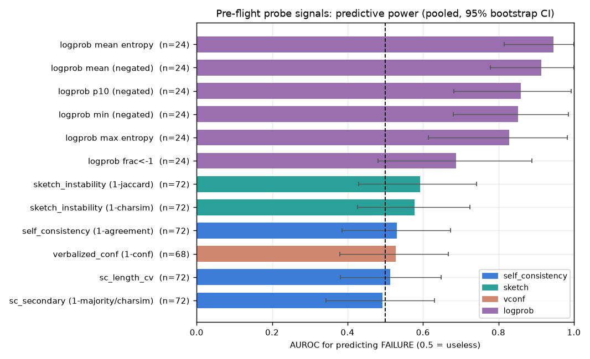
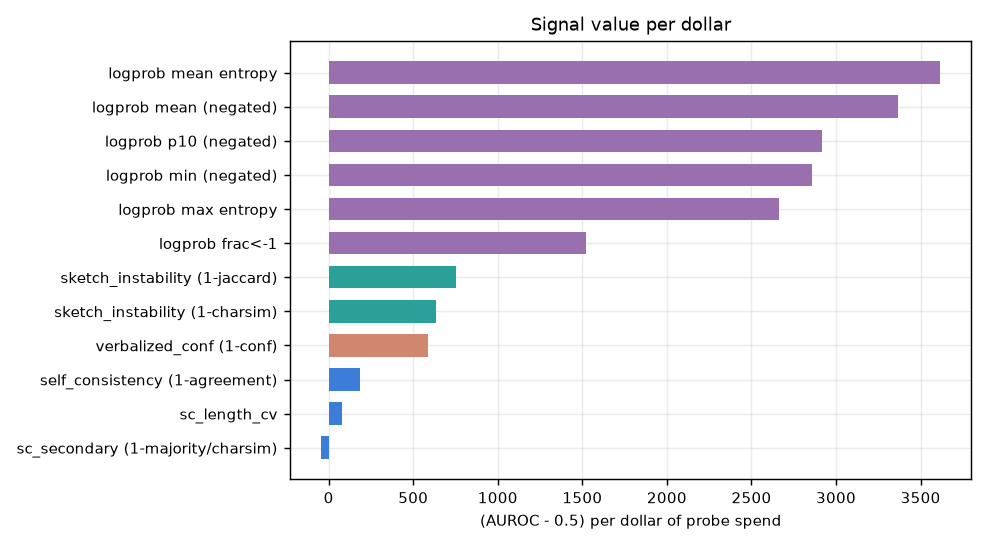
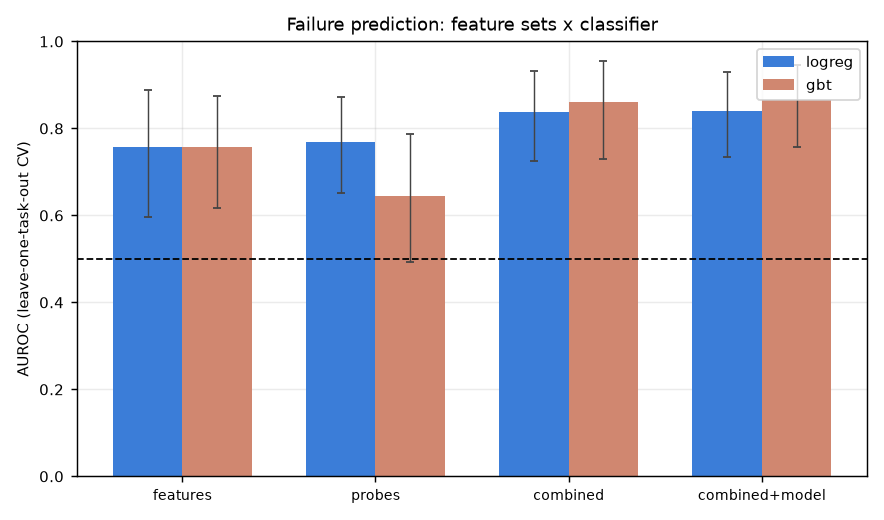
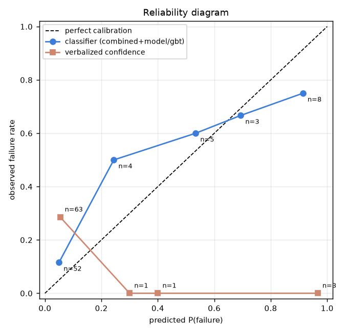
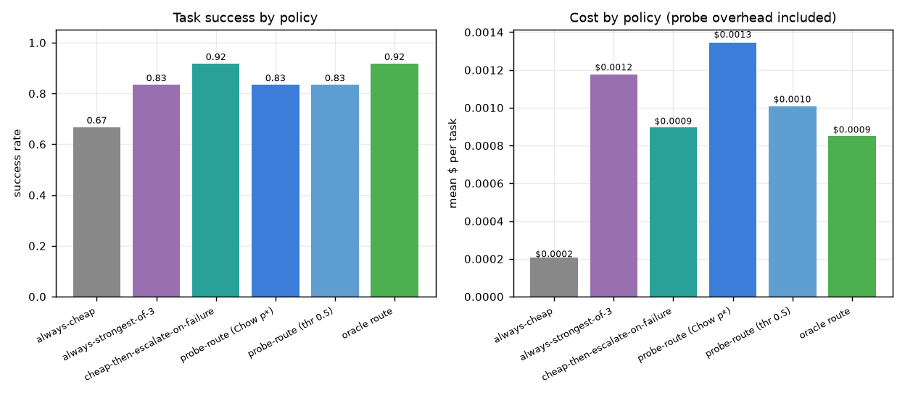
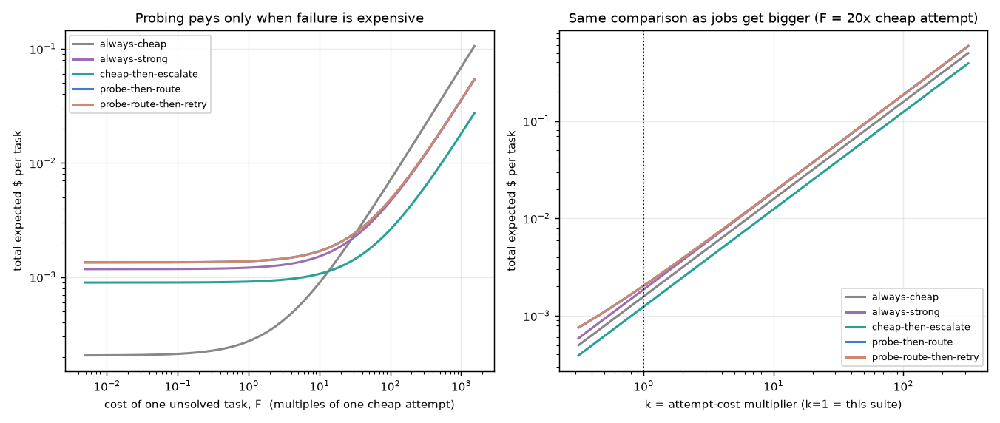

# Probe Lab -- predicting cheap-model failure before committing to the attempt

**Question.** Which cheap pre-flight signals predict whether a given cheap LLM can solve a
given task, *before* paying for the full attempt? And does collecting them pay for itself?

**Headline.** The best probe signal is **token-level entropy on a 128-token draft
(AUROC 0.945)** -- but only **1 of 3 models actually returns logprobs**, so it is not
deployable as the router's primary signal today. The best *deployable* predictor is a small
classifier over **free deterministic task features plus probes (AUROC 0.865)**, of which the
free features alone already deliver **0.758 at zero API cost**. And the economics verdict is
negative: **probing never beat simply trying the cheap model and escalating on a verified
failure**, at any failure cost or task size. Probing is worth paying for only where you
*cannot* cheaply verify the result.

---

## 1. Setup

### Model panel (verified live from `GET /api/v1/models`, not from memory)

| slug | short name | $/M in | $/M out | logprobs advertised | logprobs actually returned |
|---|---|---:|---:|---|---|
| `~deepseek/deepseek-v4-flash-latest` -> serves `deepseek/deepseek-v4-flash-0731` | deepseek-v4-flash | 0.09 | 0.18 | yes | **no** |
| `qwen/qwen3-30b-a3b-instruct-2507` | qwen3-30b-a3b | 0.048 | 0.193 | yes | **yes** |
| `z-ai/glm-4.7` | glm-4.7 | 0.40 | 1.75 | yes | yes (only with reasoning disabled) |

All three are open-weight and <= $2/M output. `~deepseek/deepseek-v4-flash-latest` is aforge's
current default; the `~` alias resolves to the pinned `deepseek-v4-flash-0731`.

> **Deployability finding #1.** All three models list `logprobs` in `supported_parameters`,
> but DeepSeek v4 Flash returns `logprobs: null` on every request. GLM-4.7 returns logprobs
> only when `reasoning.enabled=false`. **The catalog's capability flag is not trustworthy --
> the router must probe for logprob support at onboarding time and cache the answer.**

### Task suite -- 24 tasks, 3 classes, deterministic graders only

8 coding (hidden unit tests in a sandboxed subprocess, no network), 8 structured-JSON
planning (strict schema + semantic checks: acyclicity, resource capacity, exact optima),
8 exact-answer reasoning (normalized exact match). No LLM judging anywhere.

`selfcheck.py` validates the suite before any spend: every ground-truth answer is
brute-forced, every claimed optimum is proved by serial-schedule-generation over all 8!
priority lists, every task has a reference solution that must PASS and a plausible decoy
that must FAIL. **This caught 16 real defects** -- 4 wrong exact answers (I had written 1134
for a committee count whose true value is 945), 2 wrong unit-test expectations, 2 *infeasible*
JSON tasks (the menu task had no solution; the course task demanded 4 semesters for a
5-deep prerequisite chain), and 2 claimed optima that were wrong (2-worker makespan is 16,
not 14; RCPSP optimum is 14, not 11). Shipping any of those would have silently corrupted
the labels.

Hard tiers lean on **spec twists** -- a familiar problem with deliberately non-standard
semantics (half-open intervals that must *not* merge when touching; `^` at *lower*
precedence than `*`; strict-canonical Roman numerals). These separate models that read the
spec from models that pattern-match, and they proved to be the sharpest discriminators.

### Probes collected per (model, task) cell

| probe | calls | settings | signal |
|---|---:|---|---|
| (a) self-consistency | 3 | temp 0.8, 256 tok, answer-only / approach-only | pairwise agreement |
| (b) logprob draft | 1 | temp 0, 128 tok, `logprobs+top_logprobs=5` | mean logprob, entropy, tail stats |
| (c) verbalized confidence | 1 | temp 0, 8 tok, "rate 0-10" | stated confidence / 10 |
| (d) sketch stability | 2 | temp 0.8, 96 tok, one-line approach | token-overlap + char similarity |

All probes run with **reasoning disabled** -- a probe that pays for a reasoning trace is not
a cheap probe. The attempt uses the model's production default.

### Spend and wall time

| run | cells | calls | spend | wall |
|---|---:|---:|---:|---:|
| pilot | 12 | 96 | $0.0379 | 35 s |
| **main run** | **72** | **576** | **$0.4054** | **295 s** |
| replicate (label noise) | 72 | 72 | $0.3169 | 231 s |
| **total** | | **~744** | **~ $0.76** | **~ 9.4 min** |

Upfront estimate was $0.51 for the main run vs $0.4054 actual. **Hard cap $25 -- used 3.0%.**
Zero failed API calls. Concurrency 24, retries with exponential backoff on 429/5xx.

> **Deviation from spec, forced by the pilot.** The spec set the attempt at `max_tokens=4096`.
> The pilot showed **4/12 attempts hitting `finish_reason=length` with the reasoning trace
> alone consuming 2,000-4,200 tokens** (GLM-4.7 truncated 3 of 4). At 4096 the outcome label
> measures the token budget, not the model's ability, so the attempt budget was raised to
> **16,384**. Truncation is still recorded and reported below.

---

## 2. Outcomes -- not degenerate

**53/72 solved (73.6%); failure base rate 26.4% (19 failures).**

| | solved | truncated (`length`) |
|---|---:|---:|
| deepseek-v4-flash | 20/24 | 4/24 |
| glm-4.7 | 17/24 | 7/24 |
| qwen3-30b-a3b | 16/24 | 0/24 |

| tier | solved | | class | solved |
|---|---:|---|---|---:|
| 1 (trivial) | 17/18 | | code | 14/24 |
| 2 | 13/18 | | json | 17/24 |
| 3 | 11/18 | | exact | 22/24 |
| 4 (hardest) | 12/18 | | | |

Spread check: **12/24 tasks solved by all three, 2/24 by none, 10/24 discriminating.**
Not degenerate, so no difficulty recalibration round was triggered. The tier labels were
imperfect -- my "tier 4" exact-reasoning tasks turned out easier than "tier 3" coding, and
`code_roman_strict` (labelled tier 2) defeated all three models -- but the *observed* spread
is what matters and it is healthy.

> **Deployability finding #2 -- the dominant failure mode is runaway reasoning, not wrong
> answers.** 11/72 attempts hit the 16,384-token ceiling and returned **zero content
> characters**; 8 of the 19 failures are `no_code` from pure truncation. DeepSeek burned
> exactly 16,384/16,384 reasoning tokens on four coding tasks without ever emitting an
> answer. For a router this is the *most* important failure class: it is the most expensive
> possible outcome (full token budget spent, nothing returned) and it is exactly what a
> pre-flight signal should catch.

**Label noise: 5/72 outcomes flipped (6.9%)** when every attempt was re-run at identical
settings. This bounds the AUROC any predictor could reach -- roughly 7% of cells are
coin-flips no signal can resolve.

---

## 3. Signal ranking (positive class = FAILURE, i.e. "escalate")



| rank | signal | pooled AUROC [95% CI] | coverage | $/probe | (AUROC-0.5)/$ |
|---:|---|---|---:|---:|---:|
| 1 | **logprob mean entropy** | **0.945** [0.815, 1.000] | 24/72 | $0.000123 | 3617 |
| 2 | logprob mean | 0.914 [0.779, 1.000] | 24/72 | $0.000123 | 3364 |
| 3 | logprob p10 | 0.859 [0.682, 0.992] | 24/72 | $0.000123 | 2919 |
| 4 | logprob min | 0.852 [0.680, 0.986] | 24/72 | $0.000123 | 2856 |
| 5 | logprob max entropy | 0.828 [0.615, 0.983] | 24/72 | $0.000123 | 2665 |
| 6 | logprob frac < -1 | 0.688 [0.480, 0.889] | 24/72 | $0.000123 | 1523 |
| 7 | sketch instability (1-jaccard) | 0.592 [0.430, 0.742] | 72/72 | $0.000122 | 750 |
| 8 | sketch instability (1-charsim) | 0.578 [0.426, 0.725] | 72/72 | $0.000122 | 637 |
| 9 | verbalized confidence | 0.528 [0.380, 0.667] | 68/72 | $0.000047 | 589 |
| 10 | self-consistency (1-agreement) | 0.531 [0.386, 0.673] | 72/72 | $0.000168 | 186 |
| 11 | sc length CV | 0.513 [0.382, 0.647] | 72/72 | $0.000168 | 80 |
| 12 | sc secondary | 0.493 [0.343, 0.631] | 72/72 | $0.000168 | -44 |

**Free deterministic task features beat every probe except logprobs -- at zero API cost:**

| feature | AUROC [95% CI] | cost |
|---|---|---:|
| **n_tests** (hidden-test count / #semantic checks) | **0.823** [0.692, 0.931] | $0 |
| prompt_chars | 0.796 [0.673, 0.904] | $0 |
| n_constraint_words ("must", "exactly", "at least"...) | 0.704 [0.576, 0.818] | $0 |
| n_digits | 0.676 [0.531, 0.805] | $0 |
| schema_depth | 0.534 [0.399, 0.666] | $0 |

By AUROC-per-dollar the free features are infinitely efficient and should be computed first.
Among paid probes, logprobs dominate by ~5x over the next family.



### Two negative results worth stating plainly

- **Self-consistency, as implemented, is worthless here (AUROC 0.531).** k=3 at 256 tokens
  was too coarse: with reasoning disabled the "answer-only" samples on hard tasks agree on
  the *same wrong answer*. Agreement measures determinism, not correctness, and cheap models
  are confidently deterministic when they are wrong. A larger k on the *full* answer might
  do better, but that is no longer a cheap probe.
- **Verbalized confidence is useless and badly calibrated (AUROC 0.528).** Mean stated
  confidence **0.897** vs actual success rate **0.735** -- an overconfidence gap of **+0.162**,
  ECE **0.268**. Models said 9/10 or 10/10 on 63 of 68 cells including ones they failed
  outright. This confirms the expected result: *never let the model self-assess.*

Per-model AUROCs vary widely (self-consistency ranges 0.400 -> 0.633 across models;
verbalized confidence 0.294 -> 0.723), which is why model identity earns its place as a
feature and why a per-model bias term is recommended below.

---

## 4. Classifiers -- leave-one-task-out CV

All three rows of a task are held out together, so the model is never tested on a task it
trained on. Logprob columns are median-imputed **from the training fold only**, with an
explicit `lp_available` indicator.



| feature set | logistic regression | gradient-boosted trees |
|---|---|---|
| task features only (free) | 0.758 [0.597, 0.889] | 0.758 [0.618, 0.876] |
| probes only | 0.768 [0.651, 0.872] | 0.643 [0.492, 0.787] |
| combined | 0.838 [0.725, 0.932] | 0.860 [0.731, 0.956] |
| **combined + model identity** | 0.841 [0.735, 0.929] | **0.865** [0.756, 0.947] |

Brier for the best model (combined+model / GBT) is **0.142**, accuracy@0.5 **0.792**.

The story is consistent: **probes and task features are complementary** (0.758 and 0.768
alone, 0.865 together), and **model identity adds almost nothing (+0.005)** once probes are
present -- the probes already carry the model-specific information. With only 72 rows and 19
positives the confidence intervals are wide and the logreg/GBT gap is not significant; treat
the ranking as directional.

---

## 5. Asymmetric operating point (the routing-relevant metric)

Positive detection = "model cannot do it -> escalate".

**At the threshold where >=95% of truly-solvable tasks are NOT escalated** (thr = 0.742):

| metric | value |
|---|---|
| **escalation precision** | **0.778** (7/9) |
| **truly-solvable wrongly escalated** | **3.8%** (2/53) |
| failure recall (caught) | 0.368 (7/19) |
| overall escalation rate | 12.5% |

So a conservative router that almost never steals work from the cheap model still catches
**37% of failures at 78% precision** -- real value, but it leaves most failures on the table.

**Chow rule.** With escalation = 5x a cheap attempt and failure = 20x, the indifference
threshold is p* = (5-1)/(20-1) = **0.2105**:

| metric | value |
|---|---|
| escalation precision | 0.650 (13/20) |
| failure recall | 0.684 |
| truly-solvable wrongly escalated | 13.2% |
| escalation rate | 27.8% |

Expected cost per task, in units of one cheap attempt:

| policy | cost |
|---|---:|
| always-attempt | 6.014 |
| always-escalate | 5.000 |
| **Chow-threshold routing** | **3.694** |
| oracle-tuned threshold (0.075) | 3.042 |

Under the *assumed* 5x/20x cost model, routing cuts expected cost **39% vs always-attempt**
and **26% vs always-escalate**. Note this is the assumed cost model doing the work -- the
measured-dollar simulation in section 7 tells a different story.

---

## 6. Calibration



| | ECE | Brier |
|---|---:|---:|
| best classifier (combined+model / GBT) | **0.086** | **0.142** |
| verbalized confidence | 0.268 | 0.278 |

The classifier is usefully calibrated in the low-risk band (predicts 0.050, observes 0.115
over n=52) and slightly *over*-predicts risk at the top (predicts 0.914, observes 0.750,
n=8) -- a safe direction for an escalation trigger. Verbalized confidence is not calibrated
in any useful sense: the model's implied P(fail) of 0.054 corresponds to an observed failure
rate of 0.286, off by 5x.

---

## 7. Economics -- does the probe pay for itself?



Cheap = `qwen3-30b-a3b` ($0.00021/attempt, 66.7% solve). Strong = `deepseek-v4-flash`
($0.00117/attempt, 83.3% solve). The cheap-model-only router reaches **AUROC 0.930**
(n=24, 8 failures).

| policy | success | mean $/task |
|---|---:|---:|
| always-cheap | 0.667 | $0.00021 |
| always-strongest-of-3 | 0.833 | $0.00117 |
| **cheap-then-escalate-on-verified-failure** | **0.917** | **$0.00090** |
| probe-then-route (Chow p*) | 0.833 | $0.00134 |
| probe-then-route (thr 0.5) | 0.833 | $0.00101 |
| oracle route (upper bound) | 0.917 | $0.00085 |

### Probe overhead as % of attempt cost

| model | probe | attempt | **overhead** |
|---|---:|---:|---:|
| qwen3-30b-a3b | $0.00017 | $0.00021 | **82.1%** |
| deepseek-v4-flash | $0.00020 | $0.00117 | **17.0%** |
| glm-4.7 | $0.00101 | $0.01413 | **7.2%** |

Overhead is driven almost entirely by **re-sending the prompt 7 times**; probe *outputs* are
capped at 96-256 tokens. On the cheapest model the probe battery costs nearly as much as the
answer it is trying to predict.

### Verdict: probing does **not** pay for itself here



Because `$ per success` never charges for a failure, I swept an explicit downstream cost `F`
per unsolved task and a task-size multiplier `k`:

| F (x cheap attempt) | always-cheap | always-strong | cheap-then-escalate | probe-then-route | winner |
|---:|---:|---:|---:|---:|---|
| 0 | $0.00021 | $0.00117 | $0.00090 | $0.00134 | always-cheap |
| 10 | $0.00089 | $0.00152 | $0.00107 | $0.00169 | always-cheap |
| **20** (Chow) | $0.00158 | $0.00186 | **$0.00124** | $0.00203 | cheap-then-escalate |
| 100 | $0.00706 | $0.00460 | **$0.00261** | $0.00477 | cheap-then-escalate |
| 500 | $0.03446 | $0.01830 | **$0.00946** | $0.01847 | cheap-then-escalate |

**probe-then-route is never the outright best policy -- at any failure cost F, and at any
task-size multiplier k from 0.3x to 300x.** `cheap-then-escalate` wins everywhere once
failures cost anything at all.

**Why, and this is the real lesson:** these tasks have a **free, perfect verifier** (the
graders). When you can verify an outcome cheaply, you never need to *predict* it -- you
observe it and react. Prediction only buys something when verification is expensive,
impossible, or too late. Concretely, probing is worth its cost when:

1. **You cannot verify the output** (prose, design docs, architectural decisions, anything
   without a test suite) -- the dominant case in an agent harness.
2. **A failed attempt has side effects you cannot undo** (a bad commit, a sent message, a
   migration) -- retry is not free because the failure already happened.
3. **Latency matters.** The probe battery runs 7 calls in parallel in **1.7 s**, versus 9.8 s
   for a cheap attempt and 45.6 s for a strong one. Measured mean wall-clock per task:
   always-cheap 9.8 s, **cheap-then-escalate 35.7 s**, **probe-then-route 32.4 s**. Routing
   is ~9% faster than retrying and avoids the tail where a cheap model burns 16k reasoning
   tokens before returning nothing.
4. **The escalation target is much stronger.** Here "strong" was only +17 points (0.667 ->
   0.833) and cost 5.6x. Against a genuine frontier model the routing gain grows.

One nuance: at the Chow threshold the cheap-model router has **recall 1.000** -- it catches
*every* cheap-model failure -- but precision only 0.571, escalating 14/24 tasks. It is
over-eager, which is the right direction for safety but expensive.

---

## 8. Recommendation for the aforge router

### What to compute before each call

**Tier 0 -- always, costs nothing (AUROC ~ 0.76 on its own):**
Prompt length, task class, count of hidden tests / schema checks, count of constraint words
(`must`, `exactly`, `at least`, `never`), digit density, schema depth. These are free, need
no API call, and already beat every paid probe except logprobs. **Ship this first.**

**Tier 1 -- one 128-token draft with `logprobs=true, top_logprobs=5`, if the model supports
it (AUROC 0.945, ~$0.00012):**
Take mean token entropy and mean logprob. This is the single best signal in the experiment
and costs one short call. **Detect support at onboarding, do not trust the catalog flag** --
DeepSeek v4 Flash advertises logprobs and returns none.

**Tier 2 -- two one-line sketch probes (AUROC 0.59, ~$0.00012):** only worth it for models
with no logprobs, and only when the attempt is expensive enough that 7-17% overhead is
tolerable. **Skip self-consistency and verbalized confidence entirely** -- 0.531 and 0.528,
i.e. noise, and self-consistency is the most expensive probe of the four.

**Policy:** default to **try-cheap-then-escalate-on-verified-failure** wherever a
deterministic verifier exists (tests, compiler, schema check) -- it beat probing at every
cost assumption. Reserve **probe-then-route** for unverifiable outputs, irreversible
side effects, and latency-critical paths. And add a hard **reasoning-token circuit-breaker**:
15% of attempts burned the entire budget and returned nothing, which no signal is needed to
catch -- just a cap and an immediate escalate.

### Online update rule for continual learning

Use **SGD logistic regression with a per-model bias term**, updated as graded outcomes stream in:

```
p     = sigmoid(w . x + b_model)
w    <-  w    - lr   * (p - y) * x     (lr ~ 0.05, L2 ~ 1e-4)
b_m  <-  b_m  - lr_b * (p - y)         (lr_b ~ 0.02, larger so ability adapts fastest)
```

with features standardized by a running mean/variance and a class-weight of
`1/base_rate` on failures. The per-model intercept `b_model` **is an ability ledger**: it is
the log-odds that model *m* fails a task of average difficulty, so it maps directly onto an
Elo/IRT-style rating (`ability_m = -b_m`). That makes this compatible with the sibling
router-lab IRT work -- the shared feature weights `w` play the role of IRT discrimination on
task features, `b_model` is ability, and a per-task random effect would be difficulty. Two
practical guards: freeze `w` and let only `b_model` move for the first ~50 observations of a
new model (avoids a new model perturbing the shared weights), and keep a replay buffer of the
last ~2,000 outcomes to re-fit `w` nightly so drift in the shared weights stays bounded.

### Cold-start "anchor battery" for a brand-new model

Ten tasks, run **sequentially with early exit**, chosen to bisect difficulty rather than
sample it uniformly -- the discriminating tasks in this run were the spec-twist ones, not the
tier-1 or tier-4 extremes:

1. **Capability handshake first (2 calls, not tasks):** does it return logprobs? does
   `reasoning.enabled=false` work? Record both; they decide which probe tier is even available.
2. **Anchors 1-2 -- floor** (trivial coding + trivial exact). If either fails, stop: the model
   is unusable, `b_model` gets a large positive prior.
3. **Anchors 3-6 -- the discriminating band.** Pick tasks whose historical pass rate across
   known models is closest to 0.5 (here: `code_expr_twist`, `code_roman_strict`,
   `json_2workers`, `code_repeating_decimal`). These carry the most bits per call.
   Early-exit as soon as the posterior on `b_model` has a standard error below ~0.3.
4. **Anchors 7-8 -- ceiling** (RCPSP scheduling, cryptarithm) only if it passed >=3 of the
   discriminating band.
5. **Anchors 9-10 -- runaway check:** two tasks known to trigger long reasoning, purely to
   measure the truncation rate and p95 reasoning-token count. Given that runaway reasoning
   caused 42% of all failures here, this is not optional.

Initialize `b_model` from the band-3-6 pass rate, then let SGD take over. Expected cost per
new model at this suite's prices: **well under $0.01**.

---

## 9. Limitations

- **n = 72 (24 tasks x 3 models), 19 failures.** Confidence intervals are wide; the
  logprob results rest on a **single model** (24 rows, 8 failures) and its 0.945 AUROC
  should be read as "promising on one model", not established.
- **6.9% label noise** caps achievable AUROC; the 0.865 best classifier is closer to the
  ceiling than it looks.
- **One task suite**, skewed toward short, self-contained, deterministically-gradeable
  problems. Real aforge tasks are long, multi-turn, and tool-using, where probe overhead as a
  fraction of attempt cost would be far lower (GLM's 7.2% is the closest analogue) and the
  economics could plausibly flip.
- The **escalation target was weak** (deepseek-v4-flash, 83.3%). A frontier escalation target
  would raise every routing policy's ceiling and could change the section 7 verdict.
- The `probe-then-route` policy is evaluated with a router trained by leave-one-task-out CV
  on 24 points -- honest, but small.

## 10. Files

| file | contents |
|---|---|
| `tasks.py` | 24 tasks + graders + deterministic feature extraction |
| `graders.py` | sandboxed code runner, JSON extraction, exact-match normalization |
| `selfcheck.py` | brute-force ground-truth validation (run before spending) |
| `runner.py` | async probe + attempt runner, spend cap, retries |
| `replicate.py` | attempt re-run for label-noise measurement |
| `analyze.py` | AUROC, LOTO-CV classifiers, operating points, calibration, economics |
| `results.jsonl` | 72 cells: signals, features, outcome, tokens, latency, per-call cost |
| `replicate.jsonl` | 72 replicate outcomes |
| `analysis.json`, `analysis.txt` | machine- and human-readable analysis output |
| `plots/*.png` | signal AUROC, AUROC-per-dollar, classifiers, reliability, policy, break-even |

Reproduce: `python selfcheck.py && python runner.py --full && python replicate.py && python analyze.py`
