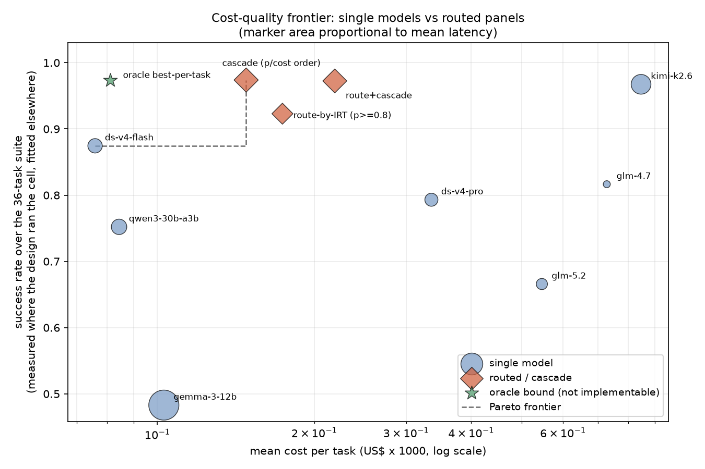

# Router lab — Phase A

**Question.** aforge currently sends every call to one model
(`~deepseek/deepseek-v4-flash-latest`, see `internal/config/config.go`). Does an
Item-Response-Theory ability–difficulty model separate cheap open-weight models
on real work, well enough that an offline-simulated routing or cascade policy
beats any single model on the cost–quality frontier?

**Answer.** Yes on both counts, with one important qualification about *why* the
cascade wins.

| | |
|---|---|
| Separation verdict | **Yes** — Rasch separation reliability 0.698, separation index G = 1.52, 12 of 21 pairwise ability orderings significant at p < 0.05. The panel occupies about 2.5 distinguishable ability strata, not one. |
| Model comparison | **1PL (Rasch) wins.** LR = 11.63 on 15 df, p = 0.71; AIC 137.4 (1PL) vs 155.8 (2PL). The discrimination parameters do not pay for themselves. |
| Price as a cold-start prior | **No.** theta vs log(output price) r = +0.46 (n = 7, p ~ 0.24); the panel's second-most-expensive model is sixth of seven on ability. Price is not usable as a prior for an unseen model. |
| Winning policy | **Cascade ordered by p-hat/cost with the deterministic grader as verifier**: 0.974 success at $0.000148/task, vs the incumbent's 0.875 at $0.000076/task. |
| Headline delta vs incumbent | **+9.9 points of success for +95% cost** — and it beats the best single model (kimi-k2.6, 0.967) at **1/5.7 the cost**. |
| Actual spend | **$0.188** against a $10 cap (1.9%). |
| Wall clock | **4.3 minutes** of API time across all runs, against a 30-minute target. |



---

## 1. Panel

Selected from the live OpenRouter catalog by `build_panel.py` (never from
memory — slugs and prices drift). Hard cap $4.00/M output tokens, open-weight
families only, no closed frontier models. All seven advertise
`structured_outputs`, which the plan tasks rely on.

| slug | label | $/M in | $/M out | context | role in the design |
|---|---|---|---|---|---|
| `google/gemma-3-12b-it` | gemma-3-12b | 0.050 | 0.150 | 131 072 | floor — very cheap small dense model |
| `qwen/qwen3-30b-a3b-instruct-2507` | qwen3-30b-a3b | 0.048 | 0.193 | 262 144 | cheap MoE, Qwen 30B-class |
| `~deepseek/deepseek-v4-flash-latest` | ds-v4-flash | 0.090 | 0.180 | 1 048 576 | **incumbent** — aforge's current default |
| `deepseek/deepseek-v4-pro` | ds-v4-pro | 0.435 | 0.870 | 1 048 576 | mid — the natural in-family upgrade |
| `z-ai/glm-4.7` | glm-4.7 | 0.400 | 1.750 | 204 800 | mid — strong open generalist under $2 |
| `moonshotai/kimi-k2.6` | kimi-k2.6 | 0.589 | 2.480 | 262 144 | upper-mid Moonshot flagship under the cap |
| `z-ai/glm-5.2` | glm-5.2 | 0.760 | 2.420 | 1 048 576 | intended top cascade rung |

**Excluded, and why.** The user suggested Kimi K3 and Kimi 2.7; the live catalog
prices `moonshotai/kimi-k3` at **$15.00/M out**, 3.75x over the hard cap, and
`~moonshotai/kimi-latest` at $14.00. `moonshotai/kimi-k2.7-code` is inside the
cap at $3.50 but is code-specialised and would confound the three work-classes.
`z-ai/glm-5-turbo` sits exactly at $4.00 while glm-5.2 is stronger for less.
No model 404'd or errored; **zero API errors across all 298 recorded calls**, so
no substitutions were needed.

**One configuration choice worth flagging.** Every call ran with reasoning
explicitly disabled (`reasoning: {enabled: false}`), because that is how aforge
actually calls models in production — `DefaultReasoning` and
`DefaultExecReasoning` are both `EffortOff` in `config.go`, settled by an
earlier controlled experiment. Measured reasoning tokens across the whole run:
**3**. This is the right comparison for aforge, but it is not a neutral one: it
penalises reasoning-first models most, and glm-5.2's poor showing below should
be read in that light.

## 2. Task suite

36 tasks, 12 per work-class, every one graded by code with **no LLM judge
anywhere** (`tasks.py`, graders included).

- **plan-structure** — strict JSON against a schema plus semantic checks:
  acyclicity, valid topological orders, budget sums, exclusion constraints,
  and full critical-path-method arithmetic (forward pass for earliest start,
  backward pass for slack).
- **coding** — self-contained Python functions run against hidden unit tests in
  a subprocess (`python -I`, 15 s timeout, no network, empty stdin). The harness
  prints only PASS/FAIL, so a solution decorated with prints cannot be mistaken
  for a passing one.
- **reasoning/extraction** — exact or normalised match against a single answer,
  extracted from a required trailing `ANSWER: <value>` line.

### The suite was validated before any money was spent

`validate_suite.py` writes a reference solution for every coding task and
requires the hidden tests to pass against it; recomputes every reasoning answer
from first principles (brute force where possible); and shows each plan grader
one correct answer it must accept plus several near-misses it must reject.

This caught **six** ground-truth errors that would otherwise have been invisible
— they would all have looked like "the models are weak":

| task | error caught |
|---|---|
| C08 | `min_coins([1,5,10,25], 9999)` expected 402, true answer 405 |
| C12 | `max_sum_k_no_adjacent([1,2,3,4,5], 2)` expected 9, true answer 8 |
| R07 | expected profit 5863.00, true answer 5924.50 |
| R09 | expected `PROJECT-MAPPING`, true answer `PROJECT-MAPPING-SOLAR` |
| R12 | the constraint set had **two** solutions, not one — a sixth constraint was added |
| P11 | the stated budget of 200 admitted exactly **one** feasible selection out of 126; raised to 210 (8 feasible) so the item could carry information rather than being uniformly failed |

A further four errors were caught in the round-2 hardened tasks the same way
(C09 star-count assertions inverted, C10 k-th-sum expectations, C11 and C12
expected values). None of these reached an API call.

## 3. Design of experiments

`design.py`. The naive experiment is 7 x 36 = 252 cells plus 70 for a replicate
= **322**. Most of those cells buy very little: once four models have failed a
task, the fifth failure barely moves the estimate of how hard it is.

IRT does not need a rectangular matrix — it needs the model-task bipartite graph
to be **connected**, otherwise ability in one component is unidentifiable
relative to the other and the two halves of the scale slide freely past each
other. So:

- **Anchor block** — 10 tasks (`P02 P07 P09 C02 C05 C08 C12 R01 R08 R10`),
  spanning the whole intended difficulty range and all three classes, answered
  by **all 7 models** with **2 replicates** at temperature 0.2 -> 140 cells.
  This block alone makes the graph connected and pins the scale; the replicates
  are what let residual stochasticity be quantified, for 70 extra cells.
- **Spoke block** — each of the remaining 26 tasks seen by exactly **3 models**,
  chosen by a cyclic allocation with offsets **{0, 1, 3}**. Those offsets are a
  perfect difference set mod 7, so as the cycle turns every *pair* of models
  co-occurs on roughly the same number of tasks. The design is therefore
  pairwise balanced, not merely connected -> 78 cells.

**218 cells vs 322 naive — a 32.3% cut**, with the cut falling entirely on the
cells carrying the least information.

Verified properties: graph connected; every task seen by >= 3 models; all 21
model pairs co-occur, minimum co-occurrence 13; per-model workload 30-32 cells.

One design detail worth recording: the spoke allocation is keyed on the
**round-1** intended difficulty level, deliberately. When the hardening in
section 4 re-levelled twelve tasks, an allocation keyed on the live level would
have handed every downstream spoke to a different model, and the round-1 results
for untouched tasks would no longer have belonged to the same design. Pinning
the key keeps the two rounds mergeable.

### Execution

`run.py` — all cells in flight at once behind a 24-permit semaphore, retry with
exponential backoff on 429/5xx only (a 400/404 is a fact, not a hiccup), 120 s
per-call timeout, `max_tokens` 4096, temperature 0.2. Grading runs in a worker
thread so a 15-second sandbox subprocess never stalls the event loop. Two spend
guards: an upfront projection from panel prices x expected tokens that refuses
to start, and a live running total that stops issuing new calls at the cap.

## 4. Two rounds — the difficulty calibration failed first

### Round 1 (`results_round1.jsonl`) — near-degenerate, as the brief anticipated

218 cells, $0.0509, 127.5 s wall, 0 errors. **Overall pass rate 93.6%. 28 of 36
tasks were passed by every model that saw them.** Only gemma-3-12b separated
from the pack at all.

An item everybody passes has zero Fisher information about ability: its ML
difficulty runs to minus infinity and it tells the scale nothing. Most of the
matrix was paying for nothing.

**Diagnosis:** the difficulty scale was calibrated against an older generation of
open models. Coin-change DP, rotated binary search, minimum-window substring —
what used to be a hard interview question is now inside the training
distribution of a $0.15/M model. The `level` field was an *intent* that the 2026
panel simply outgrew.

### Round 2 — twelve tasks hardened once, 80 cells re-run

Per the brief, the intended-hardest third was replaced once
(`HARDENED_IDS = P07 P10 C07 C08 C09 C10 C11 C12 R07 R10 R11 R12`), chosen to be
hard for reasons that do not decay:

- **plan** -> real critical-path-method arithmetic (forward *and* backward pass,
  per-node slack, zero-slack set) instead of transcribing a dependency list;
- **code** -> problems whose naive solution is *correct but too slow*
  (k-th smallest pair sum over 4M pairs, max-min <= limit over 20 000 elements),
  plus tie-breaking and impossibility rules that memorised solutions get wrong
  (bounded coin change with a lexicographic tie-break; merge-k-stones);
- **reason** -> longer arithmetic chains, harder combinatorics and modular
  arithmetic, a six-item constraint puzzle.

Only the 80 cells belonging to those twelve tasks were re-run. The other 24
tasks keep their round-1 definitions *and* their round-1 results.
`results.jsonl` holds **all 298 calls** from both rounds, each tagged `round`
and `final`; nothing was deleted.

### Both rounds, compared

| | round 1 | round 2 (hardened cells) | final matrix |
|---|---|---|---|
| calls | 218 | 80 | 218 |
| pass rate | 0.936 | 0.613 | **0.794** |
| all-pass tasks | 28 / 36 | — | **19 / 36** |
| all-fail tasks | 0 | — | **1 / 36** (P10) |
| informative tasks | 8 | — | **16** |
| spend | $0.0509 | $0.0603 | $0.1112 |
| wall clock | 127.5 s | 59.1 s | — |

The final matrix spans task pass rates from 0.00 to 1.00 with a real gradient in
between (0.29, 0.33, 0.64, 0.67, 0.79, 0.86), and model pass rates from 0.548 to
0.968. That is the spread the fit needed.

### Outcome matrix summary

Pass counts by model and work-class (final matrix, 218 cells):

| model | plan | code | reason | overall |
|---|---|---|---|---|
| kimi-k2.6 | 10/11 | 9/9 | 11/11 | **30/31 = 0.968** |
| ds-v4-flash | 6/9 | 12/13 | 9/9 | 27/31 = 0.871 |
| glm-4.7 | 8/12 | 10/11 | 9/9 | 27/32 = 0.844 |
| ds-v4-pro | 9/13 | 10/12 | 7/7 | 26/32 = 0.812 |
| qwen3-30b-a3b | 4/6 | 12/14 | 9/11 | 25/31 = 0.806 |
| glm-5.2 | 9/10 | 5/9 | 7/11 | 21/30 = 0.700 |
| gemma-3-12b | 2/8 | 9/12 | 6/11 | 17/31 = 0.548 |

Failures were inspected individually and are genuine capability failures, not
harness artifacts — wrong slack values, wrong logic-puzzle answers, `IndexError`
in generated code, a `[475, 350, 75, 100]` allocation that is not strictly
decreasing. Two gemma cells hit the 4096-token ceiling and were truncated; that
is a real failure mode for a weak model but is partly a budget artifact and is
noted rather than excused.

## 5. IRT fit

### Estimator note — why the fits are penalized

Plain joint ML **breaks on this data**, and the break is informative rather than
a bug: kimi-k2.6 passes every informative item it was shown, so its likelihood
rises without bound. Unpenalized, its theta ran to **+42 logits**, the observed
information became singular, every standard error inflated to ~470, and
separation reliability collapsed to 0.

The standard remedy for extreme scores is a penalized (weakly Bayesian)
estimator. A **N(0, 3^2)** prior on abilities and difficulties is very diffuse —
two prior SDs span +/-6 logits, i.e. success probabilities from 0.0025 to 0.9975
— so it barely touches any parameter the data identifies while keeping extreme
ones finite and the information matrix invertible. The same penalty is applied
to both models so the comparison is like for like. Reported standard errors are
posterior SDs.

The 2PL optimizer also had to be initialized *from* the 1PL solution. Started at
zero it sat on a plateau where every Newton step was rejected, and silently
reported the null model as the "2PL" fit — with a log-likelihood *worse* than the
1PL, which is impossible for a nested family. `irt.fit` now falls back to the
nested solution rather than report an impossible likelihood.

### Ability (Rasch, mean item difficulty = 0)

| model | theta | SE | raw pass | $/M out |
|---|---|---|---|---|
| kimi-k2.6 | **+4.092** | 1.527 | 0.968 | 2.480 |
| ds-v4-flash | +1.387 | 0.965 | 0.871 | 0.180 |
| glm-4.7 | +1.115 | 0.863 | 0.844 | 1.750 |
| ds-v4-pro | +0.534 | 0.875 | 0.812 | 0.870 |
| qwen3-30b-a3b | +0.238 | 0.863 | 0.806 | 0.193 |
| glm-5.2 | -0.557 | 0.847 | 0.700 | 2.420 |
| gemma-3-12b | **-1.724** | 0.865 | 0.548 | 0.150 |

19 all-pass items and 1 all-fail item (P10 — the eight-node CPM plan with two
added nodes; nobody produced the correct zero-slack set) carry no information and
are **excluded from the fit**, as reported. 114 of the 218 cells enter the
likelihood.

### Separation checks

**(a) Do the theta values order sensibly and differ beyond their standard
errors?** Yes. The ordering is sensible (the two models everyone would expect at
the ends — kimi-k2.6 and gemma-3-12b — are at the ends), and it is not noise:

- separation reliability **0.698**, separation index **G = 1.52** (true SD 1.520
  against RMSE 0.999) — the panel occupies roughly 2.5 statistically
  distinguishable strata;
- **12 of 21** pairwise orderings are significant at p < 0.05, tested on
  theta_i - theta_j with SE from the full covariance, which is invariant to the
  identification choice;
- every comparison against gemma-3-12b is significant, as is every comparison
  against kimi-k2.6, and glm-5.2 is significantly below both ds-v4-flash
  (delta 1.94, z = 2.07) and glm-4.7 (delta 1.67, z = 1.96).

The nine non-significant pairs are the middle of the pack — ds-v4-flash,
glm-4.7, ds-v4-pro, qwen3-30b-a3b are **not** separable from one another at
n = 31 cells each. That is an honest limit of this design, not a failure of the
method: separating four models clustered within one logit needs more items, not
a different estimator.

**(b) Do fitted difficulties predict which tasks flip fail -> pass as theta
rises?** Yes, and the calibration is good (`icc.png`, left panel). Empirical
pass rates in equal-count bins of (theta - b) track the Rasch ICC closely:

| bin mean (theta - b) | empirical | model |
|---|---|---|
| -1.450 | 0.194 | 0.190 |
| +0.626 | 0.649 | 0.652 |
| +1.710 | 0.912 | 0.847 |
| +2.550 | 1.000 | 0.928 |
| +3.797 | 1.000 | 0.978 |
| +5.772 | 1.000 | 0.997 |

Brier score **0.0727** against **0.1638** for a constant base rate — a skill
score of **+0.556**. The fitted scale genuinely predicts the flip.

**(c) Misfit.** Infit/outfit mean-squares are reported per item in
`analysis.json`. Four items are noisy (outfit > 1.5): **P11** (2.17), **P08**
(1.95), **R06** (1.88), **C08** (1.55) — all constraint-satisfaction or
arithmetic-constraint items where a model can stumble into a valid answer, or
slip on one clause, independently of overall ability. Several items are
*under*-dispersed (outfit < 0.5) — P06, R09, R07, C12, P12, R12, C11, R08, P09 —
which is the expected signature of a small panel: with only 3 models on a spoke
item, a clean high/low split produces residuals smaller than the binomial model
expects. The 20 zero-information items (19 all-pass, 1 all-fail) are reported
and excluded.

### 1PL vs 2PL

| model | logLik | k | AIC | BIC |
|---|---|---|---|---|
| 1PL | -46.709 | 22 | **137.42** | **197.61** |
| 2PL | -40.893 | 37 | 155.79 | 257.03 |

Likelihood ratio **11.63 on 15 df, p = 0.71**. **Keep the 1PL.** Fifteen extra
discrimination parameters buy 5.8 log-likelihood points, which is less than
chance would give. The fitted discriminations do vary sensibly (C12 1.57, P09
1.48, R08 1.44 at the top; C08 0.58, P11 0.72, R06 0.73 at the bottom — exactly
the items flagged as noisy) but the variation is not statistically supported at
this sample size. A one-parameter ability scale is the right model for this
panel, which is convenient: routing only needs theta and b.

## 6. Price as a cold-start prior — the answer is no

| relationship | Pearson r | Spearman rho |
|---|---|---|
| theta vs log(output price) | **+0.464** (p ~ 0.24) | +0.429 |
| theta vs log(context length) | +0.048 (p ~ 0.91) | +0.143 |

| model | $/M out | theta |
|---|---|---|
| gemma-3-12b | 0.150 | -1.724 |
| **ds-v4-flash** | **0.180** | **+1.387** |
| qwen3-30b-a3b | 0.193 | +0.238 |
| ds-v4-pro | 0.870 | +0.534 |
| glm-4.7 | 1.750 | +1.115 |
| glm-5.2 | 2.420 | **-0.557** |
| kimi-k2.6 | 2.480 | +4.092 |

The correlation is positive but weak and nowhere near significant at n = 7, and
the *shape* of the failure is what matters: the second-cheapest model in the
panel has the second-highest ability, and the second-most-expensive model
(glm-5.2) sits **sixth of seven** — below a model costing 13x less. Context
length carries essentially no signal at all.

**Recommendation: do not use price as a theta prior for an unseen model.** For
cold-start, use an uninformative N(0, 3^2) prior and buy information instead —
the anchor block in this design costs about **$0.02 per new model** (10 tasks x
2 replicates) and pins that model onto the existing scale directly. Measuring is
two orders of magnitude cheaper than the risk of trusting the price tag.

Caveat stated once more: reasoning was off for every call, matching aforge
production. glm-5.2 is a reasoning-first model and is the one most likely to be
understated by that choice. Its R07 answer arrived in **9 completion tokens** —
it guessed rather than computed. If Phase B ever turns reasoning on, glm-5.2's
position should be re-measured before it is written off.

## 7. Policy simulation

All offline, zero extra API cost. Every routing decision is made from the
**fitted probabilities only** — a router that peeked at measured outcomes would
be an oracle, not a policy. Measured outcomes are used to *score* decisions,
never to make them.

Each policy is scored two ways. **Hybrid** (headline) uses the measured outcome
wherever the design actually ran that cell — 148 of 252 cells, 59% — and the
fitted probability only for cells the incomplete design skipped. **Predicted**
uses the fitted probability everywhere, as a cross-check. The two agree closely
throughout, which is the sanity check passing.

| policy | success | $/task | latency s | pred. success | pred. $/task |
|---|---|---|---|---|---|
| single: gemma-3-12b | 0.483 | 0.000103 | 17.04 | 0.442 | 0.000103 |
| single: qwen3-30b-a3b | 0.752 | 0.000084 | 4.48 | 0.740 | 0.000084 |
| **single: ds-v4-flash** (incumbent) | **0.875** | **0.000076** | 3.90 | 0.854 | 0.000076 |
| single: ds-v4-pro | 0.793 | 0.000336 | 3.21 | 0.774 | 0.000336 |
| single: glm-5.2 | 0.666 | 0.000547 | 2.36 | 0.631 | 0.000547 |
| single: glm-4.7 | 0.817 | 0.000728 | 0.93 | 0.832 | 0.000728 |
| single: kimi-k2.6 | 0.967 | 0.000847 | 7.33 | 0.971 | 0.000847 |
| route-by-IRT (cheapest with p-hat >= 0.8) | 0.923 | 0.000174 | 4.17 | 0.908 | 0.000174 |
| **cascade (p-hat/cost order, grader verifies)** | **0.974** | **0.000148** | 5.51 | 0.984 | 0.000148 |
| route + cascade | 0.972 | 0.000219 | 5.41 | 0.982 | 0.000219 |
| *oracle best-per-task (bound, not implementable)* | *0.974* | *0.000081* | *3.86* | *0.984* | *0.000081* |

**Pareto frontier over implementable policies:**
`single: ds-v4-flash` (0.875 @ $0.000076) -> `cascade` (0.974 @ $0.000148).

Everything else is dominated. In particular **every single model other than the
incumbent is off the frontier**, including kimi-k2.6: the cascade matches and
slightly beats kimi's success rate at **1/5.7 of kimi's cost**.

### Why the cascade wins, and what that depends on

The cascade's advantage is not clever model selection — `route-by-IRT`, which
selects a single model from the same fitted probabilities, reaches only 0.923 at
*higher* cost. The advantage is that **failure is detectable for free**. The
deterministic grader tells the policy when to escalate, so a cheap first attempt
costs almost nothing when it works and is corrected when it does not. The
cascade sits within $0.000067/task of the omniscient oracle bound on cost, and
matches it exactly on success.

Composition of the winning cascade:

- **expected calls per task: 1.35** — the second rung fires about a third of the
  time;
- first rung is **ds-v4-flash on 25 of 36 tasks**, gemma-3-12b on 7,
  qwen3-30b-a3b on 4. The incumbent remains the workhorse; what changes is that
  it is no longer the only thing that can happen.

This is the load-bearing caveat for Phase B: **the cascade's economics require a
cheap, trustworthy verifier.** In aforge that exists for a large fraction of
work — a test suite for coding nodes, schema plus semantic validation for
planning nodes (exactly what `bench/run.sh` already does when it uses the
repository's own suite as the judge). For work where correctness cannot be
checked without another model call, these numbers do not transfer, and
`route-by-IRT` at 0.923 for $0.000174 is the honest fallback.

Latency: the cascade costs 5.51 s/task on average against the incumbent's
3.90 s — a 41% increase, concentrated on the third of tasks that escalate. Note
that gemma-3-12b's 17.04 s mean latency (measured, including two truncated
4096-token responses) is why it is not a better first rung despite being the
cheapest model in the panel.

## 8. Spend and wall clock

| run | calls | wall | spend |
|---|---|---|---|
| catalog + smoke test (7 models x 2 modes) | 14 | 4 s | $0.0002 |
| pilot (3 tasks x 7 models) | 21 | 10.0 s | $0.0023 |
| round 1 — full design | 218 | 127.5 s | $0.0509 |
| round 2a — hardened cells, superseded design | 80 | 58.6 s | $0.0747 |
| round 2b — hardened cells, pinned design | 80 | 59.1 s | $0.0603 |
| **total** | **413** | **~4.3 min** | **$0.1884** |

Against a **$10.00** cap: **1.9% used**. Against a 30-minute wall-clock target:
**14% used**. The upfront projection was deliberately pessimistic and
overestimated by 2-3x every time; the live ledger never came close to the cap.
Tokens across the 298 recorded calls: 42 190 in, 100 153 out, 3 reasoning. Zero
API errors, zero exhausted retries, zero unavailable models.

Round 2a is recorded rather than hidden: it ran against a design whose spoke
allocation had shifted because the sort key depended on the mutable `level`
field. It was re-run against the pinned design (section 3) at a cost of $0.06
and one minute, so that the final matrix is exactly the design that was
specified.

## 9. Recommendation for Phase B

**Panel — four models, drop three.**

| keep | why |
|---|---|
| `~deepseek/deepseek-v4-flash-latest` | highest ability per dollar in the panel; first cascade rung on 25/36 tasks; already the default, so shadow mode starts from a known baseline |
| `moonshotai/kimi-k2.6` | the only model significantly above the pack (theta +4.09, every pairwise comparison significant); the terminal cascade rung |
| `qwen/qwen3-30b-a3b-instruct-2507` | statistically indistinguishable from ds-v4-flash but from a different family and provider — cheap insurance against a correlated regression in the DeepSeek line |
| `google/gemma-3-12b-it` | the cheap first rung for the easiest third of work, where its $0.15/M is nearly free — but see the latency caveat below |

| drop | why |
|---|---|
| `z-ai/glm-5.2` | intended top rung; came sixth of seven. Costs 13x ds-v4-flash for significantly *lower* ability with reasoning off |
| `z-ai/glm-4.7` | ability indistinguishable from ds-v4-flash at 9.7x the output price |
| `deepseek/deepseek-v4-pro` | ability indistinguishable from ds-v4-flash at 4.8x the output price; the in-family upgrade does not pay |

**Policy — cascade ordered by p-hat/cost, with the deterministic grader as
verifier, for every node class where a cheap verifier exists.** Route-by-IRT
alone for the rest. Do not deploy `route+cascade`: it costs 48% more than the
plain cascade for 0.2 points *less* success — the p-hat >= 0.8 gate only skips
rungs that were cheap anyway.

**Projected delta vs the current single-model default**, on this suite:

- success **0.875 -> 0.974** (+9.9 points; a 79% reduction in failed tasks)
- cost **$0.000076 -> $0.000148 per task** (+95%, i.e. **+$0.72 per 10 000 tasks**)
- latency **3.90 s -> 5.51 s** (+41%, concentrated on the ~35% of tasks that escalate)

The cost increase is real but small in absolute terms, and it buys a result
better than the best single model in the panel at **one sixth** of that model's
price. If latency matters more than the last two points of quality, dropping
gemma-3-12b from the first rung is the lever: it is the source of the 17-second
tail.

**Three things to fix before trusting these numbers further.**

1. **The middle of the panel is not resolved.** ds-v4-flash, glm-4.7, ds-v4-pro
   and qwen3-30b-a3b are within one logit and mutually non-significant at
   n ~ 31 cells each. Phase B should widen the anchor block (20 tasks rather
   than 10) before making a decision that hinges on ordering those four.
2. **Reasoning was off throughout.** That matches production, but it is a
   choice, and it is the single most likely explanation for glm-5.2's placing.
   Re-measure glm-5.2 with reasoning on before writing off the GLM-5 line.
3. **19 of 36 tasks were passed by every model** even after one round of
   hardening. That is not pure waste — the easy end has to exist for the scale
   to have a bottom — but a Phase B suite should carry a larger fraction of
   items in the 0.3-0.7 pass-rate band, where Fisher information is highest.
   Aim for half the items informative, not 44%.

---

## Files

| file | what it is |
|---|---|
| `build_panel.py` | fetches the live catalog and writes `panel.json`; asserts every slug still exists and is under the cap |
| `panel.json` | the seven models with prices, context lengths, supported parameters, and the recorded exclusions |
| `tasks.py` | all 36 tasks and their graders, round 1 and round 2 definitions both retained |
| `validate_suite.py` | reference solutions, recomputed ground truths, plan-grader accept/reject tests — run this before any API call |
| `design.py` | the connected incomplete block design and its verification |
| `orclient.py` | async OpenRouter client with retry, timeout and cost accounting |
| `run.py` | the runner: upfront projection, live spend ledger, 24-way concurrency |
| `merge_results.py` | merges the two rounds into `results.jsonl` |
| `results_round1.jsonl`, `results_round2_hardened.jsonl` | raw per-round records |
| `results.jsonl` | all 298 calls, tagged `round` and `final` |
| `irt.py` | penalized 1PL/2PL fits, LR test, fit statistics, separation reliability |
| `analyze.py` | the analysis and the policy simulation |
| `analysis.json` | every number in this report, machine-readable |
| `pareto.png`, `icc.png` | the cost-quality frontier; the ICC check and ability plot |

Reproduce:

```sh
export OPENROUTER_API_KEY=...
python3 build_panel.py --refresh
python3 validate_suite.py          # must pass before spending anything
python3 design.py                  # prints the design and asserts connectivity
python3 run.py                     # prints a cost projection, asks before spending
python3 merge_results.py
python3 analyze.py
```
