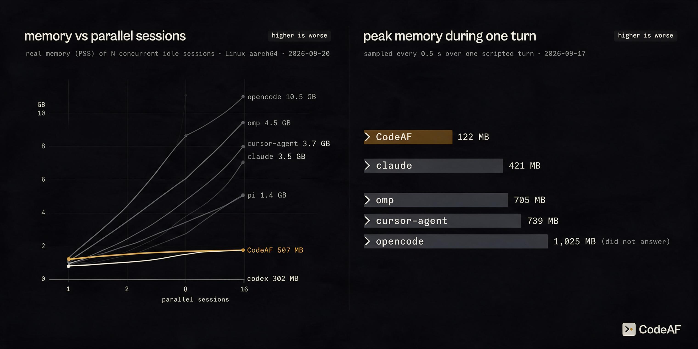

# How the footprint numbers are measured

`measure-cli.sh` measures one command-line agent and prints `key=value` lines. It takes a
name, a HOME to run under and the command to run, so it measures any CLI rather than this
one. The startup, first-frame and idle tables in `results-2026-09-17.md` are its output;
the on-disk and one-turn tables there came from other means, and `METHOD-REVIEW.md`
records what is and is not documented about them.

```bash
WORKDIR=$PWD docs/benchmarks/performance/measure-cli.sh codeaf /tmp/bench-home/codeaf ./bin/codeaf chat
```

Run it once per CLI, on the same machine, in the same working directory, within the same
session. Numbers from different machines or different days do not belong in one table.

## What it measures

- **Startup** — wall clock for `--version`, the best of `STARTUP_RUNS` measured runs
  (default 7) after `STARTUP_WARMUP` (default 2) discarded warm-ups: a warm page-cache
  figure, not a cold one. Every CLI in one comparison needs the same `STARTUP_RUNS`,
  `STARTUP_WARMUP` and tool. It uses `hyperfine` when that is installed and a
  `date +%s%3N` loop when it is not, and says which in its output (`tool=`). Archive the
  run's `phase=meta` lines with any table built from them: that is the only record of
  what was actually run.
- **First interactive frame** — time from launch until the terminal first paints a
  non-blank character, measured in a tmux pane on a private socket.
- **Idle cost** over a 30 s window, sampling the whole process tree: RSS, PSS, peak RSS
  (`VmHWM`), thread count, open file descriptors, CPU from `utime+stime` deltas, and
  voluntary context switches per second.

## Five rules the numbers depend on

**Run in a real repository, not an empty directory.** Some of these CLIs index the working
tree at startup. In an empty directory that cost is invisible, and the comparison flatters
everything that does it.

**Use an authenticated profile.** A fresh profile measures a login screen or a
folder-trust dialog, not a working session. Two of the CLIs compared read more than 120 MB
higher once actually authenticated in a repository — measured the naive way, every
competitor is understated.

**The idle figure is the part of the tree still alive at the end of the window.** A
CLI's idle resident cost is the sum over the processes of its own tree that are alive at
the last sample. A helper that appears and then exits inside the window is not in that
sum, because a steady-state figure must not depend on how long you watched: counting
every process ever seen would make one unchanged idle CLI cost more over five minutes
than over thirty seconds, and would charge it for helpers that were never resident at the
same moment. What such a helper cost while it lived shows in peak RSS instead. Both
counts are printed, `procs` for the processes alive at the last sample and `procs_seen`
for how many distinct processes the tree held at any sample, so a reader can tell a
steady pair of processes from a CLI that churns short-lived helpers.

**Report PSS, not RSS, for anything with more than one process.** CodeAF runs a surface and
a detached engine daemon that share one binary's text pages; RSS charges that memory to
both. PSS charges shared pages once. Using RSS here would overstate this binary's own
footprint by about 40 MB, so the honest number is also the less flattering discipline.

**The box has to be quiet. The script does not make it quiet.** It kills only the processes
it started, by pid, and it runs its own tmux server on a private socket so its teardown
cannot reach anything else. It contains no `pkill`, `killall` or other kill-by-pattern, and
neither should anything added to it: `pkill -f` matches the whole command line of every
process the user owns, so a pattern as ordinary as `sleep 60` will take down any unrelated
job whose arguments happen to contain it. If other work is running on the machine, the
idle and CPU figures are measuring that work too — wait, do not clear. Every run records
the machine's load average — one-, five- and fifteen-minute — in `phase=meta`, and again
immediately before and after the startup and idle windows (`startup_load1_before` /
`startup_load1_after` / `idle_load1_before` / `idle_load1_after`). A millisecond figure
taken under contention is worthless: compare runs taken at similar load, and say so when
a figure was taken outside the quiet bar you set.

## What these numbers are not

They are a measure of what the binary costs to install and to run: size, startup, and
memory at rest and during one short turn. They say nothing about whether the work is any
good. Task quality — pass rate, cost per issue, time per issue — is a separate measurement
and is not in this table.

## Known limits

- `perf stat` is unavailable on many hosts (`perf_event_paranoid`), so idle CPU is computed
  from `/proc/<pid>/stat` deltas across the process tree rather than from hardware counters.
- **The wakeup figure is noisy.** Repeated runs of one unchanged build have produced
  anything from 0 to 84 voluntary context switches per second. Treat it as a direction, not
  a rate, and do not put it in a comparison table.
- First-frame timing depends on terminal size; the script fixes the pane geometry so runs
  are comparable, but a different geometry gives different numbers.
- Peak RSS is a high-water mark and is sensitive to what the CLI did before the sample.

## 2026-09-20: the second day



A second day of tables extends the footprint past the single idle instance:

- [results-scale-2026-09-20.md](results-scale-2026-09-20.md): PSS and RSS at
  N = 1, 2, 4, 8, 16 concurrent idle sessions, and the marginal cost of each
  added session, measured with `scale2.sh`.
- [results-crash-steer-2026-09-20.md](results-crash-steer-2026-09-20.md):
  milliseconds to stop on interrupt, and what survives kill -9 mid-turn.
- [results-repo-scale-2026-09-20.md](results-repo-scale-2026-09-20.md): idle
  cost in a 3,334-file repository versus a one-file repository, with inotify
  watch counts.

- [results-resume-2026-09-20.md](results-resume-2026-09-20.md): the
  cost of reopening a 50-turn session, in memory and in milliseconds
  to usable.

Turns were driven against `stub.py`, a loopback model endpoint, so no measured
turn spent a provider token. A CLI the stub cannot drive has an empty row with
the reason, never a substituted figure. `scale2.sh` and `stub.py` sit beside
`measure-cli.sh` in this directory.
