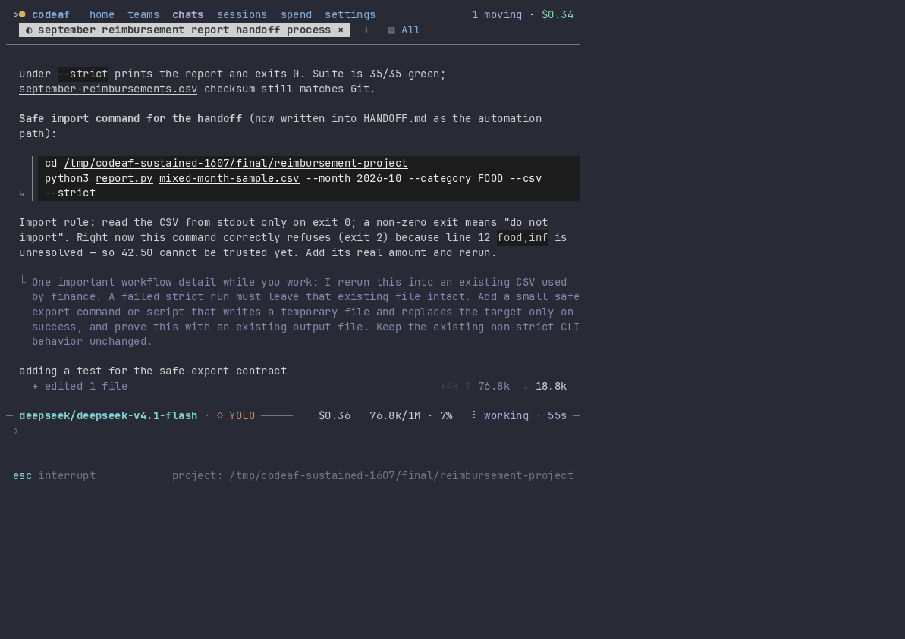
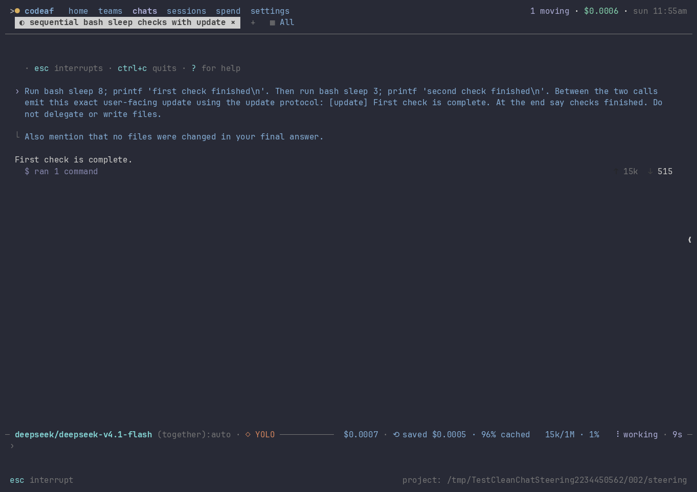
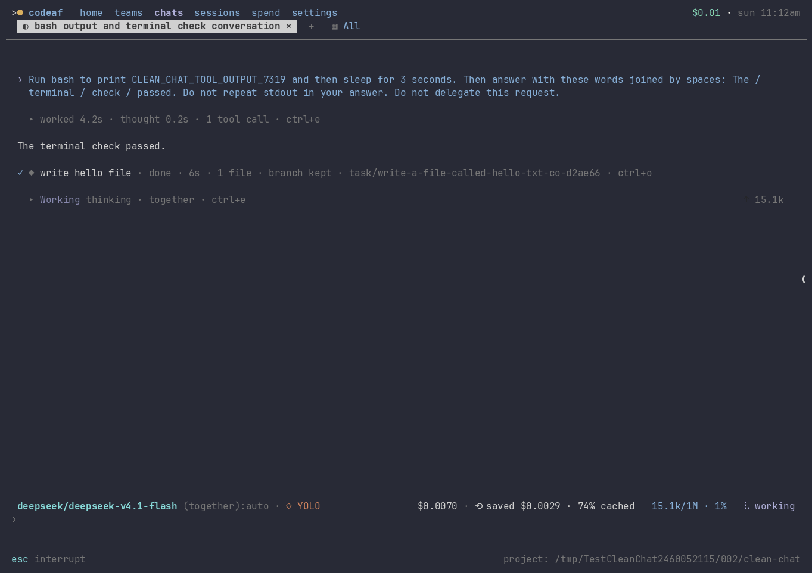

# Clean chat: live acceptance

The shared conversation renderer keeps human questions, steering, completed answers,
and explicit intended-human updates visible. Internal activity uses the existing
three-row scrolling animation and folds when finished. Errors remain compact;
opening disclosure still reveals the full record. Settled task notifications can
be dismissed and restored without deleting their results.

## Sustained real workflow



The recording uses application source `18a6ec5f21386c1a2e1d5c6165b55a4804086c2d`
on Spark. The full continuous recording lasts **254.792 seconds**. The GIF is a
contiguous **180-second excerpt (74.792–254.792) at normal speed**, with the full original cast
preserved. The model completed **41 requests**, all using OpenRouter
`deepseek/deepseek-v4.1-flash`; auxiliary roles and request starts were audited too.

The live task extended a real reimbursement-report program with strict validation
and an atomic export wrapper. Follow-up steering required failed exports to keep
the existing CSV intact. A later consumer question exposed confusing shell advice;
the user corrected it and the model tested a safe import condition locally.
Independent verification executes the generated program and checks its actual files,
exit codes and import marker, rather than trusting the assistant's summary.

[Full recording, captions, model audit, generated files and independent results](live-workflow/README.md).

During that workflow we resized the actual terminal from 140×42 to 90×32 and back,
opened work and an individual command, closed them, and dismissed receipts. Human
updates and steering survived these transitions. No raw update marker, reserved
interruption marker or automatically expanded task-reading brief was observed.

## Focused live terminal scenarios

All four real tmux scenarios passed in **112.054 seconds** on the same application
source. Every live role used `deepseek/deepseek-v4.1-flash`.

| Scenario | Verified behavior |
| --- | --- |
| Chat and task completion | Tool work folds, details open on request, compact task receipt dismisses and restores. |
| Manager replay and follow-up | Historical team traffic and wake instructions fold; the formatted answer and a new live response remain visible. Historical traffic is a fixture, not a claim of live teammate delivery. |
| Failure and recovery | An actual failing tool call stays compact while recovery runs; its output remains inspectable. |
| Steering and reopening | Real keyboard steering and an explicit assistant update remain readable during tools and after reopening the journal. |

[Run log](evidence/run.log) · [Run summary and model counts](evidence/run-summary.json)





The dismissal sequence captures a running conversation; additional model replies
arrive between frames. The captures are unmodified, so this is not a perfectly
static before/after comparison.

## Transition coverage and verification

[UX coverage matrix](UX-COVERAGE.md) records stop, consumed steering, retry,
compaction, rewind, replay, narrow widths, all chat lenses, disclosures and pending
decisions. Audience and interrupted status are stored as typed presentation
metadata while provider history and underlying details remain intact.

Older ambiguous mixed prose remains intact: legacy journals lack the metadata
needed to distinguish it safely from a human answer.

[Repository gate log](validation/pr-ready.log) records build, vet, formatting,
manuals, repository laws and affected-package tests. The help-search heading was
restored after the first combined run found a documentation regression; the
recorded application code was unchanged by that documentation-only correction.
A subsequent CI check exposed an older fixture that stopped at a steering boundary
but still expected completed work; the fixture now covers stopped and completed
responses separately. The first full gate also reproduced the already-fixed
program-run cleanup race; the existing reviewed #1619/#1622 test-only fixes
were reused as validation dependencies. No new production fix was introduced.

[Earlier full recordings](history/README.md) preserve intermediate failures and
the fixes they motivated. They are not substituted for final acceptance evidence.

## Reproduce the focused live scenarios

```sh
make build
CODEAF_E2E_EVIDENCE_DIR=/tmp/codeaf-chat-cleanup-evidence \
  go test -tags=e2e ./internal/e2e \
  -run '^TestClean(Chat|ManagerReplay|ChatFailureRecovery|ChatSteering)$' \
  -count=1 -v -timeout=15m
python3 docs/design/chat-cleanup/render-evidence.py \
  /tmp/codeaf-chat-cleanup-evidence docs/design/chat-cleanup/evidence
```

Run through Fleet on Spark with the configured OpenRouter credential. No keys,
private session directories or provider configuration belong in this evidence.
All captured screens originate from real tmux framebuffers; GIF rendering only
converts those captured bytes. The notification sequence is a labeled slideshow,
not continuous video.
