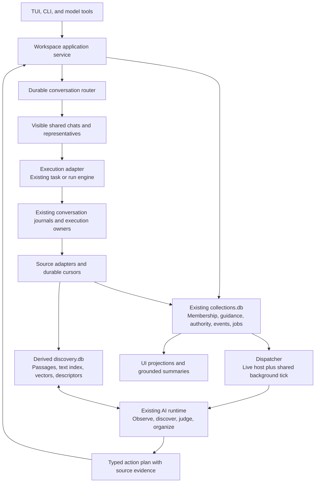
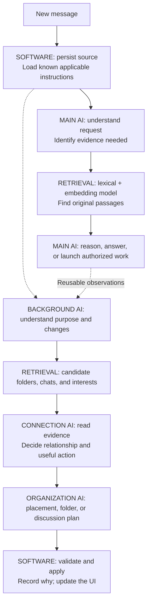
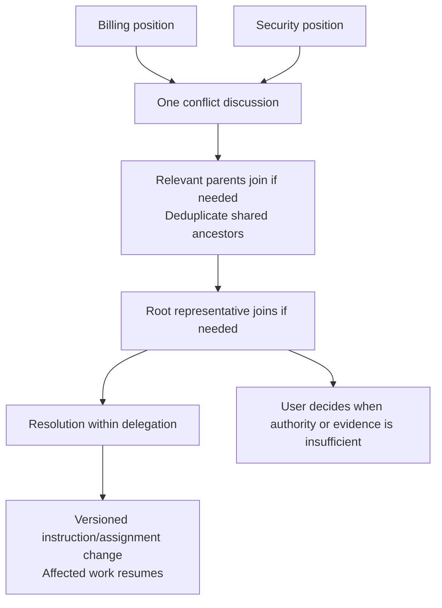

# codeaf collaborative workspace

**PRD, product design, and technical design handoff · 18 September 2026**

This document is self-contained. It specifies the experience, proposed implementation, integration points, delivery sequence, and acceptance criteria for a new session building this feature. No earlier conversation or companion design document is required. TDD here means **technical design document**.

**Status:** implementation proposal grounded in inspected source, not a claim of shipped behavior. **Required** means established product intent. **Default** means a recommended implementation choice resolving an earlier open question; build with it unless the owner changes it. **Experiment** means optional optimization, not a prerequisite for the promised experience.

**Reading order:** [product and defaults](#2-product-problem-and-promise), [UI design](#6-product-design), [existing code](#7-what-already-exists-and-what-to-extend), [architecture](#8-technical-architecture), [AI workflows](#11-explicit-ai-workflow), [build phases](#18-delivery-plan), and [acceptance](#19-acceptance-matrix). The four serial branch-local waves, owner journeys J01–J35, and engineering corrections live beside this file: [`serial-plan.md`](serial-plan.md), [`USER-JOURNEYS.md`](USER-JOURNEYS.md), [`ENGINEERING.md`](ENGINEERING.md), [`COLLABORATION-CLARIFICATION.md`](COLLABORATION-CLARIFICATION.md). Sections 9–17 contain the technical contracts; section 20 contains the mandatory implementation/testing handoff rules.

## 1. Build target and source baseline

- Repository: `https://github.com/Agent-Field/CodeAF`; Go module `github.com/Agent-Field/codeaf`.
- Local checkout inspected: `/Users/santoshkumar/Documents/agentfield/code/codeaf`.
- Requested development branch is actually **`santos/dev`**, not `santosh/dev`.
- Local branch, remote-tracking branch, and GitHub branch agreed at **`7cda67c9a066b9c805e4327054a814e0c52c0ef9`** during inspection.
- The shared working checkout was on a different feature branch. It was not switched or modified. Source inspection used a separate snapshot.
- The live product surface is `internal/tui3`; the v3 engine is `internal/session`. Extend these, not the separate resident product in `internal/head` and `internal/resident`.
- Source declares Go 1.26.5, Bubble Tea v2, the AgentField Go AI SDK, and `modernc.org/sqlite`. Reuse the installed architecture; this proposal does not require an AgentField control plane or another application framework.

**Next builder:** refresh branch state and read `AGENTS.md`/`CLAUDE.md` and relevant unreleased changes. Repository policy normally branches from and targets `dev`. **The owner explicitly requested branch-off-`santos/dev`** at `7cda67c9a066b9c805e4327054a814e0c52c0ef9`; implementation proceeds on `feat/collaborative-workspace-0918` and must not merge, force-push, or push to `dev`, `santos/dev`, `staging`, or `main`. Compare the eventual implementation base with this snapshot. Preserve other sessions' changes. Do not wholesale transplant this branch based on this document.

## 2. Product problem and promise

Today, the user opens several coding chats, opens more chats to manage them, supplies old decisions manually, and relays messages between managers. The software should absorb that coordination while keeping the work understandable and steerable.

**Promise:** start talking or working wherever convenient. codeaf finds relevant history, organizes the work, connects the right conversations, and coordinates authorized action. The user can inspect and correct what happened without becoming the dispatcher.

Support a single GitHub issue with a planner and critic, five parallel features with several coordinators, ongoing folder responsibilities, and relationships discovered across otherwise separate projects. Do not optimize only for top-level project planning.

The defining interface is **folders and chats**. Decisions, work, instructions, progress, and responsibilities are visible within them. Users need not manage retrieval indexes, execution identifiers, agent registries, or confidence scores.

AI interpretation, proactive discovery, automatic organization, and useful collaboration are initial product capabilities. Optimize their cost without removing them. Specialized personal models are optional ways to improve these capabilities later.

## 3. Product invariants

| ID | Required behavior |
|---|---|
| P1 | Every new chat keeps its own identity and history. Never silently merge it into an older chat. |
| P2 | A chat or folder can appear in multiple folders. Placements reference one object; they do not copy it. Membership is binary. |
| P3 | Folder containment is a finite rooted DAG. Multiple parents are allowed; cycles are forbidden. Communication can be bidirectional. |
| P4 | Folders provide purpose, scoped guidance, discoverable contents, progress, and an addressable AI representative. They are not necessarily filesystem directories. |
| P5 | Coordination is an inspectable chat role. A folder can contain several coordinating and ordinary chats; there is no mandatory manager subclass or single-manager limit. |
| P6 | Agents can discover relevant old conversations without the user remembering titles. Rejected proposals, corrections, and abandoned plans remain retrievable with their context. |
| P7 | Organization can happen automatically while the user is elsewhere. Routine filing does not require repeated approval. Users can add, move, remove, and correct placements. |
| P8 | A shared discussion may appear in two folders without linking all their contents or applying every sibling's instructions. |
| P9 | Chats and collaborations can launch work. Multiple coordinators must not unknowingly duplicate implementation or overwrite the effective assignment. |
| P10 | Decisions and changes retain sources, attribution, scope, and history. Reading historical text does not promote it to an instruction. |
| P11 | Large numbers of chats are supported through overviews, search, progressive disclosure, and source links. Do not force users to reuse old chats to avoid clutter. |
| P12 | The current selection, editor, and open chat stay stable when background organization changes. |

## 4. Vocabulary and working defaults

**Folder:** product name for the existing logical collection abstraction. **Chat:** durable conversation. **Representative:** an identified AI speaking for a folder or another chat. **Responsibility:** a delegated objective or ongoing duty, carried out through visible chats. **Execution:** internal work record managed through existing task/run machinery.

These defaults make the proposal buildable without pretending previous discussions settled every detail:

| Topic | Default and rationale |
|---|---|
| Root | One logical Root per local authority/home. Top-level collections and unfiled chats are children of Root. Root is not the filesystem home directory. |
| Direct communication | An existing ordinary chat can coordinate independent chats. Direct request/reply, fan-out to several recipients, and inviting participants into the current discussion share one router. A new group chat is optional when a distinct history is wanted. Folder representatives are not mandatory relays. |
| Folder conversation | Coordination is a role of an ordinary persistent chat, not a manager subclass. The current chat can host a joint discussion; a separate discussion may be created when useful and filed in multiple folders. Existing discussions remain listed and can be continued explicitly. No single endless folder transcript. |
| New automatic placements | Apply when the relationship and authority are supported. Record why; no approval card for routine filing. |
| Automatic removals | Initially allow removal of system fallback placements and correction of the organizer's own mistaken placement. Preserve explicit user placements unless the user authorizes moving/removing them or grants a broader reorganization policy. Additive organization still operates fully. |
| Membership changes during work | Change navigation immediately. Recompute applicable guidance and coordinator scope before the next affected tool action or work commitment. A conflict pauses affected mutation, not unrelated work or read-only investigation. |
| Removing a chat | Removes that placement and future folder-scoped coordination over it. It does not delete history or implicitly cancel an already-authorized run. Existing run commitments persist until explicitly revised, transferred, or stopped. |
| Selected-item coordination | Scope is a snapshot of the explicitly selected objects. Adding siblings elsewhere does not enlarge it. |
| Whole-folder coordination | Scope follows the folder's current descendants, including future additions; shared objects are deduplicated. Changes use the checkpoint rule above. |
| Conflicting instructions | Do not use arrival order or graph distance as automatic authority. Combine compatible constraints; resolve conflicts from source and delegation. Relevant parents collaborate in the same discussion, eventually involving Root and the user if needed. |
| Lifecycle | Closing a view does not stop work. Pause coordination stops new decisions/launches; stopping existing work is explicit. Archiving hides an object from routine active views and stops its autonomous wake-ups, preserving history and existing work records. |
| Deletion | Do not add automatic deletion. Respect existing explicit deletion semantics and remove corresponding derived retrieval material. |

Folder membership supplies guidance, not new tool permissions. A coordinator may act only within recorded delegation. A user can provide more specific instructions in a subfolder; an override must have appropriate authority and an explicit relationship to the rule it replaces. An agent cannot acquire that authority by restating an instruction as if the user wrote it.

## 5. Required journeys

| Journey | Observable outcome |
|---|---|
| Start a new chat in Billing about emailed receipts | It stays a new chat. AI finds relevant historical access-control discussion, cites it, and may also place the chat in Security. |
| Start without selecting a folder | Chat begins at Root; codeaf names and organizes it as its purpose becomes clear. Filesystem execution context is resolved separately when needed. |
| Bring an old chat into a new folder | Same identity/history; placement is immediate; applicable guidance is recomputed. No duplicate execution. |
| Coordinate five existing feature chats | One visible coordination chat manages those selected chats. User can inspect exchanges and intervene without manual message relaying. |
| Planner and critic on Issue 42 | Representatives exchange findings in a shared discussion and can launch one agreed implementation. Creating a special folder is optional. |
| Old plan rejected for offline requirements; requirements change | Retrieve proposal plus rejection rationale. Reconsider it; do not assume it is now correct. |
| Billing and Security request conflicting changes | Both positions appear in one discussion. Appropriate ancestors join; only affected work waits. |
| User removes a wrong automatic placement | Removal persists and explains its effect. The same unchanged evidence does not immediately recreate it. |
| Hundreds of chats and background reviews | Folder overview shows outcomes, active work, and what needs the user. Routine agent traffic is not hundreds of unread obligations. |
| Terminal closes and later reopens | Authorized background work remains recoverable; progress, pending decisions, and source links survive. No claim of background operation on an unsupported host. |

## 6. Product design

### Navigation and folder view

Extend Home with a logical folder navigator and an adaptive detail area. Reuse the existing TUI visual language, selection primitives, model, and remote adapters. A column browser/tree is a projection of the DAG, not the data model.

```text
Folders                    Billing

Root                       Migration running · receipt access needs a decision
  Product
    Billing                Conversations
      Receipts               Receipt delivery       also in Security
      Migration              Migration plan         running
  Security                   Release coordination   coordinating 5 chats

                           Recent decision
                           Preserve existing customer prices
                           Open discussion · Sources

                           Discuss · New chat · Coordinate selected
```

Use quiet rows and progressive disclosure, not a mandatory dashboard full of tiles. Respect `docs/DESIGN-LANGUAGE.md`: restrained emphasis, dim secondary telemetry, existing icon vocabulary, and no invented status colors or machinery labels. Unknown values should not become fake zero counters.

- Folder preview: purpose; short grounded progress; active chats/work; decisions; responsibilities; instructions; placements. Low-frequency properties can be expanded.
- Chat preview: purpose/title; participants; current work; latest meaningful result; placements. Opening it gives the full existing conversation surface/tab.
- A shared object is editable from any placement. Show “also in Security,” with navigation to the other placement.
- Roll-ups count unique chat/work IDs, not graph paths. Money is charged once; folder views explain overlapping attribution rather than summing duplicate costs.
- Keep selection by object ID plus navigation path; retain scroll and composer text. If a placement disappears while selected, retain the open object and explain the move.
- Narrow terminal: navigator and detail become sequential views with a clear back path; do not squeeze multiple illegible columns. Validate common 80-column and wider layouts.
- Selecting/previewing an object never launches AI work. Explicit discussion or an authorized background responsibility may.

### Main interactions

| Action | Product behavior |
|---|---|
| New chat here | Create a new identity in the selected folder and focus its composer. |
| Add to folder | Choose another folder; retain all existing placements and the object. |
| Move | Atomically add destination and remove the chosen source placement, preserving other placements. |
| Why here? | Show the short placement reason, source passage, who/what made it, and correction actions. |
| Coordinate selected | Start a persistent group chat, show the selected objects and goal, then operate within existing delegated permissions. |
| Manage this folder | Show ongoing scope and limits in the resulting coordination chat; future descendants are included. |
| Instruct this folder | Store source-backed, versioned guidance for descendants. Distinguish one-off conversation from standing guidance in the resulting visible action. |
| Pause coordination | Stop further autonomous decisions/launches for that responsibility. Offer a separate explicit action for stopping existing work. |
| Search | Search original history and objects globally, optionally constrained to folder scope. Show why a result matched and open the exact source. |

Contextual `@` selection should put current folder descendants first, then allow global search and folder traversal. Labels are readable names; selections resolve to stable IDs. Do not require the user to know an old title. Natural-language references go through AI-assisted retrieval.

Preserve current `/folder` and `/attach` filesystem behavior. Logical membership must not silently change a working directory or repository. Add new commands/actions through the existing command registry after checking collisions; command names are not fixed by this design. Update the manual with the actual final names.

### Attention and discussion visibility

An automatic review is inspectable activity, not necessarily a new chat. A substantive multi-party discussion is a persistent chat with participant labels, source links, a purpose, and a readable outcome. Show reasons and evidence, not private model reasoning.

Notify the user for a meaningful result, failure, consequential change, or decision outside delegation. Routine filing appears quietly in placements/activity and folder summaries. A failed background process must not masquerade as successful organization.

## 7. What already exists, and what to extend

All observations below are scoped to the pinned snapshot. Design documents and comments describing a future removal are not evidence that the corresponding code path is gone.

| Existing seam | Verified behavior | Build implication |
|---|---|---|
| `internal/workspace/{workspace,store}.go` | Independent SQLite collection store, schema v1; collection/conversation/task/standing/artifact refs; shared membership; transactionally checked cycles; idempotent add/remove. | Extend this abstraction. Do not build a second membership database. Preserve its independence from session, provider, optional memory, and UI. |
| `cmd/codeaf/collections.go` | `codeaf collections` CRUD/membership CLI, default `home.Join("v3", "collections.db")`. | Keep backward compatibility and route new UI/model operations through the same validated mutations. |
| `internal/manual/chat/collections.md` | Explicitly says collection UI, automatic organization, instruction inheritance, and inter-chat communication are not implemented. | These are real integration gaps; update these denials as each capability ships. |
| `internal/session/sessionfile.go` | Versioned JSONL sessions with locked single-writer ownership, completed messages, delivery IDs, compaction/replay records. | Preserve transcript ownership; add attribution/source metadata compatibly rather than replacing journals. |
| `internal/session/tools_conversations.go` | Read-only `ConversationHistoryReader`, `search_conversations`, opaque `chat:` references; lexical search and nearby-message reads. | Extend discovery behind interfaces; preserve old references and read-only authority. |
| `internal/store/{conversation_read,thread_search}.go` | FTS5/BM25 indexed history with bounded reads. | Reuse query/read semantics. Discovery must also work when optional learned memory is off. |
| `internal/session/mailbox.go` | Local session/task delivery, explicit origins, accepted-vs-recorded distinction; cross-session routing explicitly absent. | Add a durable authenticated router; do not call the local mailbox a workspace-wide bus. |
| `internal/session/assignment.go` | Versioned assignment overlay; only genuine person-origin directions revise goals in this path. | Delegated coordination requires an explicit extension, not relabeling agent messages as the user. |
| `internal/plandb/{model,persist,store}.go` | SQLite plan/task state, one `ParentID`, separate dependencies, resource claims, worker seats, notes/spend. | Keep execution hierarchy separate from shared folder membership. |
| `internal/session/{task_person,task_run_belt,plandb_plan,plandb_tasks}.go`; `internal/run` | Both session task and bash-belt/run roads remain; `StartTask` selects the latter when `CODEAF_TASK_BELT=bash`. Plan paths can be session-local or working-copy-local. | Introduce an execution adapter over the actual active road. Do not assume one global plan DB or that older task code is already removed. |
| `internal/session/auxiliary.go`; `internal/roles`; `internal/provider`; `internal/lane` | Role-aware auxiliary calls, deadlines/fallback, routing and usage accounting already exist. | Extend these paths for semantic jobs; do not create unmetered direct provider clients. |
| `internal/standing`; `cmd/codeaf/chatv3_standing.go`; `cmd/codeaf/tick.go` | Shared tick constructor, in-window passes, OS timer fallback, profile-scoped unattended rules and daily rail. | Reuse the unattended scheduling foundation and add workspace job processing. |
| `internal/enginehost`; `cmd/codeaf/engine.go` | Persistent per-filesystem-workspace hosts, session locks, attach/reconnect, idle retirement. | Use owning hosts for active delivery. Add wake/recovery integration; a host's mere existence does not guarantee perpetual folder intelligence. |
| `internal/tui3`; `internal/session/places.go` | Existing home/tab/folder pickers and filesystem-place references. | Reuse components but distinguish filesystem context from logical folders. |

## 8. Technical architecture

Prefer an in-process service with durable state and existing host/tick lifecycle. No new network service, vector server, always-running model, or distributed consensus layer is required for the first release.



**Proposed package boundary:** retain `internal/workspace` as storage and pure structural rules. Add a controller package such as `internal/workspaceflow` for orchestration over interfaces. It must not import `session` or `run` if doing so creates cycles. Wire implementations in `cmd/codeaf` and narrow session adapters. `internal/run` already imports session code; do not add the reverse import. Reuse the registered run seam.

`workspace` currently has a structural test forbidding imports of execution, provider, optional-memory, UI, and host packages. Keep that law. Its metadata may grow without giving it model calls, transcript ownership, or execution responsibility.

## 9. Data model and identity

Table names below are proposed except for existing `collections` and `memberships`. Group related records if simpler; preserve their semantics.

| Record | Essential fields and constraints |
|---|---|
| Collection | Existing stable ID/name; add purpose, revision, lifecycle, timestamps. No required filesystem path. |
| Membership | Existing typed reference; add stable edge ID, origin, reason, evidence refs, revision, created/removed history. Unique active `(collection, kind, ref_id, session_id)`; cycle check and insertion share a writer transaction. |
| Root scope | Stable authority-scoped identity, guidance, and overview. **Default:** virtual parent of every collection with no explicit parents and every known chat with no placement. Persist root metadata; compute these edges. Root is never a child. |
| Guidance | Scope ID, exact source text/ref, issuer, effective revision, status, explicit supersession/override refs. Distinguish instructions from descriptions and inferred facts. |
| Responsibility/grant | Goal, coordinating chat, selected-ID or dynamic-folder scope, permitted action classes/resources, budget, issuer/source, revocation revision, lifecycle. Delegation cannot expand itself. |
| Representative/participant | Stable actor ID, represented folder/chat, authority/grant refs, role label. Being invited does not grant broader control. |
| Observation | Source revisions, purpose/change description, inferred interests/assumptions, evidence refs, model/prompt version. Derived and correctable, not an instruction. |
| Decision/dependency | Decision text/status, sources, scope, issuer/grant, alternatives, assumptions, supersession links. Keep extracted candidate decisions distinct from adopted ones. |
| Workflow event/job | Event ID, source revision/cursor, cause ID, target scope, job type, priority, state, lease/fencing token, retry time, budget reservation, attempt/error. |
| Proposed/applied action | Typed operation, expected object/source/guidance/grant revisions, evidence, explanation, idempotency key, result, reversal link. |
| Delivery | Sender/recipient actor and chat IDs, origin, purpose, body/source refs, cause ID, dedupe key, authorization, durable status and receipt. |
| Execution binding/claim | Global work ID, owning runtime, owner chat, qualified run/task refs, scope/resources, assignment revision, grant revision, lease/fencing state. |
| Discovery passage/vector | Canonical source ref, content hash/revision, speaker/origin, passage boundaries, contextual neighbors; embedding model/version/dimension and index generation. |

### Identity rules

- Qualify cross-host references with authority/host identity. Do not collapse unrelated homes or same-named repositories. First release targets one authority/home with multiple local repositories; preserve remote identifiers without promising global graph synchronization.
- Existing collection task refs require a **numeric task ID plus session ID**. Plan tasks use string IDs that can repeat between runs. Never reinterpret one as the other. Add a versioned typed plan-task reference, or keep plan tasks behind execution bindings until that reference is implemented.
- A reused `plandb.db` path is not a run identity. Allocate/persist an immutable run-instance identifier in the adapter and qualify task IDs by it.
- Keep existing opaque `chat:` references readable. Add stable journal-entry IDs for new records compatibly; map legacy records with a source generation, ordinal, and content hash. Do not call an offset alone a permanent ID. Detect rewind/rewrite and invalidate affected derived records.
- Persist verified aliases between legacy indexed references and canonical sources. If the old index is gone and an alias cannot be established, report an unavailable reference rather than guessing which identical-looking passage it meant.
- Artifacts are currently path references. Add content/version identity where needed for evidence; do not silently claim renames preserve identity.
- Unavailable external records can remain referenced. Distinguish “unavailable” from “deleted,” and preserve the folder listing.

Virtual Root makes existing unparented collections reachable without fabricating explicit memberships or changing the old CLI's `find` results. A chat explicitly started at Root has root scope without requiring an ordinary collection edge. Effective guidance includes Root once, regardless of how many parent paths reach it.

## 10. Storage, transactions, and migration

Keep organizational control metadata and its mutation/outbox records in the existing collections database. Store rebuildable text/vector discovery data separately in `home.Join("v3", "discovery.db")`; do not couple logical organization to the optional memory switch. Original journals and execution stores remain authoritative for their content.

1. Introduce explicit versioned migrations from collection schema v1. Preserve IDs, order, shared edges, all existing ref kinds, and source ownership.
2. Preserve current refusal of foreign, damaged, and unsupported future databases. Never reset a failed database to empty state.
3. Listing must remain read-only; perform migrations through an explicit initialization/write path, with clear handling for clients that encounter a version needing upgrade. Keep private permissions and bounded lock waits.
4. A membership/guidance change, its audit event, and its outbox job commit in one transaction. No model calls or network waits inside that transaction.
5. Session JSONL and SQLite are separate durability domains. Do not claim one transaction covers both. Record to the owning journal first; ingest with persistent cursors and idempotent keys. Startup reconciliation discovers journal entries missed after a crash.
6. Backfill existing session inventory and original passages incrementally. Old chats can be added manually immediately. Show indexing progress; a miss does not imply absent history while indexing is incomplete.
7. Discovery deletion/rewind reconciliation removes or marks derived content appropriately. Abandoned proposals remain searchable; explicit deletion must not be undone by a stale index.
8. Use a feature rollout switch for new organization/AI/UI, not a second source of membership truth. Turning automation off preserves manual folders, history, and work. Schema rollback must not silently discard new metadata; older binaries should refuse unsupported writes.

## 11. Explicit AI workflow

### New chat and ongoing turns



Boxes are cognitive jobs, not mandatory individual calls. A main turn can supply observations; one background call can judge a connection and propose organization. Separate calls are worthwhile when they need different context, model capability, or independent checking. A multi-step search remains available when evidence demands it.

### Role contracts

| Role | Inputs | Structured result | Suggested routing |
|---|---|---|---|
| Observer | New content, recent context, current scope, last assessed revision | Purpose; changes; tentative needs/assumptions; query intents; source refs | Main-turn reuse or fast general model; stronger when interpretation is consequential. |
| Discovery planner | Work purpose, evidence gap, available indexes | Search queries and bounded reference expansions | Existing main model or compact model; tools do actual retrieval. |
| Connection judge | Candidate original passages, neighboring context, current work, target scope, corrections | Relationship type; relevance explanation; evidence gaps; action candidate or no action | Fast or strong according to task; no reliance on self-confidence alone. |
| Organizer | Judged relationships, hierarchy, guidance consequences, prior user actions | Add/remove/move proposal, new-folder purpose/name/parents, or retain current organization | General reasoning; stronger for restructuring or instruction conflicts. |
| Coordinator | Goal, participants, current work, scope, delegated powers, evidence | Discussion messages, assignments, resolutions, escalation, stop/no-action | Stronger model and multi-step workflow where useful. |
| Progress/attention | Real work state, decisions, changes since last summary | Short grounded overview; whether the user needs to know | Fast model/batching; factual counters remain software-derived. |
| Checker | Result and acceptance requirements, source revisions, actual execution evidence | Supported findings and remaining gaps | Existing verification machinery plus independent tests/critique as appropriate. |

Use existing role registration, `callRoleChecked`-style validation, provider selection/fallback, deadlines, and spend accounting. New roles should resolve from profile choices, not hardcoded vendor/model names. Do not assume all currently displayed model slots already have a live consumer. Add and test the real call path.

Observer/judge jobs get bounded read capabilities and emit typed proposals; they do not receive an unrestricted shell just to classify a relationship. Coordinators receive the tools and delegated scope needed to do useful work. A retrieved historical instruction stays attributed evidence until the authority resolver establishes applicability.

### How a connection is formed

For a Billing chat about receipt links, AI may infer an access-control question, search terms and semantic equivalents, find an old Security discussion, and read its reasoning. It then chooses among these outcomes:

| Relationship found | Action |
|---|---|
| A useful passage, but no shared working scope | Bring cited context into the current chat. Do not manufacture a folder relationship. |
| This chat belongs in Billing and Security | Add the same chat to Security, with reason and sources. |
| Two parties need to settle a decision | Create or continue one shared discussion placed in both folders; select relevant representatives. |
| A recurring set of work has a meaningful common purpose | Propose/create a named folder, relevant placements, and a concise purpose. Check existing equivalents first. |
| New information changes a decision's assumptions | Retrieve the decision and rejected alternatives; revisit applicability before changing work. |
| Insufficient or irrelevant evidence | Search further if worthwhile, or record no action. Never turn a similarity threshold directly into membership. |

AI creates folders because they are useful places to return to or instruct, not merely because a cluster exists. A user can create a scope around any selected set immediately. Do not enumerate all combinations of related items into folders.

## 12. Discovery and memory implementation

**Authoritative history stays in sources.** Learned weights, summaries, and folder descriptions help find it; they do not replace it.

- Index original messages/passages with neighboring context, plus concise chat/folder descriptors for routing. A whole-chat summary or vector must not hide minority topics.
- Combine lexical candidates, embedding candidates, exact identifiers, known references, and selected assumption/interest links. Reserve candidates for global search beyond existing memberships.
- Deduplicate source identity and shared-folder paths. Favor a small set of distinct evidence rather than many paraphrases of the latest decision.
- Expand to the original exchange to understand rejection, correction, attribution, and time. Extracted status is helpful metadata, not an absolute filter.
- Reverse discovery matches new evidence against outstanding interests and assumptions. Periodic review inspects neglected work and sampled dismissed candidates to detect blind spots.
- Provide an embedding adapter interface; ship and evaluate a working configured model. An optional local implementation may follow. Index vectors with model version/dimension; an encoder change creates a new generation rather than comparing incompatible vectors.
- Choose exact or approximate vector lookup based on corpus measurements and portability. Do not introduce an external vector service by default. Keep retrieval behind an interface so the index can change without changing product behavior.
- Add semantic search to the existing conversation-history interface through an adapter; do not silently change old lexical query semantics without updating tool/manual contracts. Existing `chat:` reads must still open the cited source.

Assumption links and interests should be inferred when useful, with sources and invalidation rules. A full formal truth-maintenance engine is not required. Removing one objection triggers reconsideration, not automatic acceptance of the rejected plan.

Personal scoring, Hedge/FTRL, graph diffusion, statistical drift detection, and continual fine-tuning are **experiments**. A general model should provide the corresponding intelligence initially. Train on meaningful feedback after it exists; distinguish bad filing from irrelevant evidence, and do not treat silence or AI self-approval as ground truth.

## 13. Scheduling, budgets, and unattended operation

| Trigger | Required handling |
|---|---|
| First substantive message | Initial semantic organization and global discovery are queued; main response proceeds with needed context. |
| Later message/result | Persist revisions and index updates; reuse main-turn observations or schedule an observer. Coalesce related events without losing their assessment cursor. |
| Explicit correction/guidance change | Prioritize affected work, invalidate stale proposals, and update effective context before the next affected commitment. |
| Interest/dependency match | Schedule once per relevant source/interest revision. AI judges whether to notify, connect, or collaborate. |
| Periodic pass | Revisit pending/neglected material, stale interests, and organization within an allocated budget. |
| User correction | Persist suppression/reversal and its meaning; don't immediately retry from identical evidence. |

Software detects new bytes/revisions; AI interprets whether meaning changed. A cheap similarity gate must not permanently discard content. “No, the other one” may require nearby context and can materially change a plan.

**Default scheduler design:** durable jobs with `pending → leased → completed`, plus deferred, failed, and cancelled outcomes; source-revision keys; bounded attempts; lease expiry; fencing tokens; priority and fairness between foreground, discovery, coordination, and maintenance. A model call never holds a write transaction. Revalidate before committing its result.

Reuse live engine-host processing and extend the existing shared `codeaf tick` path for unattended jobs. The existing OS timer is the no-window fallback on supported systems. Do not build another always-on daemon before proving the existing lifecycle cannot serve this. Session hosts can retire: routing must reconnect/wake the owning session through its host, or leave a durable pending delivery for recovery. Long-running work belongs to existing execution lifecycle, not an untracked goroutine inside a short tick.

Existing standing items retain their scheduling owner. A folder responsibility should reference or adapt that item when it uses the same schedule, rather than register a second timer for the same duty. Workspace events can also wake responsibilities; deduplicate schedule and event triggers against their evaluated source revisions.

Integrate with profile-level unattended permissions and the existing daily spend rail. Do not let a repository or inferred folder instruction grant itself new external permissions. Keep the same source of truth for spend limits; add job-category allocation rather than an unrelated competing global cap. Set finite per-job calls/tokens/time and concurrent reservations so simultaneous jobs cannot all spend the same remaining allowance.

Save cost through cached judgments keyed by source/guidance/model revision, incremental embeddings, bounded evidence reads, batching, and role reuse. Escalate for ambiguity, evidence gaps, contradictions, and impact; start with stronger reasoning when a cheap pass is predictably insufficient. Deferred budget-limited jobs remain pending and visible as such. Prices and performance must be measured, not assumed from model size.

## 14. Guidance, authority, and changing scope

Compute effective scope from all current parents and ancestors, deduplicated by ID, plus Root. Known applicable instructions are loaded directly, not subjected to retrieval ranking. Do not copy every ancestor transcript into every call.

A context snapshot records membership revision, guidance revisions, grant revisions, assignment revision, and source refs actually used. Compatible instructions compose. A specific refinement is allowed within its issuer's powers; an incompatible override requires the appropriate authority and an explicit supersession record. Newness or apparent specificity alone is insufficient across conflicting sources.

Separate permission to organize/read/discuss from permission to execute/revise/stop work. A delegation record grants concrete scope and action classes. Agents cannot mint broader grants, claim person origin, or self-approve changes to their completion criteria. Extend the existing assignment law deliberately for delegated revisions, preserving the authentic source and original request. Apply it to both active execution roads, not just one file's legacy path.



Finite rooted containment supplies an escalation destination, not guaranteed agreement. Bound discussion rounds and expenditure. Retain one discussion ID while adding participants; do not create a new argument at every parent. Do not halt all work because one operation is contested.

## 15. Cross-chat communication and execution ownership

The transcript is not an actor. Messages are sent by authenticated user/runtime/representative identities. A representative can consult its source chat through retrieval without opening a second writer on its journal.

Stamp origin and actor/grant identity at the trusted ingress. Never accept a model-supplied `from_person` flag as proof of authorship. Tool calls carry the caller's bound capability; local/remote delivery uses the existing peer-validation boundaries extended for these operations.

**Delivery contract:** create a durable envelope/outbox record; route to the owning host; append through the recipient's single-writer seam; acknowledge durable recording separately from queue acceptance and processing. Deduplicate by delivery ID at append. Offline recipients remain queued. A reference to an old chat as evidence does not wake it.

Persist participant attribution in new journal metadata and preserve it across replay, search, and remote transport. Historical records that only know a speaker role must not invent a speaker name. Add capability negotiation for new remote operations; old peers must not pretend to support multi-chat delivery.

**Shared discussion default:** one coordinator owns transcript append and serializes participant contributions; representatives may prepare responses concurrently. Messages carry actor/source attribution. The user can join and steer the discussion. The same chat is placed in every relevant folder.

**Work contract:** before launch, interpret whether equivalent work already exists, then atomically claim the defined work identity/resources. Stable issue/run identifiers help; fuzzy semantic equivalence requires AI judgment. Two discussions of Issue 42 are allowed; two unnoticed implementations of the same requested change are not. Reading/critique can run alongside implementation where resource claims permit it.

Use an execution adapter exposing launch-or-join, inspect, steer-with-authority, pause/stop, and result observation over existing runtimes. Preserve exactly one effective assignment/owner per work unit; multiple coordinators contribute messages and authorized revisions. Do not overload task `ParentID` with folder membership.

Workspace DB and task stores cannot atomically launch together by assumption. Reserve work in a durable launch intent, use a stable request key in runtime admission, then bind the returned execution. Recovery queries by that key before retrying. If a runtime cannot support idempotent admission, add the seam before enabling automatic launch. A lease expiry alone does not prove an old worker stopped: fence commitment and reconcile actual runtime ownership before replacement.

Do not promise exactly-once external effects. Retries are at-least-once with idempotent internal application; external operations need their own operation keys or explicit uncertain-outcome handling.

## 16. Application interfaces and action validation

Use one typed application service for TUI, CLI, and AI tool adapters. Suggested operations:

| Operation family | Contract |
|---|---|
| Browse/read | Folder snapshot, direct members, ancestors, placements, chat preview, work roll-up, activity/source read; stable IDs and revisions. |
| Organize | Create/rename folder; add/remove/move placement; correct/undo; expected revisions, origin, reason, evidence, idempotency key. |
| Guidance | Add/revise/retire instruction; create/pause/revoke responsibility; explicit issuer/grant and source. |
| Discover | Search candidates; open original evidence; observe changed source; queue targeted or periodic review. |
| Collaborate | Create/reuse discussion; add participant; deliver message; request coordinator action within scope. |
| Execute | Launch-or-join, inspect, authorized steer, pause/stop, and subscribe to results through the runtime adapter. |

An AI action plan must contain `action_type`, exact target IDs, source refs/revisions, concise reason, expected state revisions, effective grant, and a dedupe key. Validation checks shape, ID existence/availability, same-authority rules, DAG invariants, policy, source freshness, and work conflicts. Syntactically invalid model output may get a bounded repair attempt; failed interpretation escalates or remains pending. The model never writes SQL or fabricates authenticated caller identity.

Apply routine authorized plans automatically. The validator is not an extra user approval screen. Only genuine conflicts, missing delegation, or consequential unresolved decisions reach the user through existing question mechanisms.

## 17. Reliability, performance, and observability

- Preserve source generation and state revisions; reject/recompute stale organization or assignments.
- Track cause IDs and completed source-revision jobs to prevent message storms and organizer loops.
- Use resumable ingestion cursors, complete-record boundaries, recoverable job leases, and durable delivery receipts.
- Record model, role, prompt version, sources, tokens, cost, latency, outcome, and applied changes. Avoid duplicated billing between session and background ledgers.
- Cache UI projections by relevant revision. No model call or transcript-wide scan in render/update handlers.
- Summaries cite underlying work/decision IDs and refresh after meaningful changes. A running count is runtime-derived, not AI-estimated.
- Manual organization and existing chats continue if models/indexes are unavailable. State whether discovery is delayed; do not claim the workspace has been checked.
- Treat retrieved conversations, repository files, and tool outputs as attributed data. They cannot authorize tool use by instructing the discovery model to do so.
- Preserve explicit export/deletion rules; do not reconstruct deleted private material from stale embeddings or model training.

**Proposed validation targets, not measured promises:** test UI behavior with 1,000 chats and 100 folders, plus a larger 10,000-chat discovery corpus. Cached navigation should meet existing `PERF.md` limits; where no limit exists, establish and document a measured budget before gating it. Background calls must not occupy all provider capacity while a user is waiting. Measure p50/p95 interactive delay, useful-connection latency, spend per assessed change, and catch-up time after restart.

## 18. Delivery plan

The PRD's seven phases (0–6) are delivered as **four serial branch-local waves**, each leaving a playable TUI on Spark with live tmux chat acceptance. The product contract (P1–P12, A1–A22) is unchanged. Owner journeys J01–J35 in [`USER-JOURNEYS.md`](USER-JOURNEYS.md) are the completion checklist. Engineering corrections are in [`ENGINEERING.md`](ENGINEERING.md). Issue bodies: [`issue-1.md`](issue-1.md) … [`issue-4.md`](issue-4.md).

**The owner explicitly requested branch-off-`santos/dev`.** Work stays on `feat/collaborative-workspace-0918`. Do not merge or push to `dev`, `santos/dev`, `staging`, or `main`.

| Issue | Deliverable | Exit condition |
|---|---|---|
| 1. Folders you can see | Incremental collections v2 (purpose, provenance, virtual Root); home `folders` panel; `/folders`; new chat here; add/move/remove/why; shared placement | J01–J08. Shared chats work from UI and CLI, survive restart, preserve `/folder`. No speculative later-phase tables. |
| 2. Semantic discovery and instructions | Real embedding adapter; hybrid retrieval; auto-file with why; user correction; scoped guidance on the main turn | J09–J18 plus affected J01–J08. No keyword-only filer. Guidance affects real mutations. |
| 3. Ordinary chats coordinate | One router for direct, fan-out, and optional shared discussion; hierarchical parent/Root escalation; durable delivery | J19–J26. Existing chat can manage others; a new group chat is optional. Real per-participant invocations. |
| 4. Safe execution | Launch-or-join over both task roads; grants; pause vs stop; unattended tick | J27–J35 plus `make pr-ready` against the recorded baseline. Coordinators gain delegated execution here. |

Hardening (migrations, restart, manuals, live journeys) is an exit condition of each issue, not a fifth issue. Do not make personal model training a prerequisite for wave 2. Avoid shipping a deterministic keyword-only substitute for semantic discovery. After each wave, [`TRY.md`](TRY.md) records how the owner can try that exact behavior without overwriting their global binary or personal home.

## 19. Acceptance matrix

| ID | Fixture or action | Required assertion |
|---|---|---|
| A1 | Same chat in Billing and Security | One conversation identity/history; edits visible through both placements; counts and spend deduplicated. |
| A2 | Shared nested folder plus concurrent opposite-edge inserts | Valid shared parents persist; cycle cannot commit under racing writers. |
| A3 | Open new chat about an existing issue | New chat remains new; existing work is found; no duplicate implementation launch. |
| A4 | Different wording, same dependency | Relevant old source is discovered outside current folder; reason is supported by original evidence. |
| A5 | Similar wording, unrelated work | No unsupported membership or coordination is applied. |
| A6 | Rejected proposal becomes relevant | Proposal and rejection rationale are retrievable; changed assumption triggers reconsideration, not automatic adoption. |
| A7 | Short correction changes meaning | Observer/main context includes enough history; affected work gets the correction before commitment. |
| A8 | User corrects automatic placement | Removal persists; identical stale evidence does not immediately recreate it; new evidence can be reconsidered with an explanation. |
| A9 | Membership/guidance changes mid-run | UI updates without losing selection; effective instructions refresh at checkpoint; conflicting writes wait. |
| A10 | Two coordinators launch equivalent work | One launch/owner for the work unit; both discussions can follow it. Independent permitted review is not unnecessarily blocked. |
| A11 | Agent claims to be the user | Provenance/authority checks prevent assignment or grant escalation on both runtime roads. |
| A12 | Recipient offline, then resumed | Durable message arrives once in history; accepted, recorded, and processed states are not conflated. |
| A13 | Crash after journal append, before index/event update | Reconciliation catches up without losing the source or duplicating actions. |
| A14 | Crash after launch, before binding saved | Recovery finds existing request-key execution; no duplicate external action is silently retried. |
| A15 | Budget exhaustion or provider failure | Pending work is deferred or failure is visible; foreground remains usable; no fabricated completed organization. |
| A16 | Selected four chats vs whole-folder responsibility | Added fifth chat joins only the dynamic folder responsibility. Removing placement does not implicitly delete/cancel work. |
| A17 | Multiple common parents and escalation | One conflict chat, deduplicated participants, bounded activity; Root cannot exceed user delegation. |
| A18 | Memory disabled; old collection CLI; schema v1 upgrade | Organization still works, original refs survive, historical search is available through the new discovery adapter, unsupported schemas are not reset. |
| A19 | Hundreds of chats, narrow terminal, active edit during reorganization | Readable overview, keyboard/mouse operation, stable selected object and composer; no per-item model calls on render. |
| A20 | Shared discussion launches work while user is away | Profile permissions and budget respected; actual run is inspectable; OS wake/reconnect behavior is accurately reported. |
| A21 | Existing task and bash-belt/run modes | Integration neither silently routes work to the wrong engine nor confuses numeric task IDs with string plan IDs. |
| A22 | Rewind, deletion, unknown/remote record | Source refs are validated, removed material is not resurfaced as current, unavailable records are distinguishable from absence. |

Use deterministic fake-model responses for state transitions, crash/replay, permissions, and concurrency. Also run a live semantic evaluation covering both positive connections and difficult negatives, including corrections and abandoned alternatives. Report candidate recall, unsupported placement rate, unnecessary discussions, missed consequential changes, latency, and spend. Do not accept high precision achieved by almost never connecting anything.

Live quality thresholds must be established with the fixture corpus and recorded before release. Exact scope/authority, dedupe, provenance, migration, and no-data-loss invariants are release gates, not statistical averages.

## 20. Build and test handoff rules

1. The product spelling is **codeaf**, lowercase. Read repository instructions and current unreleased entries before coding.
2. Work in an isolated checkout/worktree when the shared tree contains another session's work. Stage explicit paths. Follow the repository's `dev` PR policy unless the owner explicitly changes it.
3. Build through `make build`; update `internal/manual/chat/` in the same change as tools, commands, model behavior, or user-visible limits. Remove obsolete denials. Include the required unreleased change entry.
4. **Owner policy overrides older repository text suggesting local acceptance:** all full test suites, full affected-package suites, and pre-merge/acceptance runs—including `make pr-ready`, `make test-touched`, broad package suites, and full end-to-end runs—execute on the **Spark SSH cluster, never the laptop**.
5. Read `/Users/santoshkumar/.codex/skills/fleet/SKILL.md`; use its fleet/SSH workflow, submitting from the repository root. Test the exact intended commit or snapshot. Keep remote job ID, revision/snapshot identity, results, and logs as evidence. Do not substitute small local checks for remote acceptance.
6. `fleet run`'s ordinary rsync path excludes `.git`. A git-derived gate such as `pr-ready` requires a proper Spark checkout or another explicitly supported way to supply the exact base/change metadata; do not assume the rsynced tree can calculate it. Respect Spark's `~/work` versus `~/src` ownership rules.
7. If Spark is unavailable, report the blocker; do not run acceptance locally or merge without required results. Pass this policy to any delegated implementers.
8. Exercise existing collection concurrency/schema laws, TUI/manual/icon/name laws, remote compatibility, and both active runtime routes. A suite skipped for missing credentials or tmux is not a successful live acceptance run.

This handoff itself made no application-code changes, installed no model, launched no training, and ran no application test suites.

## 21. Remaining implementation choices

These do not reopen the product requirements. Choose, document, and evaluate them while implementing:

- Exact model bindings, embedding adapter/index, candidate counts, chunk sizes, retry limits, per-job budgets, and periodic review cadence.
- Final command names, `@` picker interaction, and narrow-screen breakpoint within existing design laws.
- Precise schema layout and controller package names while maintaining the stated ownership boundaries.
- Optional support for explicit Root placements beyond the virtual-root default.
- Any extension from one authority/home to a synchronized multi-host organization graph; not assumed in the first release.

Changes to automatic-removal policy, instruction override rules, or coordinator authority must be documented as product decisions because they alter behavior, not merely implementation.

## 22. Pinned source references

These are evidence and starting points; the document above contains the requirements even if links are unavailable. All links target the inspected commit.

- [Collection types and reference rules](https://github.com/Agent-Field/CodeAF/blob/7cda67c9a066b9c805e4327054a814e0c52c0ef9/internal/workspace/workspace.go), [store and transactions](https://github.com/Agent-Field/CodeAF/blob/7cda67c9a066b9c805e4327054a814e0c52c0ef9/internal/workspace/store.go), [dependency boundary](https://github.com/Agent-Field/CodeAF/blob/7cda67c9a066b9c805e4327054a814e0c52c0ef9/internal/workspace/boundary_test.go).
- [Current collection product limits](https://github.com/Agent-Field/CodeAF/blob/7cda67c9a066b9c805e4327054a814e0c52c0ef9/internal/manual/chat/collections.md), [collection CLI](https://github.com/Agent-Field/CodeAF/blob/7cda67c9a066b9c805e4327054a814e0c52c0ef9/cmd/codeaf/collections.go).
- [Conversation history tool](https://github.com/Agent-Field/CodeAF/blob/7cda67c9a066b9c805e4327054a814e0c52c0ef9/internal/session/tools_conversations.go), [journal](https://github.com/Agent-Field/CodeAF/blob/7cda67c9a066b9c805e4327054a814e0c52c0ef9/internal/session/sessionfile.go), [mailbox](https://github.com/Agent-Field/CodeAF/blob/7cda67c9a066b9c805e4327054a814e0c52c0ef9/internal/session/mailbox.go), [assignment authority](https://github.com/Agent-Field/CodeAF/blob/7cda67c9a066b9c805e4327054a814e0c52c0ef9/internal/session/assignment.go).
- [Task dispatch selection](https://github.com/Agent-Field/CodeAF/blob/7cda67c9a066b9c805e4327054a814e0c52c0ef9/internal/session/task_person.go), [plan identity/model](https://github.com/Agent-Field/CodeAF/blob/7cda67c9a066b9c805e4327054a814e0c52c0ef9/internal/plandb/model.go), [run supervisor](https://github.com/Agent-Field/CodeAF/blob/7cda67c9a066b9c805e4327054a814e0c52c0ef9/internal/run/run.go).
- [Auxiliary AI call path](https://github.com/Agent-Field/CodeAF/blob/7cda67c9a066b9c805e4327054a814e0c52c0ef9/internal/session/auxiliary.go), [background tick integration](https://github.com/Agent-Field/CodeAF/blob/7cda67c9a066b9c805e4327054a814e0c52c0ef9/cmd/codeaf/chatv3_standing.go), [host lifecycle](https://github.com/Agent-Field/CodeAF/blob/7cda67c9a066b9c805e4327054a814e0c52c0ef9/internal/enginehost/host.go).
- [Repository rules](https://github.com/Agent-Field/CodeAF/blob/7cda67c9a066b9c805e4327054a814e0c52c0ef9/CLAUDE.md), [visual design language](https://github.com/Agent-Field/CodeAF/blob/7cda67c9a066b9c805e4327054a814e0c52c0ef9/docs/DESIGN-LANGUAGE.md).
