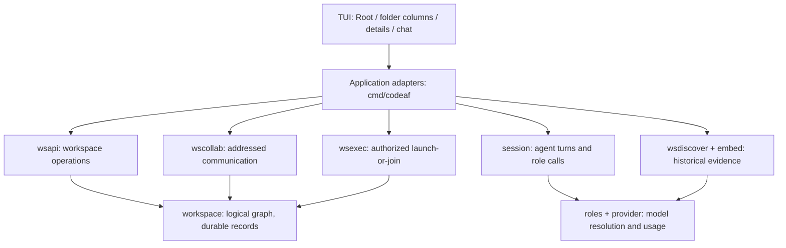

# Collaborative workspace: living system architecture

This index is maintained with implementation under the rule in
ENGINEERING.md. Source existence is not end-to-end verification. The current
architecture and UX audits must fill in source-level details and link proof
before release; this initial map does not certify every journey.

## Product contract

Root and logical folders are entry points to work, independent of filesystem
directories. A chat retains its identity and history across multiple placements.
An ordinary chat can coordinate a whole folder (current and future descendants)
or a selected set of chats. Multiple coordinating chats may coexist. Direct
request/reply, separate fan-out, and joint discussion are supported design
patterns; planner and critic are roles, not mandatory product entities.

Folder details must expose attached work, coordinating chats, relevant activity,
instructions, and links to decisions. Opening, previewing and returning should
preserve navigation state. The complete UX audit owns the exact controls and
the distinction between implemented and missing flows.

## Component map

The modules below exist in the source. Arrows show responsibilities and intended
boundaries, not proof that every path is fully wired.

Storage owns durable identity and atomic records. Application adapters connect
domain services to the chat runtime and UI. Model outputs propose changes;
authorization and validation remain software responsibilities. UI rendering
must not perform model or database work. The architecture audit must verify
actual dependency directions and exceptions against imports and call sites.

## Trigger and pipeline register

Each row requires a detailed sequence in the linked audit/design document.
“Required” means a product requirement, not a verified implementation claim.

| Entry / trigger | Required processing and observable outcome | Detail owner |
| --- | --- | --- |
| Open Root or folder | Read scoped contents; preserve shared identities; paint columns/details | UX audit, F01–F05 |
| New chat or folder | Capture selected logical scope; persist on intended action; cancel safely | UX audit, F02–F04 |
| Add old work / change membership | Search, select, authorize, record provenance; update all placements | UX audit, F06–F08 |
| New meaningful chat content | Persist revision; coalesce organization job; retrieve evidence; invoke organizer; validate current revision; apply authorized changes; push Why/Undo | Reactive contracts, F09–F10 |
| Organize existing / this chat | Explicit wake, bounded checkpointed backfill or recheck; visible progress/error | Reactive contracts, F09–F10 |
| Edit folder instructions | Persist scoped guidance; resolve inheritance/conflicts; apply at relevant work checkpoints | Engineering, F11 |
| Manage folder / coordinate selection | Create or reuse ordinary chat; establish dynamic or snapshot scope; show responsibility and controls | UX/architecture audits, F12–F14 |
| Send / fan-out / invite | Authorize addressed delivery; invoke real participants when needed; record request/reply and attribution; render communication | Engineering, F15; paint in `collabview.go` |
| Membership changes / conflict | Reconcile coordination scope and existing commitments; bounded parent/Root discussion; user decision where authority is missing | Engineering, F16–F17 |
| Launch work / standing wake | Launch-or-join existing assignment; enforce grants/budgets; record results and grounded progress | Engineering, F18–F21 |
| Pause / stop / restart / failure | Distinguish coordination pause from execution stop; recover durable jobs without duplicate effects; show actionable state | Engineering, F20–F22 |

For every implemented pipeline record the trigger producer and consumer, data
and revision, deduplication key, retry policy, cancellation, authority, usage
accounting, UI event, and recovery behavior. Reading history alone must not
wake a source chat or grant execution authority.

## F15 communication chrome

Intended: after private request, fan-out, and joint invite, the management chat
shows attributed `request` / `reply` / `sent` with source titles. Empty optional
panels stay absent. No manager entity.

Implemented: `internal/tui3/collabview.go` paints those frozen words from
`ListChatTraffic` deliveries. A coordinating turn re-reads the memo
(`refreshCollabChrome` on settle) so the pane is not empty until the next home
beat. Source ids resolve to conversation titles from the snapshotted world.
Storage, router, and `RoleCollabConsult` are unchanged.

Verified: focused TUI tests that a management-chat frame after request, reply,
and sent deliveries shows those words and titles, not store states. Live tmux
on one SHA remains `t-ux-validate` (F24). live5 `03-activity.txt` was home, not
this pane.

## AI roles and costs

Current source registers organization and participant consultation on the low
tier. Organization has a high-request path whose production reachability is
under audit. Planning/decomposition and execution must use the existing role
registry rather than hardcoded model IDs. Embeddings have a separate model pin.

The architecture/role audit must document resolved role, tier, model and effort;
fallback limits; escalation criteria; and accounting for every actual AI call.
The development harness uses santos/dev codeaf with GLM 5.3 Flash and
single-model mode. That is not proof of normal product multi-tier routing.

The UX cost audit covers per-trigger calls, input/output/cache tokens,
embeddings, retries, backfill and idle work. Distinguish measured usage, tariff
estimates and billed costs. Include persisted budgets and behavior when exhausted.

## t-rx-ui — implemented / planned / verified

**Implemented (unit, this lane, `feat/cw0918-rx-ui`):** Miller columns + pinned
details on the Folders place (`place_folders.go`, `foldercolumns.go`,
`folderdetails.go`). Wide: Root → children → pinned details, windowed
breadcrumb when depth exceeds width. 80-col: one navigation column, `→` on a
leaf focuses details, `←` returns. `→` drills; `shift+→` opens the strip.
Visible New folder calls `CreateFolderIn` with parent = standing folder.
`g` is Coordinate selected; `c` stays New folder. Details paint name/purpose,
children, chats, `also in`, instructions, busy exec lines, compact
`Added to … · Why · Undo`, `Manage this folder`, `Organize this chat`,
`Open chat`. Snapshot on the beat; stale detail generation/id/path is dropped.
`Add existing chats` is filled by `folderadd.go` (`t-ux-add-old`). Navigation does
not call the organizer. No model/disk on paint.

**Also on this integrate SHA:** painted request/reply/sent (`collabview.go`);
ordinary-chat launch-or-join, tick `continueGrantedWork`, visible `revoke grant`
(`t-ux-exec`). `workspace.reactive` and survey cursor are runtime.

**Verified:** package tests in `./internal/tui3` for J44–J49 shapes and
F03/F08/F11–F13/F21 doors. Not live tmux pane evidence — that is `t-rx-proof`
/ `t-rx-validate`. Not a change to model routing, DailyRail, or job storage.

Folder-start: New chat / Manage this folder still open an ordinary start page
with `pendingFolder`; first send files, Esc mints nothing. Cross-chat: marked
chats + `g` Coordinate selected; coordinating titles in details when the beat
already has marks/participants. Shared identity: one id, path is the walk,
`also in` from the placement memo.

## Design records and acceptance

- [PRD and technical design](PRD-TDD.md): intended system and constraints.
- [Engineering decisions](ENGINEERING.md): schema, authority, communication,
  discovery, execution and verification constraints.
- [Contracts](CONTRACTS.md): implementation seams.
- [Original journeys](USER-JOURNEYS.md): J01–J35.
- [Folders entry](FOLDERS-ENTRY.md): later folder entry journeys.
- COMPLETE-UX-AUDIT.md: full screen/control/state inventory and missing-flow map
  (parallel audit; integrate its committed document).
- ARCHITECTURE-ROLE-AUDIT.md: source-level module, storage, pipeline and model
  audit (parallel audit; integrate its committed document).

Final evidence must cover the integrated user journey, including starting in
a folder, coordinating work and inspecting cross-conversation communication.
A “done” backend task or an isolated single-model receipt does not establish
that these user journeys work. Record tested revision, binary and evidence.
