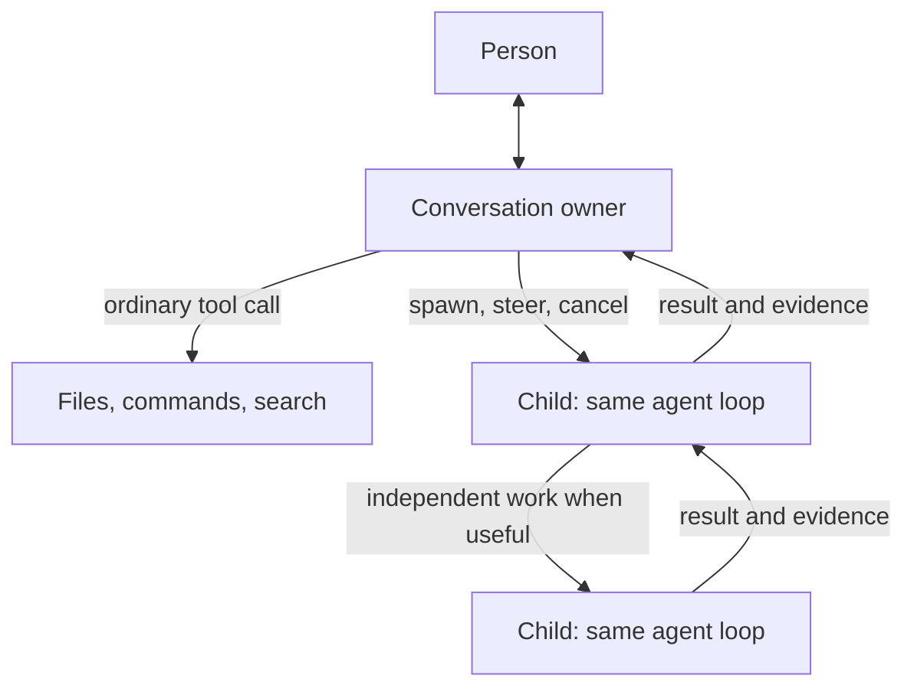

# One recursive agent loop

Decision note, September 5, 2026. This narrows the execution plan; it is not a
claim that the policy simplification below has shipped.

The user's analogy is substantially right: a Pi-like agent loop can start other
instances of that loop. Aforge already uses `newAgent` for both durable workers
(`task_run.go`, `newTaskAgentOn`) and short forks (`fork.go`). We do not need to
replace that core, or introduce separate agent implementations for every role.

## The small core to keep

An agent reads messages, calls a model, executes allowed tools and continues.
Starting a child is another tool with a clear assignment. A child uses the same
loop, a selected context, actual capabilities and an execution budget. The
parent remains responsible for the outcome it promised, including integrating
and checking returned work.

The runtime owns facts: identity, parentage, assignment revision, workspace,
execution receipts, messages, cancellation, budget and result delivery. It does
not need a second opinion to know that a command is still running or that a
child has unread results. Waiting for either should not consume model turns.

Short forks and durable tasks may share this core without pretending their
lifetimes are identical. An isolated durable task survives reopening, can be
entered and steered, and owns its worktree. A short fork returns to its caller;
if it writes in a shared directory, scope and stable combined checks still need
enforcement. A shell process is an owned operation, not another agent.

## What currently adds decisions around the core

| Current path | Question it answers | Simplification target |
| --- | --- | --- |
| `route_judge.go` router and confirmation | Should this become a task? | The current capable agent chooses the existing delegation tool. Avoid a mandatory two-reader gate. |
| `writeseam.go` two-file/five-write trigger | Has direct work become substantial? | Remove file-count-based ownership transfer. File count does not establish independence, lifetime or unfinished work. |
| `checkpoint.go` sketches, ceiling and handoff writer | What remains, should it move, and how should the next worker be briefed? | One current assignment plus attributable evidence. Transfer a concrete remainder only when needed; do not repeatedly reconstruct it through separate model calls. |
| `checkpointReopen` | Is the user's request actually complete? | Keep the owner accountable to acceptance evidence and outstanding work; avoid an unconditional second model reading of every final answer. |
| `task_child_run.go` and `task_audit.go` | Is work progressing and should it land? | Keep hard limits and real checks. Use independent review when the task's risk or uncertainty warrants it, rather than automatically rebuilding a miniature management stack for every child. |

These are deletion candidates, not proof that every listed call is unnecessary.
Some were added after real premature-completion and runaway-work failures.
Removing their behavior requires retaining those regression cases. Do not add a
new generic controller alongside them or a matrix of permanent feature flags.

## Product behavior that must survive simplification

- Entering a task opens its actual conversation. It does not create another
  agent or depend on whether the connection has a remote hostname.
- A correction has a recipient and a receipt. Refresh, reconnect and changing
  views must not lose or silently redirect the person's words.
- Stopping a parent has a defined effect on its children and processes. A
  completed child does not imply the whole request is complete.
- An unavailable provider produces a readable failure and bounded recovery.
  A failure must not be relabeled as completed work.
- A worker returns its actual patch, tests and unresolved issues. The parent
  verifies the integrated result against the current request. A passing test
  report is evidence with provenance, not a universal correctness certificate.
- Ordinary tools stay direct. The current single specialist-discovery level
  is sufficient; loading a schema does not need an agent, a planner or another
  task hierarchy.

## Order of work

First repair and exercise real task interactions and provider failure paths.
The September 5 task-click and refresh fixes remove one incorrect distinction
between local and remote windows while preserving the existing engine protocol.

Then replace ownership decisions one at a time, starting with the arbitrary
write-count promotion rule. Retain substantial-work delegation, interruption,
revision and completion tests. Measure a capable owner directly invoking tasks
before removing the router pair; the question is whether the requested work
still completes and remains steerable, not how many calls disappear.

Use realistic repository tasks to evaluate this change. The current Validated
pilot exposed a grader collection conflict and a compressed-error proxy defect;
it cannot justify a wholesale architecture rewrite or an efficiency ranking.
The corrected-proxy Aforge trial retains the original runtime so that those
experimental conditions are kept separate from future policy changes. It reached
the 30-minute deadline with implementation in the child worktree but no feature
integrated into the main workspace. The child was awaiting a full test run.
The delivered patch scored 0/159 acceptance and 61/61 regression assertions.
This supports investigating ownership timing, test execution and integration;
it does not establish that deleting a particular policy would have passed.

The target is one recursive loop with a reliable task lifecycle. The remaining
engineering is mostly about deleting duplicate decisions while preserving the
facts and behavior that make that loop dependable.
