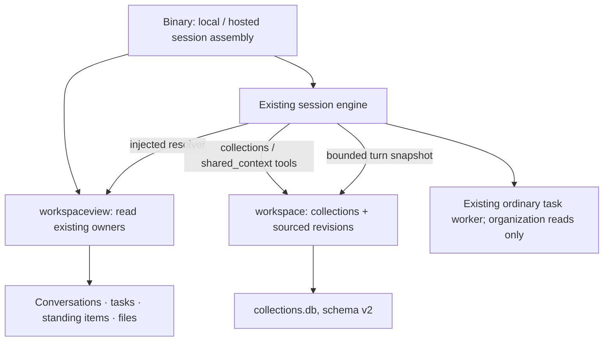

# Organization runtime: first integrated slice

This describes code on draft PR #662, not the full personal AI design.
The original collection foundation is recorded in [IMPLEMENTATION.md](IMPLEMENTATION.md).
Current verification and remaining work belong in [HANDOFF.md](HANDOFF.md).

The storage package cannot import execution, UI, provider or optional memory.
The read adapter depends on existing owners; the engine receives its callback
from the binary instead of importing the adapter. Structural tests pin both
boundaries. No new execution engine, scheduler, daemon or owner of task state
is introduced.

## What is retained

A collection keeps its name, stable ID and memberships. A shared record keeps
one stable ID and an immutable sequence of full revisions: title, text, source,
explicit targets and withdrawal state. A pointer identifies the current revision.
Create, revise and withdraw are atomic; stale expected revisions are refused.
Withdrawal is itself a revision. Explicitly revising a withdrawn record restores
it. Each revision attributes the chat that wrote it; prior sources remain in
history. Source identifies a statement, not user acceptance or authority. Identity reads
remain available outside the current scope. Their `applicable_here` field checks
that the exact revision is current, not withdrawn and explicitly applies here,
using the same direct-membership predicate as selection. A readable record is
not automatically applicable; this distinction also reaches the completion reader
through the retired-context note and the ordinary tool response.

The v1-to-v2 migration adds context tables without changing collection IDs or
memberships. An unknown or damaged store is refused. Current-schema opens avoid
reserving a writer. Read paths do not provision a missing database.

Physical transcripts, task checkpoints, ongoing items and files keep their old
owners. Task references are `(owning session, task number)`; file references
remain absolute paths and do not survive renames automatically. Resolution
returns current owner facts or explicit unavailability. Ongoing items currently
resolve active/paused/retired state, not a synthesized state for all their firings.

## How chat consumes it

`collections` finds and groups existing records and resolves a page through its
owners. `shared_context` creates, reads, revises and withdraws sourced information.
Both are conditional on the binary supplying the organization seam. A mutation
that needs a source refuses a conversation with no saved identity. Existing
approval handling still applies. Task workers can inspect, but cannot mutate,
collections or shared context.

On each turn, a chat receives current records explicitly targeting itself or its
direct collections. An ordinary task worker also considers its owning chat and
that chat's direct collections. Membership is one hop; a grandparent collection
and semantic similarity do not imply applicability. Explicit tool queries may
inspect other targets: these are relevance defaults, not information-access ACLs.

Snapshots carry source and revision, label truncated text, and replace earlier
shared-context snapshots. They use the existing volatile tail, preserving the
cached system prefix. The completion reader receives the same bounded snapshot,
so an old tool receipt does not become its account of current applicability. Withdrawal or retargeting can be detected from history;
a small session metadata bit remembers exposure after collection membership
removal, including reopen. The bit contains no finding text. Changes refresh at
the next turn, not halfway through an existing provider request. Storage errors
retire confidence in the old snapshot rather than presenting it as current.

See [PERF.md](../../../PERF.md) for storage, page and prompt bounds. List/history
and mutation receipts are metadata; bounded text reads pin revisions between
windows. The store does not duplicate runtime task status.

## Deliberately outside this slice

No autonomous wake, peer consultation protocol, discovery beyond links, event
idempotency, accepted-decision authority model, shared-context delivery to
scheduled firings, or new dashboard. Existing ongoing responsibilities can be
organized and inspected, but this change does not alter how they activate.
Forked hands, adaptive-run nodes and the separate task checker do not receive
the new organization seam. The conversation completion reader does receive its
turn's bounded snapshot, without another database lookup.
Those are separate acceptance slices, not hidden claims of these tests.

## Standing control writeback compatibility

Standing item schema 2 adds a document revision. Whole-document `Save` rejects
stale revisions; control, exception, origin-filing and effort changes use atomic
owner operations. Ticker results apply runtime deltas without replacing current
control or configuration. Schedule fields are reconciled separately so unrelated
edits do not replay an already consumed occurrence. A late expiration uses the
current deadline. An already entered external action may finish; this change does
not provide external cancellation, rollback or exactly-once delivery.

Existing schema 1 documents remain readable and become schema 2 on their next
write. **Stop existing engines and operating-system tickers before upgrading,
then restart them together.** Older readers refuse newly written schema 2 items,
but an older process already holding a document could still overwrite its old
copy. Mixed old/new writers are not supported, and downgrading after writes needs
a compatible restore rather than manually lowering the schema stamp.
