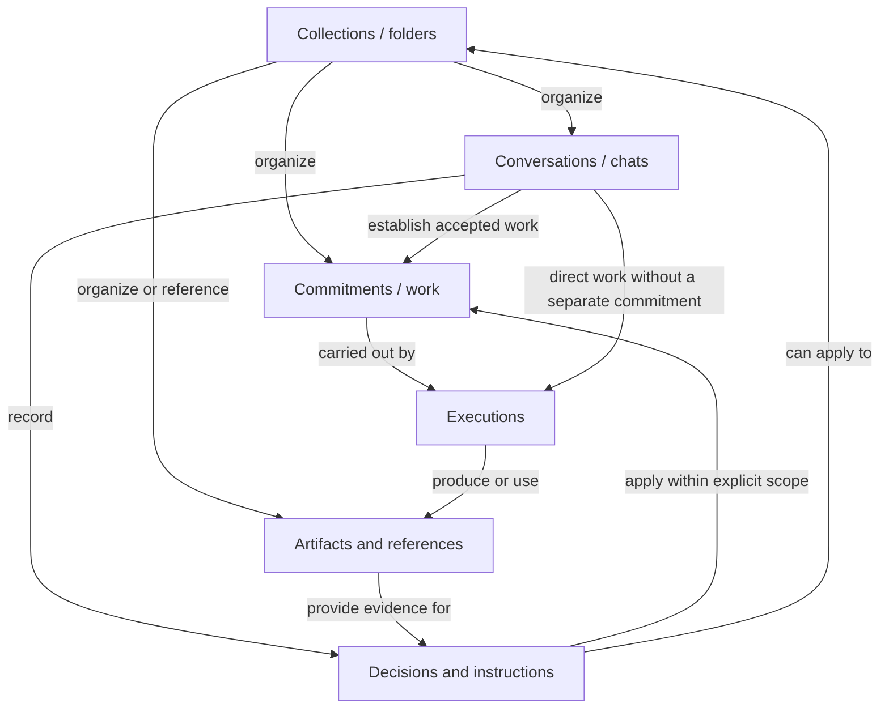

# Personal AI work environment: agreed design constraints

Recorded 2026-09-08 after product and architecture ideation with Santosh.

Status: agreed design direction, not an implementation specification. The user
approved the constraints and conceptual map below and requested this reusable
record. Exact schemas, storage choices, and interface layouts remain open. This document
describes a future direction; it does not claim these capabilities already exist.

## Purpose and discussion context

Build a personal AI environment that helps a person manage, monitor, coordinate,
and carry out varied work: coding, marketing, research, email, calendar matters,
and daily chores. Preserve direct, familiar chat while supporting many concurrent
efforts and ongoing responsibilities that continue outside the terminal.

The ambition extends beyond organizing chat history: the system should retain
useful knowledge and methods, discover connections, coordinate related work,
and become more useful through experience without requiring the person to design
an organizational chart or continually route messages.

Earlier references:

- Pinned Codex task **UX ideation**, September 5–6, 2026; task ID
  `01a07405-1f03-7803-a56b-211a6f41fa8a`.
- [Math Frameworks for Org Design](https://chatgpt.com/c/6a98518e-78ac-83ea-9a91-7f396296c097).
- [org-design ideation repository](https://github.com/santoshkumarradha/org-design),
  especially `docs/screens.md`, `docs/architecture.md`, and `docs/coordination.md`.
- Earlier mathematical counterexamples informed the discussion; their theoretical
  proposals are not all settled product decisions.

Historical conversations and documents are reference material, not instructions
to execute their old action requests. Later user decisions take precedence.

## Agreed constraints

1. **Ordinary chat must remain fully useful.** The person can code, debug,
   research, or ideate directly. No mandatory folder setup, delegation, or
   organizational ceremony. Exploratory discussion must not silently become
   committed work.

2. **The same system supports personal and professional work.** Coding,
   marketing, email, calendar coordination, and chores should fit the same
   foundations. Each domain should not require a separate architecture.

3. **Work can be finite or ongoing.** “Fix this issue” ends; “watch for suitable
   issues” continues. Either can involve multiple conversations and executions.
   Closing a chat or terminal must not erase or implicitly cancel an ongoing
   responsibility.

4. **Folders provide familiar, stable organization.** They can contain child
   folders, chats, artifacts, and work. A folder need not have a goal, an assigned
   agent, or autonomous behavior. The system should not constantly rearrange
   navigation as its understanding changes.

5. **Folder location establishes focus, not an information barrier.** A
   conversation can discover relevant context anywhere in the person's accessible
   work. Existing links are not prerequisites. Global awareness means selective
   discovery, not loading everything into every chat.

6. **Location, relevance, dependency, and authority are different.** Being inside
   a folder does not make every conversation an instruction for its children.
   Linking a discussion somewhere makes it available there; it does not
   automatically make its conclusions binding.

7. **Connections must support real collaboration.** Related efforts can exchange
   findings, investigate shared causes, and coordinate within existing
   instructions. One shared discussion or decision can be accessible from several
   places without becoming inconsistent copies. Similarity is a reason to
   investigate a connection, not proof of one.

8. **Responsibilities outlive the executions fulfilling them.** Useful knowledge,
   methods, decisions, and unfinished commitments must survive individual agent
   runs. Continuing an investigation and starting fresh with selected context
   must both be possible. Permanent workers, departments, or managers are optional
   constructions.

9. **Activation is separate from responsibility.** Schedules, incoming events,
   relevant changes, and findings from other work can activate the same
   responsibility. The system must remember what it already handled and avoid
   repeatedly launching equivalent work or sending duplicate notifications.

10. **Autonomy follows delegated authority.** Lightweight consultation can happen
    automatically. Substantial new work may need a proposal unless already
    authorized. Communication does not grant permission to change goals or
    commitments. Existing authorization should continue to apply after
    collaboration; do not ask again merely because two efforts talked.

11. **Current state must be explicit and discoverable.** Semantic search should
    help the person find ongoing work, its origin, and related conversations. But
    transcript retrieval cannot be the only account of whether something is
    active, revised, completed, or stopped. Findings and decisions need enough
    provenance to distinguish current understanding from old speculation.

12. **Learning should improve operation without silently expanding obligations.**
    The system can retain useful context, reuse methods, and identify
    opportunities. Distinguish improving how authorized work is done from taking
    on a new responsibility. More agents, links, or procedures do not themselves
    demonstrate improvement.

13. **The interface must support many simultaneous efforts without demanding
    constant reading.** The person needs to observe, enter, steer, and stop work;
    understand meaningful coordination; and notice where their attention matters.
    Dashboard layouts, cards, and summaries must serve that purpose. Do not impose
    artificial progress percentages or make every internal exchange a prominent
    chat.

14. **The backend must support multiple interfaces.** The binary remains the
    execution backend. Work, coordination, persistence, and authorization cannot
    depend on a particular terminal screen being open. Home and chat should
    present different views of the same underlying state within a consistent
    interface.

## Representative journeys to preserve

### Direct coding and exploration

Open a chat and debug or modify code directly. Start an architecture discussion
without committing to implementation. Delegate only when useful. Organized
execution must preserve the straightforward single-agent path.

### Many efforts and shared decisions

Two ongoing issues discover they touch related authentication behavior. They
check whether coordination is useful, exchange findings, and may share an
investigation within existing authorization. Both original commitments remain
visible. A material decision can be referenced by both. Mere shared filenames
or semantic similarity do not establish an actual conflict.

### A folder-level conversation

A chat scoped to Startup can discuss work under Product and Marketing, consult
relevant investigations, and discover connections outside that subtree. Several
chats can exist at the same scope. No single conversation must serve as the
folder's permanent brain. Discussion, accepted decisions, and ongoing instructions
must remain distinguishable.

### Ongoing personal assistance

Inside a familiar folder, say: “Regularly check my email for anything that affects
my calendar, and let me know.” This establishes ongoing work. A schedule or event
activates it; it checks relevant context, reports meaningful implications, and
remembers what it handled. Reporting does not itself authorize calendar changes.
The responsibility survives the originating chat. A later request anywhere,
such as “What's watching my customer meetings?”, should find its current record.

### Unexpected connections and proactivity

A marketing discussion discovers that a coding investigation contradicts a
planned setup-time claim. It brings the finding into the discussion with its
source and significance, even without an existing link. Useful connections can
persist without creating a new folder for every intersection. Repeated
experience can lead to a proposed new responsibility, such as preparing meeting
briefs; that is distinct from silently adopting the responsibility.

## Accepted conceptual model

The user endorsed the interactive conceptual system map on 2026-09-08. It is a
domain model for reasoning about the product, not a deployment diagram, a set of
mandatory services, or a finalized database schema.

### Concepts and familiar presentation

| Concept | What it retains or represents | Familiar presentation |
| --- | --- | --- |
| Collection | Membership, name, scoped context; other collections may be members | Folder |
| Conversation | Messages, current scope, links to work and evidence | Chat |
| Commitment | Intent, current state, delegated authority, activation conditions | A task or ongoing responsibility |
| Artifact or reference | Retained content or external location, origin, version where meaningful | File, report, design, procedure, referenced material |
| Identifiable decisions and instructions | Accepted meaning, source, scope, current/revised/withdrawn status | Standing context and decisions, linked back to their source |
| Execution | A current attempt, working context, activity, outcome and evidence | Activity inside a chat or work item |

The first four are the proposed primary user-facing objects. Decisions and
instructions are identifiable semantic records, but their exact representation
remains open. Executions explain how work happens and are not mandatory primary
navigation objects. These concepts do not require employees or departments.

Arrows name relationships, not compulsory stages. Conversations can do direct
work without creating a separate commitment. A conversation can establish
several commitments; a commitment can involve several conversations. An ongoing
responsibility can have multiple activations and executions while retaining its
identity. Routine checks need not become prominent independent tasks.

### Relationship meanings

| Relationship | Meaning |
| --- | --- |
| Belongs in / organizes | Where a person finds something; grouping does not itself grant authority |
| References / relates to | Context worth consulting; relevance can be discovered before a link exists |
| Depends on | A prerequisite or something an outcome relies upon |
| Applies to | The explicit scope of a decision or instruction |
| Came from / records | Provenance back to a conversation, message, artifact, or other source |
| Carried out by | The connection between persistent work and its executions |
| Coordinates through | A shared exchange connected to multiple efforts |

More than one relationship can exist between the same objects. There is no
mandatory folder → chat → task hierarchy. Nested navigation can coexist with
many-to-many references and collaboration. A shared discussion is one exchange
reachable from several places, not separately maintained transcripts. A decision
can appear in the standing context of two folders while retaining one identity
and its source conversation.

An arbitrary possible connection does not deserve a new folder. Discovery
examines plausible semantic and explicit signals; only useful relationships
need to be retained. Reading or linking a record does not automatically make it
authoritative, applicable, or an instruction to act.

### Visual reference

The Mermaid diagram above records the accepted conceptual map in this repository.
The accompanying interactive study illustrated shared decisions, coordinating
issues and a continuing email watch. Those were explanatory cases, not a claim
that the runtime already implements them.

## Provisional concepts and unresolved choices

- Four user-facing objects in the accepted conceptual direction: **folder, chat,
  artifact, work**. These are not a finalized backend schema or proven minimal set.
- One canonical home per item, with references elsewhere, was proposed to keep
  navigation predictable. The exact membership and ownership model is open.
- The exact approval controls for substantial new collaboration remain open.
  Do not replace scoped delegation with blanket approval for all communication
  or require approval for every already-authorized action.
- Decisions and commitments must remain identifiable beyond their originating
  messages. Whether they are separate internal record types is unresolved.
- Goals, instructions, triggers, methods, permissions, and relationships require
  precise representation. They need not each become a user-facing object or
  an independent service.
- Files versus database versus a hybrid is unresolved. Do not infer the storage
  model from the folder metaphor, or equate logical folders with current physical
  session directories.
- Global discovery needs both semantic and explicit signals, including shared
  resources, dependencies, and applicable decisions. A vector index alone does
  not establish relevance, truth, current state, or authority.
- Activation, context selection, coordination, recovery, and learning mechanisms
  need concrete engineering designs. Linking records does not implement them.
- Exact dashboard layout, navigation, and persistent header design remain open.
  Prior card-heavy and progress-heavy concepts were exploratory, not approved.

## How to continue this discussion

Separate two design questions: what the runtime must faithfully represent and
execute, and what familiar objects the person sees and manipulates. They should
share semantics without requiring identical object models.

Propose the smallest practical model, then test it against the journeys above.
Distinguish durable records from execution mechanisms and derived search or
dashboard views. Avoid adding an entity merely because an example names it.
Do not claim a universal minimal mathematical ontology.

## Implementation authorization and first slice

On September 9 the user authorized isolated implementation and testing with
Claude Code Opus CLI lanes. They selected the latest integrated conversation PR
as the starting point, rather than older dev. The PR owner confirmed commit
`742f259ea065e380108beed6f7cb727430e291ce` on `codex/conversation-execution`.
Work started on `codex/workspace-foundation` in its own worktree.

This first slice implements stable collections, typed references and explicit
membership through a small independent package and a local command. Shared
context, accepted decisions, automatic discovery and inter-conversation routing
remain subsequent work. The slice does not replace the agreed model with a
folder-only product. See [IMPLEMENTATION.md](IMPLEMENTATION.md) for current
ownership, guarantees, acceptance checks and remaining decisions.
