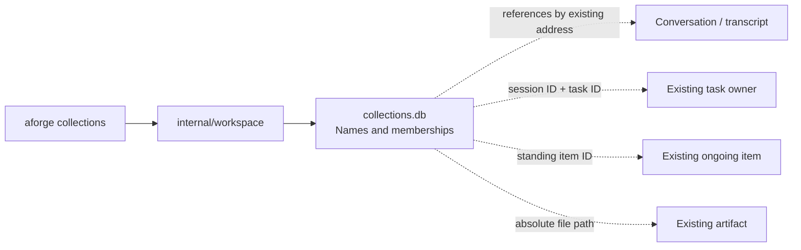

# Workspace foundation: collection membership

This records the foundation merged in PR #661. For the separate, unmerged backend
continuation and its remaining work, start with [HANDOFF.md](HANDOFF.md).

This first implementation separates logical organization from conversation
storage. The [constraints](CONSTRAINTS.md) describe the broader agreed product;
this document describes only what this branch implements.

The slice was reconciled onto `dev` commit
`0daa205df5932e05cf7a044da113b3e91dcf2851`, the accepted squash of conversation
PR #653. Only the collection commits were replayed; the conversation runtime
and its final UI fixes remain the upstream implementation.

## Ownership

`internal/workspace` imports no session, UI, provider or optional memory package.
It owns stable collection IDs, names and ordered membership sets. Existing
transcripts, tasks, standing items and artifacts remain authoritative in their
current homes. Membership carries no mutable task status, authority, activation
rule or working directory. Reading a collection never opens an execution owner.

The command is an initial adapter to this backend boundary. It makes the slice
usable and testable through the existing binary while the dashboard remains
undecided. It does not add new TUI navigation or model tools. A future surface can
resolve the typed references through existing owners and project their status;
the current command honestly prints only references, even if a source is offline.
Listing a fresh home does not initialize a store; `create` does that. Edits to a
missing collection fail without creating storage as a side effect.

## Relationships and identity

A collection can contain another collection or an externally owned reference.
The same record can appear in several collections without creating copies.
Collection nesting is a directed acyclic graph, with no privileged canonical
parent. This is a reversible first-slice choice: it avoids inventing ownership
from organization. The current list shows all collections; a future navigation
surface still needs a clear root and shortcut presentation.

Task IDs require their session ID because numbering repeats in each conversation.
Artifact references use clean absolute paths. They do not claim stable identity
across file renames, machines or versions. Conversation and standing identifiers
remain opaque existing IDs. External availability is not a condition of keeping
a reference, while collection targets must exist in this store.

Renaming changes only a collection's name. Removing membership affects only that
edge. There is deliberately no deletion, automatic reorganization, inheritance,
or goal adoption hidden behind these operations. Insertion order is stable;
remove followed by re-add puts a reference at the end.

## Persistence and failure

`~/.aforge/v3/collections.db` is a separate SQLite database. `AFORGE_HOME` changes
its root and `--db` selects a different file. Existing modernc SQLite support is
reused. Essential organization is available without enabling learned memory or
configuring a model. No existing record format is migrated.

The file is created with owner-only access; SQLite then opens it without its own
file-creation fallback, so a dangling symlink cannot bypass that provisioning.
Application ID and schema version
identify the store; unknown versions, foreign databases and damaged schema fail
explicitly rather than being reset. Version 1 is the initial schema, not a claim
that migrations from future versions exist.

Writes use SQLite transactions and foreign keys. The cycle check and membership
insert share an immediate writer transaction, preventing two processes from
concurrently adding opposing edges. Uniqueness makes repeated adds harmless;
removal is also idempotent. Lock waits are bounded to one second. Busy, cancelled,
corrupt or failed writes are errors, never reported as successful acceptance.
The ordinary rollback journal is sufficient for these small metadata writes;
there is no event log, background maintenance loop or second execution database.

## Acceptance and limits

Tests exercise persisted multi-collection references, identical task numbers in
different sessions, nested/shared folders, concurrent writes and cycles,
idempotence, cancellation, busy writers and refusal of incompatible stores.
Command journeys exercise the actual command functions with a temporary state
root and existing conversation metadata/transcript/task files; grouping and
ungrouping leave those files byte-for-byte unchanged. Binary smoke checks use a
temporary state root as well.

Next steps remain separate engineering slices:

1. Read projections resolving references through the existing conversation,
   task and standing owners, with explicit unavailable state.
2. Shared decisions with source, revision and explicit applicability; reuse the
   standing scope boundary instead of creating a competing instruction resolver.
3. Addressed consultation preserving origin, authorization, bounded wakes and
   retry identity; membership itself grants none of these capabilities.
4. Discovery and dashboard views over those records, after their meaning is stable.

This slice does not make a folder active, inject its contents into prompts,
reconstruct accepted instructions from transcripts or coordinate running tasks.
It establishes the organization boundary needed for those later changes.
