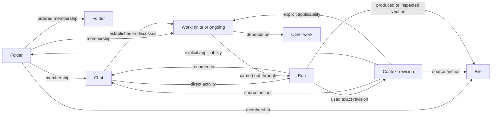
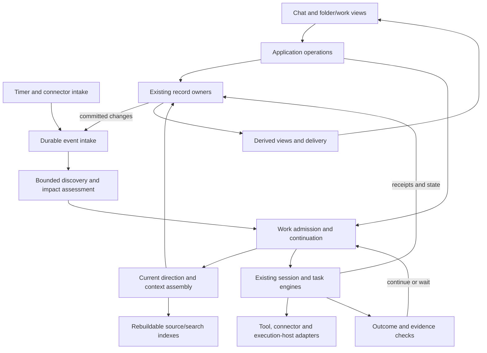
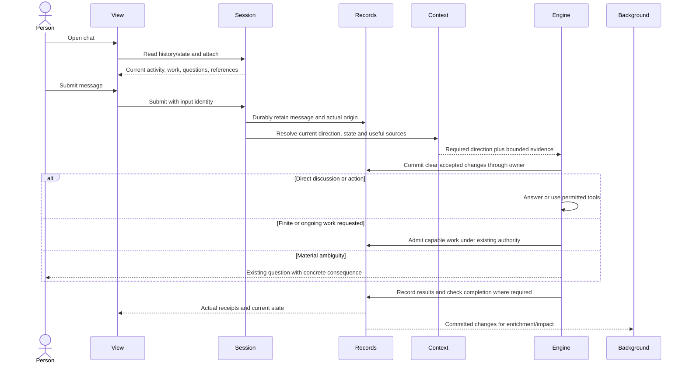
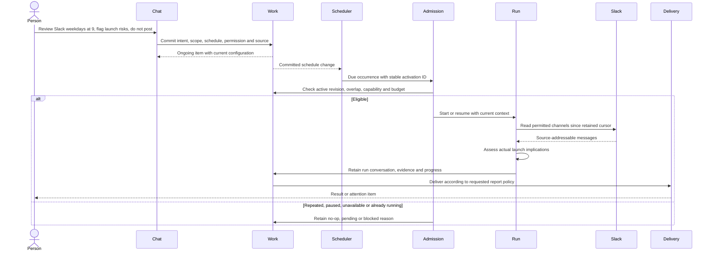
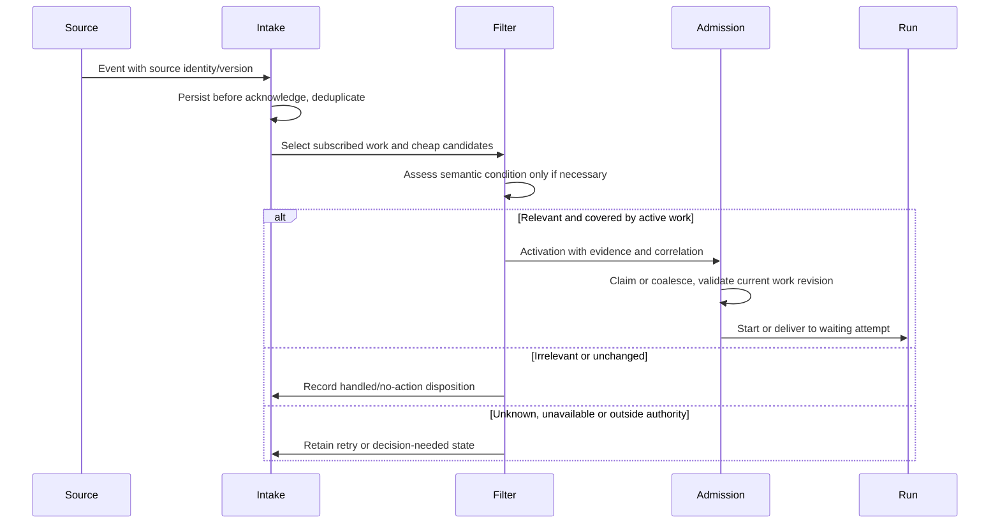
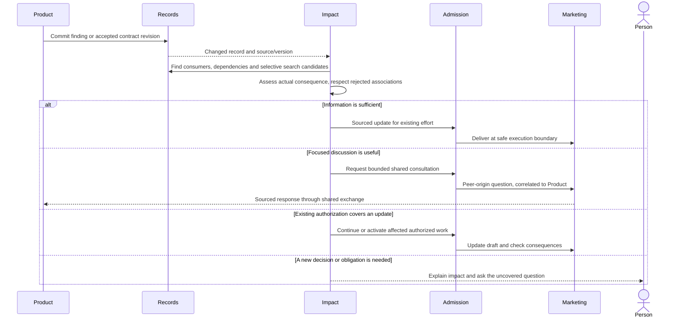
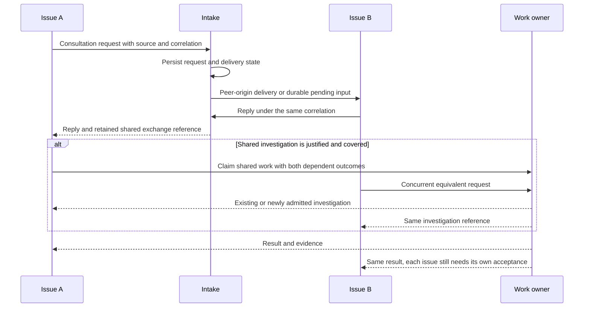
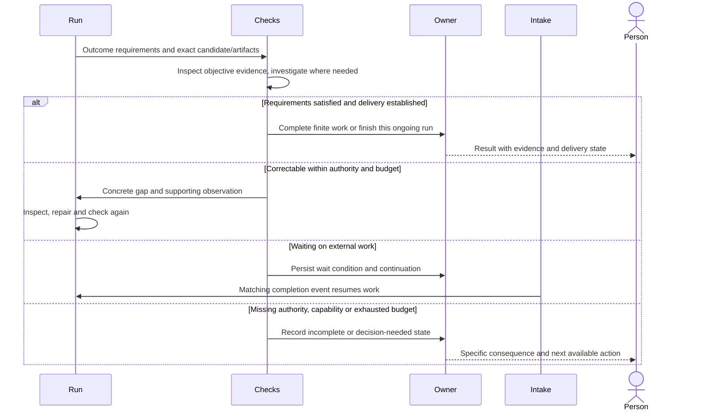
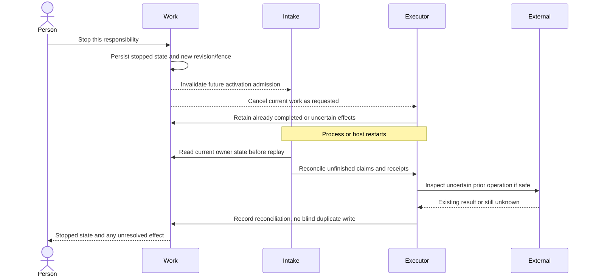

# Personal AI architecture: objects, storage and operating sequences

2026-09-10. A complete target-design proposal consolidating the two seamless-home
discussions and their continuation. Read this with the separate
[scenario review](ARCHITECTURE-SCENARIOS.md). This describes how the product should
operate, not capabilities already shipped. Product direction follows
[DECISIONS.md](DECISIONS.md); new engineering choices below are explicitly proposals.
No new implementation, migration, merger or deployment is authorized by this file.

The goal is to start naturally in chat, retain understood direction, find work in
stable folders, coordinate relevant efforts, continue delegated responsibilities
over time, and inspect, correct or stop the resulting activity. The same model
must support software development, research, marketing and personal assistance.

The subsequent [critical review](CRITICAL-REVIEW.md) narrows the validation claim:
this is a coherent target proposal, not yet an implementation-ready specification.
Its A1–A12 findings and transition contracts refine this document where an earlier
paragraph leaves ownership, versioning or failure behavior open. In particular,
source text revisions alone do not version effective context, and fitting a
journey to these diagrams is not runtime validation.

**Reading map**

1. Objects and typed relationships.
2. Scope, authority and automatic organization.
3. Software boundaries and physical persistence.
4. Context assembly and background learning.
5. Seven operating sequences.
6. Recovery, capacity and operational contracts.
7. Draft comparison, migration and remaining decisions.

The diagrams describe calls and durable effects, not one permanent agent or
microservice per box. Memory and discovery can improve without changing the
identity of folders, conversations or work.

[Rendered diagram index](diagrams/README.md) provides standalone SVGs of the two
structural diagrams and seven sequences. The Mermaid blocks here are their source.

**1. Objects and typed relationships**

The working product concepts are **Folder, Chat, Work, File**, with inspectable
**Context and Run** records. These are explanatory names, not a finalized UI or
an exhaustive backend entity model. Presentation may combine records or use
different names for the same underlying type in different journeys. There is no
six-entity ceiling on the backend and no demand for six replacement structs. In particular, finite tasks and
ongoing responsibilities already have owners that should be adapted.

| Name | Logical contents | Ownership and cardinality |
| --- | --- | --- |
| Folder | Name and ordered memberships | Zero or more members of Folder, Chat, Work or File. Folder nesting is acyclic; shared references are allowed. |
| Chat | Ordered messages/tool history; current session state; execution location where relevant | Zero or more folder memberships, work references and files. Can do direct work without creating a separate Work item. |
| Work | Versioned intent; original request; outcome; finite/ongoing mode; scope; permission references; acceptance; activation; limits; state | One existing task or ongoing-work owner; zero or more runs and dependencies. Associated chats need not be its runtime owner. |
| File | Content or external locator; producer/source; version identity when meaningful | Can be referenced from many places. References do not copy contents or move the physical file. |
| Context | Stable identity and immutable revisions of meaning, source, kind, acceptance, applicability and withdrawal | Each revision can apply to several targets and cite several source anchors. Readability and applicability are separate. |
| Run | Cause; owning chat or work; input/context revisions; execution identity; activity; evidence; outcome | One authority/execution owner. An ongoing work item can have many runs. A run may use a dedicated chat or occur within an existing one. |

Work has finite and ongoing forms. A task can have a future one-time activation;
it is still finite. Ongoing work remains active after an individual successful
run. A folder with a goal references Work carrying that goal; the folder does not
get a second independent scheduler or goal state. “Standing” is not another target
product object: its current passive-instruction and active-work meanings separate
into Context and ongoing Work.

Memory is the behavior that retains, retrieves and revises Context and source
knowledge. A reusable method is initially a versioned File referenced by Work or
a Run. Questions, permission grants, events and delivery receipts remain necessary
operational records; they do not become extra objects to file by hand.



The diagram's arrows are typed references, not a compulsory pipeline. Task
delegation-parent and task dependency remain distinct. Run-to-chat references
can form cycles with provenance without allowing cycles in folder containment.

Use a small, explicit relationship vocabulary:

| Relationship | Meaning | Must not be inferred from it |
| --- | --- | --- |
| Membership | Where something can be found | Permission to act or acceptance of everything discussed there. |
| Applicability | Which current information or direction is eligible for a consumer | That a retrieved fact grants authority. |
| Source | The exact retained evidence for a record | That an assistant's suggestion was accepted by the person. |
| Dependency | What work or output relies on | A general dependency from shared vocabulary alone. |
| Association | A discovered, evidence-supported connection | Binding direction, a new task, or a mandatory new folder. |
| Cause | The message, event, decision or result that admitted a run/action | A complete causal history merely because timestamps are close. |
| Use/production | The context or artifact version a run used/produced | That the current file still has the same contents. |

An association needs a basis and correction state, not just a similarity score.
An explicit rejection suppresses the unchanged inference; materially new evidence
can be assessed separately without silently rewriting the person's correction.

**1a. Separate backend semantics from product presentation**

Three layers must remain distinct. The backend domain model defines identities,
invariants, state transitions and ownership. Application operations compose those
owners into behavior such as “establish a daily review.” Product projections
present that behavior as folders, conversations, responsibilities, reminders or
other familiar concepts. The names and exact grouping of those projections are
open. They are not database table names or a reason to overload a backend type.

For example, a user-visible daily review can combine a durable work specification,
trigger configuration, authority references, connector bindings, run histories and
delivery state. Conversely, one backend activation mechanism can support something
called a reminder, a monitor or a routine in different contexts. The domain kind
and lifecycle, not the displayed label, select behavior. A projection may display
only relevant properties; it must not hide a material pending action or obligation.

**Proposed backend record ownership, independent of UI naming**

| Domain record or component | Identity and owner | Independent lifecycle and mutation boundary |
| --- | --- | --- |
| Object reference and membership edge | Organization owner; typed target ID, stable edge identity | Filing changes a relation, not target content or authority. |
| Conversation, message and source anchor | Session/history owner | Append messages; retain exact origin and source revision. |
| Work specification and current state | Existing task or ongoing-work owner | Version intent; compare expected revision on edit; retain transitions. |
| Context item, revision and applicability edge | Context owner | Revise meaning separately from scope; acceptance cites its authority source. |
| Trigger specification | Work-owned component with local ID and revision | Enable/edit/retire with owner; promote only if independently shared live ownership is needed. |
| Event receipt and trigger observation/join state | Intake/admission owner | Deduplicate source occurrences; consume conditions against a specific trigger revision. |
| Admission claim, lease and fencing token | Coordination owner | Claim one attempt; reconcile expiry; reject obsolete effects. |
| Run and continuation/checkpoint | Execution owner associated with Work or Chat | Record attempts, input revisions, waits and terminal outcome; do not duplicate Work truth. |
| Delegation edge and ownership transfer | Work/coordination contract | Distinguish dependency from supervision; handoff changes authority to execute atomically. |
| Execution profile and binding | Versioned configuration plus existing host/account owners | Reuse configuration; bind actual capabilities and resource identity per execution. |
| Permission grant and pending decision | Authorization/question owner | Scope, revoke, expire and answer independently of a model's text. |
| Artifact reference and version receipt | File metadata and producing owner | Preserve locator versus immutable evidence distinction. |
| Delivery attempt and receipt | Delivery owner | Retry/report separately from computational success. |
| Routing binding and resource claim | Integration/coordination owner | Stable target addressing; serialize shared external resources. |

This is a logical ownership proposal, not an instruction to create one table,
service or generic “Object” subclass per row. Reuse existing authoritative records
where they already satisfy the contract. Distinct lifecycles warrant distinct
records even when no person ever opens them directly.

**Modularity: entities, components and values**

The recommendation is composition with typed contracts, not “everything is an
object.” A small product vocabulary must not disguise necessary internal state.
A record deserves independent identity when it is independently referenced,
shared, revised, addressed or retained after its original owner is gone. A
component belongs to its owner's lifecycle but encapsulates a cohesive behavior.
An ordinary value needs neither its own address nor lifecycle.

| Category | Examples | Design rule |
| --- | --- | --- |
| Primary object | Folder, Chat, Work, File | Independently openable, with a meaningful user lifecycle. |
| Supporting entity | Context revision, Run, permission grant, delivery receipt | Identity and auditability without requiring a new item in every folder. |
| Owned component | Activation, outcome contract, reporting policy, execution configuration | Typed, independently validated behavior; the containing object owns edits and lifecycle. |
| Value | Name, timezone, deadline, maximum concurrency | Store directly; no generic property object or event stream per field. |
| Typed relation | Membership, dependency, applicability, provenance | Model its own metadata only where the relationship has meaning, such as purpose or source revision. |
| Adapter | Slack intake, browser actions, host execution, outward delivery | Implements a capability contract; does not own a duplicate Work lifecycle. |

For example, a Work item's activation component contains zero or more typed
trigger specifications. A trigger has an owner-local stable identifier, schema
version, enabled state and kind-specific configuration. A schedule specifies
calendar/interval, timezone and missed-occurrence handling; an external event
specifies connector/account/source and event filter; a semantic check specifies
its bounded observation and predicate. Admission policy states whether triggers
are alternatives, or require a defined time window and joined evidence. Do not
silently treat an ambiguous “after both” as a simple OR. Runtime cursors, last
assessment and delivery attempts are operational records, not configuration.

Each occurrence retains trigger ID and configuration revision. Editing one
schedule invalidates its obsolete pending admissions without deleting history.
Removing a Work item retires its triggers according to retention policy. A
reusable trigger template is a File; applying it creates owned configuration,
not a shared mutable schedule that edits every user's responsibility at once.
Only promote a trigger to an independent product object if a demonstrated
journey requires independently owning/sharing its live lifecycle.

The same pattern applies to outcome checks, reporting and execution settings.
Use discriminated, versioned schemas and explicit validators, with a narrow
registry for supported kinds. Unknown presentation metadata may be preserved;
unknown behavior must remain inactive and explain what capability is missing.
Never execute an unrecognized trigger or drop an unfamiliar permission constraint
because an older reader cannot interpret it. Owner writes use expected revisions
and emit one meaningful domain change, not arbitrary field-level side effects.

A future calendar trigger should require one configuration variant, adapter and
admission conformance tests; the Chat and Folder owners should not change. A
future artifact type should reuse File identity and add a reader/renderer. A
future independent approval workflow may justify a supporting entity with its
own transitions; do not force it into a string property merely to keep counts
small. Extensions must declare validation, authority requirements, persistence,
version compatibility, idempotency and observable failure behavior.

Developer extension points should be concrete operations, not unrestricted writes
to an object's property bag. Proposed contracts are: resolve a typed reference;
revise an owner with an expected revision; register an intake occurrence; evaluate
activation against a configuration revision; claim/resume an eligible run; assemble
an evidence-backed context package; execute within effective capabilities; publish
an outcome; and deliver it with a receipt. Each declares inputs, output/error
states, authority and transaction ownership. Cross-owner workflows use durable
messages and reconciliation where one transaction cannot encompass the change.

For a new feature, first identify its lifecycle and authoritative owner, then its
component/adapter boundary, version migration, emitted domain changes, replay
behavior and product projection. Backend invariants get contract tests; user
journeys exercise composed behavior. Do not couple execution to a UI label, force
all components to inherit an oversized common base, or distribute the system into
services merely because the domain has several modules.

**Proposal P3 — typed composition, no universal entity-property database.** Keep
shared identity/reference utilities and typed owner APIs over current storage.
Avoid a universal mutable `Object { properties: any }`, an entity-attribute-value
store, or a plugin platform built before two real implementations need the seam.
These make constraints, migrations and ownership harder to establish. Component
contracts can be modular without becoming separate services or stores. Exact
schema and registration code remain implementation work, not claims about #662.

**1b. Specialists, named assistants and organization-like work**

A transient specialist is a bounded Run, or a child Task when its outcome needs
independent tracking. Its versioned execution configuration can reference a File
containing a reusable method/profile: instructions, context selection, model
preference, required tools, allowed-tool ceiling and expected output. The profile
is not a permission grant. Effective access is the intersection of the owner's
authorization, host capability and specialist limits. Missing tools do not turn
into pretend execution.

A persistent named assistant need not be a permanently running process. With a
durable responsibility it is ongoing Work with associated chats, applicable
Context and an execution profile. Without such a responsibility it can be a
named Chat using that profile. Several responsibilities can share a profile
without sharing all history or schedules. Durable routing bindings address a
stable target ID, not a display name or temporary Run ID. For roles spanning several duties, use a supporting execution-identity record
independent of those duties: deleting or handing off one responsibility must not
delete the named identity or route all future messages to that obsolete work.
The identity references configuration and account bindings; it does not own a
copy of every duty’s state or require an employee object for every folder.

Group collaboration is a Chat with explicit participant/origin references and
Work carrying the common outcome. Replies from peers are evidence or requests,
not user instructions. Record an atomic owner handoff, acknowledged version and
pending obligations before replacing a worker. Parent-child delegation,
dependency, shared conversation and authority are distinct relationships.
Cancelling a delegated subtree does not cancel an independently owned ongoing
responsibility merely because it was consulted. Bound depth, fanout and total
spend across descendants; retries cannot reset the parent's budget.

A specialist normally receives a bounded context package and source references;
it retains its own transcript and returns a result plus evidence. Resume its
existing unfinished attempt when appropriate. Do not make copying every parent's
message the default implementation of shared understanding.

Execution bindings must identify host, filesystem/worktree, browser profile and
connector account where relevant. A folder or working directory is not an access
boundary. Global discovery still obeys actual read permissions. Shared browser
sessions and working copies need resource ownership or serialization so concurrent
workers cannot overwrite each other's state. No runtime may quietly substitute a
different account after the intended credential expires.

Copying a role or routine copies selected configuration and method references,
not credentials, history, learned private Context, permission grants or runs.
Copied schedules start inactive unless the instruction authorizes activating the
copy. Hiding or moving an item does not pause it; pause/stop is an explicit Work
transition. These contracts require routing, isolation and configuration records,
but no Department, Employee, Memory Vault or Workflow object in the folder view.

**2. Scope, authority and automatic organization**

“Context applying here” is a query over Context and relationships, not a second
copy of text owned by the folder. Scope selects both useful information and
governing direction, but the assembler treats them differently.

Proposed Context revision shape, omitting mundane identifiers/timestamps:

```text
ContextRevision = {
  title, meaning,
  kind: finding | preference | decision | instruction,
  acceptance: inferred | proposed | accepted,
  sources: [SourceAnchor],
  applicability: [Target + reach],
  exceptions: [Target + reach],
  supersedes?, withdrawn
}
SourceAnchor = retained owner + message/event position OR artifact version/range
reach = this target | folder subtree
```

These fields express meaning; accepted instruction records also reference the
existing authority/decision receipt. A model cannot grant permission by writing
`accepted`. A person can establish direction conversationally without a separate
save step. Evidence can come from a tool or peer, while authority remains tied to
the actual person or existing delegated policy. Acceptance of a factual decision
and permission to perform an external action are different records.

Proposed scope resolution:

1. Find explicit target applicability and the consumer's governing placements.
2. Traverse ancestors only for a scope explicitly declared to include descendants.
3. Remove explicit exceptions for their intended target and conflicting clause.
4. Keep all compatible requirements. An exception does not discard unrelated rules.
5. For a material unresolved conflict, obtain a decision through the existing
   question system; do not use a universal newest-wins or closest-folder-wins rule.
6. Keep historical consumed revisions on the Run; use current direction for the
   next action boundary. An actual move changes future folder guidance, not history.

**Proposal P1 — placement versus shortcut.** The draft has one uniform membership
relation. To uphold the already-discussed distinction between moving work and
merely referencing it, the target needs either a membership purpose
(`placement`/`reference`) or a separate governing-placement binding. Recommend
membership purpose: a placement can participate in explicitly declared folder
scope; a reference gives navigation only. Several placements are allowed; their
compatible guidance combines and material contradictions need resolution.
No canonical parent is required. This choice is not yet user-confirmed.

Automatic discovery creates reversible associations/references first. It must not
silently change governing placement. User-directed filing can establish placement
with its consequence made clear. Stronger automatic-placement policies are a later
choice; interaction never waits for perfect filing. An unfiled chat/work item is
valid. The system may suggest an existing folder or a durable new grouping, but
does not create one folder per task, per day, or per inferred intersection.

A request to “put this in Launch too” can be a reference; a request to “move this
work to Launch and follow its rules” clearly changes placement. Where intent is
ambiguous and materially changes governing direction, clarify that consequence.

**3. Software boundaries and physical persistence**

The binary remains the execution backend. Surfaces call the same application
operations. The target adds contracts to existing modules before extracting new
modules; this diagram is not a deployment topology.



| Boundary | Responsibility | Existing seam to reuse |
| --- | --- | --- |
| Organization/Context | Membership and semantic revisions | `internal/workspace`; extend its source and scope contract. |
| Live read views | Resolve references through current owners | `internal/workspaceview`; avoid duplicate mutable work state. |
| Conversation and execution | Messages, tasks, tools, cancellation, outcomes | `internal/session` and existing hosted construction. |
| Ongoing activation | Due schedules/probes and continuing intent | `internal/standing` and its runner/tick adapters; separate held guidance semantically. |
| Discovery/impact | Candidate retrieval, useful associations, affected consumers | Existing transcript/search and task-awareness seams, with incremental processing. |
| Admission/delivery | Correlated durable inputs, work claims, continuation, receipts | Existing admission/inbox/question/control paths, widened consistently. |
| External capability | Actual read/write operations, credentials, host availability | Existing conditional toolbelt and remote adapters; additional connectors where needed. |

Storage remains hybrid. Logical folder navigation is not a mapping to directories.
The target below deliberately retains existing record paths where possible.
Names marked NEW are proposed; this is not a migration script or a claim they exist.

```text
<AFORGE_HOME>/
  v3/
    collections.db                 existing: folders, memberships, context revisions
                                   extend: precise sources, scope and associations
    coordination.db                NEW proposed: durable intake/delivery bookkeeping
                                   no duplicate task, instruction or work status
    projects/<physical-bucket>/...  existing: session records and execution workspaces
      <session>/
        <journal and metadata>     existing names remain owner-defined
        <task checkpoints>         existing task owner; no shadow work table
        <run receipts>             NEW fields/files in the owning execution record
    standing/                      existing ongoing items and their retained runs
                                   legacy name can remain during semantic migration
    runs/                          existing adaptive execution records
    tasks/                         existing loose task execution records
    <rebuildable search indexes>    existing indexes extended only as measured
  <profile and credential refs>    existing configuration/credential ownership

<actual workspace or external app>/
  deliverables                     real files and external objects remain here
```

**Proposal P2 — coordination persistence.** A small SQLite store may own only
intake IDs/cursors, pending delivery, retry/lease state and correlation. Before
adding it, inspect whether an existing store can provide the same transactional
boundary. It must not become a second source of work status. Run identity belongs
to the existing execution owner; discovery indexes and run lists are projections.

Persistent records needed even if physically colocated:

| Operational record | Required facts |
| --- | --- |
| Input/event | Stable origin ID; source; observed and source time; source revision/cursor; payload reference; cause/correlation. |
| Pending delivery | Recipient owner; input ID; queued/acknowledged disposition; retry state; effective cancellation/version fence. |
| Run admission | Work/config revision; activation identity; owner/host; claim; allowed capability/budget references. |
| Run receipt | Original cause; source/context revisions used; actual tool results; produced artifact version; acceptance evidence; terminal reason. |
| External-effect receipt | Operation intent/key, target, attempt, observed result and uncertainty after interruption. |
| Correction | Rejected association/interpretation, evidence revision and source of correction. |

**Atomicity across owners.** Do not assume two SQLite databases plus JSONL are one
transaction. A SQLite owner commits its state change and outbox entry together.
A journal-owned entity appends and durably commits its authoritative change before
updating reconstructible snapshots; an outbox reader advances by committed record
position. Intake deduplicates that owner/event identity. Domain mutation must not
depend on “write state, then best-effort publish,” which loses wakes after a crash.
Adding this owner/outbox contract to older snapshot-only paths is real refactor
work. A successful acknowledgement means durable acceptance, not completed action.

No shared SQLite file over SSH/network storage. Start with one authoritative
coordinator host for the account and use existing engine/remote protocols for
execution elsewhere. Offline multi-master editing is not claimed. A move of
coordinator ownership needs an explicit handoff, not two timers racing the same DB.

**4. Context assembly and background learning**

Retain the original message first. Separate mandatory direction from optional
retrieval; both retain source identity. Existing limits on informational snapshots
must never silently drop accepted requirements.

```text
Current request + current work state + applicable direction
                       +
Exact references / lexical search / optional semantic candidates
                       ↓
Current-revision and applicability checks
                       ↓
Bounded source reading and model exploration
                       ↓
Answer/action + recorded material dependencies and evidence
```

The core model can interpret a request and propose structured changes in the same
turn; this does not require six serial model calls. Validate and commit a clear
accepted direction before acknowledging its retention or admitting work that
depends on it. Persist an unresolved interpretation if necessary rather than
invent scope. Optional learned findings, summaries, titles, embeddings and grouping
suggestions can be enriched asynchronously from a durable cursor.

Original sources remain accessible if extraction missed something. Search hits
carry current/superseded/withdrawn context; historical questions can deliberately
read prior revisions. Indexed relevance is not governing scope. Reading evidence
does not make every read a material dependency: retain consumed revision references
and explicitly record important outcome dependencies; discovery can recover
additional potential impacts, with uncertainty stated.

When required direction exceeds the prompt budget, retain the complete requirement
set structurally and execute staged inspection/checks against it. Do not summarize
away exclusions or claim all requirements satisfied from a truncated snapshot.
The exact paging/check strategy and capacity threshold need measurements.

Memory consolidation can refine optional knowledge, propose supersession and
identify reusable methods. It cannot silently rewrite accepted instructions,
forget a user correction, or turn a repeated behavior into a new obligation.
Versioned methods keep their inputs separate from reusable procedure and name the
method revision on each run.

**5. Operating sequences**

Participants in these sequences are responsibilities of the software. A step is
not necessarily a new model call, process, user-visible task or conversation.

**S1 — opening a chat and submitting a message**

Opening and submitting differ. Merely opening a folder/chat does not start paid
work. It reads current state and attaches to existing execution. Pending authorized
work can continue independently of that viewing gesture.



A normal reply can have no new durable context or work at all. Explicit direction
retention is reliable owner state; optional extraction is not the only route to it.
Quoted instructions or peer messages retain their source role. Missing capability
is resolved before claiming that work has started successfully.

**S2 — establish and run a Slack review**



Setup chat, ongoing item and run conversation have separate identities. A
substantive daily review uses a separate conversation in run history; asking
about that result continues its conversation. A cheap no-change probe can retain
a check receipt. A model exchange is retained even if collapsed in the view.
The origin chat is not filled with an endless stream of daily execution details.
An unfinished review waiting for a tool should resume its run rather than be
duplicated on the next signal.

A requested daily digest is delivered even on quiet days. An alert-only monitor
stays quiet without a material change. No meaningful-change filter may silently
cancel an explicit reporting cadence. Slack access and an available execution host
are prerequisites, not capabilities created by a schedule record.

**S3 — an external event, or a timer-based semantic check**



Timers create occurrence IDs; probes create observations. “An email arrived” and
“the email changes my itinerary” are separate stages. A semantic check may return
unknown; unavailable evidence is not the same as “nothing happened.” Cursor
advancement after durable intake must not erase an input still needing assessment.

Trigger components belong to Work: signal source, condition, schedule/timezone or
evaluation cadence, active window, overlap/coalescing policy, missed-occurrence
policy and observation state. Actions, permissions and reporting belong to Work.
Multiple triggers can feed the same work; alternative signals use OR, while joint
requirements require retained condition state, an explicit time window and expiry.
Do not introduce a general workflow language merely for one composite condition.

**S4 — Product affects Marketing without a user-created trigger**



Automatic impact assessment is a system capability over meaningful changes, not a
user-configured trigger for every possible connection. It does not mean reading
every other chat on every message. The strongest candidates are actual consumers,
dependencies and shared resources; selective search finds useful unlinked work.
Similarity is evidence to inspect, not evidence that a consumer must change.

Closed completed work receives an impact flag rather than an automatic rerun
unless an ongoing responsibility covers maintaining it. Active work refreshes at
an action boundary; it is not changed halfway through a provider response. Before
an external effect, recheck material direction and permission revisions.

**S5 — two efforts share an investigation**



A shared exchange can be an existing Chat referenced by both efforts or correlated
messages with one authoritative retained record. Do not create a second transcript
that can disagree. Peer requests never become person-origin input. Explicit bounds
on depth, messages, time and spend stop unproductive exchanges. A failed recipient
does not block unrelated work; retain timeout/pending state. Waiting for a peer is
not a reason to hold a mutable resource lock and deadlock the other effort.

Work similarity cannot safely be the sole deduplication key. A shared claim needs
a confirmed common resource/problem identity. Distinct tasks with similar wording
remain separate. Retain both original outcomes after common work is factored out.

**S6 — outcome checking, waiting and delivery**



“Ensure tests pass” is a requirement, not satisfied by injecting those words into
a prompt. The run records the exact revision/snapshot, required checks, results
and unavailable/pending evidence. AI can select checks and investigate failure;
it cannot replace an actual test result with a favorable opinion. Check feedback
itself is fallible and must be inspected before changing correct work.

Execution success, checking and delivery are distinct dimensions of the existing
owner state. An edited draft pending landing is not an applied external change.
If acceptance requires delivered output, unresolved delivery prevents completion.
If the request was only to prepare a draft, that draft can satisfy the request
while its pending publication remains explicit. Do not change approval policy to
make a test green. Missing work capability should be caught at admission and
reported honestly if discovered later.

**S7 — revise, stop and recover after a crash**



Stopping one run does not necessarily stop the responsibility. Stopping ongoing
work prevents future admission after the persisted stop boundary. Already-started
external operations may complete; cancellation is not rollback. A new explicit
resume uses a new revision so stale queued work cannot revive itself accidentally.
Pause retains state but suspends activation; retention of missed occurrences is
governed by the work's explicit policy. A chat close/detach does not imply stopping
durable work; a request to stop must use actual owner controls.

**6. Recovery, capacity and operational contracts**

A run’s effective-input manifest must name semantic source revisions, adopted
scope/direction revisions, relevant governing-membership generation, profile
version and authority revision. Text revision alone cannot reveal a changed
exception or placement. Explicit known requirements propagate deterministically;
semantic discovery is measured best-effort assistance, not the enforcement path.
When required obligations cannot be established within available context/capacity,
split or suspend affected work rather than silently dropping them.

Work specification revision, control revision, execution fence and wait token
serve different lifecycles. The [critical review transition table](CRITICAL-REVIEW.md)
defines their proposed interaction. Completing an older attempt cannot overwrite
a concurrent pause/stop or satisfy a newer outcome automatically. Local durable
admission is not an exactly-once guarantee for a remote effect; uncertain external
outcomes require adapter reconciliation before retry.


The architecture is incomplete without these operational rules:

| Area | Proposed contract |
| --- | --- |
| Duplicate inputs | Deduplicate durable source/event identities; record acknowledgement separately from completion. |
| Concurrent runs | Owner admission uses atomic claim plus work revision. Default one active occurrence per ongoing item; explicit independent concurrency remains possible. |
| Lease loss | Reconcile actual executor liveness before replacement. Use owner fencing for later effects; lease expiry is not proof that the old process stopped. |
| External effects | Use connector idempotency keys where supported; otherwise retain intent/result and reconcile unknown outcomes. Never promise universal exactly-once effects. |
| Schedule semantics | Timezone, daylight-saving ambiguity, missed occurrence, expiry and overlap policy are recorded. Propose coalescing monitor checks; do not coalesce requested daily deliverables silently. |
| Resource coordination | Preserve existing worktree isolation and conflict checks. Shared mutable files/browser sessions need appropriate ownership/serialization rather than merely a chat link. |
| Attention | Deliver actual requested reports; alert-only work stays quiet on unchanged state. Repeated failures are visible without repeatedly interrupting for the same reason. |
| Capacity | Bound active runs, assessment fan-out, source reads, model-call time/spend and retries; give interactive work priority without starving admitted background work. Exact figures require measurement. |
| Offline | Record unavailable host/connector and pending state. A sleeping laptop cannot execute; use an available authorized host or show the limitation. |
| Corrections/deletion | Unlinking preserves the underlying record. Withdrawal changes applicability. Deletion removes/restricts source payloads and rebuildable indexes according to retention policy; provenance becomes explicitly unavailable rather than invented. |
| Recovery/read views | Read state from owners; derived indexes are reconstructible and disclose stale/unavailable data. Restore pending questions through existing controls. |
| Secrets | Store credential references through existing credential owners, not tokens in context, run transcripts or generic event payloads. Retrieved external content supplies evidence, not policy. |

Global discovery is eventual, not guaranteed instantaneous. Explicitly targeted
direction changes must be checked before consequential action even if optional
semantic indexing lags. Retain dependency versions to identify stale work. A new
event should enqueue bounded incremental assessment, not compare all N chats to
all N chats. Background enrichment has durable cursors so a closed session cannot
silently lose important work that was acknowledged as retained.

Only material source/semantic changes feed impact assessment. Reindexing a record,
rewriting an equivalent summary or recording delivery acknowledgement must not
produce another semantic wake. Retain causal lineage and processed record/version
identities, suppress unchanged feedback, and bound chains even when successive
model-written summaries differ in wording. A new source revision can still carry
new evidence; loop suppression must not become permanent suppression of an issue.

**7. Draft comparison, migration and remaining decisions**

Baseline: backend draft [#662](https://github.com/Agent-Field/aforge-v2/pull/662),
`c63e03b7fe8ee84b6b94befa5403002593af0ebe`, confirmed still draft/unmerged on
2026-09-10. Existing evidence and limitations are in its
[pinned handoff](https://github.com/Agent-Field/aforge-v2/blob/c63e03b7fe8ee84b6b94befa5403002593af0ebe/docs/design/workspace-foundation/HANDOFF.md).
The grooming branch inherited an earlier implementation snapshot.

| Target | Draft foundation | Required delta |
| --- | --- | --- |
| Folder organization | SQLite memberships; multiple parents; cycle rejection; qualified task references; live owner resolution | Placement/reference semantics and reversible automatic organization. |
| Semantic records | Sourced immutable informational revisions, explicit targets and withdrawal | Exact source anchors, accepted-direction contract, exceptions, descendant scope, consumed revisions and dependency evidence. |
| Context assembly | Chats/ordinary workers; six-record bounded snapshot; direct membership only | One scope contract for every supported execution/check path; mandatory requirements survive bounds. |
| Learning/search | Optional memory extraction/routing and transcript search foundations | Durable enrichment, source fallback, corrected associations, measured semantic discovery and conservative migration. |
| Ongoing work | Standing timers/probes, budgets, OS wake integration and run history | Current logical context in scheduled runs; durable event admission, continuation and defined per-run conversation behavior. |
| Coordination | Existing origin-aware session/delivery foundations | Addressed consultation, shared claims, material impact processing, bounded durable reply flow. |
| Completion | Task acceptance/checking and improved write evidence | Reliable receipts, revision-specific completion, external waiting/reconciliation and truthful delivery presentation. |
| User control | Task/standing controls; newer upstream unified questions | Same operations from chat and future folder views, precise run-versus-responsibility stop. |

Current upstream is materially ahead of the draft. Reuse
[#717](https://github.com/Agent-Field/aforge-v2/pull/717) for evidence/handoff fixes,
[#769](https://github.com/Agent-Field/aforge-v2/pull/769) for worker/checker indexed
history access, the questions wave including
[#712](https://github.com/Agent-Field/aforge-v2/pull/712) and
[#768](https://github.com/Agent-Field/aforge-v2/pull/768), and
[#774](https://github.com/Agent-Field/aforge-v2/pull/774) for real model-accessible
task stopping. These are reuse references, not claims the combined candidate has
been built/tested. The prior review observed `dev` at `81fbbdf0b`; resolve an exact
fresh integration base before implementation.

Proposed migration order:

1. Integrate relevant upstream into an isolated draft candidate and preserve
   existing state owners. Resolve overlapping completion changes deliberately.
2. Add backward-compatible record/source/scope versions. Preserve old IDs and
   source history. Existing informational context must not become accepted
   instructions; ambiguous old `project` memory labels must not become invented
   folder scope. Legacy memberships remain references/informational until a
   governing placement is established.
3. Expose one application contract for current direction and context across chat,
   task, checker, scheduled and other supported execution paths. Keep a capability
   absent until its complete path works. Add durable owner-change publication.
4. Complete S1 and S6 using an actual cross-chat scoped requirement and outcome.
   Add inspection/correction through current chat controls.
5. Add S2/S3/S7 with synthetic external connectors and fault/restart injection.
6. Add S4/S5, using the same admission, context, delivery and evidence boundaries.
7. Improve discovery and reusable methods with measured task success and cost.

Every store migration is atomic, backed up and refuses incompatible versions;
rollback means restoring compatible owner state, not allowing an old binary to
misread the new schema. No bulk physical session move is required for the logical
folder model. Restore testing must include coordinated snapshots/journal positions,
not just copying the SQLite file while ignoring owner checkpoints and pending effects.

**Missing pieces and choices exposed by this design**

| ID | Gap or decision | Status in this document |
| --- | --- | --- |
| G1 | Moving versus referencing can change instruction scope | Proposed membership purpose P1; needs confirmation. |
| G2 | Accepted meaning lacks universal exact sources and governing semantics | Explicit Context/authority contract proposed; implementation needed. |
| G3 | A saved revision does not durably wake the appropriate work | Owner outbox/intake contract and P2 proposed; implementation needed. |
| G4 | A run's cause, consumed context and external effect can be uncertain | Run receipts, fencing and reconciliation specified; adapters must implement. |
| G5 | Restart/missed-schedule/cancellation semantics differ by use case | Alternatives bounded; defaults and in-flight policy need confirmation. |
| G6 | “Every run is a chat” can produce clutter or duplicate unfinished work | Dedicated substantive run history, collapsed checks and resumable attempts proposed. |
| G7 | Global discovery has no measured completeness or latency guarantee | Incremental candidate approach specified; retrieval evaluation and budgets needed. |
| G8 | Completing work differs from keeping its outputs current | Explicit maintenance coverage required; completed-output treatment needs confirmation. |
| G9 | Reference-product features require real external capabilities | Connector, browser/host and notification inventory/acceptance required. |
| G11 | Specialist configuration, stable addressing and resource isolation are not one complete path | Versioned profiles, origin-aware routing, bounded delegation and explicit execution bindings; validate J15–J22. |
| G12 | Extensibility can erase domain invariants | Proposed P3 typed components; unknown behavior inactive, owner revisions and capability contracts. |
| G10 | Physical files do not provide immutable historical identity | Version/content receipts where needed; source-retention policy remains to settle. |

This architecture supplies a path for the selected journeys once the proposed
contracts are implemented. It does not prove universal capability parity, a finished
schema, or runtime reliability. The separate scenario review tests the design's
logic and names the executable evidence still needed.
