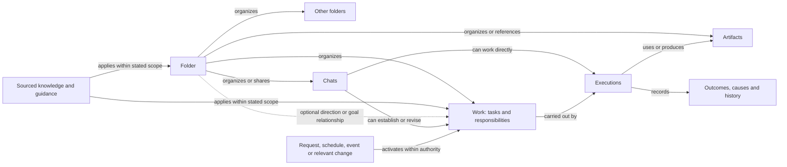
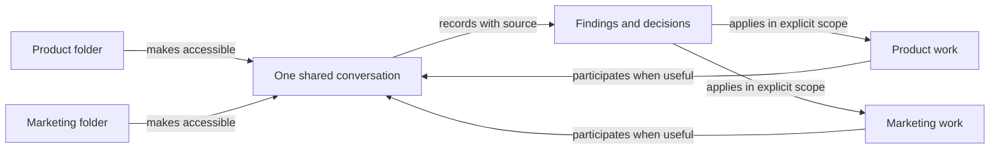
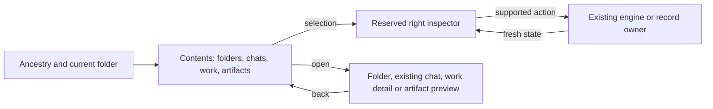

# From the shared model to a usable personal AI workspace

Recorded 2026-09-14. This is the living product discussion and proposed path to
an interactive TUI, alongside the existing backend effort on
`codex/personal-ai-backend`, draft #662. It is not a new implementation wave,
schema migration, or permission to merge into dev.

Discussion task: `01a0a142-0499-72c0-8d50-edc3286793e3`.
Backend task: `01a08ba9-2fc0-7102-a5ad-d6f18934cdf8`.

The user asked to preserve this discussion on that branch, inspect and coordinate
with the backend effort, and propose how to experience the product before adding
more capabilities. The direction is supported; the details below are recommendations
unless already confirmed in [DECISIONS.md](DECISIONS.md). Do not silently promote
this critique into new accepted runtime semantics.

## What we are building

A folder is a meaningful place the person can return to: find expected things,
continue a conversation, understand ongoing work, and give direction. It can
organize knowledge and responsibilities without becoming an agent itself.
Interaction can begin without choosing a folder, and a mistaken starting place
must not become permanent authority. Relevant information can be discovered
elsewhere without repeatedly reorganizing the person's navigation.

Preserve four familiar presentation objects for now: Folder, Chat, Work, Artifact.
Work may be a finite task or an ongoing responsibility. Those UI labels do not
require a single backend owner or a migration of tasks and standing records into
one universal entity table.

The key separation is what is INSIDE a folder, what APPLIES there, and what
HAPPENS there. The earlier drawing listed ingredients but blurred these relations.

## Internal structure and presentation have different jobs

| Internal responsibility | Presentation responsibility |
| --- | --- |
| Preserve identity, ownership, history, scope and authority | Make things recognizable and easy to find again |
| Separate commitments, activations and executions | Show what continues, what happened, and what needs attention |
| Represent precise typed relationships | Explain useful connections without showing every edge |
| Handle concurrent edits, waits, interruptions and recovery | Let the person inspect, change, pause and stop work predictably |
| Support extensions through specific contracts | Keep ordinary chat and simple folders simple |

A small UI vocabulary does not mean four internal record types. Conversely,
an internal record does not automatically deserve a top-level navigation item.
Retain existing owners and compose bounded projections over them.

This is a conceptual map, not a claim that every arrow is implemented. A folder's
purpose can also be descriptive direction with no Work relationship at all.

## Critical limits on the abstraction

1. A folder needs no permanent agent, permanent chat or execution loop. Organizing
   something does not itself authorize work or require that every folder have a goal.
2. Composition must preserve meaning. Triggers activate work; knowledge provides
   information; instructions have applicability; permissions constrain actions.
   A generic property system must not erase these distinctions.
3. A purpose is not necessarily an executable commitment. “Make the product
   welcoming” can be direction; a delegated outcome with success conditions is Work.
   Do not automatically turn every purpose sentence into an autonomous goal.
4. The inspector is contextual. Do not show every architecture component as a
   permanent empty section on every selection.
5. Do not require roles or identities to browse, chat, or entrust ordinary work.
   Named identities spanning responsibilities remain an optional later concern.
6. Logical folders are not filesystem directories. Adding a file/directory for
   tools to use, filing a chat, and giving work governing placement are distinct acts.
7. Linking to knowledge is not adopting an instruction. Explicit descendant scope,
   narrow exceptions and unresolved conflicts follow the confirmed ledger.

## Shared conversations and dynamic collaboration

Shared placement and active participation are different relationships. One chat
may appear in two folders with one message history and no concurrent agents.
Two work items may collaborate without acquiring a common folder or transferring
ownership. Participation can start and end while the exchange and conclusions persist.

“Marketing talked to Product” is useful shorthand, but the runtime needs to know
which work/execution spoke, to whom, why, and under whose authority. Folders do not
need to become thinking actors. A brief consultation can remain work activity;
a sustained exchange worth revisiting or steering can be a discoverable chat.
Not every internal message creates another chat in the folder list.

Still to formalize: guidance for a turn/action in a multiply placed chat;
participant admission and departure; shared-investigation ownership; duplicate
suppression; peer findings versus person decisions; and which exchanges become
visible conversations. Shared membership alone implements none of these mechanisms.

## Current evidence checkpoint

Inspected published branch head: `3788e569e2744288ac0d76d602d06c9478f81d61`,
fetched 2026-09-14. Draft #662 is open against dev. This document changes no runtime.
The saved backend task's latest visible updates describe a stricter live journey
for report edits and an unsupported second-folder watch. A subsequent read-only
Spark inspection found the run finished with **1 of 35 checks failed**, exit 1:
`nested-file-woke-a-run-and-reached-the-report`. This does not yet distinguish a
runtime defect from an acceptance-driver problem. Do not count that candidate as
integrated or passed.

In-flight lane: `/home/santosh/src/af-pai-next-0914`,
`codex/personal-next-0914`, observed head `76f92b88d`. Latest inspected receipt:
`/tmp/af-pai-next-0914/live/logs/journey-run03.log`, ended 2026-09-14
15:00:38 America/Toronto. Earlier 29/33 and 31/33 results are exploratory failed
evidence. This observation is not a review or adoption of the lane's changes.

The PR body and older continuation documents contain accumulated historical
checkpoints. Later dated evidence supersedes their earlier statements. No test
was rerun for this document, and a test file's existence is not a fresh pass.

| Area | What source/evidence supports now | Gap to the proposed experience |
| --- | --- | --- |
| Logical organization | `internal/workspace` owns collections, ordered typed references, cycle checks, context and governing placements | No complete logical-folder browsing surface was found in tui3 |
| Current owner state | `internal/workspaceview` resolves collection/chat/task/standing/artifact references through existing owners | Compose a bounded folder page including both members and placed work; do not equate Members with every kind of relationship |
| Identity | Task addresses retain conversation identity; artifact references are currently absolute paths | Do not promise rename-stable or globally versioned artifact identity |
| Existing TUI building blocks | Folder picker columns, search, async reads and preview; Home rows/cards; chat opening; standing cards and controls | Picker data is the physical filesystem; Home is an activity switcher, not this logical collection view |
| Backend wiring | `cmd/aforge/chatv3.go` gives sessions Organization; chat tools expose collections/context | A surface-to-engine read/action contract still needs explicit integration; no workspaceview consumer was found in tui3 in this inspection |
| Ongoing work | Setup through chat/CLI, owner-published reports, watches, controls and receipts have recorded Spark evidence | Bring actual state and actions into one selected-work inspector rather than duplicating owners |
| Chat edits | Published head includes the W5 edit slice; active backend task is probing the complete live journey and report-path behavior | Await its exact final source and acceptance before promising the whole edit experience |
| Trigger behavior | Local file changes, recursive watches and quiet no-change behavior have retained evidence | A discoverable setup/edit/why-ran UX; compound/multiple-root and semantic activation are not assumed supported |
| Guidance | Scoped context, placements, consumed-input records and report rule checking exist; further retention work is integrated | Present exact supported source/scope/revision behavior; broad automatic memory and conflict handling need their own acceptance |
| Cross-folder effects | Product-to-Marketing via explicit file watch has evidence | General discovery, dynamic peer coordination and dependency-driven activation remain beyond that evidence |
| Persistence | Existing occurrences, publication and recovery receipts have substantial backend work | Surface running/held/paused/stopped/error honestly; preserve known publication and tool-effect limits |

Useful source anchors: `internal/workspace/workspace.go`, `placement.go`,
`context.go`, `internal/workspaceview/workspaceview.go`,
`internal/tui3/folderpick.go`, `place_home.go`, `standing.go`, `place_standing.go`,
`cmd/aforge/chatv3.go`. Evidence records: [BUILD-ROUND-3B.md](BUILD-ROUND-3B.md),
[BUILD-CHATDOOR.md](BUILD-CHATDOOR.md), [BUILD-WAVE-04.md](BUILD-WAVE-04.md),
and their linked receipts. Read the current W5 lane record before implementation.

## Proposed first experience: browse, inspect, enter, return

Build one evolving real TUI demonstration. The first interaction should answer
whether the organization feels right; it need not wait for semantic coordination,
roles, all trigger kinds, or a universal memory architecture.

Use a disposable, clearly identified demo workspace backed by the actual stores:
Startup with Product and Marketing, a shared chat, a finite task, one existing
local-file responsibility, its report, one scoped instruction, and an unfiled chat.
Seed ordinary records through supported paths. The same shared chat must resolve
to the same owner and history. Synthetic fixture data must not imply synthetic
execution results are real activity.

Recommended inspector behavior:

| Selection | Show first | Reveal when relevant |
| --- | --- | --- |
| Folder | Name/direction, useful activity summary | Applicable guidance, shared placements and related items |
| Chat | Title, current activity, places it appears | Sources and work established through it; effective guidance when available |
| Work | Intent, current state, last result and next expected activation | Trigger, report, limits, permissions, applicable guidance and cause history |
| Artifact | Preview/location and availability | Producing work, source/history only where recorded |

Keep the panel stable on wide terminals; on narrow terminals make it an explicit
detail view without losing selection or navigation. Use the existing design
language, glyph vocabulary, keyboard/mouse conventions and asynchronous patterns.
Keep direct chat from Home and unfiled work reachable. Start as an additive view;
do not replace the Home switcher before the person has tried the folder experience.

## Small contracts needed to connect the surface

These are conceptual boundaries to design against the code, not prescribed new
services, schema types or endpoint names.

- **Folder page reading:** collection metadata, ordered contents, relationship
  meaning, current owner state, availability and pagination. Include placed work
  without duplicating a row merely because it is also referenced. Preserve the
  distinct relationship facts in detail. Avoid rescanning the whole workspace
  synchronously on cursor movement.
- **Selected-item reading:** type-specific detail, applicable-context provenance,
  supported actions, and a revision/freshness basis. Missing is not empty; a read
  failure is not absence. Only display next activity where the owner can say it.
- **Open by identity:** navigate or attach to the existing chat/work owner, never
  clone history. Keep browsing path separate from execution context. Until shared
  guidance is settled, opening from a second place must not silently change it.
- **Actions through owners:** use existing version-aware edit/pause/resume/stop
  operations. Keep controls unavailable when no supported action exists. Confirm
  or explain changed state using the product's actual authority contract.
- **Refresh:** changes from other chats or background work update the current view
  without jumping the cursor, duplicating rows or overwriting a newer selection.
- **Host boundary:** use the engine serving the selected workspace. Verify which
  reads/actions are already exposed before adding adapters; never read laptop
  stores to fabricate state for a remote engine.

## Trajectory: extend the same demonstration

These are suggested observation checkpoints, not independent feature tracks or
a replacement for NEXT-STEPS. The first checkpoint is the recommended next slice
after the backend owner's current bounded edit validation.

### 1. Feel the organization

Browse the fixture, inspect each kind of item, open the shared chat from both
folders, return to the same selection, preview a real artifact, and start a chat
without choosing a folder. Use real owner reads; no activation is necessary yet.
Observe whether contents versus properties, shared items, and navigation are
understandable. Allow manual filing only through supported operations.

Ready to try means a built binary, an isolated fixture and a reproducible launch
recipe, plus actual wide/narrow terminal and keyboard/mouse evidence. A static
HTML study or a terminal screenshot alone is not this milestone.

### 2. Feel continuing work

From chat in Product, ask for a local-file report to stay current. Inspect the
real proposal and accepted work, change a fixture file, and see the existing
responsibility's state/report/cause update. Edit it, pause it, resume it and stop
it through the same owner paths. State clearly whether checking requires an open
window, an existing timer, or an explicit check. No timer installation is implied.

The Work inspector should make the supported trigger discoverable: when it checks,
what it watches, what counts as change, what the run may do, where its report goes,
and how to change it. Start with existing trigger forms; do not build a general
Boolean trigger editor before evidence shows it is needed. Reading another folder
is not watching that folder. Reject or explain unsupported scope without moving
the user's folders as a workaround.

### 3. Feel guidance and connections

Inspect one actual sourced instruction and its scope. Revise it and observe which
future work consumes it. Add a navigation reference and show that it does not
become governing placement. Demonstrate the existing explicit Product-to-Marketing
watch, labeling its cause accurately. Do not describe it as semantic discovery.

### 4. Add dynamic collaboration where a journey needs it

Two work items discover a shared cause and consult or share an investigation,
with visible origin, bounded authority, preserved ownership and no duplicate
work. Promote a sustained exchange to a discoverable shared chat when warranted.
Completed-output maintenance, new adapters, reusable identities/methods and
compound triggers follow measured gaps in this same demonstration.

## Coverage and remaining behavioral contracts

The model can express the shape of the earlier Claude Code/OpenClaw/Grok Bot
journeys. This is not a current competitor audit or proof of feature containment.
Useful capability still depends on actual tools, access, resources and lifecycle
behavior. The [scenario review](ARCHITECTURE-SCENARIOS.md) remains the wider record.

| Journey/counterexample | Required semantics; avoid adding a primitive just for the example |
| --- | --- |
| Direct coding or research | Direct chat remains useful without mandatory filing or delegation |
| Start in the wrong folder | Correct organization without rewriting history or silently widening authority |
| Shared conversation | One history; explicit governing context for actions; participation differs from placement |
| Parallel related bugs | Consultation, shared ownership claims and duplicate suppression |
| Recurring inbox/report | New occurrence versus continuation, no-change quiet, explicit reporting policy |
| Production monitoring | Persistent responsibility, bounded tools/permissions, visible hosting and recovery |
| Decision changes mid-run | Refresh boundaries and re-admission before consequential actions |
| Completed output becomes stale | Record impact; revision requires appropriate maintenance authority |
| Wait for a person or event | Durable wait, correct continuation, understandable attention state |
| Stop during an external action | Stop future admission; accurately record effects already started |
| Reuse a successful method | Separate reusable procedure from private inputs, grants and obsolete assumptions |
| Named roles/organization | Optional identity across duties, without mandatory folder agents |

## Coordination and acceptance

Keep the active backend lane working on its bounded edit/report journey. This
document requests a status response and proposes the next experience slice; it
does not ask that lane to abandon its current validation or start a competing
rewrite. Rebase/merge the documentation change without discarding its work.

Before implementation, the backend owner should record here or in NEXT-STEPS:

1. Its final integrated head and exact live-journey receipt, with remaining failures.
2. Which folder-page/selected-item operations already exist through the engine,
   and the smallest missing adapter needed by the TUI.
3. Any conflict between this proposed experience and existing lifecycle/scope rules.
4. The first runnable terminal fixture and bounded acceptance contract.

No direct Codex task-message tool was available to the author. Automated access
to the Codex app was refused. The handoff is therefore published on this branch
and the existing draft PR; a direct acknowledgement from the other task remains
unconfirmed. Do not describe a posted handoff as a completed live discussion.

All implementation compilation and tests stay on Spark, never the laptop. Read
the fleet skill; submit from the repository root and preserve the exact source,
job ID, commands, results and skipped checks. Use `make build` for bin/aforge.
Existing broad-test deferrals are not passes. When a future change is intended
for merge, run its required acceptance on Spark against that exact change.
Keep #662 draft; no merge, release, installation or replacement of the user's
running binary is part of this document task. Runtime slices update the manual
and change entry in the same change.

## Living record

- [x] Preserve the model, critique and separation of internal structure from UI.
- [x] Inspect published backend source and saved task progress at the checkpoint above.
- [x] Backend owner acknowledgement and current final receipt, including failed acceptance (see below).
- [x] First bounded TUI contract recorded against engine operations (checkpoint 1 below).
- [x] Build and inspect the real browse/inspect/open/return fixture on Spark
  ([BUILD-TUI-01.md](BUILD-TUI-01.md), `36922486c`, 48/48 terminal checks).
- [ ] Let the person try that fixture and record friction before expanding scope.
- [ ] Extend the same fixture with visible activation, guidance and collaboration.

Append observations with date, source revision, what the person tried, what was
confusing, and the next smallest change. Keep a failed journey visible; do not
replace it with a feature-completion percentage.

## Backend acknowledgement — 2026-09-14

The backend coordinator read and preserved this handoff at `19bb937d3`. The
subsequent user instruction explicitly authorizes the incremental TUI checkpoints
and stable isolated demonstrations while implementation continues separately.
The bounded W5-B lane ended at `aa8c52e4a` (runtime `0ad0ccea7`): its final live
journey was 21/37, exit 1, and remains unaccepted. The previously observed nested
report defect was repaired and exercised live; model loops, unreliable report
field selection, and a driver cascade remain recorded in BUILD-WAVE-05B.
Read-only Opus recon for the browse/inspect boundary is running on Spark under
Fleet job `20260914-191334-000444`; this is not yet an implemented TUI checkpoint.
The original conceptual recommendations above are preserved, not blanket runtime
authorization. The quarantined integration checkout remains untouched.

Integration candidate `e1f4de1c1` preserves both `19bb937d3` and `aa8c52e4a`;
its runtime/test tree equals the reviewed lane (only documentation differs).
Spark Fleet `20260914-192632-000445` ran `make build` and the version check at
that exact merge, exit 0, 19:26:33–19:26:36 UTC. Receipt:
[merged build](validation/w05b-integration-build.log). This is build evidence,
not a passing combined chat journey or broad merge acceptance.

Coordinator decision for checkpoint 1: use the existing additive place model
for a Folders entry and preserve Home/direct chat. This is a reversible surface
choice under the user's instruction, not a new folder/runtime semantic. The
inspector initially reads only; no unsupported controls will be implied.

## Checkpoint 1 — contract, results and next (2026-09-14)

**Smallest seam found.** No engine method served collections to a surface: chat
tools read `collections.db` inside the session, and every place's reads go through
`remote.Client` on the local-engine and `--host` roads. The seam is three read-only
engine methods, `Collections.Page|Item|File`, backed by `workspaceview` (a folder page
that joins memberships and governing placements without duplicates, a selected-item
reading, and a preview limited to files a folder names), plus one additive place in the
existing place registry. No protocol version bump: against an older engine the place says `could not read this
folder · engine: no such method "Collections.Page"` instead of drawing an empty folder.

**Contract as built.** Additive `folders` place after settings (`alt+8`); Home and direct
unfiled chat unchanged. One row per record with `placed` marked; the distinction is spelled
in the inspector (`filed here · filing does not apply this folder's rules` / `placed here ·
this folder's rules reach it`). Reserved right inspector from 88 columns; explicit details
page below. Read-only. Open by identity through existing owners — `openConversationRow`
(bring forward, never clone), the task record, the standing item — without changing a
conversation's workspace. Path and row kept on return. Reads are async, bounded (15 s,
500 rows, 64 KiB preview) and generation-checked. This surface choice is the coordinator's
reversible decision; it settles no new folder or runtime semantics, and the recon's
recommendations remain recommendations.

**Results.** [BUILD-TUI-01.md](BUILD-TUI-01.md): implementation `9d7588a1e`, independent
Opus review (one blocker — a preview could block on a named pipe — and three should-fix
items, all fixed), real `bin/aforge` at `36922486c`, tmux
through `ssh -tt spark`, wide and 60-column, keyboard and mouse, 48 PASS / 0 FAIL; the same
shared chat opened from Product and Marketing with no new session and an unchanged
transcript; work opened on tasks and standing; a real file previewed through the engine;
the unfiled chat still reached from home. Stable demonstration: worktree
`/home/santosh/src/af-pai-demo-36922486c`, profile `/home/santosh/aforge-pai-demo-36922486c`.
The person has not tried it yet; friction is still to be recorded.

**Next.** Checkpoint 2 in the same fixture: complete the work inspector from the owner's
records, expose pause/resume/stop through the standing owner's existing verbs only, and
observe a file change reach state, report and cause after an explicit check. Report-path
edits stay on the chat card and are not promised (W5-B G2 remains unreliable).

