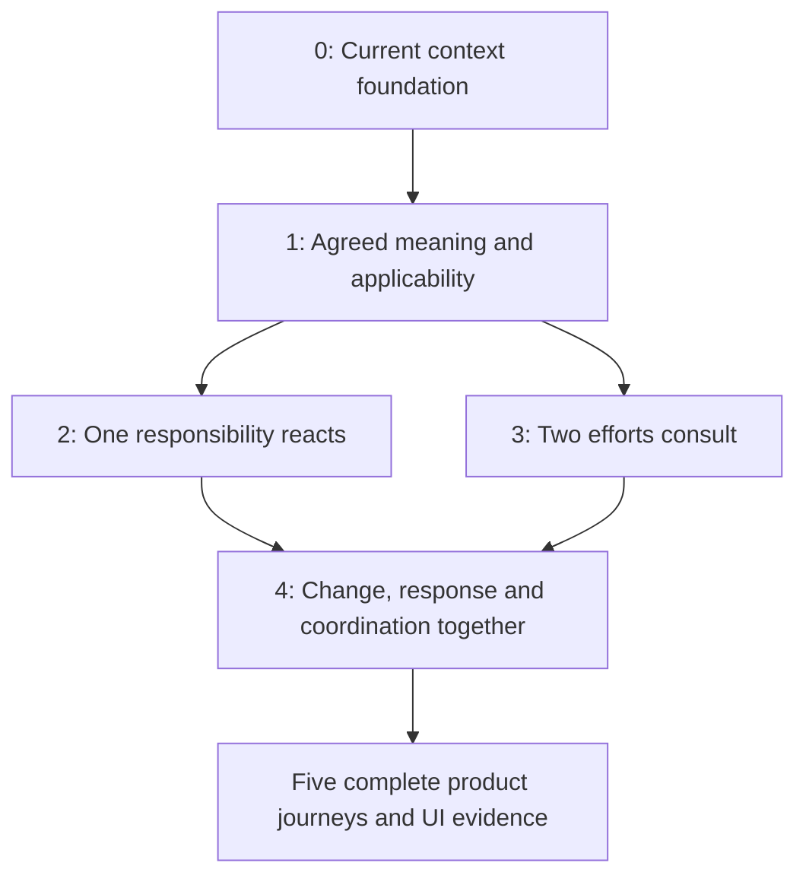

# Personal AI: living design and delivery record

Updated 2026-09-09. Discussion owner: Codex task
`01a08653-1fcf-7880-b64f-dae46f29b86a`.

Start here when continuing this discussion. Read [decisions](DECISIONS.md) before
interpreting a proposal as accepted behavior. [Journeys](JOURNEYS.md) define the
product examples and evidence boundaries. [Delivery](DELIVERY.md) governs future
build tasks, branch ownership and integration.

## The product we are preserving

Aforge is one personal AI work environment for development, research, marketing,
email, calendars and everyday work. The person can think in ordinary chat, make
things directly, delegate finite work, entrust ongoing responsibilities, and
return to inspect or steer them. Useful context and ways of working accumulate
through experience. Connections between efforts should reduce the person's need
to repeat information or route messages.

Preserve the [agreed model](../CONSTRAINTS.md): familiar folders organize
conversations, work and artifacts, with meaningful references, sources,
dependencies and explicit applicability. Decisions and instructions remain
identifiable. The organization of work does not dictate a hierarchy of permanent
agents, departments or managers. Organization, relevance and authority differ.

The user explicitly rejected adding primitives or architecture merely to fit a
new example. The terms below name delivery tracks and test slices ONLY. They are
not new product objects, modules, services or required UI labels. Customization
and specialized views are future boundary checks, not an add-on platform to
build now. Reuse existing methods/programs, task ownership, standing behavior,
memory and runtime boundaries where they suffice.

## Current work and integration destination

The main working branch for this effort is `codex/personal-ai-backend`, draft
PR #662, in `/Users/santoshkumar/af-personal-ai-backend`. It stays unmerged into
`dev`. “Bring it back to the main working branch” does not mean Git branch
`main`, `dev`, `staging`, or publishing a release.

The existing implementation task is **Ideate seamless home chat UX**,
`01a0839c-a6c1-7a93-94f2-be0e4c528f64`. Its latest report says the integrated
backend builds and resolver/chat integration tests pass; independent review and
real-model acceptance are outstanding. This is a reported checkpoint, not an
independent rerun. The local working tree has uncommitted implementation.

Its first wave owns collections, resolved owner state, explicit sourced context,
revision/withdrawal, ordinary chat/task context refresh and memory-off behavior.
It has acknowledged the five-domain acceptance in [JOURNEYS.md](JOURNEYS.md).
Scheduled application of that new context, autonomous triggers, live peer
consultation and global discovery are not yet proved by the first wave. Existing
docs may lag in-flight code; completion requires receipts on an identified commit.

This grooming record has its own documentation worktree and branch,
`/Users/santoshkumar/af-personal-ai-grooming`, `codex/personal-ai-grooming`, based
on pushed integration commit `81de2f213`. Keep proposal edits out of the active
implementation checkout. The discussion owner updates these files as the person
settles decisions; builders return evidence and proposed corrections rather than
silently changing the product contract.

## Proposed split: two product tracks, small delivery slices

Six separate teams for memory, triggers, coordination, lifecycle, UI and tests
would each implement part of a promise. Two huge feature branches would defer
integration risk until the end. Instead, organize discussion around two outcomes
and build the smallest complete slices that prove them.

| Product track | Question | Main example |
| --- | --- | --- |
| Keep related work aligned | How does work use current meaning and reason together when needed? | A changed API contract reaches backend, frontend and docs. |
| Keep ongoing responsibilities useful | How does authorized work notice relevant changes, act appropriately and continue reliably? | Repository maintenance and travel/calendar assistance. |

Both tracks include the relevant UI behavior, authority, restart/stop behavior,
evidence and use of existing retained methods. These are not later cleanup lanes.

The following decomposition is a PROPOSAL to validate during grooming:

| Slice | Small complete outcome | Gate before building |
| --- | --- | --- |
| 0 — current implementation | Existing work can be found and current sourced information used across chats. | Already authorized; existing owner completes the five first-wave variants. |
| 1 — use agreed meaning deliberately | The person can distinguish a shared finding, an accepted decision and an instruction; inspect its scope/source and correct it; affected work uses the current applicable meaning when resumed. | Settle acceptance, authority and scope using contract change and research withdrawal. Do not invent a second instruction resolver. Existing behavior may satisfy portions without new code. |
| 2 — one ongoing responsibility reacts | One existing responsibility handles a concrete schedule/event, uses applicable context, reports meaningful outcomes and survives restart/stop correctly. | Confirm event identity, permitted action, overlapping observations, notification and stop semantics. No peer conversation is required for this slice's acceptance. |
| 3 — two efforts consult purposefully | Two addressed efforts exchange a bounded request/reply, retain their goals and expose a useful source/exchange to the person. | Confirm origin/authority, recipient lifetime, disagreement behavior, budget and retry semantics. No automatic global discovery is required for this slice's acceptance. |
| 4 — the integrated loop | A meaningful change finds affected work, triggers a justified response, and consults or uses an existing method when useful. | Slices 2 and 3 meet their receipts; settle semantic relevance, accepted-decision dependencies, and limits. Explicit links alone do not prove discovery beyond links. |

These are behavioral dependencies, not promises of five PRs. Combine slices if
their production changes are inseparable; split only when both halves have an
honest independently testable product outcome. Two and three can run concurrently
only after their shared wake/authority interfaces and file ownership are settled.
Otherwise serialize the shared integration and parallelize tests/review. Do not
fork two implementations of delivery or scheduling to obtain concurrency.

Completing these journeys proves a bounded release milestone, not every aspect
of the long-term ambition. Learning better methods from feedback and proposing
new responsibilities remain explicit design topics. They are not silently
declared solved by passing a shared-context test.

## How discussion proceeds

Start with general rules and relationships. Use the five journeys to reveal
consequences and counterexamples, not to invent domain-specific mechanisms. For
each slice, record the rule, a concept or sequence diagram, a short story and
awkward counterexample, agreed behavior, existing-code mapping, open choices and
observable acceptance. Keep product and engineering coupled: a product promise
must have an owner and evidence; implementation convenience cannot quietly
decide a product question. Sketch the person's actions and visible consequences
at the same time. Specialized dashboards and broad visual polish can wait.

Confirm only the next buildable slice, not an entire speculative roadmap. While
that confirmed slice is built and tested in its own task, use this discussion to
groom the next one. If tests reveal ambiguity, bring back the concrete case and
update the decision record before building a workaround.

## Start here next

Slice 1 is being groomed. The person has confirmed automatic retention of an
explicit decision with source and understood scope, without a separate save
request (C09). Next settle the general distinction between default applicability
to a folder/subtree and discovery/reference from other work. Exact scope,
authority, conflicts and changes remain open; no new buildable slice is yet
confirmed. Then test the resulting rules against API-contract change and revised
research. See open items D01–D04 in the ledger.

## Folder inspector study

The user requested a Finder-like drawing to clarify a folder's contents versus
its properties. The exploratory interactive study is retained in the discussion's
artifact directory:

- Editable fragment: `/Users/santoshkumar/.codex/visualizations/2026/09/09/01a08653-1fcf-7880-b64f-dae46f29b86a/folder-inspector.html`.
- Standalone preview: `/Users/santoshkumar/.codex/visualizations/2026/09/09/01a08653-1fcf-7880-b64f-dae46f29b86a/folder-inspector-preview.html`.

It shows contents and a selected-item inspector. The folder's own proposed
properties stay small; applicable decisions, memory and connections remain
inspectable records. Selecting an ongoing responsibility reveals its activation
and permitted actions, rather than treating these as properties of the folder.
An alternative places decisions/memory in the contents list instead of the
inspector. The study is not a finalized TUI layout, implemented capability or
confirmation of scope inheritance. Selection, both placements, light/dark and
narrow/wide layouts were checked locally. No product E2E claim follows from that.
