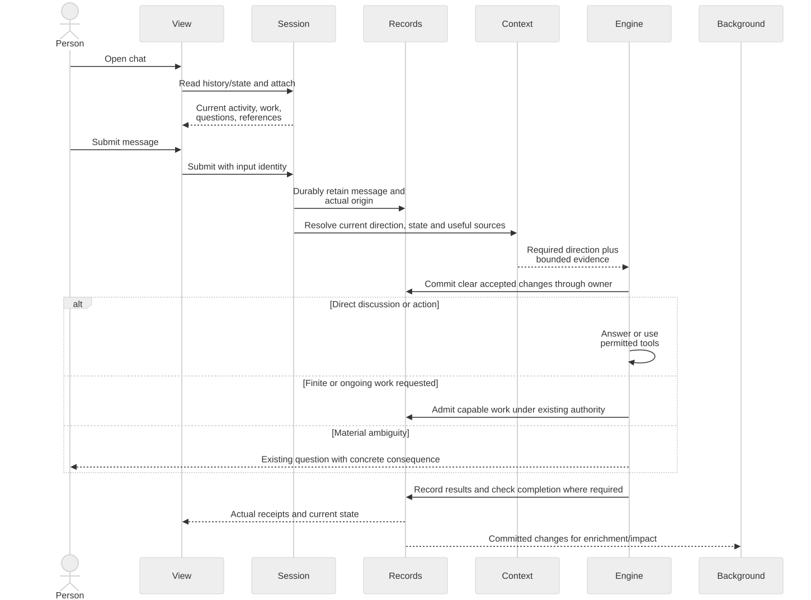
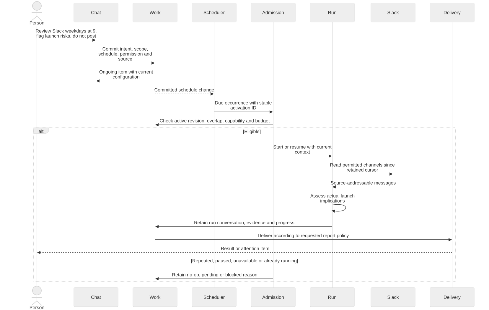
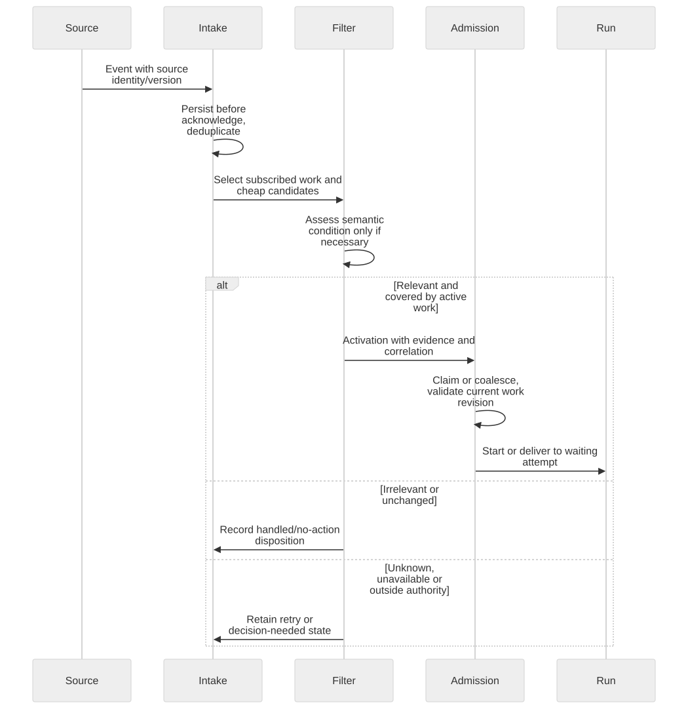
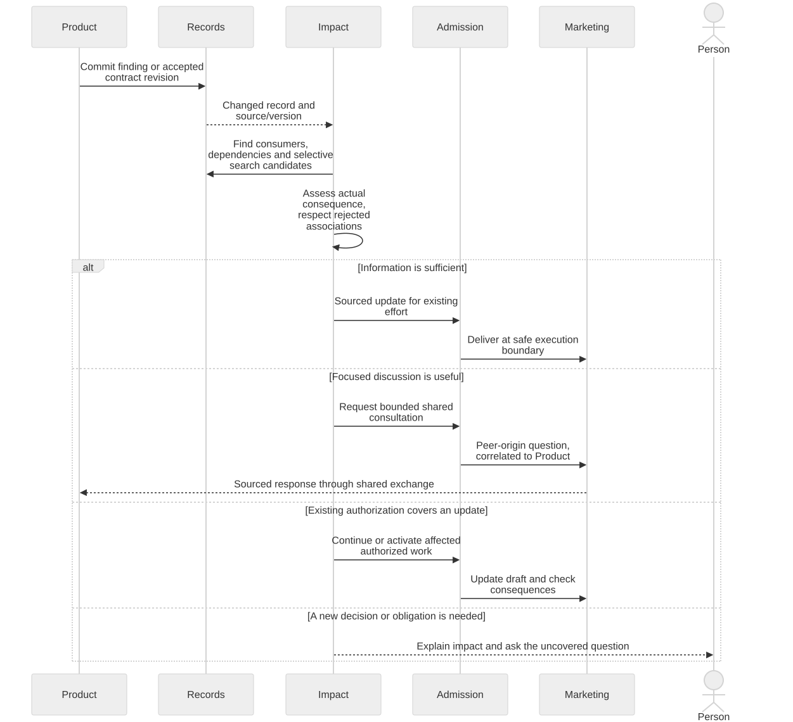
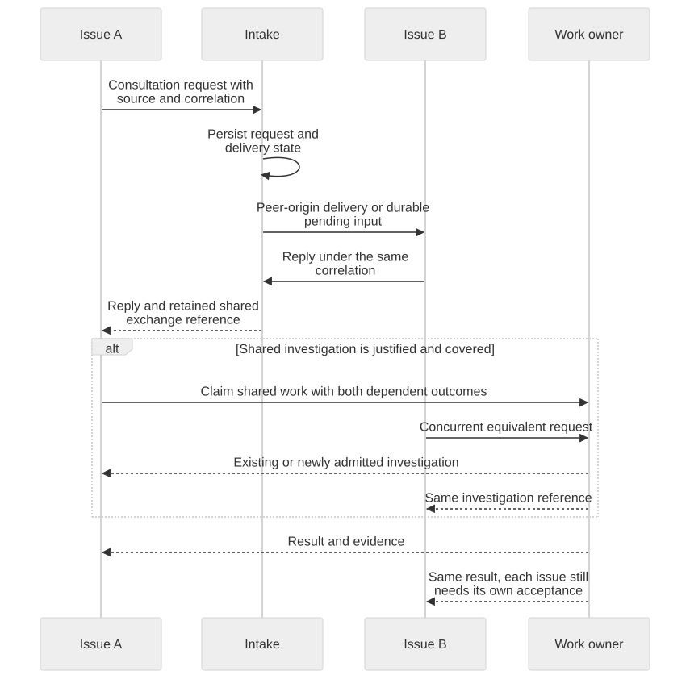
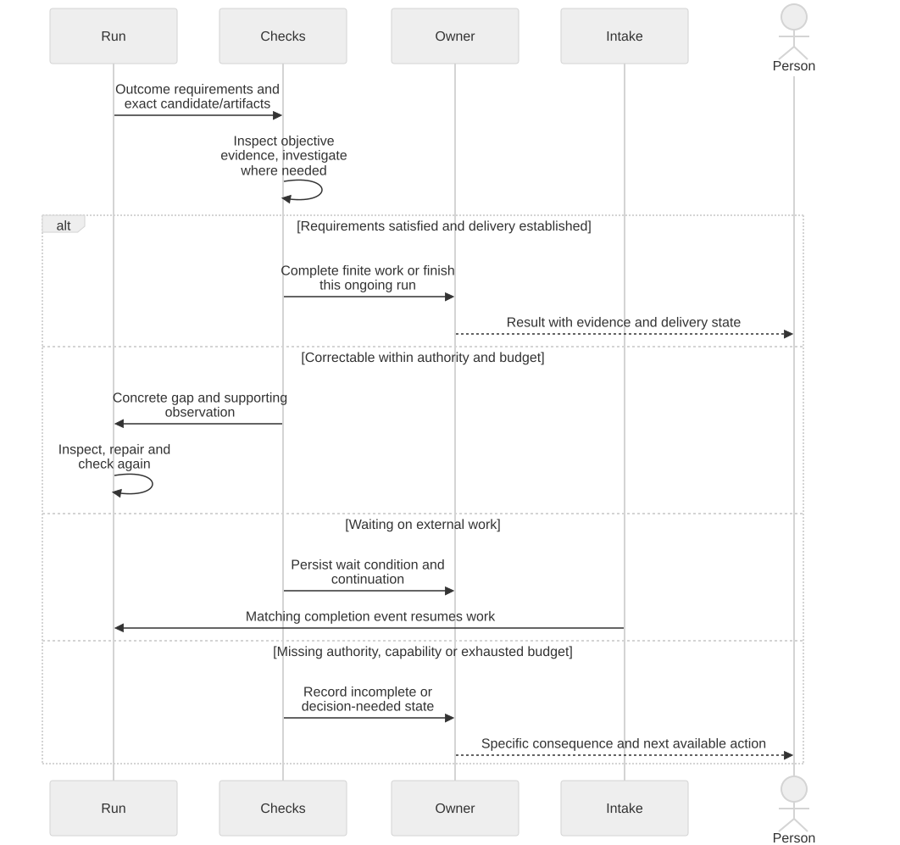
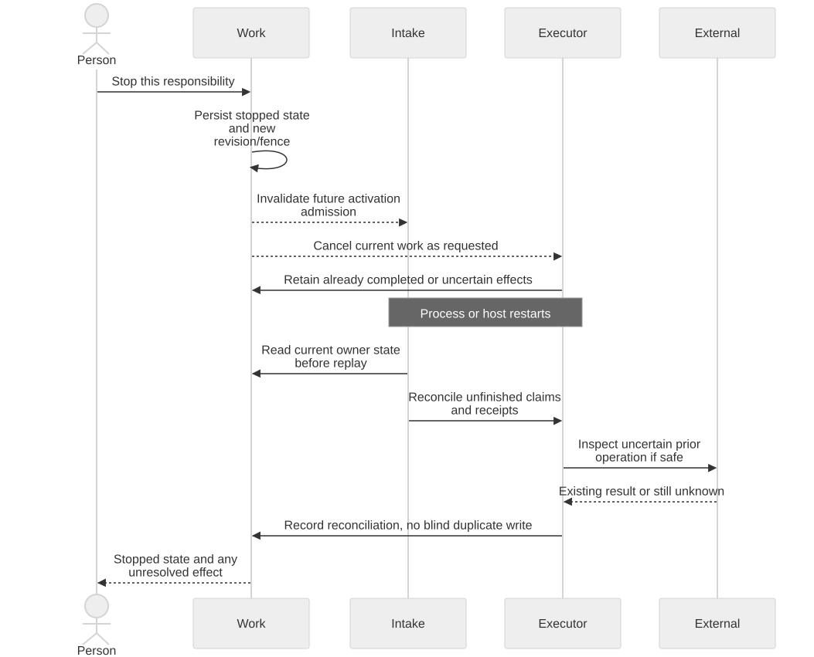

# Architecture diagrams

Rendered from the Mermaid blocks in [ARCHITECTURE.md](../ARCHITECTURE.md),
2026-09-10. These show the proposed target, not completed implementation.
The [separate scenario review](../ARCHITECTURE-SCENARIOS.md) walks twenty-three
journeys through the sequences and names the unresolved contracts.

| Diagram | Question it answers |
| --- | --- |
| [Objects](objects.svg) | What are the objects and which relationships connect them? |
| [Software boundaries](boundaries.svg) | Which parts retain, assess, execute and expose the work? |
| [S1: Chat](s1-chat.svg) | What happens when a chat opens and a message is submitted? |
| [S2: Daily Slack review](s2-slack.svg) | How does a chat establish ongoing work and each review run? |
| [S3: Trigger](s3-trigger.svg) | How does an event become a relevant, admitted activation? |
| [S4: Cross-work impact](s4-impact.svg) | How does Product affect Marketing without manual routing? |
| [S5: Consultation](s5-consultation.svg) | How do two efforts discuss and share an investigation? |
| [S6: Completion](s6-completion.svg) | How does work get checked, continue, wait and deliver? |
| [S7: Recovery](s7-recovery.svg) | What happens after a stop or a crash? |

**Objects and relationships**

**Software responsibilities**

**Chat opening and submission**

**An ongoing Slack review and its runs**

**External and semantic triggers**

**Automatic cross-work impact**

**Shared consultation and investigation**

**Checking, waiting and delivery**

**Stopping and recovering**

The architecture's Mermaid is the source of truth. Regenerate these SVGs after
editing its diagram blocks; the render is documentation, not product test evidence.
